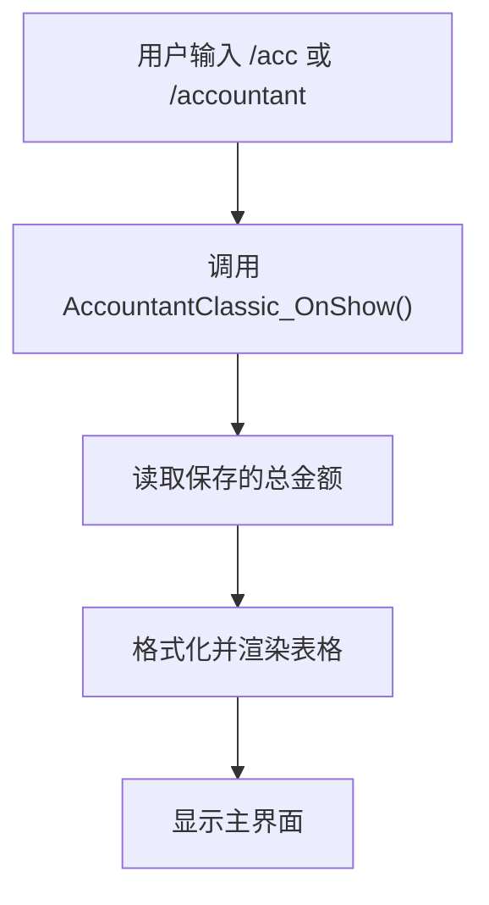

# 快速入门

<cite>
**本文档中引用的文件**  
- [pkgmeta.yaml](file://pkgmeta.yaml)
- [Bindings.xml](file://Bindings.xml)
- [README.md](file://README.md)
- [Core.lua](file://Core/Core.lua)
- [Core.xml](file://Core/Core.xml)
- [Constants.lua](file://Core/Constants.lua)
- [Config.lua](file://Core/Config.lua)
- [localization.en.lua](file://Locale/localization.en.lua)
- [CurrencyCore.lua](file://CurrencyTracker/CurrencyCore.lua)
- [CurrencyConstants.lua](file://CurrencyTracker/CurrencyConstants.lua)
- [CurrencyFrame.lua](file://CurrencyTracker/CurrencyFrame.lua)
- [CurseForge-Packaging.md](file://Docs/CurseForge-Packaging.md)
</cite>

## 目录
1. [安装指南](#安装指南)
2. [首次使用](#首次使用)
3. [配置与设置](#配置与设置)
4. [命令行功能](#命令行功能)
5. [常见问题排查](#常见问题排查)
6. [开发者构建与打包](#开发者构建与打包)

## 安装指南

Accountant_Classic 是一款轻量级的《魔兽世界》插件，用于跟踪金币的收支情况。用户可以从 CurseForge 或其他渠道下载并正确安装该插件。

### 安装步骤
1. 关闭《魔兽世界》客户端。
2. 将 `Accountant_Classic` 文件夹复制到游戏的 AddOns 目录中：
   - 零售版：`_retail_/Interface/AddOns/`
   - 经典旧世/硬核/SoD：`_classic_/Interface/AddOns/`
   - 巫妖王之怒经典版/巨龙时代经典版：`_classic_*/Interface/AddOns/`
3. 启动游戏，并在角色选择界面启用插件。

确保插件文件夹名称为 `Accountant_Classic`，且所有子文件夹和文件均位于正确路径下。

**Section sources**
- [README.md](file://README.md#L20-L35)

## 首次使用

安装完成后，玩家可以开始使用 Accountant_Classic 插件来查看和管理金币数据。

### 打开主界面
- 使用斜杠命令：`/acc` 或 `/accountant`
- 左键点击小地图上的图标或数据代理（LDB）按钮

### 查看数据
- 点击小地图图标可最小化主界面，再次点击可恢复显示。
- 主界面上方显示总收入、总支出和净收益。
- 表格按来源分类显示收入和支出，包括商人、修理、出租车、训练师、拍卖行、邮件、任务、战利品等。

### 时间窗口切换
底部的标签页允许用户切换不同的时间范围：
- 本会话
- 今天
- 昨天
- 本周
- 上周
- 本月
- 上月
- 本年
- 上年
- 总计
- 所有角色

每个标签页提供相应时间段内的详细收支信息。

**Section sources**
- [README.md](file://README.md#L37-L55)
- [Core.xml](file://Core/Core.xml#L1-L627)
- [Constants.lua](file://Core/Constants.lua#L1-L261)

## 配置与设置

用户可以通过右键点击小地图图标或通过游戏界面选项进入配置菜单，调整插件的行为和外观。

### 配置入口
- 右键点击小地图图标
- 或使用 `/acc` 命令后点击“选项”按钮

### 默认行为说明
- **显示小地图按钮**：默认开启，可在配置中关闭。
- **显示金钱信息**：可在屏幕上显示浮动金钱信息框。
- **显示提示**：启用后，鼠标悬停时会显示操作提示。
- **数字分组**：将数字转换为本地化字符串，按需分组数字。
- **记住选择的角色**：记住下拉菜单中最后选择的角色。
- **跨服务器显示**：启用后可显示所有服务器角色的金钱信息。
- **跨阵营显示**：启用后可显示所有阵营角色的金钱信息。
- **跟踪位置**：记录每笔收支发生的位置。
- **跟踪子区域**：进一步记录子区域信息，例如：苏拉玛 - 序列圣殿。

### 缩放与透明度
- **主框架缩放**：调整主窗口的大小。
- **主框架透明度**：调整主窗口的透明度。
- **浮动信息缩放**：调整屏幕上的浮动金钱信息框大小。
- **浮动信息透明度**：调整浮动信息框的透明度。

**Section sources**
- [Config.lua](file://Core/Config.lua#L1-L431)
- [localization.en.lua](file://Locale/localization.en.lua#L1-L259)

## 命令行功能

Accountant_Classic 提供了多个斜杠命令，方便用户快速访问特定功能。

### 关键斜杠命令
- `/acc` 或 `/accountant`：打开主界面
- `/ct`：打开货币追踪器界面
  - `/ct show <currency_id>`：显示指定货币的详细信息
  - `/ct show-all`：显示所有货币的汇总信息
  - `/ct debug on|off`：开启或关闭调试模式
  - `/ct status`：显示当前状态
  - `/ct ui`：打开独立的货币追踪器UI窗口

### 按键绑定
根据 `Bindings.xml` 文件，用户可以通过以下按键绑定与插件交互：
- **ACCOUNTANT_CLASSIC_TOGGLE**：切换 Accountant Classic 主界面
  - 默认绑定：未指定，可通过游戏设置自定义



**Diagram sources**
- [Core.lua](file://Core/Core.lua#L1-L2335)
- [Core.xml](file://Core/Core.xml#L1-L627)

**Section sources**
- [Bindings.xml](file://Bindings.xml#L1-L9)
- [CurrencyCore.lua](file://CurrencyTracker/CurrencyCore.lua#L1-L1414)
- [CurrencyConstants.lua](file://CurrencyTracker/CurrencyConstants.lua#L1-L555)
- [CurrencyFrame.lua](file://CurrencyTracker/CurrencyFrame.lua#L1-L1220)

## 常见问题排查

如果遇到插件未加载、命令无效或数据不更新的问题，请参考以下排查步骤。

### 插件未加载
- 确认插件文件夹已正确放置在 AddOns 目录中。
- 检查游戏客户端版本是否兼容。
- 确保没有与其他同名插件冲突（如 "Accountant"）。
- 重启游戏客户端并重新启用插件。

### 命令无效
- 确认插件已成功加载并在角色选择界面启用。
- 检查是否有拼写错误，确保使用正确的斜杠命令。
- 尝试重新加载界面（/reload）。

### 数据不更新
- 确认插件已正确初始化并完成基线校准。
- 检查是否启用了“跟踪位置”和“跟踪子区域”选项。
- 确保游戏事件监听正常工作，特别是 `PLAYER_MONEY` 和 `CHAT_MSG_MONEY` 事件。

### 其他问题
- 如果问题持续存在，尝试删除 `Accountant_ClassicSaveData` 和 `Accountant_ClassicZoneDB` SavedVariables 文件，然后重新启动游戏。
- 查看游戏日志文件以获取更多错误信息。

**Section sources**
- [Core.lua](file://Core/Core.lua#L1-L2335)
- [README.md](file://README.md#L100-L120)

## 开发者构建与打包

对于开发者，了解如何构建和打包插件是必要的。项目使用 CurseForge 自动打包系统，通过 GitHub webhook 触发构建。

### 构建流程
1. 推送分支到 GitHub。
2. 创建带注释的标签（annotated tag），标签名决定发布类型：
   - Alpha：标签包含 `alpha`
   - Beta：标签包含 `beta`
   - Release：标签不包含 `alpha` 或 `beta`
3. 推送标签以触发打包程序。

### 示例命令
```bash
# 推送分支
git push origin master

# 创建 alpha 标签
git tag -a 3.0.00-alpha.2 -m "Release 3.0.00-alpha.2"

# 推送标签
git push origin 3.0.00-alpha.2
```

### 包装配置
`pkgmeta.yaml` 文件定义了打包规则：
- `package-as: Accountant_Classic`：指定打包后的文件夹名称。
- `ignore`：忽略某些文件和目录，如 `CLAUDE.md` 和 `Docs`。

最终生成的 ZIP 文件名为 `Accountant_Classic-<tag>.zip`，内容遵循 `pkgmeta.yaml` 的忽略规则。

**Section sources**
- [pkgmeta.yaml](file://pkgmeta.yaml#L1-L6)
- [CurseForge-Packaging.md](file://Docs/CurseForge-Packaging.md#L1-L71)