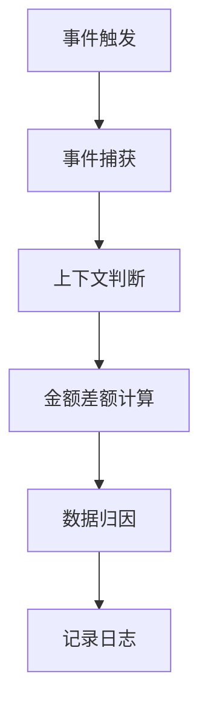

# 事件处理流程

<cite>
**本文档引用的文件**   
- [AceEvent-3.0.lua](file://Libs/AceEvent-3.0/AceEvent-3.0.lua)
- [CallbackHandler-1.0.lua](file://Libs/CallbackHandler-1.0/CallbackHandler-1.0.lua)
- [Core.lua](file://Core/Core.lua)
- [Constants.lua](file://Core/Constants.lua)
- [CurrencyEventHandler.lua](file://CurrencyTracker/CurrencyEventHandler.lua)
- [GoldTracker-Event-Classification.md](file://Docs/GoldTracker-Event-Classification.md)
- [CharacterLogin-Process-Flow.md](file://Docs/CharacterLogin-Process-Flow.md)
</cite>

## 目录
1. [事件驱动机制概述](#事件驱动机制概述)
2. [事件注册与监听](#事件注册与监听)
3. [事件触发与执行流程](#事件触发与执行流程)
4. [动态启用与禁用策略](#动态启用与禁用策略)
5. [事件冲突与泄漏处理](#事件冲突与泄漏处理)
6. [调试与日志](#调试与日志)

## 事件驱动机制概述

事件驱动机制是Accountant_Classic插件的核心功能之一，通过AceEvent-3.0库实现事件的注册、触发和处理。该机制允许插件在特定游戏事件发生时执行相应的处理逻辑，如金钱变化、商人界面打开等。AceEvent-3.0基于CallbackHandler-1.0库，提供了安全的事件分发机制，确保事件处理的可靠性和高效性。

**Section sources**
- [AceEvent-3.0.lua](file://Libs/AceEvent-3.0/AceEvent-3.0.lua#L0-L30)
- [CallbackHandler-1.0.lua](file://Libs/CallbackHandler-1.0/CallbackHandler-1.0.lua#L0-L33)

## 事件注册与监听

### 事件注册

事件注册通过`RegisterEvent`方法实现，将特定事件与回调函数绑定。例如，注册`PLAYER_MONEY`事件以监听玩家金钱变化：

```lua
self:RegisterEvent("PLAYER_MONEY")
```

### 事件监听

事件监听通过`OnEvent`方法实现，当注册的事件触发时，`OnEvent`方法会被调用，执行相应的处理逻辑。例如，处理`PLAYER_MONEY`事件：

```lua
function EventHandler:OnEvent(event, ...)
    if event == "PLAYER_MONEY" then
        self:ProcessMoneyChange()
    end
end
```

**Section sources**
- [Core.lua](file://Core/Core.lua#L1493-L1558)
- [CurrencyEventHandler.lua](file://CurrencyTracker/CurrencyEventHandler.lua#L200-L250)

## 事件触发与执行流程

### 事件触发

事件触发由游戏引擎在特定条件下自动触发，如玩家金钱变化时触发`PLAYER_MONEY`事件。事件触发后，AceEvent-3.0库会调用注册的回调函数。

### 执行流程

1. **事件捕获**：游戏引擎捕获事件并通知AceEvent-3.0库。
2. **上下文判断**：检查当前游戏状态，如是否处于商人界面。
3. **金额差额计算**：计算金钱变化的差额。
4. **数据归因**：将变化归因于特定的事件类型，如`MERCH`（商人）。



**Diagram sources**
- [Core.lua](file://Core/Core.lua#L1493-L1558)
- [Constants.lua](file://Core/Constants.lua#L94-L144)

## 动态启用与禁用策略

### 动态启用

动态启用策略通过`Enable`方法实现，确保在需要时注册事件监听器，避免不必要的性能开销。例如，在玩家登录时启用事件监听：

```lua
function EventHandler:Enable()
    if not isInitialized then
        if not self:Initialize() then
            return false
        end
    end

    if isEnabled then
        return true
    end

    self:RegisterEvents()

    isEnabled = true
    return true
end
```

### 动态禁用

动态禁用策略通过`Disable`方法实现，确保在不需要时取消事件监听器。例如，在玩家登出时禁用事件监听：

```lua
function EventHandler:Disable()
    if not isEnabled then
        return true
    end

    self:UnregisterEvents()

    isEnabled = false
    return true
end
```

**Section sources**
- [CurrencyEventHandler.lua](file://CurrencyTracker/CurrencyEventHandler.lua#L100-L150)

## 事件冲突与泄漏处理

### 事件冲突处理

事件冲突处理通过确保事件监听器的唯一性和正确性来实现。例如，避免重复注册同一事件：

```lua
if not registeredEvents[event] then
    eventFrame:RegisterEvent(event)
    registeredEvents[event] = true
end
```

### 监听器泄漏预防

监听器泄漏预防通过在适当的时候取消注册事件监听器来实现。例如，在插件卸载时取消所有事件监听：

```lua
function EventHandler:UnregisterAllEvents()
    for event in pairs(registeredEvents) do
        eventFrame:UnregisterEvent(event)
    end
    registeredEvents = {}
end
```

**Section sources**
- [CurrencyEventHandler.lua](file://CurrencyTracker/CurrencyEventHandler.lua#L150-L200)

## 调试与日志

### 调试技巧

调试技巧包括使用`/ct debug`命令输出事件日志，帮助开发者追踪事件的触发和处理过程。例如，输出事件日志：

```lua
CurrencyTracker:LogDebug("Event triggered: %s", event)
```

### 日志记录

日志记录通过`LogDebug`方法实现，记录事件的详细信息，便于后续分析和调试。例如，记录金钱变化日志：

```lua
CurrencyTracker:LogDebug("Money changed: %d", newQuantity)
```

**Section sources**
- [CurrencyEventHandler.lua](file://CurrencyTracker/CurrencyEventHandler.lua#L542-L570)
- [GoldTracker-Event-Classification.md](file://Docs/GoldTracker-Event-Classification.md#L79-L83)