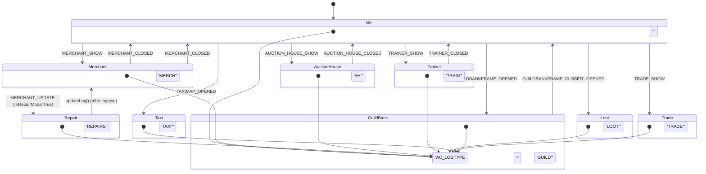

# 交易上下文管理

<cite>
**本文档引用文件**   
- [Core.lua](file://Core/Core.lua)
- [Constants.lua](file://Core/Constants.lua)
- [GoldTracker-Event-Classification.md](file://Docs/GoldTracker-Event-Classification.md)
</cite>

## 目录
1. [引言](#引言)
2. [交易上下文设计概述](#交易上下文设计概述)
3. [核心上下文变量与状态管理](#核心上下文变量与状态管理)
4. [上下文切换的触发机制](#上下文切换的触发机制)
5. [金币变动的分类归因](#金币变动的分类归因)
6. [上下文一致性保障机制](#上下文一致性保障机制)
7. [状态转换图示](#状态转换图示)
8. [常见上下文类型与事件源](#常见上下文类型与事件源)
9. [结论](#结论)

## 引言

本文件旨在详细阐述Accountant_Classic插件中交易上下文（Transaction Context）的设计与实现。该系统通过全局状态变量精确跟踪玩家在游戏中的各种经济活动场景，如与商人交易、使用拍卖行、接受训练等。文档将深入分析上下文的设置、清除、分类归因逻辑以及为防止数据错乱而设计的一致性保障机制，为开发者和高级用户提供一个全面的技术参考。

## 交易上下文设计概述

交易上下文是Accountant_Classic插件的核心设计之一，其目的是将玩家的金币变动（由`PLAYER_MONEY`事件触发）与特定的游戏场景（Context）关联起来，从而实现对收入和支出的精确分类。该设计不依赖于直接解析聊天信息，而是采用一种“事件预设-状态记录-延迟归因”的模式。

其基本原理是：当玩家进入一个可能涉及金钱交易的游戏场景（如打开商人界面）时，插件会监听相应的UI事件（如`MERCHANT_SHOW`），并立即设置一个全局的上下文标识符（即`AC_LOGTYPE`变量）。当后续的`PLAYER_MONEY`事件发生时，插件会检查`AC_LOGTYPE`的当前值，并据此将本次金币变动归因到对应的分类（如“商人”或“修理”）中。当玩家离开该场景时（如关闭商人界面），插件会通过`MERCHANT_CLOSED`等事件将`AC_LOGTYPE`清空，为下一次交易做好准备。

这种设计巧妙地解决了游戏事件与金钱变动事件之间的时间差问题，确保了分类的准确性。

**Section sources**
- [Core.lua](file://Core/Core.lua#L1400-L1599)
- [Constants.lua](file://Core/Constants.lua#L80-L190)

## 核心上下文变量与状态管理

整个交易上下文系统围绕一个核心的全局变量`AC_LOGTYPE`构建。

- **`AC_LOGTYPE`**: 这是一个字符串类型的全局变量，用于存储当前激活的交易上下文。它的值直接对应于插件内部定义的分类标识符，如`"MERCH"`（商人）、`"TRAIN"`（训练师）、`"AH"`（拍卖行）等。当`PLAYER_MONEY`事件被处理时，系统会读取`AC_LOGTYPE`的值来决定本次金钱变动的归属。如果`AC_LOGTYPE`为空字符串（`""`），则该次变动将被归类为`"OTHER"`（未知）。

该变量的管理是动态的，其生命周期由一系列UI事件精确控制。例如，当`MERCHANT_SHOW`事件发生时，`AC_LOGTYPE`被设置为`"MERCH"`；当`MERCHANT_CLOSED`事件发生时，`AC_LOGTYPE`被重置为空字符串。

**Section sources**
- [Core.lua](file://Core/Core.lua#L1400-L1599)
- [Constants.lua](file://Core/Constants.lua#L162-L163)

## 上下文切换的触发机制

上下文的切换完全由游戏客户端发出的特定事件驱动。插件通过`AccountantClassic_OnEvent`函数注册并监听这些事件，一旦事件被触发，立即更新`AC_LOGTYPE`的状态。

- **上下文设置（进入场景）**:
    - **商人/修理**: `MERCHANT_SHOW`事件触发，`AC_LOGTYPE`被设置为`"MERCH"`。随后，如果检测到玩家处于修理模式（`InRepairMode()`），`MERCHANT_UPDATE`事件会将`AC_LOGTYPE`进一步细化为`"REPAIRS"`。
    - **拍卖行**: `AUCTION_HOUSE_SHOW`事件触发，`AC_LOGTYPE`被设置为`"AH"`。
    - **训练师**: `TRAINER_SHOW`事件触发，`AC_LOGTYPE`被设置为`"TRAIN"`。
    - **飞行管理员**: `TAXIMAP_OPENED`事件触发，`AC_LOGTYPE`被设置为`"TAXI"`。
    - **其他场景**: 如`LOOT_OPENED`（拾取）、`TRADE_SHOW`（交易）等事件，也会相应地设置`AC_LOGTYPE`。

- **上下文清除（离开场景）**:
    - **商人**: `MERCHANT_CLOSED`事件触发，`AC_LOGTYPE`被清空（设置为`""`）。
    - **拍卖行**: `AUCTION_HOUSE_CLOSED`事件触发，`AC_LOGTYPE`被清空。
    - **训练师**: `TRAINER_CLOSED`事件触发，`AC_LOGTYPE`被清空。
    - **公会银行**: `GUILDBANKFRAME_CLOSED`事件触发，`AC_LOGTYPE`被清空。

值得注意的是，对于某些事件（如`TAXIMAP_CLOSED`、`LOOT_CLOSED`、`QUEST_FINISHED`），其对应的清除逻辑在代码中被注释掉了。这是为了防止UI窗口关闭的时间早于实际的金钱交易，导致`AC_LOGTYPE`被过早清空，从而使后续的`PLAYER_MONEY`事件无法正确归因。这种设计体现了对事件时序的深刻理解。

**Section sources**
- [Core.lua](file://Core/Core.lua#L1400-L1599)
- [GoldTracker-Event-Classification.md](file://Docs/GoldTracker-Event-Classification.md#L31-L70)

## 金币变动的分类归因

金币变动的最终归因发生在`PLAYER_MONEY`事件的处理过程中，具体由`updateLog`函数执行。

1.  **事件触发**: 当玩家的金币数量发生变化时，游戏客户端会发出`PLAYER_MONEY`事件。
2.  **状态检查**: `AccountantClassic_OnEvent`函数捕获此事件，并调用`updateLog`函数。
3.  **差额计算**: `updateLog`函数首先计算当前金币数量与上一次记录数量的差额（`diff`）。
4.  **上下文读取**: 函数读取全局变量`AC_LOGTYPE`的当前值。
5.  **分类与记录**: 根据`diff`的正负（收入或支出）和`AC_LOGTYPE`的值，系统将差额记录到对应分类（如“商人”、“训练”）和对应时间周期（如“今日”、“本周”）的数据结构中。
6.  **默认归类**: 如果`AC_LOGTYPE`为空字符串（`""`），则本次变动将被归类到`"OTHER"`（未知）类别。

这种设计确保了只有在明确的上下文下发生的金钱变动才会被精确分类，而那些无法关联到特定场景的变动则被合理地归入“未知”类别，保证了数据的完整性和可解释性。

**Section sources**
- [Core.lua](file://Core/Core.lua#L1535-L1536)
- [Core.lua](file://Core/Core.lua#L1122-L1148)

## 上下文一致性保障机制

为了防止因事件顺序异常或插件加载时机问题导致的数据错乱，系统设计了多重保障机制。

- **基线初始化（Priming）**: 这是防止首笔交易被错误归因的关键机制。插件通过一个持久化的标志位`AccountantClassic_Profile["options"].primed`来跟踪一个角色是否已经完成初始化。在角色首次登录时，如果该标志位为`false`，系统会立即将当前的金币数量作为“基线”（baseline）记录下来，并将`AC_LASTMONEY`设置为此值，同时将`primed`标志置为`true`。这确保了后续的`PLAYER_MONEY`事件计算的是真正的变动量，而不是将初始余额误认为是一笔收入。此机制在`PLAYER_LOGIN`和`PLAYER_MONEY`事件中均有实现，提供了双重保障。

- **黏性上下文（Sticky Context）**: 如前所述，对于`TAXIMAP_CLOSED`等事件，其清除`AC_LOGTYPE`的代码被注释掉。这种“黏性”设计允许上下文在UI关闭后依然保持一段时间，以应对金钱交易可能稍晚发生的情况，从而避免了因事件顺序颠倒导致的分类错误。

- **状态日志**: 当`AC_LOGTYPE`的值发生变化时，如果启用了详细模式（`AccountantClassic_Verbose`），插件会通过`ACC_Print`函数在聊天框中输出一条日志，如`"Accountant mode changed to 'MERCH'"`。这为调试和验证上下文切换的正确性提供了便利。

**Section sources**
- [Core.lua](file://Core/Core.lua#L1532-L1536)
- [Core.lua](file://Core/Core.lua#L1268-L1289)

## 状态转换图示

**Diagram sources**
- [Core.lua](file://Core/Core.lua#L1400-L1599)

## 常见上下文类型与事件源

下表列出了插件支持的主要交易上下文类型、其对应的事件源以及简要说明。

| 上下文类型 (AC_LOGTYPE) | 触发事件 (Event) | 说明 |
| :--- | :--- | :--- |
| **MERCH** | `MERCHANT_SHOW` | 玩家与商人进行买卖交易。 |
| **REPAIRS** | `MERCHANT_UPDATE` (当处于修理模式时) | 玩家修理装备。此状态由`MERCH`状态派生。 |
| **AH** | `AUCTION_HOUSE_SHOW` | 玩家在拍卖行进行拍卖或购买。 |
| **TRAIN** | `TRAINER_SHOW` | 玩家向训练师学习技能或重置天赋。 |
| **TAXI** | `TAXIMAP_OPENED` | 玩家使用飞行管理员服务。 |
| **LOOT** | `LOOT_OPENED` | 玩家从战利品中获得金币。 |
| **TRADE** | `TRADE_SHOW` | 玩家与他人进行交易。 |
| **MAIL** | `MAIL_INBOX_UPDATE` (非拍卖行邮件) | 玩家从普通邮件中获得金币。 |
| **GUILD** | `GUILDBANKFRAME_OPENED` | 玩家在公会银行存取款。 |
| **OTHER** | N/A (当`AC_LOGTYPE`为空时) | 默认分类，用于无法归因的金币变动。 |

**Section sources**
- [Constants.lua](file://Core/Constants.lua#L100-L110)
- [GoldTracker-Event-Classification.md](file://Docs/GoldTracker-Event-Classification.md#L31-L70)

## 结论

Accountant_Classic插件的交易上下文管理系统是一个简洁而高效的解决方案。它通过全局变量`AC_LOGTYPE`作为状态机，利用游戏事件精确地控制上下文的开启与关闭，并在`PLAYER_MONEY`事件中完成最终的分类归因。该设计不仅实现了对玩家经济活动的精细化追踪，还通过基线初始化和黏性上下文等机制，有效保障了数据的一致性和准确性。这种基于事件驱动和状态管理的设计模式，为类似的功能开发提供了有价值的参考。