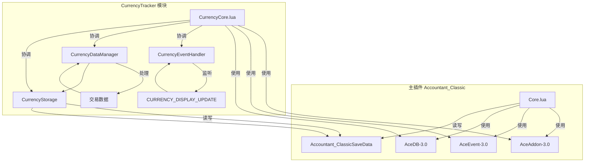
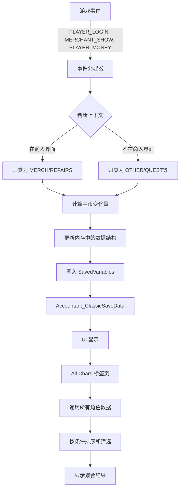

# 技术架构

<cite>
**本文档引用的文件**   
- [Core.lua](file://Core/Core.lua)
- [CurrencyCore.lua](file://CurrencyTracker/CurrencyCore.lua)
- [CurrencyEventHandler.lua](file://CurrencyTracker/CurrencyEventHandler.lua)
- [CurrencyStorage.lua](file://CurrencyTracker/CurrencyStorage.lua)
- [CurrencyDataManager.lua](file://CurrencyTracker/CurrencyDataManager.lua)
- [AceAddon-3.0.lua](file://Libs/AceAddon-3.0/AceAddon-3.0.lua)
- [AceEvent-3.0.lua](file://Libs/AceEvent-3.0/AceEvent-3.0.lua)
- [Constants.lua](file://Core/Constants.lua)
- [CurrencyConstants.lua](file://CurrencyTracker/CurrencyConstants.lua)
</cite>

## 目录
1. [引言](#引言)
2. [单例插件架构](#单例插件架构)
3. [事件驱动设计](#事件驱动设计)
4. [交易处理与上下文管理](#交易处理与上下文管理)
5. [跨角色数据聚合](#跨角色数据聚合)
6. [模块解耦设计](#模块解耦设计)
7. [组件交互图](#组件交互图)
8. [数据流图](#数据流图)

## 引言
Accountant_Classic 是一个为《魔兽世界》经典版设计的财务追踪插件，其核心功能是记录玩家的金币收支情况。本技术架构文档旨在系统性地阐述该插件的软件设计模式和系统边界。文档将深入分析其基于AceAddon-3.0的单例架构、事件驱动机制、数据处理流程以及模块化设计。通过本文档，开发者可以全面理解插件的内部工作原理，包括其如何管理状态、响应游戏事件、处理交易上下文以及实现跨角色的数据聚合。

## 单例插件架构

Accountant_Classic 采用基于 **AceAddon-3.0** 库的单例模式进行架构设计。这种设计模式确保了在整个游戏会话中，插件的核心功能仅存在一个实例，从而避免了资源浪费和状态冲突。

插件的生命周期由 **OnInitialize** 和 **OnEnable** 两个关键方法管理。在 `Core.lua` 文件中，通过 `LibStub("AceAddon-3.0"):NewAddon()` 创建了名为 `Accountant_Classic` 的单例对象。该对象在创建后，会自动进入初始化队列。

- **OnInitialize**: 此方法在插件完全加载后立即调用。它负责执行初始化任务，例如加载保存的变量（SavedVariables）、设置默认选项、初始化数据结构（如 `initOptions()` 函数）以及注册事件。此阶段发生在 `PLAYER_LOGIN` 事件之前，主要用于准备插件的静态配置和基础数据。
- **OnEnable**: 此方法在 `PLAYER_LOGIN` 事件触发时被调用。此时，游戏世界已基本就绪，大部分游戏数据（如玩家角色信息）已经可用。`OnEnable` 方法负责启用插件的核心功能，例如开始监听游戏事件、构建用户界面（UI）以及恢复上一次会话的状态。这标志着插件从“准备就绪”状态转变为“运行中”状态。

这种分阶段的生命周期管理确保了插件在正确的时机执行正确的操作，保证了稳定性和可靠性。

**Section sources**
- [Core.lua](file://Core/Core.lua#L1-L2335)
- [AceAddon-3.0.lua](file://Libs/AceAddon-3.0/AceAddon-3.0.lua#L1-L650)

## 事件驱动设计

Accountant_Classic 的核心功能依赖于 **AceEvent-3.0** 库实现的事件驱动设计。插件通过监听特定的游戏事件来触发数据记录逻辑，从而实现对玩家经济活动的实时追踪。

在 `Core.lua` 中，`AccountantClassic_RegisterEvents` 函数注册了一系列关键事件，主要包括：
- **PLAYER_LOGIN**: 玩家登录时触发，用于初始化会话和执行数据滚动（rollover）。
- **MERCHANT_SHOW**: 商人界面打开时触发，用于记录与商人相关的交易。
- **PLAYER_MONEY**: 玩家的金币数量发生变化时触发，这是记录金币收支的核心事件。

当这些事件发生时，AceEvent-3.0 会调用预先注册的事件处理函数。例如，`PLAYER_MONEY` 事件会触发一个函数，该函数会比较当前金币数量与上一次记录的数量，计算出变化量，并将其归类到相应的收支类型（如训练、修理、任务奖励等）中，最终更新到保存的数据结构里。这种设计模式使得插件能够以非侵入式的方式响应游戏状态的变化，实现了高内聚、低耦合。

**Section sources**
- [Core.lua](file://Core/Core.lua#L1-L2335)
- [Constants.lua](file://Core/Constants.lua#L1-L261)
- [AceEvent-3.0.lua](file://Libs/AceEvent-3.0/AceEvent-3.0.lua#L1-L127)

## 交易处理与上下文管理

在处理交易时，Accountant_Classic 需要管理当前的上下文，以准确判断交易的性质。一个典型的上下文是“当前是否在商人界面”。

该上下文管理机制主要通过监听 `MERCHANT_SHOW` 和 `MERCHANT_CLOSED` 事件来实现。当 `MERCHANT_SHOW` 事件触发时，插件会设置一个内部标志，表明玩家当前正在与商人交互。随后，当 `PLAYER_MONEY` 事件发生时，插件会检查这个标志。如果标志为真，则将此次金币变化归类为“商人”（MERCH）或“修理”（REPAIRS）；如果标志为假，则归类为其他类型（如任务奖励、拍卖行等）。这种基于事件的上下文管理确保了交易分类的准确性。

**Section sources**
- [Core.lua](file://Core/Core.lua#L1-L2335)
- [Constants.lua](file://Core/Constants.lua#L1-L261)

## 跨角色数据聚合

Accountant_Classic 支持跨角色查看所有角色的财务数据，这一功能通过遍历 `SavedVariables` 中的存储结构来实现。

插件的保存数据结构是一个多层嵌套的表，其路径为 `Accountant_ClassicSaveData[服务器名][角色名]`。为了聚合所有角色的数据，插件会遍历 `Accountant_ClassicSaveData` 表中的每一个服务器条目，然后遍历每个服务器下的每一个角色条目。对于每个角色，它会读取其 `options.totalcash` 字段（即总金币数）以及 `options.lastsessiondate` 字段（最后登录日期），并将这些信息用于在“All Chars”标签页中显示。

此外，插件还支持按服务器和阵营进行筛选，这通过在遍历时检查 `AC_SELECTED_SERVER` 和 `AC_SELECTED_FACTION` 等选择变量来实现。最终，聚合的数据会根据用户的选择（如按金币数、名称或日期排序）进行排序并显示。

**Section sources**
- [Core.lua](file://Core/Core.lua#L1-L2335)

## 模块解耦设计

Accountant_Classic 采用了模块化设计，其中 **CurrencyTracker** 模块是一个独立运作但共享基础库的典型例子。

CurrencyTracker 模块位于 `CurrencyTracker/` 目录下，拥有自己的核心文件（`CurrencyCore.lua`）、事件处理器（`CurrencyEventHandler.lua`）、数据管理器（`CurrencyDataManager.lua`）和存储模块（`CurrencyStorage.lua`）。它通过 `CurrencyTracker = CurrencyTracker or {}` 的方式创建独立的命名空间，确保了其内部逻辑的封装性。

尽管是独立的，CurrencyTracker 模块仍然深度依赖于主插件的基础库。它通过 `LibStub` 加载 `AceAddon-3.0`、`AceEvent-3.0` 和 `AceLocale-3.0` 等库，并且其数据存储直接写入主插件的 `Accountant_ClassicSaveData` 全局变量中。这种设计实现了“独立运作”与“共享基础”的完美平衡：CurrencyTracker 可以作为一个可选功能被单独启用或禁用，而无需修改主插件的核心逻辑，同时又能无缝地利用主插件的事件系统、本地化和数据存储能力。

**Section sources**
- [CurrencyCore.lua](file://CurrencyTracker/CurrencyCore.lua#L1-L1414)
- [CurrencyEventHandler.lua](file://CurrencyTracker/CurrencyEventHandler.lua#L1-L932)
- [CurrencyDataManager.lua](file://CurrencyTracker/CurrencyDataManager.lua#L1-L426)
- [CurrencyStorage.lua](file://CurrencyTracker/CurrencyStorage.lua#L1-L1222)

## 组件交互图

**Diagram sources **
- [Core.lua](file://Core/Core.lua#L1-L2335)
- [CurrencyCore.lua](file://CurrencyTracker/CurrencyCore.lua#L1-L1414)
- [CurrencyEventHandler.lua](file://CurrencyTracker/CurrencyEventHandler.lua#L1-L932)
- [CurrencyDataManager.lua](file://CurrencyTracker/CurrencyDataManager.lua#L1-L426)
- [CurrencyStorage.lua](file://CurrencyTracker/CurrencyStorage.lua#L1-L1222)
- [AceAddon-3.0.lua](file://Libs/AceAddon-3.0/AceAddon-3.0.lua#L1-L650)
- [AceEvent-3.0.lua](file://Libs/AceEvent-3.0/AceEvent-3.0.lua#L1-L127)

## 数据流图

**Diagram sources **
- [Core.lua](file://Core/Core.lua#L1-L2335)
- [Constants.lua](file://Core/Constants.lua#L1-L261)