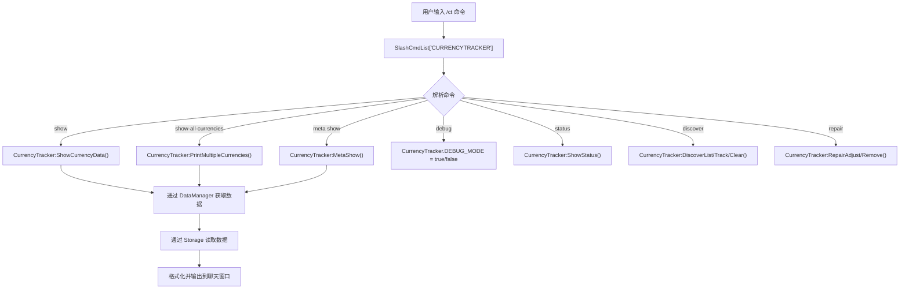
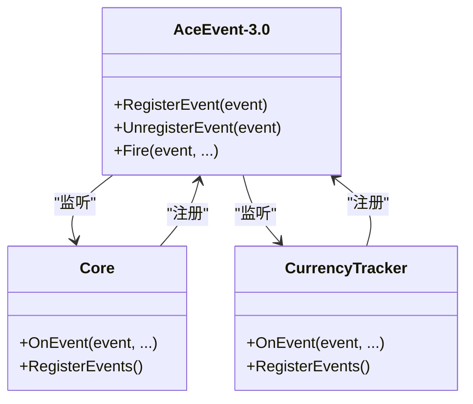
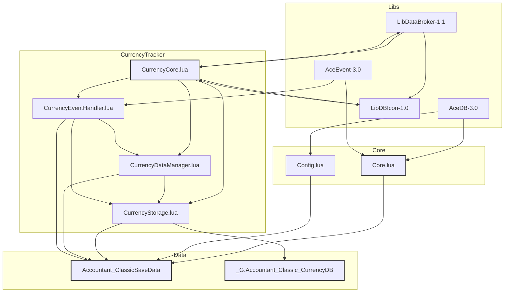

# 模块解耦与扩展机制

<cite>
**本文档引用的文件**   
- [Core/Core.lua](file://Core/Core.lua)
- [Core/Config.lua](file://Core/Config.lua)
- [CurrencyTracker/CurrencyCore.lua](file://CurrencyTracker/CurrencyCore.lua)
- [CurrencyTracker/CurrencyStorage.lua](file://CurrencyTracker/CurrencyStorage.lua)
- [CurrencyTracker/CurrencyDataManager.lua](file://CurrencyTracker/CurrencyDataManager.lua)
- [CurrencyTracker/CurrencyEventHandler.lua](file://CurrencyTracker/CurrencyEventHandler.lua)
- [Libs/AceDB-3.0/AceDB-3.0.lua](file://Libs/AceDB-3.0/AceDB-3.0.lua)
- [Libs/AceEvent-3.0/AceEvent-3.0.lua](file://Libs/AceEvent-3.0/AceEvent-3.0.lua)
- [Libs/LibDataBroker-1.1/LibDataBroker-1.1.lua](file://Libs/LibDataBroker-1.1/LibDataBroker-1.1.lua)
- [Libs/LibDBIcon-1.0/LibDBIcon-1.0.lua](file://Libs/LibDBIcon-1.0/LibDBIcon-1.0.lua)
</cite>

## 目录
1. [模块解耦设计](#模块解耦设计)
2. [功能隔离实现](#功能隔离实现)
3. [共享基础库](#共享基础库)
4. [插件扩展性](#插件扩展性)
5. [外部集成点](#外部集成点)
6. [组件依赖图](#组件依赖图)

## 模块解耦设计

Accountant_Classic 插件通过精心设计的模块化架构，实现了 `Core`（金币追踪）与 `CurrencyTracker`（货币追踪）两个核心模块的完全解耦。这种设计确保了两个子系统可以独立开发、测试和维护，同时又能通过定义良好的接口协同工作。

`Core` 模块主要负责追踪玩家的金币（金钱）变化，提供用户界面（UI）来展示收入、支出和净收益。它通过 `Core.xml` 和 `Core-Classic.xml` 文件加载，其功能围绕 `Core.lua` 和 `Config.lua` 等核心文件构建。

`CurrencyTracker` 模块则是一个独立的子系统，专注于追踪游戏中的各种货币（如荣誉点、声望、代币等）。其设计原则是“无头优先”（headless-first），即默认不提供用户界面，而是作为一个后台服务运行。该模块通过 `CurrencyTracker.xml` 文件加载，其核心功能由 `CurrencyCore.lua`、`CurrencyDataManager.lua` 和 `CurrencyEventHandler.lua` 等文件实现。

两个模块之间没有直接的代码依赖。它们通过共享的 Ace3 基础库（如 AceDB 和 AceEvent）以及一个共同的全局数据结构 `Accountant_ClassicSaveData` 来进行间接通信和数据交换。这种松耦合的设计极大地提高了代码的可维护性和可测试性。

**文档来源**
- [Core/Core.lua](file://Core/Core.lua#L1-L2335)
- [CurrencyTracker/CurrencyCore.lua](file://CurrencyTracker/CurrencyCore.lua#L1-L1414)

## 功能隔离实现

`CurrencyTracker` 模块通过独立的 Slash 命令和数据存储实现了与 `Core` 模块的功能隔离。

### 独立的 Slash 命令
`CurrencyTracker` 模块通过 `/ct` 命令提供所有功能，与 `Core` 模块的 `/accountant` 命令完全分离。这确保了用户在使用货币追踪功能时，不会与金币追踪功能产生混淆。



**图示来源**
- [CurrencyTracker/CurrencyCore.lua](file://CurrencyTracker/CurrencyCore.lua#L1-L1414)

### 独立的数据存储
`CurrencyTracker` 模块使用独立的数据存储结构，确保其数据与 `Core` 模块的金币数据完全隔离。

- **主数据存储**: `CurrencyTracker` 的所有货币数据都存储在 `Accountant_ClassicSaveData` 全局表的 `currencyData` 字段下。其数据结构为：
  ```
  Accountant_ClassicSaveData[服务器][角色].currencyData[货币ID][时间段][来源] = { In = 0, Out = 0 }
  ```
  这种结构与 `Core` 模块用于存储金币数据的 `data` 字段是并列的，互不干扰。

- **账户范围的发现数据**: 为了实现跨角色的货币发现信息共享，`CurrencyTracker` 使用了一个独立的全局表 `_G.Accountant_Classic_CurrencyDB`。该表存储了所有被发现的货币的元数据（如名称、图标、是否追踪等），其结构为：
  ```
  _G.Accountant_Classic_CurrencyDB.currencyDiscovery[货币ID] = { name = "名称", icon = "图标", tracked = true }
  ```
  这个表是账户范围的，不与任何特定角色绑定，确保了玩家在不同角色上发现的货币信息可以共享。

这种数据存储的隔离设计，使得 `CurrencyTracker` 可以独立地进行数据迁移、修复和初始化，而不会影响到 `Core` 模块的任何功能。

**文档来源**
- [CurrencyTracker/CurrencyStorage.lua](file://CurrencyTracker/CurrencyStorage.lua#L1-L1222)
- [CurrencyTracker/CurrencyCore.lua](file://CurrencyTracker/CurrencyCore.lua#L1-L1414)

## 共享基础库

尽管 `Core` 和 `CurrencyTracker` 模块在功能上是解耦的，但它们都依赖于 Ace3 插件框架提供的基础库，这使得它们能够以一致的方式处理配置、事件和数据库操作。

### AceDB-3.0
两个模块都使用 `AceDB-3.0` 来管理其配置和持久化数据。

- `Core` 模块通过 `Config.lua` 文件创建和注册其配置选项表，并使用 `AceDB` 来管理用户配置文件（profile）。其配置数据存储在 `Accountant_ClassicSaveData[服务器][角色].options` 中。
- `CurrencyTracker` 模块同样使用 `AceDB` 的概念，但其配置数据（如是否启用追踪、最后选择的货币等）直接存储在 `Accountant_ClassicSaveData[服务器][角色].currencyOptions` 中。虽然它没有直接调用 `AceDB` 的 API，但其数据结构和管理方式遵循了 `AceDB` 的模式。

这种共享基础库的使用，确保了两个模块在数据持久化和配置管理上具有一致的行为，而无需直接相互依赖。

### AceEvent-3.0
两个模块都利用 `AceEvent-3.0` 来处理游戏事件。

- `Core` 模块通过 `AceEvent-3.0` 注册 `PLAYER_MONEY` 和 `CHAT_MSG_MONEY` 等事件来追踪金币变化。
- `CurrencyTracker` 模块则注册 `CURRENCY_DISPLAY_UPDATE` 和 `BAG_UPDATE` 等事件来追踪货币变化。

通过共享 `AceEvent-3.0`，两个模块可以高效地监听和响应游戏事件，而事件的分发和管理由 `AceEvent` 库统一处理，避免了模块间的直接耦合。



**图示来源**
- [Libs/AceEvent-3.0/AceEvent-3.0.lua](file://Libs/AceEvent-3.0/AceEvent-3.0.lua#L1-L372)
- [Core/Core.lua](file://Core/Core.lua#L1-L2335)
- [CurrencyTracker/CurrencyEventHandler.lua](file://CurrencyTracker/CurrencyEventHandler.lua#L1-L932)

## 插件扩展性

`CurrencyTracker` 模块的设计充分考虑了未来的可扩展性，遵循了清晰的模式，便于新增货币类型或跟踪维度。

### 新增货币类型
要支持一种新的货币类型，开发者只需遵循以下步骤：

1.  **动态发现**: `CurrencyTracker` 的核心优势在于其动态发现机制。当玩家在游戏中首次获得一种新的货币时，`CurrencyEventHandler` 会捕获 `CURRENCY_DISPLAY_UPDATE` 事件。如果该货币 ID 尚未被记录，系统会自动将其添加到 `Accountant_Classic_CurrencyDB.currencyDiscovery` 表中，并保存其基本元数据（如名称、图标）。这意味着，对于绝大多数新货币，无需任何代码修改即可被自动追踪。
2.  **静态定义（可选）**: 对于需要特殊处理的货币（如设置周上限、关联任务等），开发者可以在 `CurrencyConstants.lua` 文件中添加其元数据。例如，可以为特定货币定义 `weeklyMax` 或 `earnByQuest` 等属性。这不会影响已发现的货币，但为特定货币提供了更丰富的信息。

### 新增跟踪维度
当前的跟踪维度包括会话（Session）、今日（Today）、本周（Week）、本月（Month）、本年（Year）和总计（Total）。要新增一个维度（例如“上个副本”），可以按照以下模式进行：

1.  **扩展数据结构**: 在 `CurrencyStorage.lua` 的 `TIME_PERIODS` 常量中添加新的时间段（如 `"Dungeon"`）。
2.  **更新数据处理**: 在 `Storage:InitializeCurrencyData()` 和 `Storage:ShiftCurrencyLogs()` 等方法中，确保新的时间段被正确初始化和处理。
3.  **扩展命令**: 在 `CurrencyCore.lua` 中，修改 `ShowHelp()` 函数以包含新的时间段，并实现相应的命令处理逻辑（如 `/ct show dungeon <id>`）。
4.  **更新 UI（如果需要）**: 如果实现了 UI，需要在 `CurrencyFrame.lua` 中更新标签和布局以支持新的维度。

这种模式化的设计使得扩展功能变得简单且可预测，所有相关的修改都集中在 `CurrencyTracker` 模块内部，不会影响 `Core` 模块。

**文档来源**
- [CurrencyTracker/CurrencyConstants.lua](file://CurrencyTracker/CurrencyConstants.lua#L1-L555)
- [CurrencyTracker/CurrencyStorage.lua](file://CurrencyTracker/CurrencyStorage.lua#L1-L1222)
- [CurrencyTracker/CurrencyCore.lua](file://CurrencyTracker/CurrencyCore.lua#L1-L1414)

## 外部集成点

`CurrencyTracker` 模块通过 `LibDataBroker-1.1` 和 `LibDBIcon-1.0` 提供了强大的外部集成点，允许第三方插件轻松地读取数据或添加快捷入口。

### LibDataBroker-1.1 集成
`LibDataBroker-1.1` 是一个轻量级的数据代理框架，允许插件将数据源（DataObject）注册到一个全局的代理池中。

- **数据源创建**: `CurrencyTracker` 可以创建一个 `LibDataBroker` 数据对象，该对象包含一个 `text` 字段，用于显示当前选定货币的摘要信息（如收入、支出）。
- **数据访问**: 第三方插件（如 `ElvUI` 或 `Titan Panel`）可以通过 `LibDataBroker` 的 API 获取这个数据对象，并将其集成到自己的信息面板中。例如，一个插件可以查询 `CurrencyTracker` 的数据对象，并将其显示为一个信息条。

```lua
-- CurrencyTracker 创建数据对象的伪代码
local ldb = LibStub("LibDataBroker-1.1")
local currencyLDB = ldb:NewDataObject("AccountantCurrency", {
    type = "data source",
    text = "Loading...",
    OnClick = function(clickedframe, button)
        -- 处理点击事件，例如打开 UI
    end,
    OnTooltipShow = function(tooltip)
        -- 填充工具提示，显示详细信息
    end
})

-- 第三方插件读取数据的伪代码
local ldb = LibStub("LibDataBroker-1.1")
local dataobj = ldb:GetDataObjectByName("AccountantCurrency")
if dataobj then
    local currentText = dataobj.text
    -- 将 currentText 显示在自己的 UI 中
end
```

### LibDBIcon-1.0 集成
`LibDBIcon-1.0` 用于在小地图周围创建一个可拖动的图标按钮。

- **按钮注册**: `CurrencyTracker` 可以使用 `LibDBIcon-1.0` 将其 `LibDataBroker` 数据对象注册为一个小地图按钮。
- **交互功能**: 该按钮支持左键点击打开 `CurrencyTracker` 的独立 UI 窗口，右键点击打开配置选项。这为用户提供了快速访问 `CurrencyTracker` 功能的便捷方式。

```lua
-- 注册小地图按钮
ACbutton:Register("Accountant_Classic", currencyLDB, profile.minimap);
```

通过这两个库的集成，`CurrencyTracker` 不仅可以作为一个独立的插件运行，还可以无缝地融入到更广泛的插件生态系统中，为其他插件提供数据支持。

**文档来源**
- [Libs/LibDataBroker-1.1/LibDataBroker-1.1.lua](file://Libs/LibDataBroker-1.1/LibDataBroker-1.1.lua#L1-L91)
- [Libs/LibDBIcon-1.0/LibDBIcon-1.0.lua](file://Libs/LibDBIcon-1.0/LibDBIcon-1.0.lua#L1-L572)

## 组件依赖图

以下图表清晰地展示了 `Accountant_Classic` 插件中各模块间的调用关系与数据流方向。



**图示来源**
- [Core/Core.lua](file://Core/Core.lua#L1-L2335)
- [Core/Config.lua](file://Core/Config.lua#L1-L430)
- [CurrencyTracker/CurrencyCore.lua](file://CurrencyTracker/CurrencyCore.lua#L1-L1414)
- [CurrencyTracker/CurrencyDataManager.lua](file://CurrencyTracker/CurrencyDataManager.lua#L1-L426)
- [CurrencyTracker/CurrencyEventHandler.lua](file://CurrencyTracker/CurrencyEventHandler.lua#L1-L932)
- [CurrencyTracker/CurrencyStorage.lua](file://CurrencyTracker/CurrencyStorage.lua#L1-L1222)
- [Libs/AceDB-3.0/AceDB-3.0.lua](file://Libs/AceDB-3.0/AceDB-3.0.lua#L1-L372)
- [Libs/AceEvent-3.0/AceEvent-3.0.lua](file://Libs/AceEvent-3.0/AceEvent-3.0.lua#L1-L372)
- [Libs/LibDataBroker-1.1/LibDataBroker-1.1.lua](file://Libs/LibDataBroker-1.1/LibDataBroker-1.1.lua#L1-L91)
- [Libs/LibDBIcon-1.0/LibDBIcon-1.0.lua](file://Libs/LibDBIcon-1.0/LibDBIcon-1.0.lua#L1-L572)