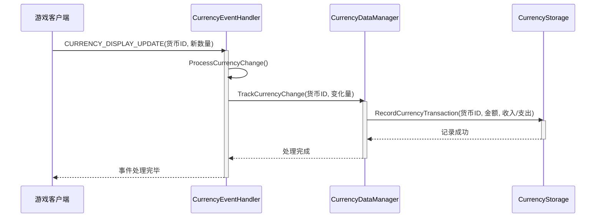

# 设计模式与架构风格

<cite>
**本文档中引用的文件**   
- [Core.lua](file://Core/Core.lua)
- [AceAddon-3.0.lua](file://Libs/AceAddon-3.0/AceAddon-3.0.lua)
- [CurrencyCore.lua](file://CurrencyTracker/CurrencyCore.lua)
- [CurrencyEventHandler.lua](file://CurrencyTracker/CurrencyEventHandler.lua)
- [CurrencyStorage.lua](file://CurrencyTracker/CurrencyStorage.lua)
- [CurrencyDataManager.lua](file://CurrencyTracker/CurrencyDataManager.lua)
- [CurrencyConstants.lua](file://CurrencyTracker/CurrencyConstants.lua)
</cite>

## 目录
1. [单例插件架构实现](#单例插件架构实现)
2. [生命周期方法职责划分](#生命周期方法职责划分)
3. [模块化设计与功能解耦](#模块化设计与功能解耦)
4. [Lua面向对象编程实践](#lua面向对象编程实践)
5. [事件驱动机制优势分析](#事件驱动机制优势分析)
6. [架构决策权衡考量](#架构决策权衡考量)

## 单例插件架构实现

Accountant_Classic 插件通过 AceAddon-3.0 库实现了严格的单例模式，确保了全局唯一实例。该架构的核心在于 `LibStub` 服务定位器模式，它作为插件的注册中心，通过 `NewAddon` 方法创建并管理插件实例。当调用 `LibStub("AceAddon-3.0"):NewAddon("Accountant_Classic")` 时，AceAddon-3.0 会首先检查 `addons` 注册表中是否已存在同名插件，若存在则直接抛出错误，从而从源头上杜绝了重复实例化。新创建的插件对象被存储在 `AceAddon.addons` 表中，并通过元表（metatable）的 `__tostring` 方法重写，确保其可识别性。这种设计不仅保证了插件的全局唯一性，还通过集中化的注册表为后续的模块管理和生命周期控制提供了基础。

**Section sources**
- [Core.lua](file://Core/Core.lua#L25-L50)
- [AceAddon-3.0.lua](file://Libs/AceAddon-3.0/AceAddon-3.0.lua#L100-L150)

## 生命周期方法职责划分

插件的生命周期由 AceAddon-3.0 严格定义，主要通过 `OnInitialize` 和 `OnEnable` 两个核心方法进行职责划分，实现了初始化与启用的解耦。

### OnInitialize 方法
`OnInitialize` 方法在 `ADDON_LOADED` 事件触发时执行，其核心职责是完成插件的基础配置和依赖项的初始化。此阶段主要进行数据库初始化（通过 AceDB）、LibDataBroker (LDB) 数据对象的注册、聊天命令（`/accountant`, `/acc`）的设置、主UI框架的创建以及配置面板的搭建。此方法执行时，游戏世界尚未加载，因此所有操作都应是静态的、不依赖于角色数据的。其执行顺序严格遵循：数据库初始化 → LDB对象创建 → 最小化地图按钮注册 → 聊天命令注册 → 选项面板设置 → UI框架创建。

**Section sources**
- [Core.lua](file://Core/Core.lua#L1800-L1850)

### OnEnable 方法
`OnEnable` 方法在 `PLAYER_LOGIN` 事件后触发，此时角色数据已完全可用。其核心职责是启用插件的功能，包括迁移旧版选项、安全地钩住（hook）游戏函数（如修理、拾取物品）、加载财务数据、建立初始金钱基线、注册所有财务追踪事件以及初始化 CurrencyTracker 模块。此方法的执行时机至关重要，因为它需要 `AC_PLAYER`, `AC_SERVER`, `AC_FACTION` 等角色特定数据，若在 `ADDON_LOADED` 时调用，将导致数据初始化不完整或错误。

**Section sources**
- [Core.lua](file://Core/Core.lua#L1852-L1920)

## 模块化设计与功能解耦

Accountant_Classic 采用了清晰的模块化设计原则，通过共享的 Libs 库实现了 Core 与 CurrencyTracker 模块之间的功能解耦。CurrencyTracker 模块作为一个独立的子系统，拥有自己的核心（CurrencyCore）、数据管理（CurrencyDataManager）、事件处理（CurrencyEventHandler）和存储（CurrencyStorage）组件。这些组件通过 `CurrencyTracker` 全局表进行协调，但其内部逻辑完全独立。关键的解耦体现在数据存储上：CurrencyStorage 模块负责管理 `Accountant_ClassicSaveData` 中的货币数据，而 Core 模块则专注于金币数据。两者通过 AceDB-3.0 共享同一套持久化机制，但操作的是不同的数据结构，从而实现了高内聚、低耦合的设计。

```mermaid
graph TD
subgraph "Libs"
AceAddon["AceAddon-3.0"]
AceDB["AceDB-3.0"]
AceEvent["AceEvent-3.0"]
AceLocale["AceLocale-3.0"]
end
subgraph "Core"
Core["Core.lua"]
end
subgraph "CurrencyTracker"
CurrencyCore["CurrencyCore.lua"]
CurrencyDataManager["CurrencyDataManager.lua"]
CurrencyEventHandler["CurrencyEventHandler.lua"]
CurrencyStorage["CurrencyStorage.lua"]
end
AceAddon --> Core
AceDB --> Core
AceEvent --> Core
AceLocale --> Core
AceAddon --> CurrencyCore
AceDB --> CurrencyStorage
AceEvent --> CurrencyEventHandler
AceLocale --> CurrencyDataManager
Core --> CurrencyCore
CurrencyCore --> CurrencyDataManager
CurrencyCore --> CurrencyEventHandler
CurrencyCore --> CurrencyStorage
```

**Diagram sources**
- [Core.lua](file://Core/Core.lua)
- [CurrencyCore.lua](file://CurrencyTracker/CurrencyCore.lua)
- [CurrencyDataManager.lua](file://CurrencyTracker/CurrencyDataManager.lua)
- [CurrencyEventHandler.lua](file://CurrencyTracker/CurrencyEventHandler.lua)
- [CurrencyStorage.lua](file://CurrencyTracker/CurrencyStorage.lua)

## Lua面向对象编程实践

Accountant_Classic 在 Lua 中通过表（table）和元表（metatable）巧妙地模拟了面向对象编程。插件实例本身就是一个包含方法和属性的表，例如 `addon = LibStub("AceAddon-3.0"):NewAddon(...)` 创建的 `addon` 对象。通过 `Embed` 机制，AceAddon-3.0 将其提供的 `Enable`, `Disable`, `RegisterEvent` 等方法直接注入到插件表中，这类似于类的继承或组合。对于模块化设计，`NewModule` 方法通过创建一个新表，并将其元表的 `__index` 指向一个原型（prototype）表来实现“继承”。例如，CurrencyTracker 的子模块可以通过这种方式共享通用方法。此外，`CurrencyStorage` 模块中的 `InitializeCurrencyData` 方法通过操作嵌套表来管理不同货币和时间段的数据，这体现了用数据结构模拟对象属性的实践。

**Section sources**
- [AceAddon-3.0.lua](file://Libs/AceAddon-3.0/AceAddon-3.0.lua#L500-L600)
- [CurrencyStorage.lua](file://CurrencyTracker/CurrencyStorage.lua#L200-L300)

## 事件驱动机制优势分析

Accountant_Classic 选择事件驱动而非轮询机制来追踪金币和货币变化，这是出于性能和响应性的深思熟虑。轮询机制需要在主游戏循环中定期检查状态，这会带来持续的CPU开销，尤其是在高帧率下。而事件驱动机制通过 `AceEvent-3.0` 注册 `PLAYER_MONEY` 和 `CHAT_MSG_MONEY` 等特定事件，仅在相关游戏事件发生时才触发回调函数。这极大地减少了不必要的计算，将CPU占用降至最低。同时，事件驱动提供了近乎实时的响应性，当玩家获得或花费金币时，插件能立即捕获并记录该变化，确保了数据的准确性和及时性。对于 CurrencyTracker 模块，它通过监听 `CURRENCY_DISPLAY_UPDATE` 事件来追踪货币，同样遵循了这一高效原则。



**Diagram sources**
- [CurrencyEventHandler.lua](file://CurrencyTracker/CurrencyEventHandler.lua#L500-L600)
- [CurrencyDataManager.lua](file://CurrencyTracker/CurrencyDataManager.lua#L100-L150)
- [CurrencyStorage.lua](file://CurrencyTracker/CurrencyStorage.lua#L100-L150)

## 架构决策权衡考量

Accountant_Classic 的架构设计在内存占用与实时性之间做出了精妙的权衡。一方面，通过 AceDB-3.0 将所有数据（金币、货币、配置）持久化到 `SavedVariables`，确保了数据的长期保存和跨会话的连续性，但这会占用一定的磁盘和内存空间。另一方面，为了保证实时性，插件采用了事件驱动的即时更新策略，避免了轮询带来的性能损耗。在数据初始化上，引入了“基线预热”（Priming）机制，通过 `AC_LOG_PRIMED` 标志位确保在角色首次登录时只进行一次性的初始余额设置，既防止了将初始余额误判为收入，又避免了整个首会话的空白期，平衡了数据准确性和用户体验。此外，CurrencyTracker 模块的“登录时基线预热”功能，通过在 `PLAYER_ENTERING_WORLD` 时读取所有已发现货币的实时数量来修正 `Total` 周期，解决了因事件延迟导致的基线偏差问题，进一步提升了数据的可靠性。

**Section sources**
- [Core.lua](file://Core/Core.lua#L100-L200)
- [CurrencyEventHandler.lua](file://CurrencyTracker/CurrencyEventHandler.lua#L300-L400)
- [CurrencyStorage.lua](file://CurrencyTracker/CurrencyStorage.lua#L500-L600)