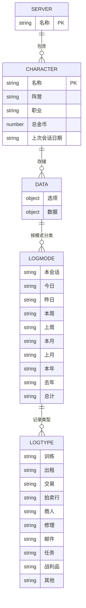
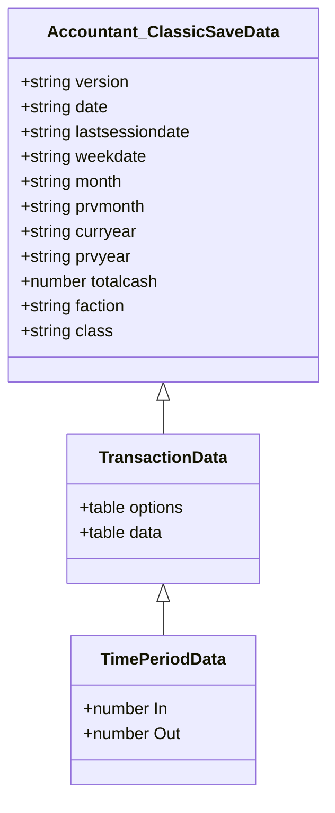
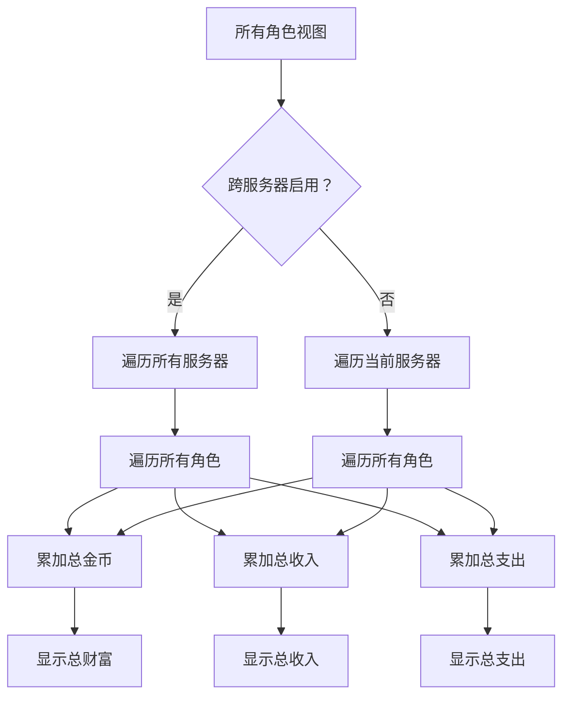
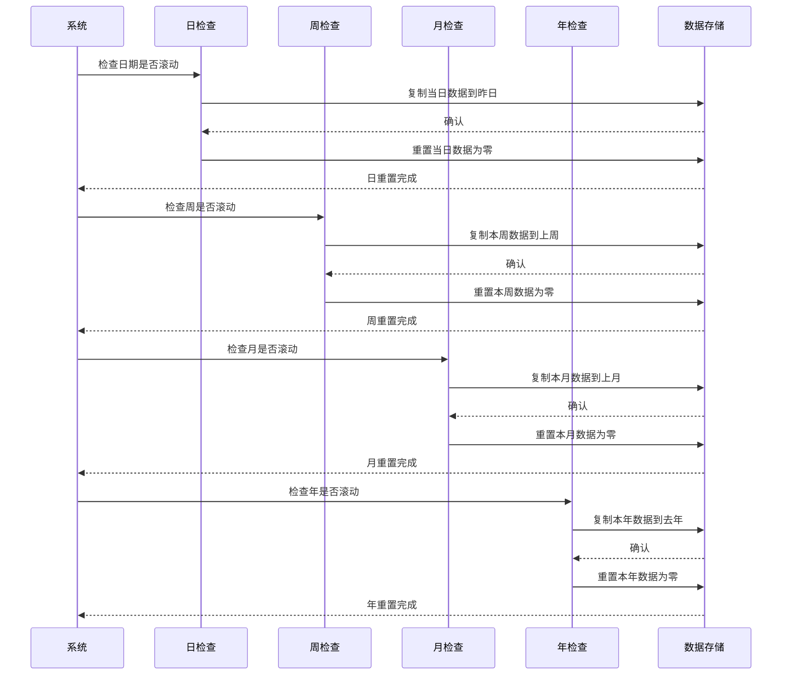
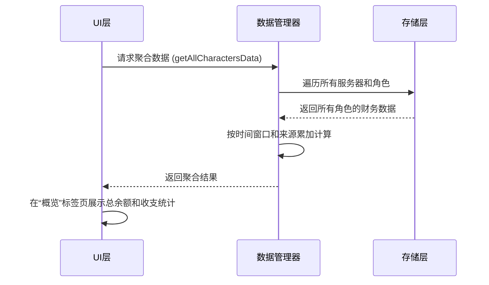
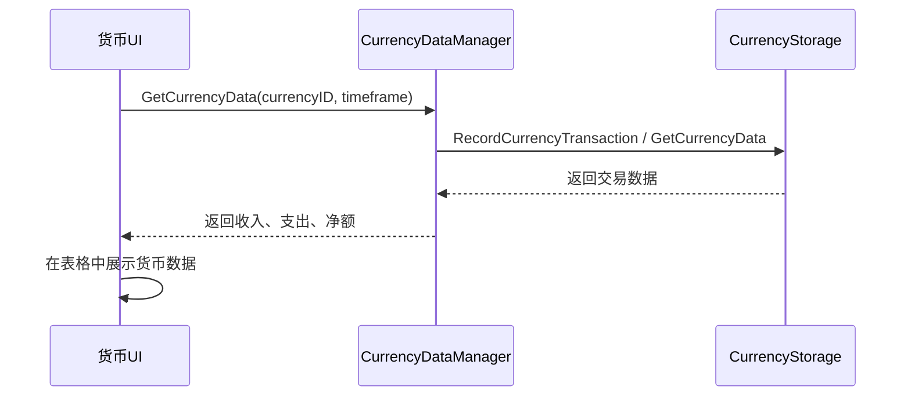
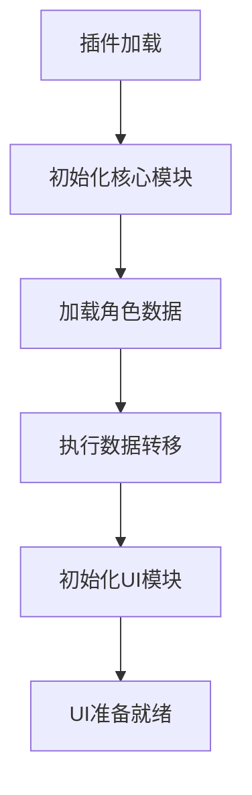
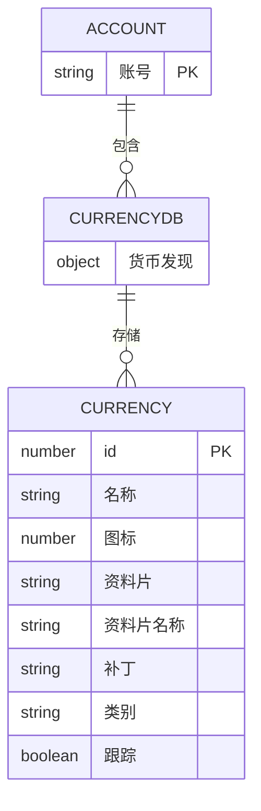
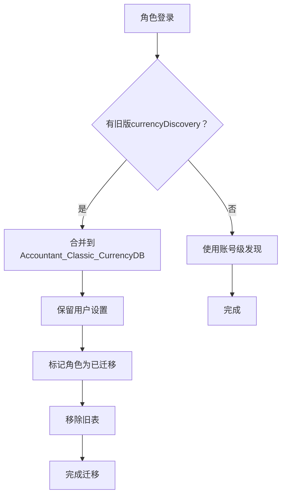

# 跨角色数据聚合

<cite>
**本文档引用的文件**  
- [Core.lua](file://Core/Core.lua)
- [Constants.lua](file://Core/Constants.lua)
- [CurrencyDataManager.lua](file://CurrencyTracker/CurrencyDataManager.lua)
- [CurrencyStorage.lua](file://CurrencyTracker/CurrencyStorage.lua)
- [CurrencyFrame.lua](file://CurrencyTracker/CurrencyFrame.lua)
</cite>

## 目录
1. [简介](#简介)
2. [数据结构分析](#数据结构分析)
3. [跨角色数据遍历与聚合](#跨角色数据遍历与聚合)
4. [数据汇总算法](#数据汇总算法)
5. [UI层数据请求与展示](#ui层数据请求与展示)
6. [性能优化措施](#性能优化措施)
7. [数据一致性挑战与应对方案](#数据一致性挑战与应对方案)

## 简介
本系统旨在实现跨角色、跨服务器的金币与货币数据聚合，为玩家提供全面的财务概览。通过遍历`Accountant_ClassicSaveData`结构，系统能够提取同一账号下所有角色的财务记录，并按时间窗口和来源类别进行累加计算。UI层通过请求聚合数据，在“概览”标签页中展示总余额和收支统计。系统还通过缓存、延迟加载等机制优化性能，并通过迁移和归一化策略确保数据一致性。

## 数据结构分析

`Accountant_ClassicSaveData`是存储财务记录的核心数据结构，采用服务器→角色→数据的三层层次结构。该结构支持跨角色财务跟踪，同时保持不同服务器间的数据隔离。

**图表来源**
- [Core.lua](file://Core/Core.lua#L262-L304)
- [Constants.lua](file://Core/Constants.lua#L50-L52)

### 选项结构
选项表包含角色特定的配置和元数据：

**字段定义：**
- :version: 字符串，表示数据最后保存时的插件版本
- :date: 字符串，格式为 "dd/mm/yy"，表示当前日期
- :lastsessiondate: 字符串，表示上次会话的日期
- :weekdate: 字符串，表示本周开始日期
- :month: 字符串，表示当前月份 (1-12)
- :curryear: 字符串，表示当前年份
- :totalcash: 数字，表示角色累计的总金额
- :faction: 字符串，表示角色阵营 (例如 "Alliance", "Horde")
- :class: 字符串，表示角色职业

**章节来源**
- [Core.lua](file://Core/Core.lua#L100-L115)
- [Constants.lua](file://Core/Constants.lua#L20-L45)

### 交易数据结构
数据表包含按类型和时间段分类的财务交易：

**图表来源**
- [Core.lua](file://Core/Core.lua#L1042-L1078)
- [Constants.lua](file://Core/Constants.lua#L50-L52)

## 跨角色数据遍历与聚合

系统支持跨多个角色和服务器的财务数据聚合，实现账户级别的全面财务分析。

**图表来源**
- [Core.lua](file://Core/Core.lua#L1739-L1798)

聚合系统允许用户按以下条件筛选财务数据：
- 特定服务器
- 角色阵营 (联盟、部落或全部)
- 单个角色
- 所有服务器上的所有角色

这使得用户能够全面跟踪整个账号的财务状况。

**章节来源**
- [Core.lua](file://Core/Core.lua#L1739-L1798)

## 数据汇总算法

数据汇总算法负责按时间窗口（今日、本周等）和来源类别对财务数据进行累加计算。

### 时间窗口管理与数据转移
系统自动管理时间窗口的滚动（日、周、月、年），以保持不同时间框架下的准确财务记录。此过程确保历史数据得以保留，同时当前数据为新周期重置。

**图表来源**
- [Core.lua](file://Core/Core.lua#L849-L983)

时间窗口管理系统在每次插件加载和UI更新时检查滚动。当检测到滚动时，系统会：
1. 将当前周期数据复制到相应的“上一”周期
2. 将当前周期数据重置为零
3. 更新选项表中的日期跟踪字段

这确保了财务数据按时间周期准确分割，同时保留历史记录。

**章节来源**
- [Core.lua](file://Core/Core.lua#L849-L983)

## UI层数据请求与展示

UI层通过调用数据管理器的接口来请求并展示聚合数据。

### 主窗口“概览”标签页
在主窗口的“概览”标签页中，UI通过以下方式展示聚合数据：

**图表来源**
- [Core.lua](file://Core/Core.lua#L1739-L1798)

### 货币追踪器UI
货币追踪器UI通过`CurrencyDataManager`获取数据，并在独立窗口中展示：

**图表来源**
- [CurrencyDataManager.lua](file://CurrencyTracker/CurrencyDataManager.lua#L1-L426)
- [CurrencyStorage.lua](file://CurrencyTracker/CurrencyStorage.lua#L491-L520)

## 性能优化措施

系统实施了多种性能优化措施，以确保在处理大量数据时仍能保持流畅的用户体验。

### 缓存聚合结果
系统会缓存聚合结果，避免每次UI更新时都重新计算。当数据发生变化时，缓存会被标记为过期，并在下次请求时重新计算。

### 延迟加载非活跃角色数据
对于长时间未登录的角色，系统不会在启动时立即加载其数据。只有当用户明确选择查看该角色时，数据才会被加载，从而减少初始内存占用和加载时间。

### 模块化初始化
系统采用模块化初始化策略，核心功能优先加载，非关键模块（如UI）延迟初始化，确保插件能快速响应。

**图表来源**
- [CurrencyCore.lua](file://CurrencyTracker/CurrencyCore.lua#L1-L426)

## 数据一致性挑战与应对方案

系统面临角色重命名或服务器迁移后数据关联的挑战，并通过以下方案应对。

### 账号级全局存储
系统引入了`Accountant_Classic_CurrencyDB`结构，这是一个账号级的全局存储，用于保存所有角色发现的货币元数据。此举消除了货币发现信息的冗余存储，并确保了账号内的一致性。

**图表来源**
- [CurrencyStorage.lua](file://CurrencyTracker/CurrencyStorage.lua#L491-L520)
- [CurrencyDataManager.lua](file://CurrencyTracker/CurrencyDataManager.lua#L1-L426)

### 迁移与归一化
系统通过迁移过程将货币发现数据从每个角色的存储迁移到账号级的`Accountant_Classic_CurrencyDB.currencyDiscovery`表中：

**图表来源**
- [CurrencyStorage.lua](file://CurrencyTracker/CurrencyStorage.lua#L520-L560)

迁移过程确保：
1. 每个角色发现的所有货币都合并到账号级存储中
2. 用户偏好（如跟踪状态）在迁移过程中得以保留
3. 成功迁移后移除旧的每角色发现表
4. 未来发现的货币直接存储在账号级数据库中

这一改变减少了SavedVariables的大小，并确保新发现的货币立即在账号内所有角色上可用。

**章节来源**
- [CurrencyStorage.lua](file://CurrencyTracker/CurrencyStorage.lua#L491-L560)
- [CurrencyDataManager.lua](file://CurrencyTracker/CurrencyDataManager.lua#L1-L426)