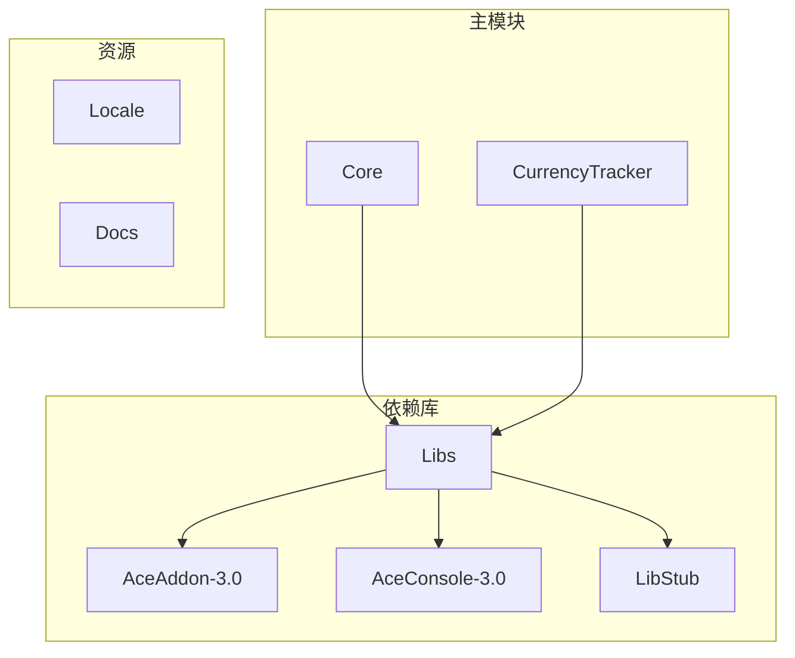
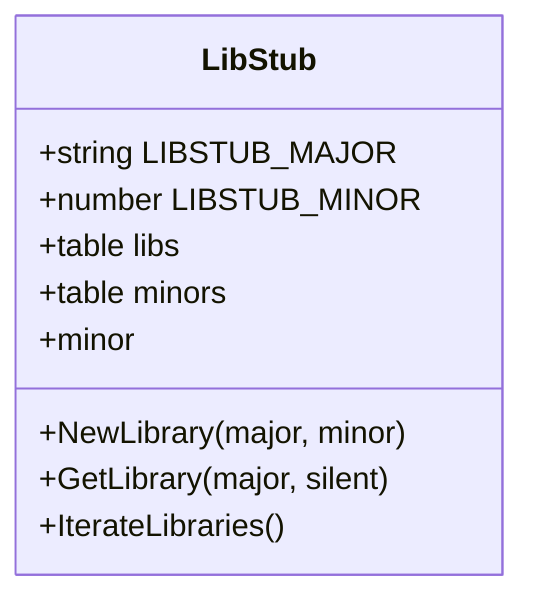
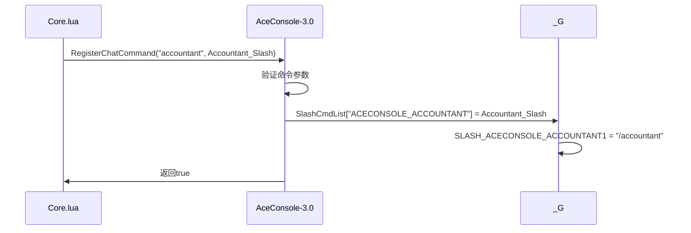
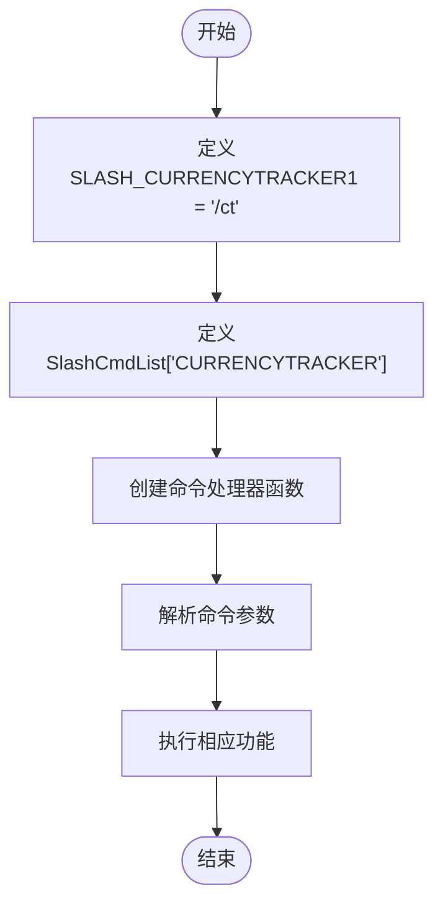
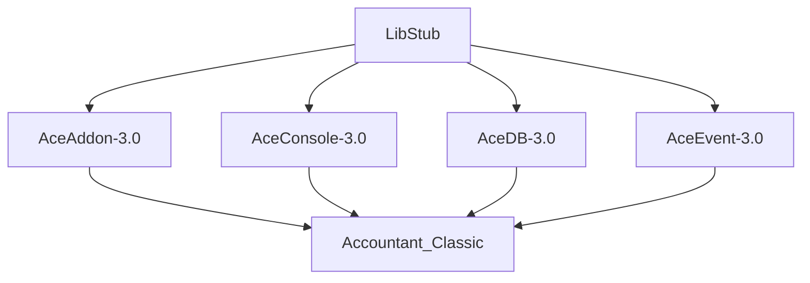

# Slash命令注册失败

<cite>
**本文档引用的文件**  
- [Core/Core.lua](file://Core/Core.lua)
- [CurrencyTracker/CurrencyCore.lua](file://CurrencyTracker/CurrencyCore.lua)
- [Libs/AceConsole-3.0/AceConsole-3.0.lua](file://Libs/AceConsole-3.0/AceConsole-3.0.lua)
- [Libs/LibStub/LibStub.lua](file://Libs/LibStub/LibStub.lua)
</cite>

## 目录
1. [简介](#简介)
2. [项目结构](#项目结构)
3. [核心组件](#核心组件)
4. [架构概述](#架构概述)
5. [详细组件分析](#详细组件分析)
6. [依赖分析](#依赖分析)
7. [性能考虑](#性能考虑)
8. [故障排除指南](#故障排除指南)
9. [结论](#结论)

## 简介
本文档深入分析Accountant_Classic插件中Slash命令注册机制的实现原理，重点研究LibStub和AceAddon-3.0如何协作完成命令绑定。文档将检查Core.lua中`LibStub('AceConsole-3.0')`的初始化流程，验证`RegisterChatCommand`是否被正确调用，并确认CurrencyCore.lua中`/ct`命令的注册逻辑。同时提供详细的调试指导，包括如何启用脚本错误提示、验证按键绑定状态以及排查因TOC文件加载顺序错误导致的依赖库未就绪问题。

## 项目结构
Accountant_Classic插件采用模块化设计，主要分为核心功能模块、货币追踪模块、依赖库和本地化文件四个部分。核心功能位于Core目录，货币追踪功能位于CurrencyTracker目录，所有第三方依赖库统一存放在Libs目录，本地化资源则存放在Locale目录。



**图示来源**
- [Core/Core.lua](file://Core/Core.lua#L1-L50)
- [CurrencyTracker/CurrencyCore.lua](file://CurrencyTracker/CurrencyCore.lua#L1-L30)
- [Libs/LibStub/LibStub.lua](file://Libs/LibStub/LibStub.lua#L1-L20)

## 核心组件
插件的核心组件包括AceAddon-3.0提供的插件管理框架、AceConsole-3.0提供的命令行接口以及LibStub实现的库版本管理。这些组件通过协作实现了插件的初始化、命令注册和功能扩展。

**章节来源**
- [Core/Core.lua](file://Core/Core.lua#L1-L100)
- [Libs/AceConsole-3.0/AceConsole-3.0.lua](file://Libs/AceConsole-3.0/AceConsole-3.0.lua#L1-L50)

## 架构概述
插件采用分层架构设计，上层为业务逻辑模块，下层为第三方依赖库。LibStub作为最底层的库管理器，负责加载和管理所有Ace3库。AceAddon-3.0在LibStub基础上提供插件生命周期管理，而AceConsole-3.0则提供命令行交互功能。

```mermaid
graph TD
A[LibStub] --> B[AceAddon-3.0]
A --> C[AceConsole-3.0]
A --> D[AceDB-3.0]
A --> E[AceEvent-3.0]
B --> F[Accountant_Classic]
C --> F
D --> F
E --> F
F --> G[/ct命令处理器]
F --> H[Accountant命令处理器]
```

**图示来源**
- [Core/Core.lua](file://Core/Core.lua#L1-L30)
- [Libs/AceConsole-3.0/AceConsole-3.0.lua](file://Libs/AceConsole-3.0/AceConsole-3.0.lua#L1-L20)
- [Libs/LibStub/LibStub.lua](file://Libs/LibStub/LibStub.lua#L1-L15)

## 详细组件分析

### LibStub初始化流程分析
LibStub作为Ace3库的版本管理器，其初始化流程确保了插件能够正确加载所需依赖库的最新版本。

#### LibStub类图


**图示来源**
- [Libs/LibStub/LibStub.lua](file://Libs/LibStub/LibStub.lua#L1-L50)

### AceConsole-3.0命令注册机制
AceConsole-3.0通过RegisterChatCommand方法实现Slash命令的注册，该方法将命令与处理函数关联，并在全局环境中创建相应的SLASH_变量。

#### 命令注册序列图


**图示来源**
- [Core/Core.lua](file://Core/Core.lua#L2190-L2200)
- [Libs/AceConsole-3.0/AceConsole-3.0.lua](file://Libs/AceConsole-3.0/AceConsole-3.0.lua#L80-L110)

### CurrencyCore.lua中/ct命令注册分析
CurrencyTracker模块通过直接定义SLASH_CURRENCYTRACKER1全局变量和SlashCmdList条目来注册`/ct`命令，这是一种更直接的命令注册方式。

#### 命令注册流程图


**图示来源**
- [CurrencyTracker/CurrencyCore.lua](file://CurrencyTracker/CurrencyCore.lua#L580-L600)

**章节来源**
- [CurrencyTracker/CurrencyCore.lua](file://CurrencyTracker/CurrencyCore.lua#L580-L779)

## 依赖分析
插件的依赖关系清晰地展示了各组件之间的协作方式。LibStub作为基础库被所有Ace3库依赖，AceAddon-3.0和AceConsole-3.0作为核心功能库被主插件依赖。



**图示来源**
- [Core/Core.lua](file://Core/Core.lua#L1-L30)
- [Libs/LibStub/LibStub.lua](file://Libs/LibStub/LibStub.lua#L1-L20)
- [Libs/AceConsole-3.0/AceConsole-3.0.lua](file://Libs/AceConsole-3.0/AceConsole-3.0.lua#L1-L20)

**章节来源**
- [Core/Core.lua](file://Core/Core.lua#L1-L50)
- [Libs/LibStub/LibStub.lua](file://Libs/LibStub/LibStub.lua#L1-L30)

## 性能考虑
从代码分析来看，命令注册机制的性能开销主要集中在初始化阶段。LibStub的版本检查和AceConsole的命令注册都是一次性操作，不会对游戏运行时性能造成持续影响。建议避免在运行时频繁注册和注销命令，以减少对全局命名空间的修改。

## 故障排除指南
当遇到Slash命令注册失败的问题时，可以按照以下步骤进行排查：

1. **启用脚本错误提示**：在游戏内输入`/console scriptErrors 1`以启用详细的脚本错误报告，这有助于发现潜在的Lua错误。

2. **验证按键绑定**：使用`GetBindingKey('SLASH_ACCOUNTANT1')`命令检查Accountant命令的按键绑定状态，确认命令是否已正确注册。

3. **检查依赖库加载**：确保Libs目录下的所有依赖库文件都存在且未损坏，特别是LibStub.lua、AceAddon-3.0.lua和AceConsole-3.0.lua。

4. **验证TOC文件加载顺序**：检查插件的.toc文件，确保Libs目录在主模块之前加载，正确的顺序应为：
   ```
   ## Dependencies: Libs
   Libs\Libs.xml
   Core\Core.xml
   CurrencyTracker\CurrencyTracker.xml
   ```

5. **调试命令映射**：使用以下代码片段打印addon.commands表内容以确认命令映射：
   ```lua
   -- 在聊天框中输入以下命令
   /run for k,v in pairs(Accountant_Classic.commands) do print(k,v) end
   ```

6. **检查LibStub初始化**：确认LibStub是否成功初始化，可以通过以下代码验证：
   ```lua
   /run if LibStub then print("LibStub已加载") else print("LibStub未加载") end
   ```

7. **验证AceConsole注册**：检查AceConsole-3.0是否正确注册了命令处理函数：
   ```lua
   /run local ac = LibStub("AceConsole-3.0", true) if ac then print("AceConsole已就绪") else print("AceConsole未就绪") end
   ```

**章节来源**
- [Core/Core.lua](file://Core/Core.lua#L2190-L2200)
- [CurrencyTracker/CurrencyCore.lua](file://CurrencyTracker/CurrencyCore.lua#L580-L600)
- [Libs/AceConsole-3.0/AceConsole-3.0.lua](file://Libs/AceConsole-3.0/AceConsole-3.0.lua#L80-L110)

## 结论
Accountant_Classic插件的Slash命令注册机制设计合理，通过LibStub和AceConsole-3.0的协作实现了灵活的命令行接口。`/accountant`和`/ct`命令分别通过AceConsole的RegisterChatCommand方法和直接全局变量定义的方式成功注册。最常见的问题源于TOC文件中的加载顺序错误，确保Libs目录在主模块之前加载是解决问题的关键。开发者应使用提供的调试方法系统性地排查问题，优先检查依赖库的加载状态和全局错误提示。