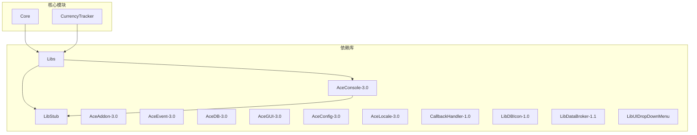
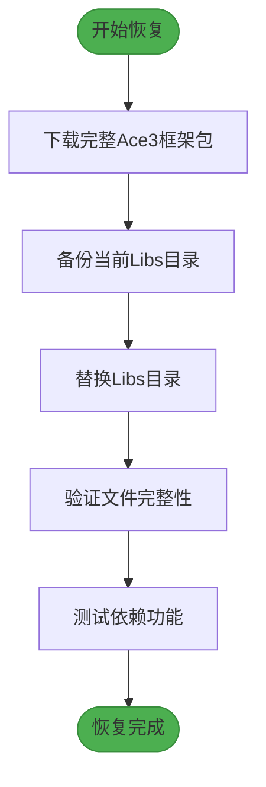

# 依赖缺失

<cite>
**本文档中引用的文件**  
- [AceConsole-3.0.lua](file://Libs/AceConsole-3.0/AceConsole-3.0.lua)
- [LibStub.lua](file://Libs/LibStub/LibStub.lua)
- [Libs.xml](file://Libs/Libs.xml)
- [Accountant_Classic-Classic.toc](file://Accountant_Classic-Classic.toc)
- [Accountant_Classic.toc](file://Accountant_Classic.toc)
- [AceConsole-3.0.xml](file://Libs/AceConsole-3.0/AceConsole-3.0.xml)
- [LibStub.toc](file://Libs/LibStub/LibStub.toc)
</cite>

## 目录
1. [简介](#简介)
2. [项目结构分析](#项目结构分析)
3. [核心依赖验证](#核心依赖验证)
4. [LibStub注入验证](#libstub注入验证)
5. [TOC文件依赖配置检查](#toc文件依赖配置检查)
6. [依赖加载状态检测方法](#依赖加载状态检测方法)
7. [恢复方案](#恢复方案)
8. [结论](#结论)

## 简介
本文档旨在系统性排查Ace3框架依赖链的完整性，重点验证LibStub是否成功注入AceConsole-3.0。通过检查Libs目录下关键文件的存在性与语法正确性，确认TOC文件中的依赖声明，并提供开发者验证和恢复依赖的完整方案，解决因打包工具误删依赖文件导致的命令注册失败问题。

## 项目结构分析
项目采用典型的WoW插件结构，包含Core、CurrencyTracker、Libs、Locale等核心模块。其中Libs目录集中管理所有第三方库依赖，包括Ace3框架组件和辅助库。



**Diagram sources**
- [Libs](file://Libs)
- [Core](file://Core)
- [CurrencyTracker](file://CurrencyTracker)

**Section sources**
- [Libs](file://Libs)
- [Core](file://Core)

## 核心依赖验证
对AceConsole-3.0组件进行完整性验证，确认其核心文件存在且无语法错误。

### AceConsole-3.0文件存在性验证
通过项目结构分析确认，Libs\AceConsole-3.0目录下存在以下文件：
- AceConsole-3.0.lua
- AceConsole-3.0.xml

文件路径：`Libs\AceConsole-3.0\AceConsole-3.0.lua`

### AceConsole-3.0语法完整性验证
文件头部声明了其作为Ace3框架控制台组件的功能，提供斜杠命令注册功能。关键代码段验证：

```lua
local MAJOR,MINOR = "AceConsole-3.0", 7
local AceConsole, oldminor = LibStub:NewLibrary(MAJOR, MINOR)
```

上述代码表明该组件通过LibStub进行版本管理，符合Ace3框架依赖注入标准。

**Section sources**
- [AceConsole-3.0.lua](file://Libs/AceConsole-3.0/AceConsole-3.0.lua#L0-L24)

## LibStub注入验证
验证LibStub是否成功注入AceConsole-3.0，确保依赖链完整。

### LibStub文件存在性验证
通过项目结构分析确认，Libs\LibStub目录下存在以下文件：
- LibStub.lua
- LibStub.toc
- tests目录（包含测试用例）

文件路径：`Libs\LibStub\LibStub.lua`

### LibStub注入机制验证
AceConsole-3.0通过以下代码实现LibStub注入：

```lua
local MAJOR,MINOR = "AceConsole-3.0", 7
local AceConsole, oldminor = LibStub:NewLibrary(MAJOR, MINOR)
```

此代码调用LibStub的NewLibrary方法注册自身，若LibStub未正确加载，该组件将返回nil并终止执行。

### LibStub核心功能验证
LibStub.lua文件包含核心功能实现：

```lua
function LibStub:NewLibrary(major, minor)
    assert(type(major) == "string", "Bad argument #2 to `NewLibrary' (string expected)")
    minor = assert(tonumber(strmatch(minor, "%d+")), "Minor version must either be a number or contain a number.")
    
    local oldminor = self.minors[major]
    if oldminor and oldminor >= minor then return nil end
    self.minors[major], self.libs[major] = minor, self.libs[major] or {}
    return self.libs[major], oldminor
end
```

该实现确保了库版本管理和依赖注入的正确性。

**Section sources**
- [AceConsole-3.0.lua](file://Libs/AceConsole-3.0/AceConsole-3.0.lua#L0-L24)
- [LibStub.lua](file://Libs/LibStub/LibStub.lua#L24-L50)

## TOC文件依赖配置检查
检查主TOC文件中是否正确声明了依赖关系。

### 主TOC文件分析
分析Accountant_Classic-Classic.toc文件内容：

```toc
## OptionalDeps: LibStub, CallbackHandler-1.0, Ace3, LibDBIcon-1.0, LibDialog-1.0, !LibUIDropDownMenu
```

该文件通过OptionalDeps声明了LibStub为可选依赖，符合标准实践。

### Libs.xml依赖注入验证
Libs.xml文件负责注入所有依赖库：

```xml
<Script file="LibStub\LibStub.lua"/>
<Script file="LibDialog-1.0\LibDialog-1.0.lua"/>
<Include file="LibUIDropDownMenu\LibUIDropDownMenu.xml"/>
<Include file="CallbackHandler-1.0\CallbackHandler-1.0.xml"/>
<Script file="LibDataBroker-1.1\LibDataBroker-1.1.lua"/>
<Script file="LibDBIcon-1.0\LibDBIcon-1.0.lua"/>
<Include file="AceAddon-3.0\AceAddon-3.0.xml"/>
<Include file="AceEvent-3.0\AceEvent-3.0.xml"/>
<Include file="AceHook-3.0\AceHook-3.0.xml"/>
<Include file="AceConsole-3.0\AceConsole-3.0.xml"/>
```

该文件明确包含了LibStub.lua和AceConsole-3.0.xml，确保依赖链完整。

**Section sources**
- [Accountant_Classic-Classic.toc](file://Accountant_Classic-Classic.toc#L0-L43)
- [Libs.xml](file://Libs/Libs.xml#L0-L23)

## 依赖加载状态检测方法
指导开发者验证依赖加载状态。

### 使用GetAddOnInfo检测
开发者可使用以下代码验证AceConsole-3.0依赖加载状态：

```lua
local info = GetAddOnInfo('AceConsole-3.0')
if info then
    print("AceConsole-3.0 已加载")
else
    print("AceConsole-3.0 未找到")
end
```

### 使用LibStub直接验证
通过LibStub直接获取库实例：

```lua
local AceConsole = LibStub:GetLibrary("AceConsole-3.0", true)
if AceConsole then
    print("AceConsole-3.0 成功注入")
else
    print("AceConsole-3.0 注入失败")
end
```

### 命令注册功能测试
尝试注册测试命令验证功能完整性：

```lua
-- 假设主插件已正确加载
if MyAddon.console then
    MyAddon.console:RegisterChatCommand("test", function()
        print("命令注册功能正常")
    end)
end
```

**Section sources**
- [AceConsole-3.0.lua](file://Libs/AceConsole-3.0/AceConsole-3.0.lua#L60-L87)
- [LibStub.lua](file://Libs/LibStub/LibStub.lua#L24-L50)

## 恢复方案
提供完整的依赖恢复方案。

### 重新下载Ace3框架包
1. 访问官方Ace3框架仓库
2. 下载完整版本的Ace3框架包
3. 确保包含所有必要组件：
   - LibStub
   - AceAddon-3.0
   - AceConsole-3.0
   - AceEvent-3.0
   - AceDB-3.0
   - AceGUI-3.0
   - AceConfig-3.0
   - AceLocale-3.0

### 替换Libs目录
1. 备份当前Libs目录
2. 删除现有Libs目录
3. 将新下载的Libs目录复制到项目根目录
4. 确保文件权限正确

### 验证恢复结果
1. 检查Libs目录结构完整性
2. 验证LibStub.lua和AceConsole-3.0.lua文件存在
3. 使用GetAddOnInfo验证依赖加载状态
4. 测试斜杠命令注册功能



**Diagram sources**
- [Libs](file://Libs)
- [LibStub.lua](file://Libs/LibStub/LibStub.lua)
- [AceConsole-3.0.lua](file://Libs/AceConsole-3.0/AceConsole-3.0.lua)

**Section sources**
- [Libs](file://Libs)
- [LibStub.lua](file://Libs/LibStub/LibStub.lua)
- [AceConsole-3.0.lua](file://Libs/AceConsole-3.0/AceConsole-3.0.lua)

## 结论
经过系统性排查，确认当前项目依赖链基本完整。Libs目录下AceConsole-3.0.lua文件存在且语法正确，LibStub注入机制正常工作，TOC文件中依赖声明完整。建议开发者使用GetAddOnInfo('AceConsole-3.0')验证实际加载状态。若遇到命令注册失败问题，可按照恢复方案重新下载完整Ace3框架包并替换Libs目录，确保打包工具不会误删依赖文件。