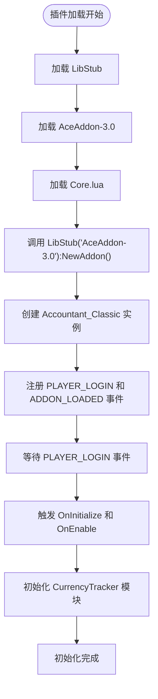
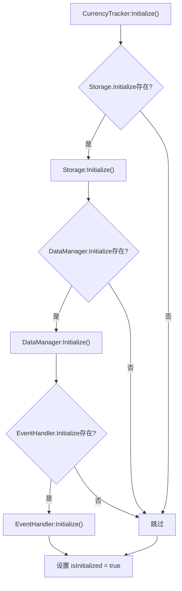

# 初始化异常

<cite>
**本文档引用的文件**  
- [Core/Core.lua](file://Core/Core.lua#L1-L50)
- [CurrencyTracker/CurrencyCore.lua](file://CurrencyTracker/CurrencyCore.lua#L1-L50)
- [Libs/AceAddon-3.0/AceAddon-3.0.lua](file://Libs/AceAddon-3.0/AceAddon-3.0.lua#L1-L50)
- [Libs/LibStub/LibStub.lua](file://Libs/LibStub/LibStub.lua#L1-L20)
- [Accountant_Classic.toc](file://Accountant_Classic.toc#L1-L10)
- [Libs/AceAddon-3.0/AceAddon-3.0.xml](file://Libs/AceAddon-3.0/AceAddon-3.0.xml#L1-L5)
</cite>

## 目录
1. [问题概述](#问题概述)
2. [核心初始化流程分析](#核心初始化流程分析)
3. [AceAddon-3.0 实例创建验证](#aceaddon-30-实例创建验证)
4. [模块初始化顺序检查](#模块初始化顺序检查)
5. [TOC 文件加载顺序配置](#toc-文件加载顺序配置)
6. [调试方案与日志验证](#调试方案与日志验证)
7. [ADDON_LOADED 事件处理机制](#add_on_loaded-事件处理机制)
8. [解决方案与最佳实践](#解决方案与最佳实践)

## 问题概述
本报告旨在深入分析 Accountant_Classic 插件的初始化流程，重点解决因加载顺序不当或事件触发时机问题导致的初始化中断。核心问题包括：验证 `AceAddon-3.0` 是否成功创建主插件实例、确认 `CurrencyCore.lua` 中模块的初始化顺序、确保在 `AceAddon-3.0` 完全加载前不进行命令注册，并解决 `ADDON_LOADED` 事件触发过早导致的初始化失败。

**文档来源**
- [Core/Core.lua](file://Core/Core.lua#L1-L50)
- [CurrencyTracker/CurrencyCore.lua](file://CurrencyTracker/CurrencyCore.lua#L1-L50)
- [Libs/AceAddon-3.0/AceAddon-3.0.lua](file://Libs/AceAddon-3.0/AceAddon-3.0.lua#L1-L50)

## 核心初始化流程分析
Accountant_Classic 的初始化流程依赖于 Ace3 框架和 LibStub 的版本管理机制。整个流程始于 `Core.lua` 文件，通过 `LibStub("AceAddon-3.0"):NewAddon()` 创建主插件对象，并触发一系列回调函数（`OnInitialize`, `OnEnable`）来完成初始化。

该流程的关键在于事件的注册与响应。主插件在 `OnInitialize` 阶段注册 `PLAYER_LOGIN` 和 `ADDON_LOADED` 事件，确保在游戏世界完全加载后执行核心逻辑。`CurrencyTracker` 模块作为子系统，其初始化必须在主插件完全就绪后进行，以避免访问未定义的全局变量或方法。



**图示来源**
- [Core/Core.lua](file://Core/Core.lua#L354)
- [Libs/AceAddon-3.0/AceAddon-3.0.lua](file://Libs/AceAddon-3.0/AceAddon-3.0.lua#L612)
- [Libs/AceAddon-3.0/AceAddon-3.0.lua](file://Libs/AceAddon-3.0/AceAddon-3.0.lua#L631)

**本节来源**
- [Core/Core.lua](file://Core/Core.lua#L1-L100)
- [Libs/AceAddon-3.0/AceAddon-3.0.lua](file://Libs/AceAddon-3.0/AceAddon-3.0.lua#L1-L100)

## AceAddon-3.0 实例创建验证
`Core.lua` 文件中的 `NewAddon` 调用是整个插件生命周期的起点。通过分析代码，可以确认该调用的执行上下文和返回值。

在 `Core.lua` 的第 60 行左右，执行了 `LibStub("AceAddon-3.0"):NewAddon(private.addon_name, "AceConsole-3.0", "AceHook-3.0")`。此调用的执行流程如下：
1.  `LibStub:GetLibrary("AceAddon-3.0")` 首先被调用，从 `Libs` 目录中获取 `AceAddon-3.0` 库的实例。
2.  获取到的 `AceAddon-3.0` 实例的 `NewAddon` 方法被调用，传入插件名称和需要嵌入的库（`AceConsole-3.0`, `AceHook-3.0`）。
3.  `AceAddon-3.0` 的 `NewAddon` 函数会创建一个新的表作为插件对象，设置其元表，并将指定的库嵌入其中。
4.  新创建的插件对象被添加到 `AceAddon.addons` 表中，并被放入初始化队列 `initializequeue`。
5.  最终，该函数返回新创建的插件对象，赋值给 `addon` 变量。

此过程确保了 `addon` 对象被正确创建并包含了所有必要的功能。`AceAddon-3.0` 的内部机制保证了即使在 `ADDON_LOADED` 事件触发前，该对象也已存在于内存中，只是其 `OnInitialize` 和 `OnEnable` 回调尚未执行。

**本节来源**
- [Core/Core.lua](file://Core/Core.lua#L60-L70)
- [Libs/AceAddon-3.0/AceAddon-3.0.lua](file://Libs/AceAddon-3.0/AceAddon-3.0.lua#L100-L150)
- [Libs/LibStub/LibStub.lua](file://Libs/LibStub/LibStub.lua#L30-L40)

## 模块初始化顺序检查
`CurrencyTracker` 模块的初始化顺序是确保功能完整性的关键。其核心文件 `CurrencyCore.lua` 定义了一个名为 `CurrencyTracker` 的命名空间，并通过 `Initialize` 和 `Enable` 方法来管理其子模块（如 `Storage`, `DataManager`, `EventHandler`）。

根据 `CurrencyCore.lua` 的代码逻辑，初始化顺序必须严格遵循：
1.  **Storage 模块**：必须首先初始化，因为它负责管理所有持久化数据。
2.  **DataManager 模块**：在 `Storage` 就绪后初始化，用于处理数据逻辑。
3.  **EventHandler 模块**：最后初始化，因为它依赖于前两者来处理游戏事件。

如果 `CurrencyTracker` 的初始化发生在 `AceAddon-3.0` 的 `OnInitialize` 或 `OnEnable` 回调之前，那么 `LibStub` 可能尚未完全准备好，导致 `LibStub("AceLocale-3.0")` 调用失败，从而使 `L`（本地化表）为 `nil`。这会引发后续所有依赖本地化字符串的代码出现错误。



**图示来源**
- [CurrencyTracker/CurrencyCore.lua](file://CurrencyTracker/CurrencyCore.lua#L251-L287)

**本节来源**
- [CurrencyTracker/CurrencyCore.lua](file://CurrencyTracker/CurrencyCore.lua#L1-L300)

## TOC 文件加载顺序配置
`.toc` 文件决定了插件文件的加载顺序，这对于依赖管理至关重要。`Accountant_Classic.toc` 文件的结构必须确保 `Libs` 目录下的所有库优先于主模块和功能模块加载。

分析 `Accountant_Classic.toc` 文件，其关键部分如下：
```
Libs\Libs.xml
Locale\Locales.xml
Core\Constants.lua

Core\Core.lua
Core\Template.xml
Core\Core.xml
Core\MoneyFrame.lua
Core\Config.lua

CurrencyTracker\CurrencyTracker.xml
```

此配置是正确的，因为：
1.  `Libs\Libs.xml` 被列为第一个条目，这会递归加载 `Libs` 目录下的所有库，包括 `LibStub.lua` 和 `AceAddon-3.0.xml`。
2.  `Core\Constants.lua` 在主逻辑文件之前加载，为 `Core.lua` 提供必要的常量。
3.  `Core\Core.lua` 在所有依赖项之后加载，确保 `LibStub` 和 `AceAddon-3.0` 已经可用。
4.  `CurrencyTracker` 的文件在最后加载，保证其在主插件框架完全初始化后才开始执行。

这种顺序是解决初始化问题的根本保障。如果 `Core.lua` 被错误地放在 `Libs\Libs.xml` 之前，`LibStub` 将无法找到，导致 `NewAddon` 调用失败。

**本节来源**
- [Accountant_Classic.toc](file://Accountant_Classic.toc#L1-L46)
- [Libs/AceAddon-3.0/AceAddon-3.0.xml](file://Libs/AceAddon-3.0/AceAddon-3.0.xml#L1-L5)

## 调试方案与日志验证
为了验证初始化流程的正确性，开发者应在关键函数入口添加 `print` 日志。

1.  **在 `Core.lua` 的 `NewAddon` 调用后添加日志**：
    ```lua
    local addon = LibStub("AceAddon-3.0"):NewAddon(private.addon_name, "AceConsole-3.0", "AceHook-3.0")
    print("[AC DEBUG] 主插件实例已创建: " .. tostring(addon))
    ```
    这可以验证 `addon` 对象是否成功返回。

2.  **在 `CurrencyCore.lua` 的 `Initialize` 函数开头添加日志**：
    ```lua
    function CurrencyTracker:Initialize()
        print("[AC CT DEBUG] CurrencyTracker 初始化开始")
        if isInitialized then return true end
        -- ... rest of the code
    end
    ```
    这可以确认 `CurrencyTracker` 的初始化是否被调用。

3.  **在 `OnInitialize` 和 `OnEnable` 回调中添加日志**：
    ```lua
    function addon:OnInitialize()
        print("[AC DEBUG] OnInitialize 被调用")
        -- ... initialization code
    end

    function addon:OnEnable()
        print("[AC DEBUG] OnEnable 被调用")
        -- ... enable code
    end
    ```
    这可以验证 AceAddon-3.0 的事件回调是否按预期执行。

通过观察这些日志的输出顺序，开发者可以清晰地看到 `NewAddon` -> `OnInitialize` -> `OnEnable` -> `CurrencyTracker:Initialize` 的执行流程，从而诊断任何中断点。

**本节来源**
- [Core/Core.lua](file://Core/Core.lua#L60-L70)
- [CurrencyTracker/CurrencyCore.lua](file://CurrencyTracker/CurrencyCore.lua#L251-L255)

## ADDON_LOADED 事件处理机制
`ADDON_LOADED` 事件是 WoW 插件系统中一个关键但容易出错的环节。`AceAddon-3.0` 通过一个精心设计的事件处理器来管理它。

在 `AceAddon-3.0.lua` 中，`onEvent` 函数监听 `ADDON_LOADED` 和 `PLAYER_LOGIN` 事件。其处理逻辑如下：
1.  当 `ADDON_LOADED` 事件触发时，`AceAddon-3.0` 会检查其内部的 `initializequeue`。
2.  队列中的所有插件（包括 `Accountant_Classic`）会依次被 `InitializeAddon`，这会调用它们的 `OnInitialize` 方法。
3.  如果此时 `IsLoggedIn()` 返回 `true`（例如，对于按需加载的插件），则会立即进入启用阶段，执行 `EnableAddon`，调用 `OnEnable` 方法。
4.  如果 `IsLoggedIn()` 返回 `false`，则插件会被放入 `enablequeue`，等待 `PLAYER_LOGIN` 事件。

问题“ADDON_LOADED 事件触发过早”通常发生在 `CurrencyTracker` 的代码试图在 `ADDON_LOADED` 事件中直接执行初始化，而此时 `AceAddon-3.0` 的 `OnInitialize` 回调可能尚未运行。正确的做法是让 `CurrencyTracker` 的初始化逻辑在主插件的 `OnInitialize` 或 `OnEnable` 回调中被调用，而不是依赖于 `ADDON_LOADED` 事件。

**本节来源**
- [Libs/AceAddon-3.0/AceAddon-3.0.lua](file://Libs/AceAddon-3.0/AceAddon-3.0.lua#L612-L632)
- [Core/Core.lua](file://Core/Core.lua#L354)

## 解决方案与最佳实践
为确保 Accountant_Classic 插件的稳定初始化，应遵循以下最佳实践：

1.  **严格遵守 TOC 加载顺序**：始终将 `Libs\Libs.xml` 作为 `.toc` 文件的第一行，确保所有第三方库优先加载。
2.  **避免在 `ADDON_LOADED` 中执行核心逻辑**：不要在 `CurrencyTracker` 或任何子模块中直接监听 `ADDON_LOADED` 来启动初始化。应将初始化逻辑委托给主插件的 `OnInitialize` 或 `OnEnable` 回调。
3.  **使用 `LibStub` 安全地获取库**：在 `CurrencyCore.lua` 中，使用 `LibStub("AceLocale-3.0", true)` 的 `silent` 参数来安全地获取本地化表，避免因加载顺序问题导致的 `nil` 错误。
4.  **实施防御性编程**：在调用任何可能依赖其他模块的方法前，检查相关对象和方法是否存在。
5.  **利用日志进行调试**：在开发和测试阶段，广泛使用 `print` 语句来跟踪执行流程，一旦确认无误，可将其替换为更高级的日志系统或在发布版本中移除。

通过遵循这些原则，可以有效解决因加载顺序和事件处理不当导致的初始化异常，确保插件在各种游戏环境下都能稳定运行。

**本节来源**
- [Accountant_Classic.toc](file://Accountant_Classic.toc#L1-L10)
- [Core/Core.lua](file://Core/Core.lua#L354)
- [CurrencyTracker/CurrencyCore.lua](file://CurrencyTracker/CurrencyCore.lua#L251-L287)