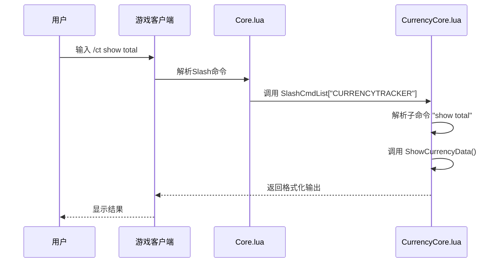
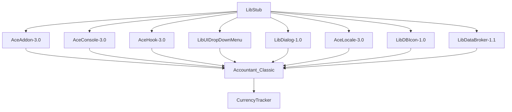

# 命令无效或无响应

<cite>
**本文档引用的文件**   
- [Core.lua](file://Core/Core.lua)
- [CurrencyCore.lua](file://CurrencyTracker/CurrencyCore.lua)
- [CurrencyTracker-Usage.md](file://Docs/CurrencyTracker-Usage.md)
</cite>

## 目录
1. [简介](#简介)
2. [命令注册与初始化流程](#命令注册与初始化流程)
3. [核心组件分析](#核心组件分析)
4. [依赖项与加载顺序](#依赖项与加载顺序)
5. [调试与验证步骤](#调试与验证步骤)
6. [常见问题与解决方案](#常见问题与解决方案)
7. [结论](#结论)

## 简介
本文档系统性地解释了Slash命令（如`/accountant`、`/ct`）无法执行的可能原因。分析重点包括命令注册失败、AceAddon初始化异常、依赖库未加载等问题。通过分析`Core.lua`中的Slash命令注册逻辑和`CurrencyCore.lua`中`/ct`命令的解析流程，确认命令处理器是否被正确绑定。指导用户通过控制台输出验证插件状态，并提供详细的调试步骤。

## 命令注册与初始化流程

```mermaid
flowchart TD
Start([插件加载]) --> LoadLibs["加载依赖库<br/>LibStub, AceAddon-3.0"]
LoadLibs --> CreateAddon["创建主插件实例<br/>NewAddon"]
CreateAddon --> RegisterSlash["注册Slash命令<br/>SLASH_XXX1 = \"/command\""]
RegisterSlash --> SlashList["绑定命令处理器<br/>SlashCmdList[\"COMMAND\"]"]
SlashList --> Initialize["执行OnInitialize()"]
Initialize --> Enable["执行OnEnable()"]
Enable --> Ready([命令就绪])
```

**图示来源**
- [Core.lua](file://Core/Core.lua#L1800-L1850)

**章节来源**
- [Core.lua](file://Core/Core.lua#L1800-L1850)

## 核心组件分析

### Slash命令注册机制
主插件在`Core.lua`中通过AceAddon-3.0框架注册其Slash命令。命令处理器的绑定依赖于`LibStub`成功获取`AceAddon-3.0`实例。如果依赖库加载失败，将导致`NewAddon`调用异常，从而使整个初始化流程中断。

**章节来源**
- [Core.lua](file://Core/Core.lua#L1800-L1850)

### CurrencyTracker命令解析
`CurrencyCore.lua`文件中的`CurrencyTracker`模块负责处理`/ct`命令。该模块通过`SLASH_CURRENCYTRACKER1 = "/ct"`注册命令，并将处理器绑定到`SlashCmdList["CURRENCYTRACKER"]`。命令解析采用前缀匹配模式，支持`show`、`debug`、`status`等多种子命令。



**图示来源**
- [CurrencyCore.lua](file://CurrencyTracker/CurrencyCore.lua#L500-L600)

**章节来源**
- [CurrencyCore.lua](file://CurrencyTracker/CurrencyCore.lua#L500-L600)

## 依赖项与加载顺序



**图示来源**
- [Core.lua](file://Core/Core.lua#L1800-L1850)
- [CurrencyCore.lua](file://CurrencyTracker/CurrencyCore.lua#L10-L50)

**章节来源**
- [Core.lua](file://Core/Core.lua#L1800-L1850)
- [CurrencyCore.lua](file://CurrencyTracker/CurrencyCore.lua#L10-L50)

## 调试与验证步骤

### 验证插件状态
通过以下命令验证插件是否正常启用：
```lua
print(Accountant_Classic:IsEnabled())
```

### 检查依赖库
验证`LibStub`是否成功获取关键实例：
```lua
local addon = LibStub("AceAddon-3.0"):GetAddon("Accountant_Classic", true)
if addon then
    print("AceAddon实例获取成功")
else
    print("AceAddon实例获取失败")
end
```

### 验证命令注册
检查Slash命令是否正确注册：
```lua
print(SLASH_CURRENCYTRACKER1) -- 应输出 "/ct"
print(SlashCmdList["CURRENCYTRACKER"]) -- 应输出函数地址
```

### 配置文件检查
确认`CurrencyTracker-Usage.md`中的命令语法规范，检查配置文件中命令别名是否被意外修改。确保没有与其他插件的命令发生冲突。

**章节来源**
- [CurrencyTracker-Usage.md](file://Docs/CurrencyTracker-Usage.md#L1-L244)

## 常见问题与解决方案

### 问题1：命令完全无响应
**可能原因**：
- `LibStub`或`AceAddon-3.0`未正确加载
- 插件初始化过程中发生异常
- Slash命令注册语句被注释或删除

**解决方案**：
1. 检查`Libs`目录下所有依赖库是否存在
2. 验证`Core.lua`中`LibStub("AceAddon-3.0")`调用是否成功
3. 确认`SLASH_XXX1`和`SlashCmdList`的注册代码未被修改

### 问题2：/ct命令部分功能失效
**可能原因**：
- `CurrencyCore.lua`文件未被正确加载
- 子命令解析逻辑出现错误
- 版本兼容性问题

**解决方案**：
1. 检查`.toc`文件中是否包含`CurrencyTracker/CurrencyCore.lua`
2. 验证`CurrencyTracker:Initialize()`是否被正确调用
3. 参考`CurrencyTracker-Usage.md`确认命令语法

## 结论
Slash命令无法执行的根本原因通常源于初始化流程的某个环节中断。最关键的检查点是`LibStub`能否成功获取`AceAddon-3.0`实例，这是整个插件生命周期管理的基础。建议用户按照文档提供的调试步骤逐一验证，从依赖库加载到命令注册的每个环节进行排查，以快速定位并解决问题。