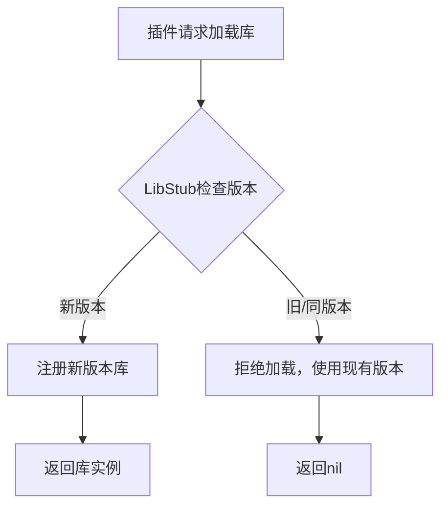
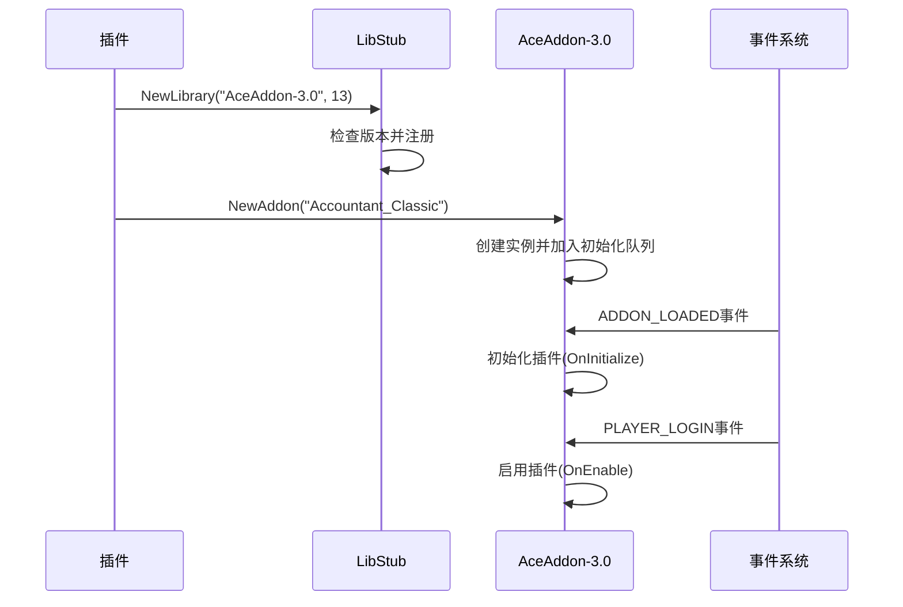

# 插件冲突

<cite>
**本文档中引用的文件**
- [Core/Core.lua](file://Core/Core.lua)
- [Libs/AceAddon-3.0/AceAddon-3.0.lua](file://Libs/AceAddon-3.0/AceAddon-3.0.lua)
- [Libs/LibStub/LibStub.lua](file://Libs/LibStub/LibStub.lua)
- [pkgmeta.yaml](file://pkgmeta.yaml)
</cite>

## 目录
1. [引言](#引言)
2. [核心组件分析](#核心组件分析)
3. [LibStub库版本管理机制](#libstub库版本管理机制)
4. [AceAddon-3.0加载与初始化](#aceaddon-30加载与初始化)
5. [插件加载优先级与冲突规避](#插件加载优先级与冲突规避)
6. [系统性排查步骤](#系统性排查步骤)
7. [结论](#结论)

## 引言
本文档深入分析由多个插件共用Ace3库引发的冲突问题。重点解释LibStub的库版本管理机制，特别是当不同插件携带不同版本的AceAddon-3.0时可能出现的覆盖与不兼容现象。指导用户如何检查当前加载的库版本及来源插件，并提供系统性的排查和解决策略。

## 核心组件分析

Accountant_Classic插件通过LibStub加载Ace3系列库，其核心功能在Core.lua中实现。该文件通过AceAddon-3.0创建插件实例，并集成AceConsole-3.0和AceHook-3.0等其他Ace3库。LibStub作为依赖管理器，确保了库的正确加载和版本控制。

**本节来源**
- [Core/Core.lua](file://Core/Core.lua#L1-L50)
- [Libs/AceAddon-3.0/AceAddon-3.0.lua](file://Libs/AceAddon-3.0/AceAddon-3.0.lua#L1-L20)

## LibStub库版本管理机制

LibStub是WoW插件生态系统中用于管理库版本的核心组件。它通过`NewLibrary`和`GetLibrary`方法实现版本控制。

当一个插件调用`LibStub:NewLibrary("AceAddon-3.0", MINOR)`时，LibStub会检查当前已注册的库版本。如果请求的版本号（MINOR）小于或等于已存在的版本，则拒绝加载新版本，返回nil。这确保了只有最新版本的库会被加载，防止了旧版本覆盖新版本的问题。

**图示来源**
- [Libs/LibStub/LibStub.lua](file://Libs/LibStub/LibStub.lua#L20-L50)

**本节来源**
- [Libs/LibStub/LibStub.lua](file://Libs/LibStub/LibStub.lua#L1-L52)

## AceAddon-3.0加载与初始化

AceAddon-3.0为插件提供了标准的生命周期管理。在Accountant_Classic中，通过`LibStub("AceAddon-3.0"):NewAddon()`创建插件实例。该过程会将指定的库（如AceConsole-3.0, AceHook-3.0）嵌入到插件对象中。

库的初始化通过事件驱动机制完成。AceAddon-3.0注册了`ADDON_LOADED`和`PLAYER_LOGIN`事件。当插件被加载时，它会被加入初始化队列，在`ADDON_LOADED`事件中进行初始化；在`PLAYER_LOGIN`事件中，插件被启用并调用`OnEnable`回调。

**图示来源**
- [Libs/AceAddon-3.0/AceAddon-3.0.lua](file://Libs/AceAddon-3.0/AceAddon-3.0.lua#L26-L60)
- [Core/Core.lua](file://Core/Core.lua#L1-L30)

**本节来源**
- [Libs/AceAddon-3.0/AceAddon-3.0.lua](file://Libs/AceAddon-3.0/AceAddon-3.0.lua#L1-L650)
- [Core/Core.lua](file://Core/Core.lua#L1-L100)

## 插件加载优先级与冲突规避

插件的加载顺序对其功能有重要影响。在pkgmeta.yaml文件中，可以通过配置影响插件的打包和加载方式。虽然该文件中未直接指定加载顺序，但插件目录的命名和结构会影响其加载优先级。

当多个插件包含不同版本的Ace3库时，先加载的插件会将其库版本注册到LibStub中。后加载的插件如果携带较新版本，则会成功升级；如果携带较旧版本，则会被忽略。因此，通过重命名插件目录（如在名称前添加数字前缀）可以调整其加载时序，从而规避因库版本不兼容导致的冲突。

建议的规避策略：
1. 确保所有插件使用兼容的Ace3库版本
2. 通过调整插件目录名称控制加载顺序
3. 定期更新插件以获取最新的库版本

**本节来源**
- [pkgmeta.yaml](file://pkgmeta.yaml#L1-L6)
- [Libs/LibStub/LibStub.lua](file://Libs/LibStub/LibStub.lua#L1-L52)

## 系统性排查步骤

为有效排查和解决插件冲突，建议遵循以下系统性步骤：

1. **启用安全模式**：暂时禁用所有插件，然后逐个启用，以确定冲突源。
2. **检查库版本**：使用命令`/run print(LibStub:GetLibraryVersion('AceAddon-3.0', true))`检查当前加载的AceAddon-3.0库版本及来源插件。
3. **监控Lua错误日志**：在游戏内开启Lua错误提示，或检查WTF文件夹中的错误日志文件，定位具体的错误信息。
4. **使用兼容性检测工具**：推荐使用AddOnSkins等工具来检测插件间的兼容性问题。
5. **验证库实例安全调用**：在Core.lua中，通过`LibStub("AceAddon-3.0")`获取实例的方式是安全的，因为它遵循了LibStub的规范，避免了因外部插件篡改全局环境导致的崩溃。

**本节来源**
- [Core/Core.lua](file://Core/Core.lua#L1-L50)
- [Libs/LibStub/LibStub.lua](file://Libs/LibStub/LibStub.lua#L1-L52)

## 结论
Ace3库的冲突问题主要源于多个插件携带不同版本的库文件。通过理解LibStub的版本管理机制，合理调整插件加载顺序，并采用系统性的排查方法，可以有效避免和解决此类问题。建议插件开发者遵循标准的库管理实践，用户则应保持插件更新并使用兼容性工具进行维护。