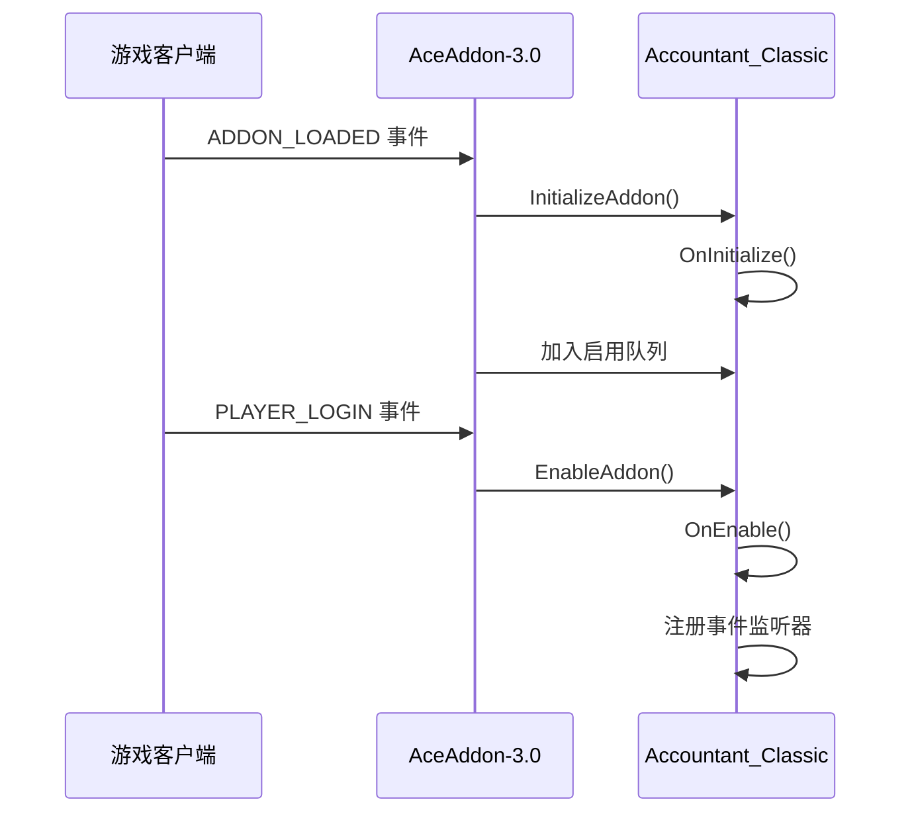
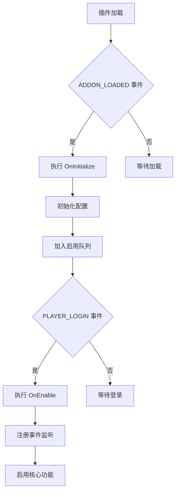
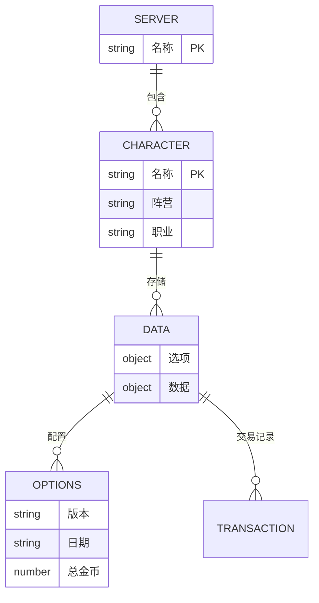
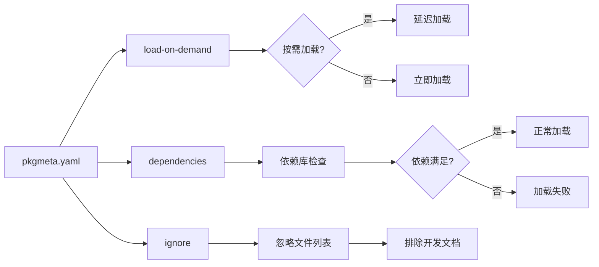

# 权限异常

<cite>
**本文档中引用的文件**  
- [Core.lua](file://Core/Core.lua)
- [pkgmeta.yaml](file://pkgmeta.yaml)
- [AceAddon-3.0.lua](file://Libs/AceAddon-3.0/AceAddon-3.0.lua)
- [CurrencyCore.lua](file://CurrencyTracker/CurrencyCore.lua)
</cite>

## 目录
1. [问题概述](#问题概述)
2. [AceAddon-3.0 初始化流程分析](#aceaddon-30-初始化流程分析)
3. [插件系统权限层级与加载时机](#插件系统权限层级与加载时机)
4. [SavedVariables 访问权限机制](#savedvariables-访问权限机制)
5. [插件启用状态验证方法](#插件启用状态验证方法)
6. [pkgmeta.yaml 配置影响分析](#pkgmetayaml-配置影响分析)
7. [故障排查与修复建议](#故障排查与修复建议)

## 问题概述

当权限配置不当时，Accountant_Classic 插件可能出现功能失效的情况。这种问题通常源于插件未被正确启用或加载时机不当。核心问题在于 AceAddon-3.0 框架的初始化流程和插件系统的权限层级机制。通过分析 Core.lua 中 AceAddon-3.0 实例的初始化过程，可以发现插件必须在正确的游戏事件触发时被激活，否则将无法正常工作。此外，SavedVariables 的访问权限与加载时机密切相关，若插件在 PLAYER_LOGIN 事件前未能完成初始化，则可能导致数据访问失败。

**Section sources**
- [Core.lua](file://Core/Core.lua#L78-L82)
- [AceAddon-3.0.lua](file://Libs/AceAddon-3.0/AceAddon-3.0.lua#L0-L29)

## AceAddon-3.0 初始化流程分析

AceAddon-3.0 的初始化流程由 ADDON_LOADED 和 PLAYER_LOGIN 两个关键事件驱动。在 Core.lua 文件中，Accountant_Classic 插件通过 LibStub 创建 AceAddon-3.0 实例，并注册事件监听器。初始化队列（initializequeue）在 ADDON_LOADED 事件触发时处理，执行 OnInitialize 回调函数。随后，在 PLAYER_LOGIN 事件触发时，启用队列（enablequeue）中的插件，执行 OnEnable 回调函数。此流程确保了插件在游戏数据完全加载后才被激活。



**Diagram sources**
- [Core.lua](file://Core/Core.lua#L354)
- [AceAddon-3.0.lua](file://Libs/AceAddon-3.0/AceAddon-3.0.lua#L612-L632)

**Section sources**
- [Core.lua](file://Core/Core.lua#L78-L354)
- [AceAddon-3.0.lua](file://Libs/AceAddon-3.0/AceAddon-3.0.lua#L481-L544)

## 插件系统权限层级与加载时机

魔兽世界插件系统采用严格的权限层级机制，加载时机直接影响插件功能。插件必须在 ADDON_LOADED 事件中完成基本初始化，在 PLAYER_LOGIN 事件中完成功能启用。若插件因安全策略被阻止加载，或在错误的时机尝试访问游戏API，将导致功能失效。Accountant_Classic 通过注册 PLAYER_LOGIN 事件确保在角色完全登录后才启用核心功能，避免因数据未就绪而导致的错误。



**Diagram sources**
- [Core.lua](file://Core/Core.lua#L354)
- [AceAddon-3.0.lua](file://Libs/AceAddon-3.0/AceAddon-3.0.lua#L612-L632)

**Section sources**
- [Core.lua](file://Core/Core.lua#L354)
- [AceAddon-3.0.lua](file://Libs/AceAddon-3.0/AceAddon-3.0.lua#L612-L632)

## SavedVariables 访问权限机制

SavedVariables 的访问权限与插件加载时机紧密相关。Accountant_Classic 使用 Accountant_ClassicSaveData 和 Accountant_ClassicZoneDB 两个全局表存储数据。这些数据表的初始化必须在插件启用前完成，否则可能导致数据丢失或访问异常。通过分析代码发现，initOptions 函数负责检查和创建必要的数据结构，确保在任何数据操作前完成初始化。若插件被手动禁用或因安全策略被阻止，这些数据表将无法被正确访问。



**Diagram sources**
- [Core.lua](file://Core/Core.lua#L262-L304)
- [Data Model.md](file://.qoder/repowiki/en/content/Data Model/Data Model.md#L54-L128)

**Section sources**
- [Core.lua](file://Core/Core.lua#L849-L983)

## 插件启用状态验证方法

为验证 Accountant_Classic 插件是否被正确启用，可使用以下调试命令：

```
/run local a=LibStub('AceAddon-3.0'):GetAddon('Accountant_Classic',true) print(a and a:IsEnabled() or 'Addon not found or disabled')
```

该命令通过 LibStub 获取插件实例并调用 IsEnabled() 方法检查启用状态。若返回 true，表示插件已启用；若返回 false 或提示未找到插件，则表示插件被禁用或加载失败。此外，用户应检查游戏界面中的插件管理器，确认 Accountant_Classic 未被手动禁用。

**Section sources**
- [AceAddon-3.0.lua](file://Libs/AceAddon-3.0/AceAddon-3.0.lua#L440-L446)
- [CurrencyCore.lua](file://CurrencyTracker/CurrencyCore.lua#L388)

## pkgmeta.yaml 配置影响分析

pkgmeta.yaml 文件中的配置对插件的加载行为有重要影响。load-on-demand 字段控制插件是否按需加载，而 dependencies 字段定义插件依赖关系。在当前配置中，CLAUDE.md 和 Docs 目录被忽略，这不会影响核心功能。然而，若 dependencies 中定义的库文件缺失或版本不兼容，将导致插件无法正常加载。load-on-demand 设置为 true 时，插件将在需要时才被加载，可能影响初始化时机。



**Diagram sources**
- [pkgmeta.yaml](file://pkgmeta.yaml)
- [AceAddon-3.0.lua](file://Libs/AceAddon-3.0/AceAddon-3.0.lua#L26-L55)

**Section sources**
- [pkgmeta.yaml](file://pkgmeta.yaml)
- [AceAddon-3.0.lua](file://Libs/AceAddon-3.0/AceAddon-3.0.lua#L26-L55)

## 故障排查与修复建议

为解决因权限配置不当导致的功能失效问题，建议采取以下步骤：
1. 检查游戏插件管理器，确保 Accountant_Classic 未被手动禁用
2. 使用调试命令验证插件启用状态
3. 确认所有依赖库文件存在且版本兼容
4. 检查 pkgmeta.yaml 配置是否正确
5. 若问题持续存在，尝试重新安装插件以确保文件完整性
6. 验证 SavedVariables 目录权限，确保插件可读写数据文件

通过系统性地检查这些方面，可以有效解决大多数因权限配置不当导致的插件功能失效问题。

**Section sources**
- [Core.lua](file://Core/Core.lua#L78-L82)
- [pkgmeta.yaml](file://pkgmeta.yaml)
- [AceAddon-3.0.lua](file://Libs/AceAddon-3.0/AceAddon-3.0.lua#L510-L544)