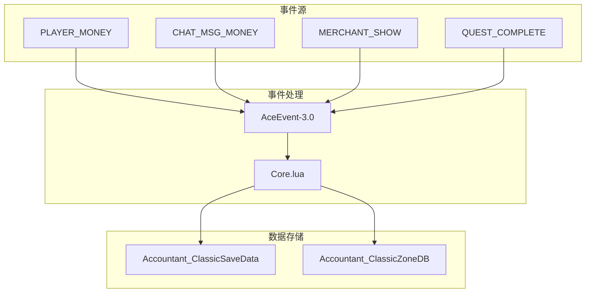
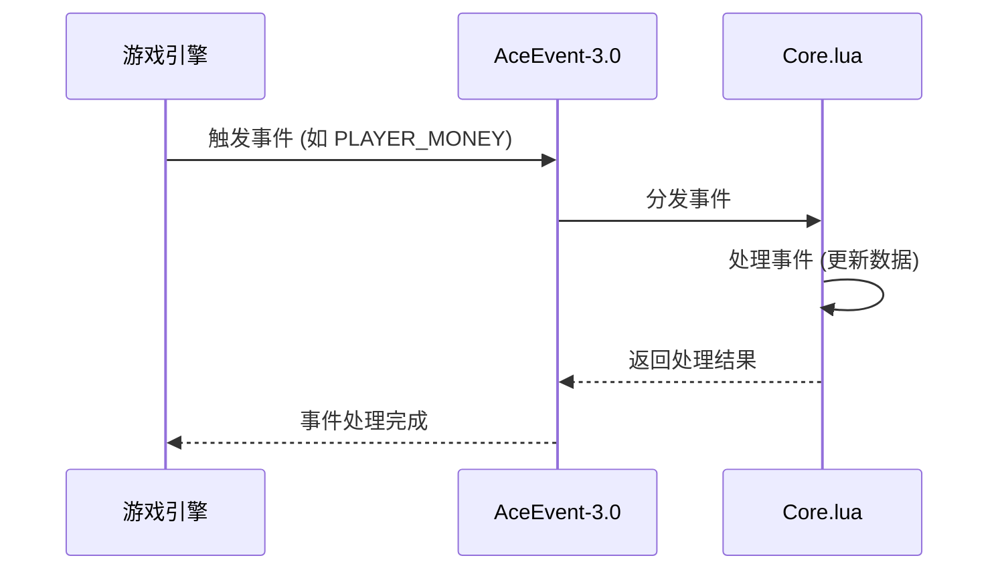
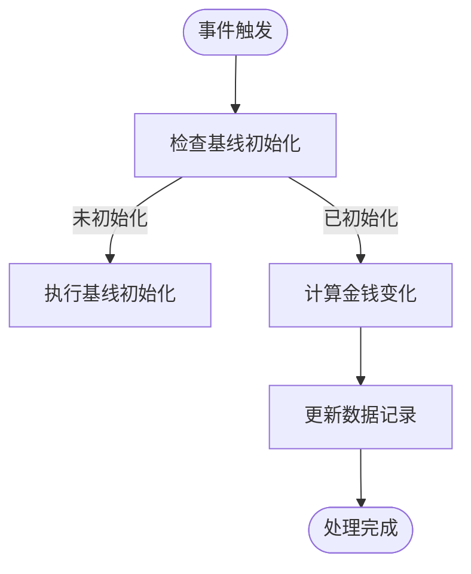
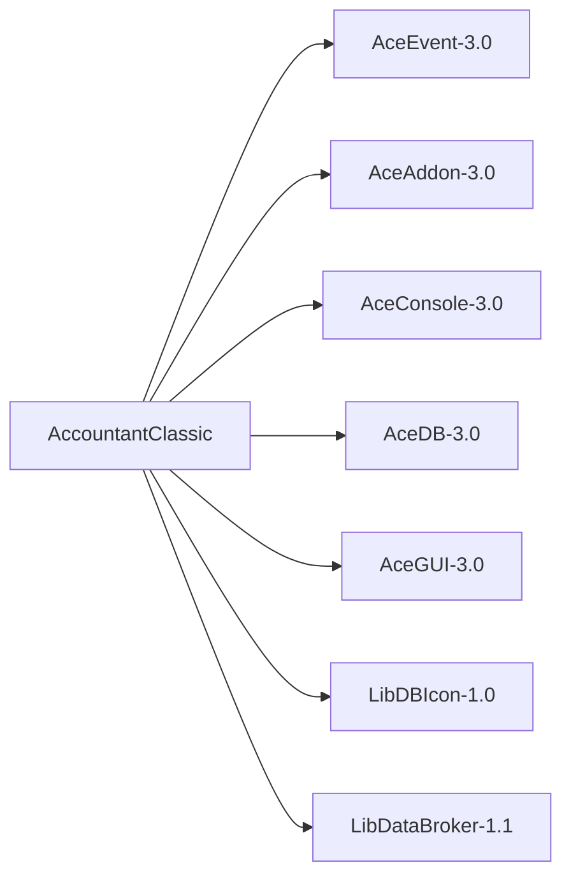

# CPU性能问题与事件处理优化

<cite>
**本文档引用的文件**  
- [Core.lua](file://Core/Core.lua)
- [Constants.lua](file://Core/Constants.lua)
- [AceEvent-3.0.lua](file://Libs/AceEvent-3.0/AceEvent-3.0.lua)
</cite>

## 目录
1. [简介](#简介)
2. [项目结构](#项目结构)
3. [核心组件](#核心组件)
4. [架构概述](#架构概述)
5. [详细组件分析](#详细组件分析)
6. [依赖分析](#依赖分析)
7. [性能考量](#性能考量)
8. [故障排除指南](#故障排除指南)
9. [结论](#结论)

## 简介
本文档深入分析Accountant_Classic插件中高频事件（如PLAYER_MONEY、UNIT_MONEY）的监听频率与处理逻辑，评估其对CPU性能的影响。文档详细解释了当前事件驱动架构如何通过AceEvent-3.0注册和响应游戏事件，并指出在高频率事件触发下可能产生的性能瓶颈。结合Constants.lua中定义的事件列表，说明了哪些事件属于高开销操作。最后，文档提供了优化方案，包括实现事件节流（throttling）或去抖（debouncing）机制，延迟非关键模块初始化，使用条件注册减少监听事件数量。

## 项目结构
Accountant_Classic插件的项目结构清晰，主要分为Core、CurrencyTracker、Docs、Libs和Locale五个目录。Core目录包含插件的核心逻辑，CurrencyTracker目录负责货币追踪功能，Docs目录包含文档，Libs目录包含第三方库，Locale目录包含本地化文件。

**Section sources**
- [Core.lua](file://Core/Core.lua#L0-L2335)
- [Constants.lua](file://Core/Constants.lua#L0-L261)

## 核心组件
Core.lua是插件的核心文件，负责处理所有事件和数据记录。Constants.lua定义了插件的常量和配置。AceEvent-3.0.lua是事件处理库，负责注册和分发事件。

**Section sources**
- [Core.lua](file://Core/Core.lua#L0-L2335)
- [Constants.lua](file://Core/Constants.lua#L0-L261)
- [AceEvent-3.0.lua](file://Libs/AceEvent-3.0/AceEvent-3.0.lua#L0-L127)

## 架构概述
插件采用事件驱动架构，通过AceEvent-3.0库注册和响应游戏事件。当事件触发时，插件会根据事件类型更新相应的数据记录。这种架构使得插件能够实时响应游戏中的各种事件，但也可能导致性能问题，特别是在高频率事件触发时。

**Diagram sources**
- [Core.lua](file://Core/Core.lua#L0-L2335)
- [Constants.lua](file://Core/Constants.lua#L0-L261)
- [AceEvent-3.0.lua](file://Libs/AceEvent-3.0/AceEvent-3.0.lua#L0-L127)

## 详细组件分析

### 事件注册与处理
插件通过`AccountantClassic_RegisterEvents`函数注册所有需要监听的事件。这些事件在Constants.lua中定义，并通过AceEvent-3.0库进行注册。当事件触发时，`AccountantClassic_OnEvent`函数会被调用，根据事件类型更新相应的数据记录。

**Diagram sources**
- [Core.lua](file://Core/Core.lua#L0-L2335)
- [AceEvent-3.0.lua](file://Libs/AceEvent-3.0/AceEvent-3.0.lua#L0-L127)

### 高频事件处理
PLAYER_MONEY和CHAT_MSG_MONEY是插件中处理频率最高的事件。这些事件在每次玩家金钱发生变化时都会触发，可能导致性能瓶颈。插件通过`updateLog`函数处理这些事件，计算金钱变化并更新数据记录。

**Diagram sources**
- [Core.lua](file://Core/Core.lua#L0-L2335)

## 依赖分析
插件依赖多个第三方库，其中最重要的是AceEvent-3.0，用于事件注册和分发。其他依赖包括AceAddon-3.0、AceConsole-3.0、AceDB-3.0等，这些库提供了插件开发所需的基本功能。

**Diagram sources**
- [Core.lua](file://Core/Core.lua#L0-L2335)
- [AceEvent-3.0.lua](file://Libs/AceEvent-3.0/AceEvent-3.0.lua#L0-L127)

## 性能考量
高频事件的处理可能导致CPU性能问题，特别是在玩家频繁进行金钱交易时。为了优化性能，建议实现事件节流或去抖机制，减少不必要的事件处理。此外，可以延迟非关键模块的初始化，使用条件注册减少监听事件数量。

**Section sources**
- [Core.lua](file://Core/Core.lua#L0-L2335)
- [Constants.lua](file://Core/Constants.lua#L0-L261)

## 故障排除指南
如果插件出现性能问题，可以检查事件处理函数的执行频率，确保没有不必要的重复处理。可以通过启用详细模式（verbose mode）来查看事件处理的详细信息，帮助定位问题。

**Section sources**
- [Core.lua](file://Core/Core.lua#L0-L2335)

## 结论
Accountant_Classic插件通过事件驱动架构实现了对玩家金钱变化的实时追踪。然而，高频事件的处理可能导致性能问题。通过实现事件节流或去抖机制，延迟非关键模块初始化，使用条件注册减少监听事件数量，可以有效优化插件性能。