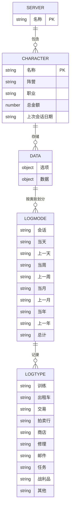
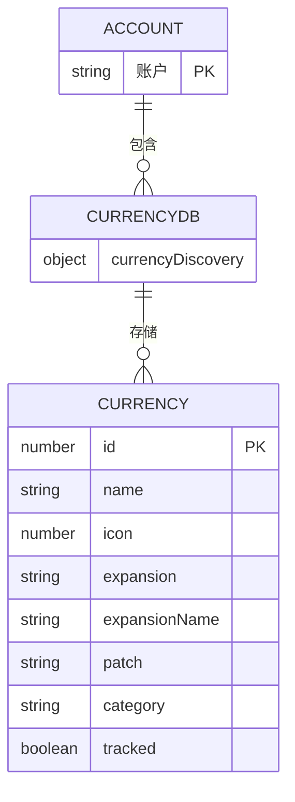

# 内存管理与数据存储优化

<cite>
**本文档引用的文件**   
- [CurrencyStorage.lua](file://CurrencyTracker/CurrencyStorage.lua)
- [Core.lua](file://Core/Core.lua)
- [Workspace-Memory-Dump.md](file://Docs/Workspace-Memory-Dump.md)
- [CurrencyDataManager.lua](file://CurrencyTracker/CurrencyDataManager.lua)
- [CurrencyEventHandler.lua](file://CurrencyTracker/CurrencyEventHandler.lua)
</cite>

## 目录
1. [引言](#引言)
2. [数据结构分析](#数据结构分析)
3. [内存占用与冗余问题](#内存占用与冗余问题)
4. [多角色与多服务器场景下的内存膨胀风险](#多角色与多服务器场景下的内存膨胀风险)
5. [调试与内存泄漏检测](#调试与内存泄漏检测)
6. [优化策略](#优化策略)
7. [数据写入逻辑与内存开销](#数据写入逻辑与内存开销)
8. [结论](#结论)

## 引言
Accountant_Classic 是一款用于跟踪《魔兽世界》中货币和金钱变化的插件，其核心功能依赖于复杂的数据存储结构。本文件旨在系统性地探讨 `CurrencyStorage.lua` 中的数据结构设计对内存占用的影响，特别是当记录大量货币元数据时的冗余问题。我们将深入分析 `Accountant_ClassicSaveData` 和 `Accountant_Classic_CurrencyDB` 的嵌套结构，评估其在多角色、多服务器场景下的内存膨胀风险，并提出一系列优化策略，以在保证功能完整性的同时降低内存开销。

**Section sources**
- [CurrencyStorage.lua](file://CurrencyTracker/CurrencyStorage.lua#L1-L50)
- [Workspace-Memory-Dump.md](file://Docs/Workspace-Memory-Dump.md#L1-L20)

## 数据结构分析
`Accountant_Classic` 插件的数据存储主要依赖于两个全局表：`Accountant_ClassicSaveData` 和 `Accountant_Classic_CurrencyDB`。这两个表构成了插件数据模型的核心，其设计直接影响了内存的使用效率。

### Accountant_ClassicSaveData 结构
`Accountant_ClassicSaveData` 是一个按服务器和角色分层的嵌套表，用于存储每个角色的财务记录。其结构遵循严格的层次化组织。

**Diagram sources**
- [Core.lua](file://Core/Core.lua#L262-L304)
- [Constants.lua](file://Core/Constants.lua#L50-L52)

### Accountant_Classic_CurrencyDB 结构
`Accountant_Classic_CurrencyDB` 是一个账户范围的全局存储，用于存放所有角色发现的货币元数据。此结构的引入旨在消除冗余存储，确保跨角色的一致性。

**Diagram sources**
- [CurrencyStorage.lua](file://CurrencyTracker/CurrencyStorage.lua#L491-L520)
- [CurrencyDataManager.lua](file://CurrencyTracker/CurrencyDataManager.lua#L1-L426)

**Section sources**
- [CurrencyStorage.lua](file://CurrencyTracker/CurrencyStorage.lua#L491-L560)
- [CurrencyDataManager.lua](file://CurrencyTracker/CurrencyDataManager.lua#L1-L426)

## 内存占用与冗余问题
当前的数据结构设计在处理大量货币元数据时存在显著的内存冗余问题。主要问题体现在以下几个方面：

### 嵌套结构的内存开销
`Accountant_ClassicSaveData` 的嵌套结构（服务器 -> 角色 -> 数据）虽然逻辑清晰，但每一层嵌套都会引入额外的哈希表开销。对于拥有大量角色的玩家，这种开销会成倍增长。每个角色的 `currencyData` 表都包含多个时间周期（Session, Day, Week, Month, Year, Total）的子表，即使某个周期内没有交易记录，这些空表依然会占用内存。

### 重复的元数据存储
在 `Accountant_Classic_CurrencyDB` 引入之前，每个角色的 `currencyDiscovery` 表都独立存储了相同的货币元数据（如名称、图标、扩展包信息）。这种设计导致了严重的数据冗余。例如，一个玩家有10个角色，那么关于“时光扭曲徽章”的元数据就会被重复存储10次。尽管现在已通过迁移机制将元数据集中到 `Accountant_Classic_CurrencyDB`，但历史数据和潜在的兼容性问题仍可能造成内存浪费。

### 动态发现的元数据
`SaveDiscoveredCurrency` 函数会在发现新货币时，将其元数据写入 `Accountant_Classic_CurrencyDB.currencyDiscovery`。虽然这是一个必要的功能，但如果不对发现的货币进行有效管理（如定期清理未使用的条目），这个全局表会随着时间推移而不断膨胀，成为内存泄漏的潜在源头。

**Section sources**
- [CurrencyStorage.lua](file://CurrencyTracker/CurrencyStorage.lua#L520-L560)
- [CurrencyStorage.lua](file://CurrencyTracker/CurrencyStorage.lua#L1011-L1041)

## 多角色与多服务器场景下的内存膨胀风险
在多角色、多服务器的使用场景下，上述的内存问题会被进一步放大。

### 角色数量的线性增长
内存占用与角色数量呈近似线性关系。每个新角色的加入都会在 `Accountant_ClassicSaveData` 中创建一个全新的、包含完整结构的条目。随着角色数量的增加，SavedVariables的总大小会迅速增长，可能导致游戏客户端的内存压力增大，甚至在极端情况下影响游戏性能。

### 服务器隔离与数据孤岛
不同服务器的角色数据是完全隔离的。这意味着即使在不同服务器上玩同一个角色名，数据也会被分别存储。这种设计虽然保证了数据安全，但也意味着无法在账户层面进行数据聚合和优化，进一步加剧了存储冗余。

### 全局数据库的单点膨胀
`Accountant_Classic_CurrencyDB` 作为账户范围的单点存储，其大小会随着玩家在所有角色上发现的货币总数而增长。虽然它避免了元数据的重复，但它本身变成了一个可能无限增长的“黑洞”。如果没有有效的清理机制，这个表将成为内存膨胀的主要风险点。

**Section sources**
- [CurrencyStorage.lua](file://CurrencyTracker/CurrencyStorage.lua#L491-L560)
- [Core.lua](file://Core/Core.lua#L1739-L1798)

## 调试与内存泄漏检测
为了有效识别和解决内存问题，开发者可以利用 `Workspace-Memory-Dump.md` 中提到的内存快照分析方法。

### 使用调试工具
通过启用插件的调试模式（`/ct debug on`），可以输出详细的日志信息，包括事件处理、数据写入和内存操作的详细过程。这些日志是分析问题的第一手资料。

### 识别对象泄漏点
重点关注那些长期持有对大型数据结构引用的函数和模块。例如，`CurrencyEventHandler` 模块中的 `lastCurrencyAmounts` 和 `primedCurrencies` 表，如果未在角色登出或插件禁用时正确清理，就可能成为内存泄漏点。通过分析这些表的生命周期，可以判断是否存在未释放的引用。

### 分析长期持有引用
使用内存分析工具定期对 `Accountant_ClassicSaveData` 和 `Accountant_Classic_CurrencyDB` 进行快照，比较不同时间点的大小和内容变化。如果发现某个表的大小持续增长而没有合理的业务原因，则表明可能存在长期持有引用或数据未清理的问题。

**Section sources**
- [Workspace-Memory-Dump.md](file://Docs/Workspace-Memory-Dump.md#L1-L80)
- [CurrencyEventHandler.lua](file://CurrencyTracker/CurrencyEventHandler.lua#L1-L100)
- [CurrencyStorage.lua](file://CurrencyTracker/CurrencyStorage.lua#L1-L50)

## 优化策略
为了解决上述内存问题，提出以下优化策略：

### 懒加载（Lazy Loading）
实现懒加载机制，避免在插件初始化时加载所有角色的所有数据。只有当用户明确请求查看某个角色或某类货币的数据时，才从 `SavedVariables` 中读取并构建相应的数据结构。这可以显著减少插件启动时的内存占用。

### 定期清理过期或无用数据
实现 `CleanupOldData` 函数，根据配置的保留周期（如仅保留最近6个月的数据）定期清理 `Accountant_ClassicSaveData` 中的旧数据。同时，可以添加一个功能，允许用户手动清理 `Accountant_Classic_CurrencyDB` 中标记为 `tracked=false` 且长时间未使用的货币元数据。

### 压缩存储结构
对于 `currencyData` 中的交易记录，可以考虑使用更紧凑的数据格式。例如，将 `In` 和 `Out` 字段合并为一个带符号的 `Delta` 字段，并使用更短的键名。虽然Lua的字符串开销相对较小，但在数据量巨大时，这种微小的优化也能累积成显著的节省。

### 限制历史数据保留周期
在插件设置中增加一个选项，允许用户自定义历史数据的保留周期（如3个月、6个月、1年或永久）。默认设置为一个合理的周期（如6个月），以平衡数据完整性和内存占用。超过保留周期的数据将被自动归档或删除。

**Section sources**
- [CurrencyStorage.lua](file://CurrencyTracker/CurrencyStorage.lua#L1109-L1128)
- [CurrencyStorage.lua](file://CurrencyTracker/CurrencyStorage.lua#L1064-L1107)

## 数据写入逻辑与内存开销
`Core.lua` 中的数据写入逻辑是内存管理的关键环节。`RecordCurrencyTransaction` 函数负责将交易记录写入 `currencyData` 的各个时间周期。

### 写入过程的内存影响
每次写入操作都需要遍历 `Session`, `Day`, `Week`, `Month`, `Year`, `Total` 这六个时间周期，并在每个周期的对应来源（source）下更新 `In` 或 `Out` 的值。这个过程虽然高效，但频繁的写入操作会持续占用内存，且写入的数据会一直保留在内存中，直到被清理。

### 在保证功能完整性的同时降低内存开销
可以通过以下方式优化：
1.  **批量写入**：将短时间内发生的多个交易记录暂存于内存中，然后一次性批量写入 `SavedVariables`，减少I/O操作和内存碎片。
2.  **写入前检查**：在写入前检查该交易是否会导致数据结构发生实质性变化（即 `In` 或 `Out` 的值确实增加），避免写入无意义的零值或重复数据。
3.  **结合懒加载**：写入的数据可以保持完整，但在读取和展示时采用懒加载，只在需要时才将数据加载到活动内存中。

**Section sources**
- [Core.lua](file://Core/Core.lua#L1500-L1599)
- [CurrencyStorage.lua](file://CurrencyTracker/CurrencyStorage.lua#L800-L850)

## 结论
`Accountant_Classic` 的当前数据结构在处理大量数据时存在明显的内存冗余和膨胀风险，尤其是在多角色、多服务器的场景下。通过分析 `Accountant_ClassicSaveData` 和 `Accountant_Classic_CurrencyDB` 的嵌套结构，我们识别出了主要的内存问题。结合 `Workspace-Memory-Dump.md` 中的调试方法，开发者可以有效地识别内存泄漏点。通过实施懒加载、定期清理、压缩存储和限制保留周期等优化策略，并结合 `Core.lua` 中的写入逻辑进行改进，可以在不牺牲核心功能的前提下，显著降低插件的内存开销，提升整体性能和用户体验。