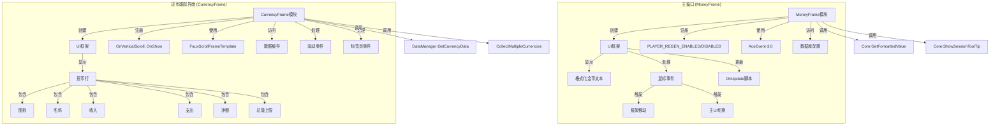
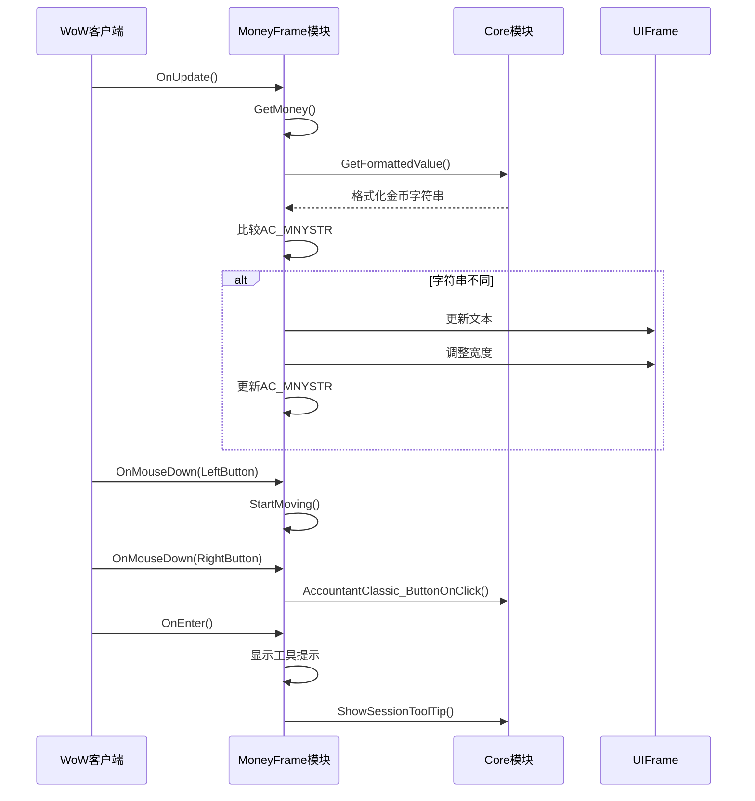
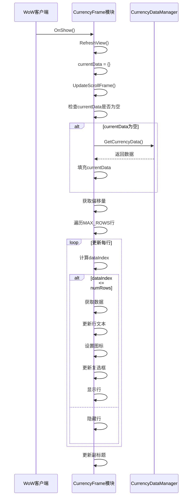
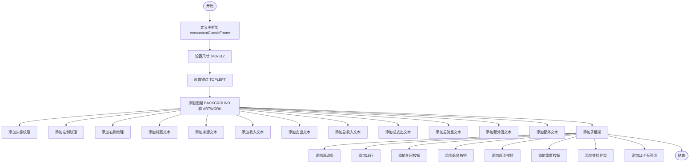
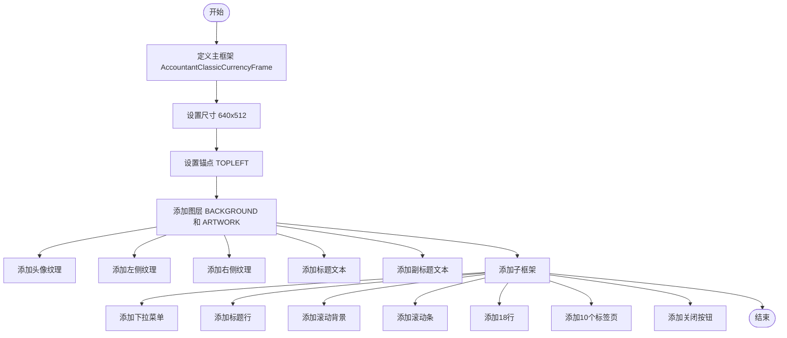

# 用户界面响应性与渲染优化

<cite>
**本文档引用文件**   
- [MoneyFrame.lua](file://Core/MoneyFrame.lua)
- [Core.xml](file://Core/Core.xml)
- [CurrencyFrame.lua](file://CurrencyTracker/CurrencyFrame.lua)
- [CurrencyFrame.xml](file://CurrencyTracker/CurrencyFrame.xml)
- [Core.lua](file://Core/Core.lua)
</cite>

## 目录
1. [引言](#引言)
2. [主窗口与货币跟踪界面架构](#主窗口与货币跟踪界面架构)
3. [UI渲染性能分析](#ui渲染性能分析)
4. [XML布局与帧刷新分析](#xml布局与帧刷新分析)
5. [UI更新机制分析](#ui更新机制分析)
6. [优化建议](#优化建议)
7. [结论](#结论)

## 引言
本文档旨在分析Accountant_Classic插件中主窗口（MoneyFrame）和货币跟踪界面（CurrencyFrame）在频繁数据更新时的用户界面响应性和渲染性能。通过审查XML定义中的布局嵌套和帧刷新操作，评估当前UI更新机制是否在每次金钱变动时都触发全量重绘，从而导致帧率下降。结合Core.xml中的模板定义和Lua中的setLabels等函数，提出优化建议，包括实现增量更新、使用脏检查机制、延迟非关键UI元素的渲染以及优化字体和纹理资源使用，以提升整体响应速度。

## 主窗口与货币跟踪界面架构

**图表来源**
- [MoneyFrame.lua](file://Core/MoneyFrame.lua#L1-L168)
- [CurrencyFrame.lua](file://CurrencyTracker/CurrencyFrame.lua#L1-L1220)
- [Core.xml](file://Core/Core.xml#L1-L626)
- [CurrencyFrame.xml](file://CurrencyTracker/CurrencyFrame.xml#L1-L672)

## UI渲染性能分析

### 主窗口（MoneyFrame）性能分析
主窗口的UI渲染性能主要依赖于`frame_OnUpdate`函数，该函数在每个OnUpdate事件中检查当前金币数量是否发生变化。如果发生变化，则更新框架文本并调整框架宽度以适应新内容。此机制通过比较`AC_MNYSTR`变量来避免不必要的更新，从而减少CPU开销。

**图表来源**
- [MoneyFrame.lua](file://Core/MoneyFrame.lua#L20-L35)
- [Core.lua](file://Core/Core.lua#L1600-L1630)

### 货币跟踪界面（CurrencyFrame）性能分析
货币跟踪界面的UI渲染性能主要依赖于`UpdateScrollFrame`函数，该函数在每次滚动或显示时更新滚动框架的内容。该函数首先检查数据缓存是否为空，如果为空则从数据管理器加载数据。然后根据偏移量更新可见行的数据，并隐藏不可见的行。此机制通过缓存数据和仅更新可见行来减少渲染开销。

**图表来源**
- [CurrencyFrame.lua](file://CurrencyTracker/CurrencyFrame.lua#L400-L600)
- [CurrencyDataManager.lua](file://CurrencyTracker/CurrencyDataManager.lua#L1-L200)

## XML布局与帧刷新分析

### 主窗口XML布局分析
主窗口的XML布局相对简单，主要包含一个主框架和多个子元素，如图标、文本和按钮。布局使用了绝对定位和固定尺寸，减少了布局计算的复杂性。然而，存在一些潜在的优化空间，例如可以考虑使用更灵活的布局管理器来适应不同分辨率的屏幕。

**图表来源**
- [Core.xml](file://Core/Core.xml#L1-L626)

### 货币跟踪界面XML布局分析
货币跟踪界面的XML布局较为复杂，包含多个模板和动态生成的行。布局使用了绝对定位和固定尺寸，确保了布局的一致性。然而，存在过度嵌套的问题，例如每个行都包含多个文本元素和一个复选框，这可能导致渲染性能下降。此外，滚动条的使用增加了布局的复杂性，但提供了良好的用户体验。

**图表来源**
- [CurrencyFrame.xml](file://CurrencyTracker/CurrencyFrame.xml#L1-L672)

## UI更新机制分析

### 主窗口UI更新机制
主窗口的UI更新机制主要依赖于`OnUpdate`脚本，该脚本在每个游戏帧中检查当前金币数量是否发生变化。如果发生变化，则更新框架文本并调整框架宽度。此机制通过比较`AC_MNYSTR`变量来避免不必要的更新，从而减少CPU开销。然而，这种机制在频繁数据更新时可能会导致帧率下降，因为每次更新都需要重新计算文本宽度和调整框架大小。

**代码路径**
- [MoneyFrame.lua](file://Core/MoneyFrame.lua#L20-L35)

### 货币跟踪界面UI更新机制
货币跟踪界面的UI更新机制主要依赖于`UpdateScrollFrame`函数，该函数在每次滚动或显示时更新滚动框架的内容。该函数首先检查数据缓存是否为空，如果为空则从数据管理器加载数据。然后根据偏移量更新可见行的数据，并隐藏不可见的行。此机制通过缓存数据和仅更新可见行来减少渲染开销。然而，这种机制在频繁数据更新时可能会导致帧率下降，因为每次更新都需要重新加载数据和更新所有可见行。

**代码路径**
- [CurrencyFrame.lua](file://CurrencyTracker/CurrencyFrame.lua#L400-L600)

## 优化建议

### 实现增量更新而非全量刷新
当前的UI更新机制在每次数据变化时都会触发全量重绘，这在频繁数据更新时会导致性能问题。建议实现增量更新机制，仅更新发生变化的部分。例如，在主窗口中，可以仅在金币数量发生变化时更新文本，而不重新计算框架宽度。在货币跟踪界面中，可以仅更新发生变化的行，而不重新加载所有数据。

### 使用脏检查（dirty checking）机制批量处理UI变更
引入脏检查机制，将UI变更标记为“脏”，并在下一个渲染周期中批量处理这些变更。这样可以减少不必要的UI更新，提高渲染效率。例如，在主窗口中，可以在`OnUpdate`脚本中检查`AC_MNYSTR`是否发生变化，如果发生变化则标记为“脏”，并在下一个渲染周期中更新文本。在货币跟踪界面中，可以在数据变化时标记相关行为“脏”，并在下一个渲染周期中更新这些行。

### 延迟非关键UI元素的渲染
对于非关键的UI元素，如工具提示和次要文本，可以延迟其渲染，直到它们真正需要显示时再进行渲染。这样可以减少初始渲染的开销，提高启动速度。例如，在主窗口中，可以延迟工具提示的渲染，直到用户将鼠标悬停在框架上时再进行渲染。在货币跟踪界面中，可以延迟次要文本的渲染，直到用户滚动到相关行时再进行渲染。

### 优化字体和纹理资源使用
优化字体和纹理资源的使用，减少内存占用和渲染开销。例如，可以使用更小的字体和纹理，或者使用更高效的纹理格式。此外，可以考虑使用字体图集（font atlas）来减少纹理切换的开销。在主窗口中，可以使用更小的字体和纹理来减少内存占用。在货币跟踪界面中，可以使用字体图集来减少纹理切换的开销。

## 结论
通过对主窗口（MoneyFrame）和货币跟踪界面（CurrencyFrame）的UI渲染性能进行分析，发现当前的UI更新机制在频繁数据更新时可能会导致帧率下降。建议实现增量更新、使用脏检查机制、延迟非关键UI元素的渲染以及优化字体和纹理资源使用，以提升整体响应速度。这些优化措施将有助于提高用户体验，特别是在高频率数据更新的场景下。