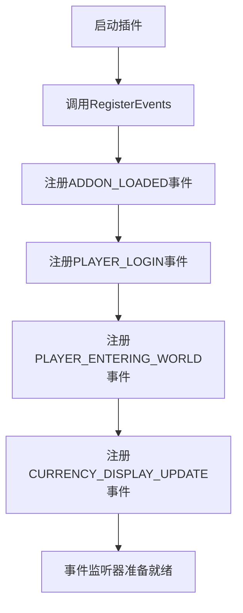
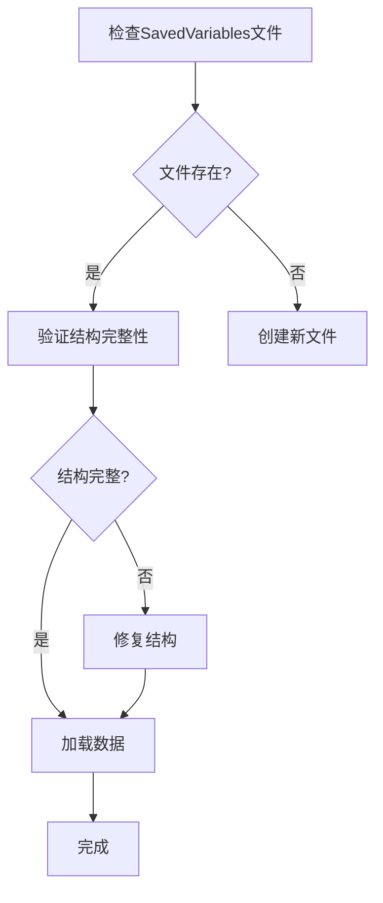
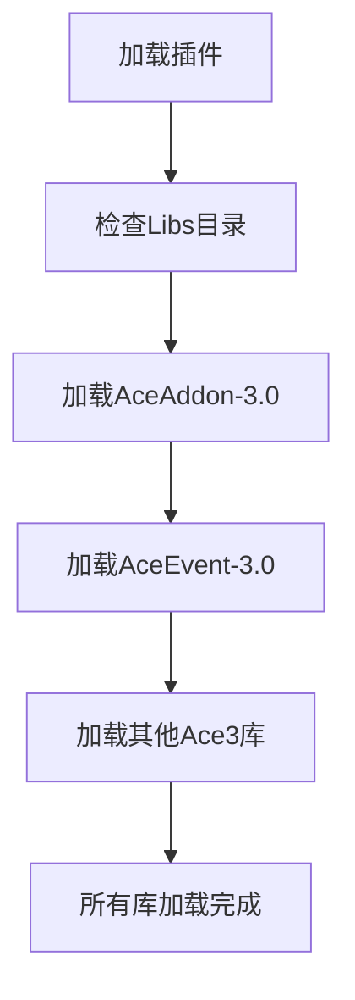
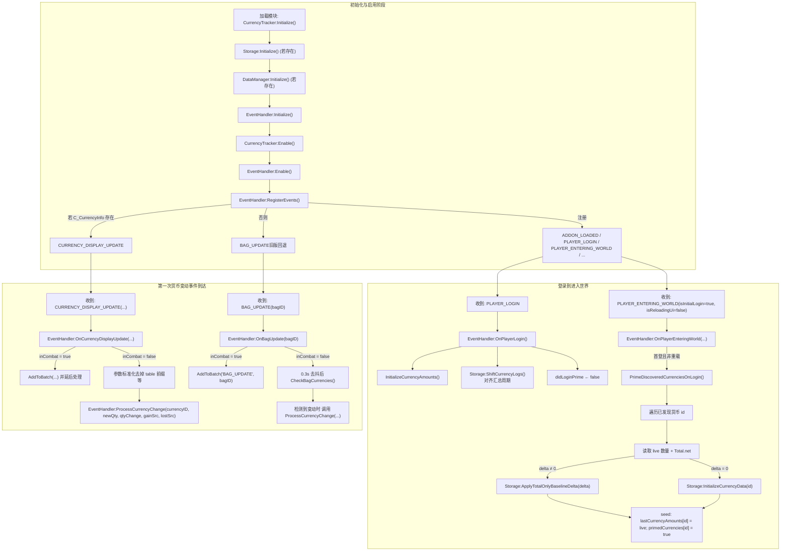
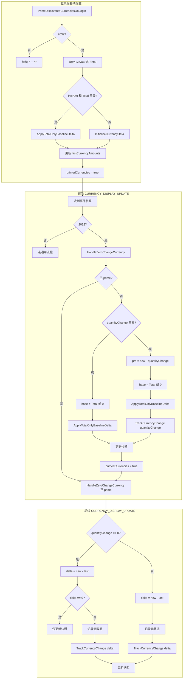

# 故障排除

<cite>
**本文档中引用的文件**   
- [CurrencyEventHandler.lua](file://CurrencyTracker/CurrencyEventHandler.lua)
- [CurrencyStorage.lua](file://CurrencyTracker/CurrencyStorage.lua)
- [CurrencyDataManager.lua](file://CurrencyTracker/CurrencyDataManager.lua)
- [CharacterLogin-Process-Flow.md](file://Docs/CharacterLogin-Process-Flow.md)
- [Traders-Tender-Process-Flow.md](file://Docs/Traders-Tender-Process-Flow.md)
- [CurrencyConstants.lua](file://CurrencyTracker/CurrencyConstants.lua)
</cite>

## 目录
1. [简介](#简介)
2. [常见问题分类](#常见问题分类)
3. [诊断步骤](#诊断步骤)
4. [登录流程分析](#登录流程分析)
5. [商人交易流程分析](#商人交易流程分析)
6. [调试命令与日志](#调试命令与日志)
7. [错误日志解读与修复](#错误日志解读与修复)

## 简介
本指南旨在帮助用户解决在使用Accountant_Classic插件时遇到的常见问题。通过系统性地列出问题类别、提供详细的诊断步骤、分析关键流程图以及解释调试命令和日志，用户可以快速定位并解决故障。

## 常见问题分类
用户在使用过程中可能遇到以下几类常见问题：
- **数据不准确**：例如金币变动未记录。
- **界面不显示**：例如货币追踪界面无法正常显示。
- **命令无效**：例如输入的命令没有响应。
- **性能卡顿**：例如游戏运行缓慢或插件导致的延迟。

## 诊断步骤
针对上述问题，以下是详细的诊断步骤：

### 检查事件监听是否正常注册
确保插件的事件监听器已正确注册。可以通过检查`CurrencyEventHandler.lua`中的`RegisterEvents`函数来验证事件是否已注册。



**图示来源**
- [CurrencyEventHandler.lua](file://CurrencyTracker/CurrencyEventHandler.lua#L180-L220)

### 验证SavedVariables文件完整性
检查`Accountant_ClassicSaveData`文件是否存在且结构完整。如果文件损坏或缺失，可能导致数据丢失或不准确。



**图示来源**
- [CurrencyStorage.lua](file://CurrencyTracker/CurrencyStorage.lua#L100-L150)

### 确认Ace3库正确加载
确保所有依赖的Ace3库（如AceAddon-3.0、AceEvent-3.0等）都已正确加载。可以通过检查`Libs`目录下的文件和`Core.lua`中的加载逻辑来确认。



**图示来源**
- [Core.lua](file://Core/Core.lua#L50-L100)

## 登录流程分析
利用`CharacterLogin-Process-Flow.md`中的登录流程图，解释角色登录时的数据初始化顺序和潜在故障点。



**图示来源**
- [CharacterLogin-Process-Flow.md](file://Docs/CharacterLogin-Process-Flow.md)

## 商人交易流程分析
参考`Traders-Tender-Process-Flow.md`分析商人交易场景中的逻辑分支。



**图示来源**
- [Traders-Tender-Process-Flow.md](file://Docs/Traders-Tender-Process-Flow.md)

## 调试命令与日志
提供调试命令（如/ct debug）的使用方法来启用详细日志输出。

### 启用调试模式
输入`/ct debug`命令以启用调试模式，这将显示详细的日志信息，帮助诊断问题。

```lua
-- 在CurrencyEventHandler.lua中启用调试模式
function EventHandler:EnableDebug()
    CurrencyTracker.DEBUG_MODE = true
    print("[AC CT] Debug mode enabled")
end
```

**节来源**
- [CurrencyEventHandler.lua](file://CurrencyTracker/CurrencyEventHandler.lua#L500-L510)

## 错误日志解读与修复
给出典型错误日志的解读方法和修复方案，如数据库损坏时的重置步骤。

### 数据库损坏修复
当发现数据库损坏时，可以按照以下步骤进行修复：

1. **备份当前数据**：首先备份`Accountant_ClassicSaveData.lua`文件。
2. **重置数据库**：使用`/ct reset`命令重置数据库。
3. **重新加载插件**：重新加载插件以应用更改。

```lua
-- 在CurrencyStorage.lua中重置数据库
function Storage:ResetAllData()
    if not EnsureSavedVariablesStructure() then
        return false
    end
    local server, character = GetCurrentServerAndCharacter()
    local sv = _G.Accountant_ClassicSaveData
    if sv and sv[server] and sv[server][character] then
        sv[server][character].currencyData = {}
        sv[server][character].currencyOptions = {
            selectedCurrency = DEFAULT_CURRENCY,
            trackingEnabled = true,
            lastUpdate = time(),
            version = CURRENCY_VERSION
        }
        SafeLogDebug("All currency data reset for %s-%s", server, character)
        return true
    end
    return false
end
```

**节来源**
- [CurrencyStorage.lua](file://CurrencyTracker/CurrencyStorage.lua#L800-L850)