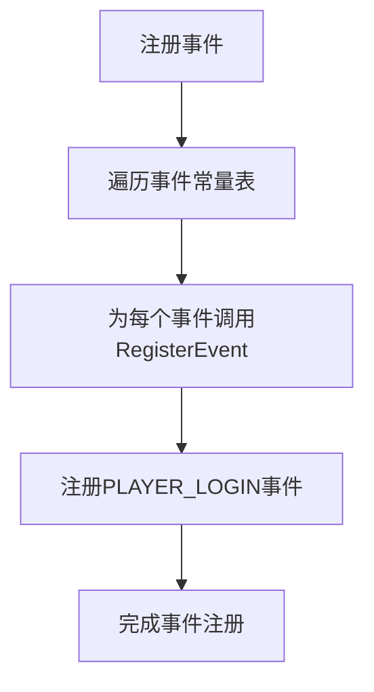
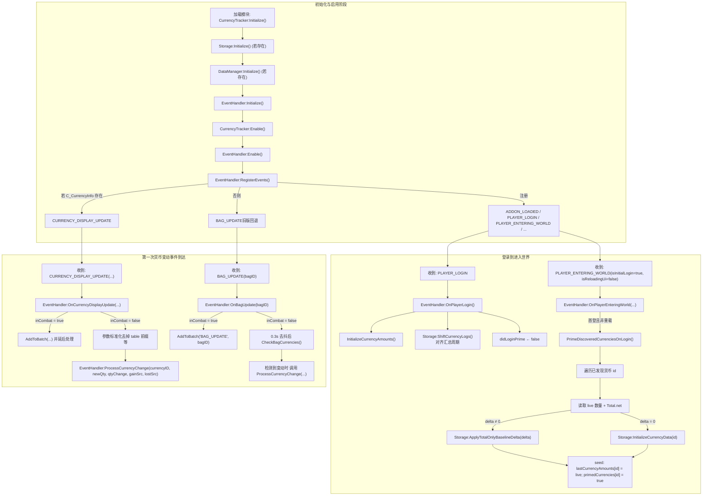
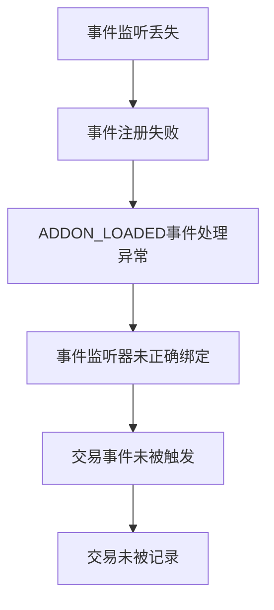
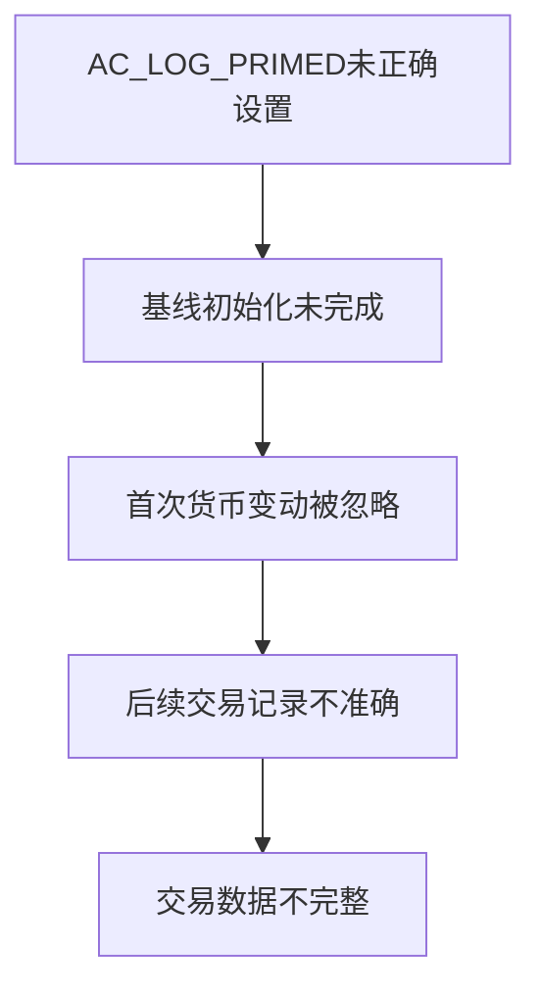
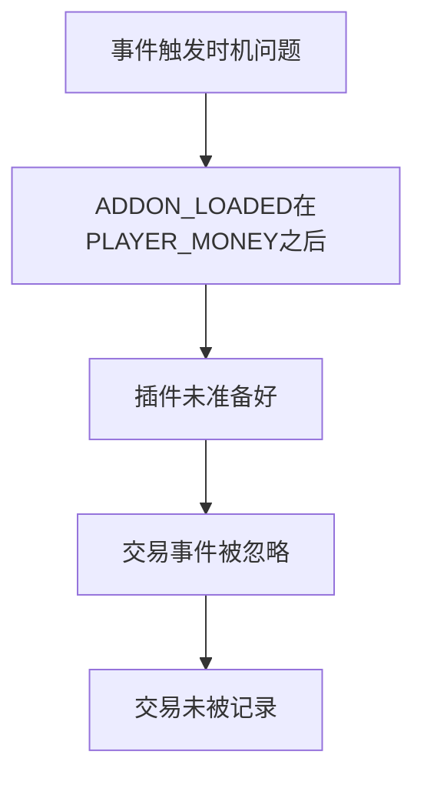

# 交易未记录问题

<cite>
**本文档引用的文件**
- [Core.lua](file://Core/Core.lua)
- [Constants.lua](file://Core/Constants.lua)
- [CharacterLogin-Process-Flow.md](file://Docs/CharacterLogin-Process-Flow.md)
- [CurrencyEventHandler.lua](file://CurrencyTracker/CurrencyEventHandler.lua)
</cite>

## 目录
1. [简介](#简介)
2. [事件监听机制](#事件监听机制)
3. [角色登录流程分析](#角色登录流程分析)
4. [交易未记录的常见原因](#交易未记录的常见原因)
5. [诊断步骤](#诊断步骤)
6. [修复建议](#修复建议)

## 简介
本文件旨在深入分析Accountant_Classic插件中交易未被记录的问题。通过研究插件的事件注册机制、初始化流程和角色登录过程，识别导致交易数据丢失的根本原因，并提供相应的诊断和修复方案。

## 事件监听机制

### 事件注册流程
Accountant_Classic插件通过`AccountantClassic_RegisterEvents`函数建立事件监听机制。该函数在`Core.lua`文件中定义，负责注册所有需要监听的事件。



**Diagram sources**
- [Core.lua](file://Core/Core.lua#L354-L357)

**Section sources**
- [Core.lua](file://Core/Core.lua#L348-L357)

### 核心事件类型
插件主要监听以下两类事件来跟踪交易：

1. **货币相关事件**：
   - `PLAYER_MONEY`：玩家货币发生变化时触发
   - `CHAT_MSG_MONEY`：聊天消息中包含货币信息时触发

2. **交互事件**：
   - `MERCHANT_SHOW`：与商人交互时触发
   - `QUEST_TURNED_IN`：任务完成时触发
   - `MAIL_INBOX_UPDATE`：邮箱更新时触发

这些事件在`Constants.lua`文件中定义，构成了插件事件监听的基础。

**Section sources**
- [Constants.lua](file://Core/Constants.lua#L107-L190)

## 角色登录流程分析

### 登录流程概述
根据`CharacterLogin-Process-Flow.md`文档，角色登录过程包含多个关键阶段，这些阶段的时序对交易记录的完整性至关重要。



**Diagram sources**
- [CharacterLogin-Process-Flow.md](file://Docs/CharacterLogin-Process-Flow.md#L1-L52)

**Section sources**
- [CharacterLogin-Process-Flow.md](file://Docs/CharacterLogin-Process-Flow.md#L1-L52)

### 初始化时序风险
在角色登录过程中，存在一个关键的风险点：`ADDON_LOADED`事件的触发时机。根据分析，`ADDON_LOADED`事件可能在`PLAYER_MONEY`事件之前发生，这会导致在插件完全初始化之前发生的货币变动被忽略。

这种时序问题可能导致以下情况：
- 角色登录时的初始货币变动未被记录
- 在插件加载过程中进行的交易操作丢失
- 首次登录时的货币变化数据不完整

## 交易未记录的常见原因

### 事件监听丢失
事件监听丢失是导致交易未被记录的最常见原因之一。当插件未能正确注册事件监听器时，相关的交易事件将不会被捕获。



**Diagram sources**
- [Core.lua](file://Core/Core.lua#L348-L357)

**Section sources**
- [Core.lua](file://Core/Core.lua#L348-L357)

### AC_LOG_PRIMED未正确设置
`AC_LOG_PRIMED`标志位用于控制插件的基线初始化状态。如果该标志位未正确设置，可能导致交易记录的异常。



**Diagram sources**
- [Core.lua](file://Core/Core.lua#L151-L156)

**Section sources**
- [Core.lua](file://Core/Core.lua#L151-L156)

### 事件触发时机问题
事件触发时机问题是导致交易丢失的另一个重要原因。由于`ADDON_LOADED`和`PLAYER_MONEY`事件的触发顺序不确定，可能导致在插件初始化之前发生的交易被忽略。



**Diagram sources**
- [CharacterLogin-Process-Flow.md](file://Docs/CharacterLogin-Process-Flow.md#L1-L52)

**Section sources**
- [CharacterLogin-Process-Flow.md](file://Docs/CharacterLogin-Process-Flow.md#L1-L52)

## 诊断步骤

### 检查AC_LOG_PRIMED状态
检查`AC_LOG_PRIMED`标志位的状态是诊断交易记录问题的第一步。该标志位指示基线初始化是否已完成。

```lua
-- 检查AC_LOG_PRIMED状态
if AC_LOG_PRIMED then
    print("基线初始化已完成")
else
    print("基线初始化未完成")
end
```

**Section sources**
- [Core.lua](file://Core/Core.lua#L306-L307)

### 验证关键事件捕获
验证关键事件是否被正确捕获是诊断过程的重要环节。需要检查`MERCHANT_SHOW`等关键事件是否被成功监听。

```lua
-- 验证MERCHANT_SHOW事件是否被注册
for key, value in pairs(private.constants.events) do
    if value == "MERCHANT_SHOW" then
        print("MERCHANT_SHOW事件已注册")
        break
    end
end
```

**Section sources**
- [Constants.lua](file://Core/Constants.lua#L107-L190)

### 确认事件监听器注册
确认事件监听器是否成功注册是确保交易记录完整性的关键步骤。

```lua
-- 确认事件监听器注册
function addon:PopulateCharacterList(server, faction)
    -- 检查事件监听器是否正常工作
    if AC_CHARSCROLL_LIST then
        print("事件监听器工作正常")
    else
        print("事件监听器存在问题")
    end
end
```

**Section sources**
- [Core.lua](file://Core/Core.lua#L354-L357)

## 修复建议

### 启用调试日志
启用调试日志可以帮助开发者追踪事件的触发和处理过程，是诊断问题的有效手段。

```lua
-- 启用调试日志
local function AccountantClassic_ShowPrimingAlert()
    if AC_PRIMING_ALERTED then return end
    AC_PRIMING_ALERTED = true
    local msg = "|cffffd200Accountant Classic (Gold): Baseline primed. Subsequent money changes will be tracked.|r"
    ACC_Print(msg)
end
```

**Section sources**
- [Core.lua](file://Core/Core.lua#L145-L150)

### 手动触发事件重注册
当发现事件监听丢失时，可以手动触发事件重注册来恢复正常的交易记录功能。

```lua
-- 手动触发事件重注册
function AccountantClassic_RegisterEvents(self)
    for key, value in pairs(private.constants.events) do
        self:RegisterEvent(value)
    end
    self:RegisterEvent("PLAYER_LOGIN")
end
```

**Section sources**
- [Core.lua](file://Core/Core.lua#L348-L357)

### 避免在加载过程中进行交易操作
为避免因事件监听器未完全初始化而导致的交易丢失，建议在插件加载完成后再进行交易操作。

```lua
-- 检查插件是否已完全加载
if AC_LOG_PRIMED then
    -- 可以安全进行交易操作
    print("插件已准备就绪，可以进行交易")
else
    -- 建议等待插件初始化完成
    print("插件仍在初始化，请稍后进行交易")
end
```

**Section sources**
- [Core.lua](file://Core/Core.lua#L306-L307)