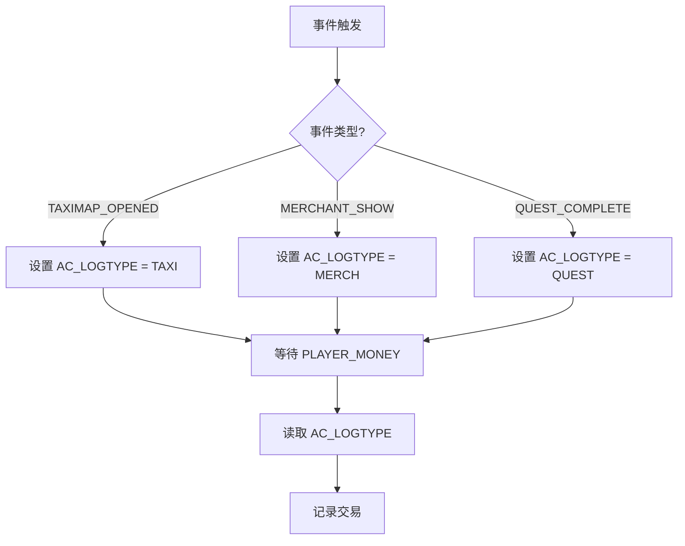
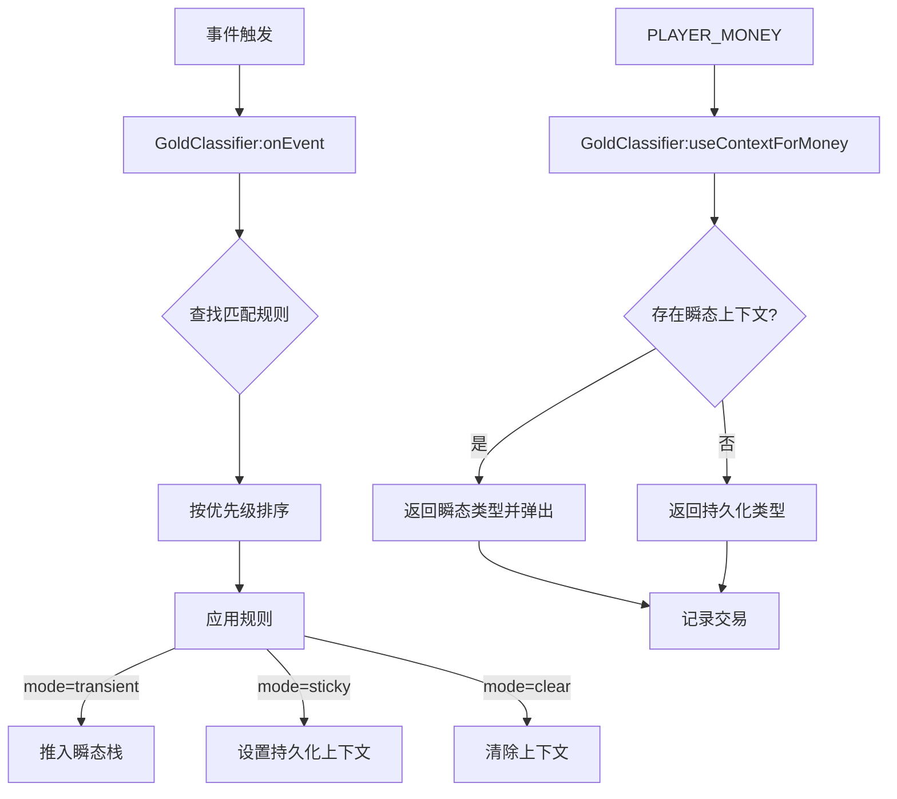

# 分类错误问题

<cite>
**本文档引用的文件**   
- [Core.lua](file://Core/Core.lua)
- [GoldTracker-Classification-Refactor.md](file://Docs/GoldTracker-Classification-Refactor.md)
- [Constants.lua](file://Core/Constants.lua)
- [GoldTracker-Event-Classification.md](file://Docs/GoldTracker-Event-Classification.md)
</cite>

## 目录
1. [引言](#引言)
2. [根本原因分析](#根本原因分析)
3. [新旧分类逻辑对比](#新旧分类逻辑对比)
4. [诊断步骤](#诊断步骤)
5. [修复建议](#修复建议)
6. [结论](#结论)

## 引言
本文件旨在深入分析Accountant Classic插件中交易分类错误的根本原因。该问题主要源于当前基于全局变量`AC_LOGTYPE`的状态机设计，当事件顺序异常或上下文切换逻辑存在缺陷时，会导致后续的金钱变化事件被错误归因。文档将结合`Core.lua`中的实现和`GoldTracker-Classification-Refactor.md`中提出的新设计，详细阐述问题、对比新旧逻辑，并提供诊断与修复方案。

## 根本原因分析

### AC_LOGTYPE 状态污染
`AC_LOGTYPE`是一个全局字符串变量，用于在`PLAYER_MONEY`事件触发时，标记当前金钱变化的来源类型。其核心问题在于“状态污染”——一旦被某个事件（如`TAXIMAP_OPENED`）设置为特定值（如`TAXI`），该状态会一直“黏性”地持续，直到被另一个事件显式覆盖或清空。

例如，当玩家打开出租车地图（`TAXIMAP_OPENED`）时，`AC_LOGTYPE`被设置为`TAXI`。如果此时玩家没有立即支付费用，而是先进行了其他操作（如拾取战利品或交易），这些操作触发的`PLAYER_MONEY`事件会读取到仍为`TAXI`的`AC_LOGTYPE`，从而导致本应归类为`LOOT`或`TRADE`的金钱变化被错误地记录为`TAXI`。

**Section sources**
- [Core.lua](file://Core/Core.lua#L105)
- [Core.lua](file://Core/Core.lua#L1447-L1520)

### 事件顺序异常
游戏中的事件顺序并非总是可预测的。一个典型的例子是UI关闭与金钱交易的时序问题。代码中注释掉了`TAXIMAP_CLOSED`、`LOOT_CLOSED`和`QUEST_FINISHED`等事件对`AC_LOGTYPE`的清空操作，原因正是“UI关闭早于金钱入账”。如果不清空，当玩家完成任务后，任务窗口关闭，但奖励金币稍后才到账，此时`AC_LOGTYPE`已为空，导致奖励被错误归类为`OTHER`。然而，这种“不清空”的妥协方案，又为状态污染创造了条件。

### 上下文切换逻辑缺陷
当前的上下文切换逻辑是分散且隐式的。它依赖于一个庞大的`if-elseif`链来响应不同的事件，并直接修改`AC_LOGTYPE`。这种设计存在以下缺陷：
1.  **缺乏优先级**：当多个事件可能同时影响分类时（例如，一个任务奖励同时包含金币和拍卖行收入），没有明确的优先级规则来决定最终分类。
2.  **逻辑分散**：所有分类规则都散落在`AccountantClassic_OnEvent`函数中，难以维护和审计。
3.  **无超时机制**：对于`TAXI`、`LOOT`这类短暂的上下文，没有设置过期时间（TTL），导致状态可能长时间“悬挂”，污染后续的分类。

**Section sources**
- [Core.lua](file://Core/Core.lua#L1447-L1520)
- [GoldTracker-Event-Classification.md](file://Docs/GoldTracker-Event-Classification.md#L33-L69)

## 新旧分类逻辑对比

### 旧逻辑：基于全局状态的命令式编程
旧的分类逻辑是典型的命令式编程，其核心流程如下：
1.  **事件监听**：`AccountantClassic_OnEvent`函数监听所有相关事件。
2.  **状态设置**：根据事件类型，直接修改全局变量`AC_LOGTYPE`。
3.  **分类应用**：当`PLAYER_MONEY`事件发生时，读取`AC_LOGTYPE`的当前值，并将其作为交易的分类。

这种逻辑简单直接，但如上所述，其全局状态的特性是所有问题的根源。

**Diagram sources**
- [Core.lua](file://Core/Core.lua#L1447-L1520)

### 新逻辑：基于规则引擎的声明式编程
`GoldTracker-Classification-Refactor.md`提出了一种全新的数据驱动架构，引入了`GoldClassifier`模块，其核心思想是将分类逻辑从“命令式”转变为“声明式”。

#### 核心组件
- **`GoldClassification.lua`**：一个纯数据表，定义了所有事件到分类的映射规则。
- **`GoldClassifier.lua`**：一个调度器，负责管理上下文栈和应用规则。

#### 规则模式（Rule Schema）
每个规则是一个包含以下字段的Lua表：
- `event`: 触发事件的名称。
- `type`: 对应的`AC_LOGTYPE`值。
- `mode`: 模式，分为：
  - `"sticky"`：持久化，直到被覆盖。
  - `"transient"`：瞬态，仅被下一个`PLAYER_MONEY`事件消费一次，然后自动移除。
  - `"clear"`：清除上下文。
- `priority`: 优先级，数值越高越优先。
- `cond`: 可选的条件函数，用于更精确的匹配。
- `ttlSec`: 瞬态模式的过期时间（秒）。

#### 工作流程
1.  **规则注册**：在启动时加载`GoldClassification.lua`中的规则，并按事件类型建立索引。
2.  **事件处理**：每当事件发生，`GoldClassifier:onEvent()`会查找所有匹配的规则，根据`priority`选择最高优先级的规则，并根据`mode`更新内部的上下文栈（而非直接修改`AC_LOGTYPE`）。
3.  **分类获取**：在`PLAYER_MONEY`事件中，调用`GoldClassifier:useContextForMoney()`。该函数会优先返回一个有效的瞬态上下文（并将其从栈中弹出），如果没有瞬态上下文，则使用持久化上下文。

这种设计从根本上解决了旧逻辑的缺陷：
- **避免状态污染**：瞬态模式（`transient`）确保了上下文只被使用一次。
- **解决时序问题**：为瞬态上下文设置`ttlSec`（如5秒），即使金钱交易延迟，只要在有效期内，分类依然正确。
- **逻辑集中且可维护**：所有规则集中在一个数据表中，添加新功能（如“制造订单”）只需添加一条新规则，无需修改核心逻辑。

**Diagram sources**
- [GoldTracker-Classification-Refactor.md](file://Docs/GoldTracker-Classification-Refactor.md#L26-L46)
- [GoldTracker-Classification-Refactor.md](file://Docs/GoldTracker-Classification-Refactor.md#L78-L94)

## 诊断步骤
要诊断分类错误问题，可以遵循以下步骤：

1.  **检查事件与金钱变化的时间间隔**：使用`/console taintLog 1`或插件的详细日志模式（`AccountantClassic_Verbose`），观察从触发UI事件（如打开商人界面）到实际发生`PLAYER_MONEY`事件之间的时间差。过长的间隔是瞬态上下文过期的征兆。
2.  **验证关键事件点的AC_LOGTYPE值**：在怀疑发生错误分类的场景下，通过调试工具或在`PLAYER_MONEY`事件处理函数的开头添加临时打印语句，输出`AC_LOGTYPE`的值，确认其是否符合预期。
3.  **确认是否存在未处理的边缘情况**：检查是否存在同时打开多个UI的情况。例如，玩家在商人界面修理装备时，`MERCHANT_UPDATE`事件会将`AC_LOGTYPE`从`MERCH`改为`REPAIRS`。如果此时玩家又打开了任务界面，`QUEST_COMPLETE`事件会将其改为`QUEST`，这可能导致修理费用被错误归类。需要确保`updateLog()`函数在处理完`REPAIRS`后能正确地将`AC_LOGTYPE`重置回`MERCH`。

**Section sources**
- [Core.lua](file://Core/Core.lua#L1182-L1183)
- [Core.lua](file://Core/Core.lua#L1447-L1520)

## 修复建议
基于`GoldTracker-Classification-Refactor.md`的提案，提出以下修复建议：

1.  **采用瞬态上下文（transient context）机制**：这是最核心的修复。将`TAXI`、`LOOT`、`MAIL`、`AH`等短暂的上下文模式从`sticky`改为`transient`，并设置合理的`ttlSec`（如5秒）。这能确保这些分类只影响紧随其后的金钱变化，从根本上杜绝状态污染。
2.  **引入事件关联ID**：虽然提案中未直接提及，但可以作为一种增强方案。为每个可能产生金钱变化的UI操作生成一个唯一的ID，并将其与`PLAYER_MONEY`事件关联。这样可以精确地将金钱变化与源头事件匹配，完全不受时序和状态污染的影响。
3.  **使用GoldClassifier模块进行重构**：按照提案的“系统性、安全重构步骤”，逐步将现有逻辑迁移到新的规则引擎架构。首先搭建`GoldClassification.lua`和`GoldClassifier.lua`模块，然后在`PLAYER_MONEY`分支中优先使用`GoldClassifier:useContextForMoney()`的返回值，最后逐步移除`AccountantClassic_OnEvent`中冗余的`elseif`分支。这种渐进式重构能最大限度地降低风险。

**Section sources**
- [GoldTracker-Classification-Refactor.md](file://Docs/GoldTracker-Classification-Refactor.md#L150-L190)

## 结论
Accountant Classic的分类错误问题源于其基于全局变量`AC_LOGTYPE`的脆弱状态机设计。通过引入`GoldClassifier`模块，采用基于规则引擎的声明式编程和瞬态上下文机制，可以构建一个更健壮、可维护且不易出错的分类系统。该重构方案不仅能解决当前的`TAXI`、`LOOT`等分类错误，还能为未来添加新功能（如“制造订单”）提供一个清晰、安全的框架。