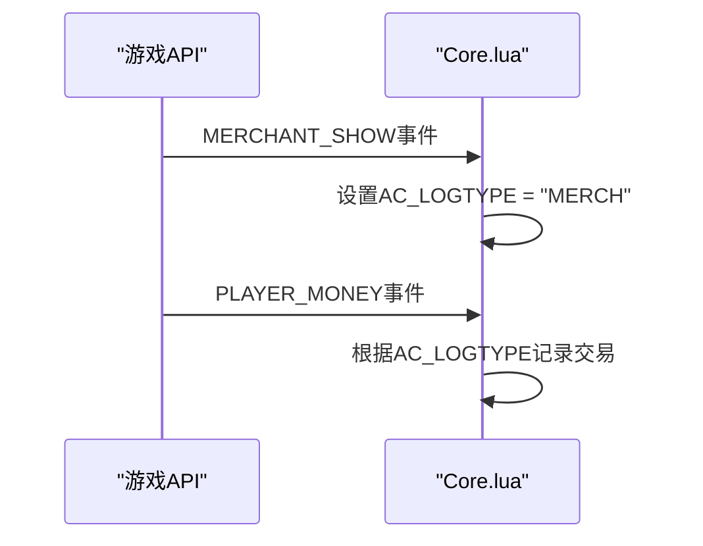
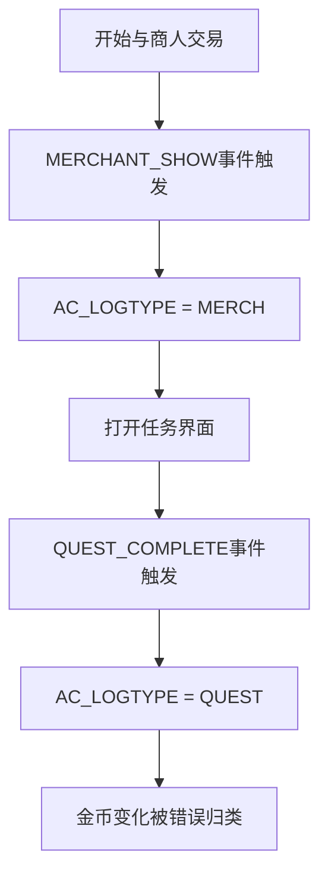
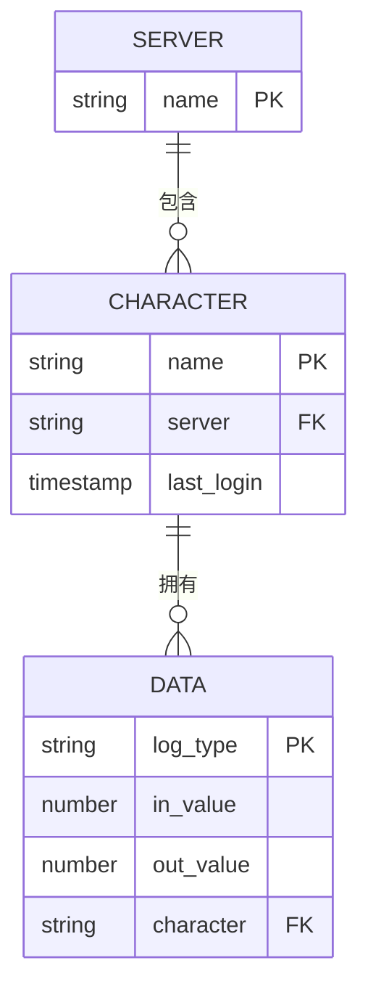
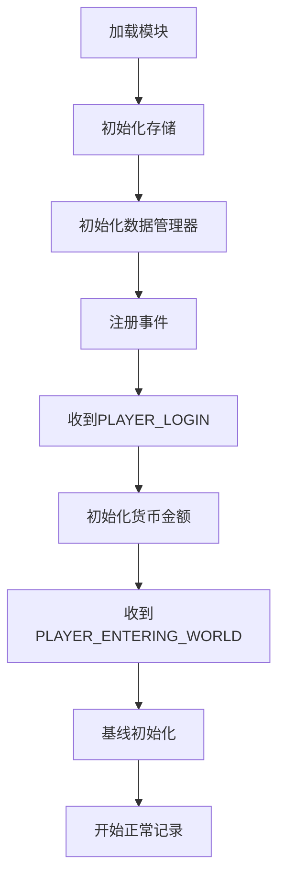

# 数据不准确问题

<cite>
**本文档引用的文件**  
- [Core.lua](file://Core/Core.lua)
- [Constants.lua](file://Core/Constants.lua)
- [CharacterLogin-Process-Flow.md](file://Docs/CharacterLogin-Process-Flow.md)
- [CurrencyEventHandler.lua](file://CurrencyTracker/CurrencyEventHandler.lua)
</cite>

## 目录
1. [简介](#简介)
2. [事件监听丢失导致的数据不准确](#事件监听丢失导致的数据不准确)
3. [上下文切换错误](#上下文切换错误)
4. [多角色数据混淆](#多角色数据混淆)
5. [登录初始化流程与数据加载问题](#登录初始化流程与数据加载问题)
6. [诊断步骤](#诊断步骤)
7. [修复建议](#修复建议)

## 简介
本文件旨在深入分析Accountant_Classic插件中金币或货币数据记录不准确的常见原因。通过分析`Core.lua`中的事件处理逻辑和`CharacterLogin-Process-Flow.md`中的登录初始化流程，我们将揭示数据归因机制的工作流程，并提供诊断和修复建议。

## 事件监听丢失导致的数据不准确
在`Core.lua`中，插件通过注册一系列事件来跟踪金币变化。关键事件包括`PLAYER_MONEY`和`MERCHANT_SHOW`。当`MERCHANT_SHOW`事件触发时，`AC_LOGTYPE`被设置为"MERCH"，表示接下来的金币变化与商人交易相关。随后，当`PLAYER_MONEY`事件触发时，系统根据当前的`AC_LOGTYPE`值将交易归类。

然而，如果事件监听丢失或顺序错误，可能导致数据归因错误。例如，如果`MERCHANT_SHOW`事件未被正确捕获，后续的`PLAYER_MONEY`事件将使用默认的`AC_LOGTYPE`值，导致交易被错误分类。

**Diagram sources**
- [Core.lua](file://Core/Core.lua#L1493-L1533)
- [Constants.lua](file://Core/Constants.lua#L80-L108)

**Section sources**
- [Core.lua](file://Core/Core.lua#L1493-L1533)
- [Constants.lua](file://Core/Constants.lua#L80-L108)

## 上下文切换错误
上下文切换错误通常发生在角色切换或界面切换时。在`Core.lua`中，使用全局变量`AC_LOGTYPE`来跟踪当前的交易上下文。如果在交易过程中切换到其他界面（如任务界面或拍卖行），可能会导致`AC_LOGTYPE`被错误地覆盖。

例如，当玩家在与商人交易时打开任务界面，`QUEST_COMPLETE`事件可能会将`AC_LOGTYPE`设置为"QUEST"，从而导致后续的金币变化被错误地归类为任务奖励而非商人交易。

**Diagram sources**
- [Core.lua](file://Core/Core.lua#L1493-L1533)
- [Constants.lua](file://Core/Constants.lua#L80-L108)

**Section sources**
- [Core.lua](file://Core/Core.lua#L1493-L1533)

## 多角色数据混淆
当管理多个角色时，数据混淆可能发生在角色切换过程中。`Accountant_ClassicSaveData`结构按服务器和角色组织数据，但在角色切换时，如果未正确加载或保存数据，可能导致数据覆盖或丢失。

在`CharacterLogin-Process-Flow.md`中描述的登录流程显示，角色数据在`PLAYER_LOGIN`和`PLAYER_ENTERING_WORLD`事件期间初始化。如果这些事件处理不当，可能导致新角色的数据覆盖旧角色的数据。

**Diagram sources**
- [CharacterLogin-Process-Flow.md](file://Docs/CharacterLogin-Process-Flow.md#L1-L51)
- [Core.lua](file://Core/Core.lua#L1531-L1558)

**Section sources**
- [CharacterLogin-Process-Flow.md](file://Docs/CharacterLogin-Process-Flow.md#L1-L51)

## 登录初始化流程与数据加载问题
登录初始化流程是确保数据准确性的关键阶段。根据`CharacterLogin-Process-Flow.md`，插件在`PLAYER_LOGIN`事件后初始化货币金额，并在`PLAYER_ENTERING_WORLD`事件期间进行基线初始化。

基线初始化（Priming Approach）确保首次登录时的金币余额不会被错误地计为收入。该过程通过设置`AC_LOG_PRIMED`标志来实现，确保基线初始化仅执行一次。

如果此流程失败，可能导致首次会话中的所有金币变化都被忽略，或初始余额被错误地计为收入。

**Diagram sources**
- [CharacterLogin-Process-Flow.md](file://Docs/CharacterLogin-Process-Flow.md#L1-L51)
- [Core.lua](file://Core/Core.lua#L1531-L1558)

**Section sources**
- [CharacterLogin-Process-Flow.md](file://Docs/CharacterLogin-Process-Flow.md#L1-L51)

## 诊断步骤
要诊断数据不准确问题，请按以下步骤操作：

1. **检查当前上下文变量**：验证`AC_LOGTYPE`是否正确设置。可以在`Core.lua`中添加调试输出来监控其值的变化。

2. **验证事件是否被正确触发和捕获**：使用`/console scriptErrors 1`命令启用脚本错误显示，并观察相关事件是否按预期触发。

3. **确认SavedVariables中数据结构的完整性**：检查`Accountant_ClassicSaveData`中的数据结构是否完整，特别是`options.primed`标志是否正确设置。

4. **检查角色切换逻辑**：验证`PopulateCharacterList`函数是否正确处理角色切换，确保不会加载错误角色的数据。

**Section sources**
- [Core.lua](file://Core/Core.lua#L1531-L1558)
- [Config.lua](file://Core/Config.lua#L1-L430)

## 修复建议
为解决数据不准确问题，建议采取以下措施：

1. **启用调试日志**：在`Core.lua`中启用`AccountantClassic_Verbose`模式，以获取详细的事件处理日志。

2. **手动重置特定角色数据**：如果发现特定角色的数据不准确，可以通过删除该角色在`Accountant_ClassicSaveData`中的条目来手动重置。

3. **避免在交易过程中切换UI界面**：教育用户在完成交易前不要切换到其他界面，以防止`AC_LOGTYPE`被意外覆盖。

4. **强化事件处理逻辑**：在`Core.lua`中添加额外的错误检查，确保关键事件（如`MERCHANT_SHOW`和`PLAYER_MONEY`）按正确顺序处理。

5. **改进基线初始化**：确保`AC_LOG_PRIMED`标志在正确时机设置，防止首次会话中的交易数据丢失。

**Section sources**
- [Core.lua](file://Core/Core.lua#L1531-L1558)
- [CurrencyEventHandler.lua](file://CurrencyTracker/CurrencyEventHandler.lua#L1-L932)