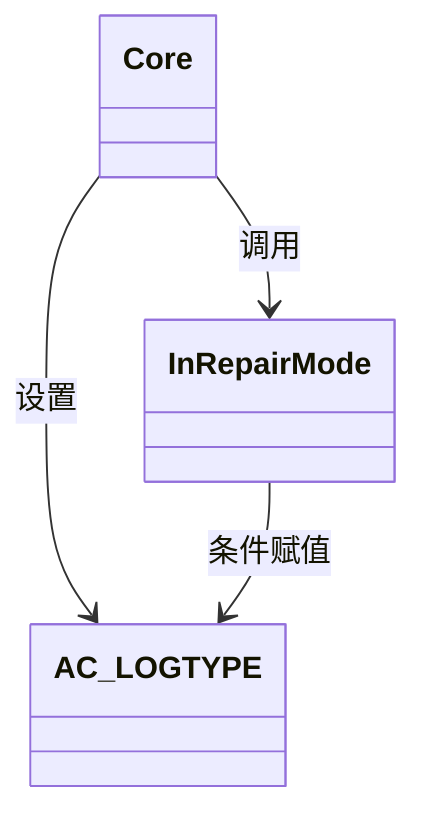

# 重复计费问题

<cite>
**本文档引用文件**  
- [Core.lua](file://Core/Core.lua)
- [Constants.lua](file://Core/Constants.lua)
</cite>

## 目录
1. [简介](#简介)
2. [核心组件分析](#核心组件分析)
3. [事件触发与状态判断逻辑](#事件触发与状态判断逻辑)
4. [重复计费的常见原因](#重复计费的常见原因)
5. [诊断步骤](#诊断步骤)
6. [修复建议](#修复建议)

## 简介
本文件旨在深入分析《Accountant_Classic》插件中导致同一笔交易被多次计费的潜在问题。重点探讨事件重复触发、上下文未及时清除、MERCHANT_UPDATE与REPAIRS逻辑冲突等核心原因。通过分析`Core.lua`和`Constants.lua`中的关键逻辑，提供详细的诊断方法和修复建议，以确保金钱记录的准确性。

## 核心组件分析

`Core.lua`是插件的核心逻辑文件，负责处理所有与金钱变动相关的事件。`Constants.lua`则定义了插件所监听的事件列表和日志类型。这两个文件共同构成了金钱追踪系统的基础。

**Section sources**
- [Core.lua](file://Core/Core.lua#L0-L2335)
- [Constants.lua](file://Core/Constants.lua#L0-L261)

## 事件触发与状态判断逻辑

### MERCHANT_UPDATE 事件处理
`MERCHANT_UPDATE`事件在与商人交互时频繁触发。其处理逻辑位于`Core.lua`的`AccountantClassic_OnEvent`函数中：

```mermaid
flowchart TD
A[MERCHANT_UPDATE 事件触发] --> B{InRepairMode() == true?}
B --> |是| C[设置 AC_LOGTYPE = "REPAIRS"]
B --> |否| D[不改变 AC_LOGTYPE]
C --> E[等待 PLAYER_MONEY 事件]
D --> E
E --> F[调用 updateLog() 记录交易]
```

**Diagram sources**
- [Core.lua](file://Core/Core.lua#L1497-L1500)

### REPAIRS 逻辑的实现
`REPAIRS`日志类型的判定依赖于`InRepairMode()`函数。该函数的调用点不仅在`MERCHANT_UPDATE`事件中，还在`CursorHasItem`钩子中被调用，这增加了状态判断的复杂性。



**Diagram sources**
- [Core.lua](file://Core/Core.lua#L1498)
- [Core.lua](file://Core/Core.lua#L1973)

## 重复计费的常见原因

### 1. 事件重复触发
`Constants.lua`中定义了多个与商人相关的事件，它们可能在短时间内连续触发：
- `MERCHANT_SHOW`: 商人界面打开。
- `MERCHANT_UPDATE`: 商人界面内容更新（如修理、购买、出售）。
- `PLAYER_MONEY`: 玩家金钱发生实际变动。

当玩家在商人界面进行修理时，`MERCHANT_UPDATE`事件可能因界面刷新而被多次触发，每次触发都可能将`AC_LOGTYPE`设置为`REPAIRS`。

### 2. 上下文未及时清除
`AC_LOGTYPE`变量用于存储当前交易的类型。在`updateLog()`函数执行后，该变量并未被重置为空字符串。如果`PLAYER_MONEY`事件因网络延迟等原因未能及时触发，后续的`MERCHANT_UPDATE`事件可能会再次将其设置为`REPAIRS`，导致下一笔交易（即使是非修理交易）也被错误地归类为`REPAIRS`。

### 3. MERCHANT_UPDATE与REPAIRS逻辑冲突
`MERCHANT_UPDATE`事件的处理逻辑存在一个根本性问题：它将一个**状态性**的判断（是否在修理模式）与一个**瞬时性**的事件（商人界面更新）耦合在一起。`InRepairMode()`函数的返回值可能在`MERCHANT_UPDATE`事件触发后发生变化，但`AC_LOGTYPE`的设置已经完成，这可能导致状态判断的延迟和不一致。

## 诊断步骤

为诊断重复计费问题，请按以下步骤操作：

1.  **检查日志记录**:
    *   在`Core.lua`中启用`AccountantClassic_Verbose`模式。
    *   检查游戏日志中是否出现连续的、相同类型的`REPAIRS`记录，尤其是在一次修理操作后。

2.  **验证AC_LOGTYPE重置**:
    *   在`updateLog()`函数的末尾添加日志输出，打印`AC_LOGTYPE`的值。
    *   确认在交易记录完成后，`AC_LOGTYPE`是否被正确重置（例如，重置为`MERCH`或空字符串）。

3.  **监控PLAYER_MONEY事件**:
    *   使用`/console scriptErrors 1`命令启用脚本错误报告。
    *   观察`PLAYER_MONEY`事件的触发频率和时机，确认其是否在`MERCHANT_UPDATE`事件之后稳定触发。

**Section sources**
- [Core.lua](file://Core/Core.lua#L1132-L1158)
- [Core.lua](file://Core/Core.lua#L1497-L1500)

## 修复建议

### 1. 引入交易哈希去重机制
为每次金钱变动生成一个唯一的哈希值（例如，基于时间戳和金额的组合），并在记录前检查该哈希值是否已存在。这可以从根本上防止完全相同的交易被重复记录。

### 2. 设置上下文超时
为`AC_LOGTYPE`引入一个短暂的超时机制。例如，当`MERCHANT_UPDATE`事件将`AC_LOGTYPE`设置为`REPAIRS`后，启动一个5秒的定时器。如果在5秒内没有触发`PLAYER_MONEY`事件，则自动将`AC_LOGTYPE`重置为`MERCH`或空字符串，防止状态“悬挂”。

### 3. 启用详细日志追踪事件序列
增强`AccountantClassic_Verbose`模式，使其能够打印出完整的事件序列和`AC_LOGTYPE`的变更历史。例如：
```
[事件] MERCHANT_UPDATE -> AC_LOGTYPE = REPAIRS
[事件] PLAYER_MONEY (金额变化: -100) -> 记录REPAIRS支出
[事件] MERCHANT_UPDATE -> AC_LOGTYPE = REPAIRS (状态未重置)
[事件] PLAYER_MONEY (金额变化: -50) -> 错误地记录为REPAIRS支出
```
这将极大地方便问题的定位和调试。

**Section sources**
- [Core.lua](file://Core/Core.lua#L1084-L1114)
- [Core.lua](file://Core/Core.lua#L1497-L1500)