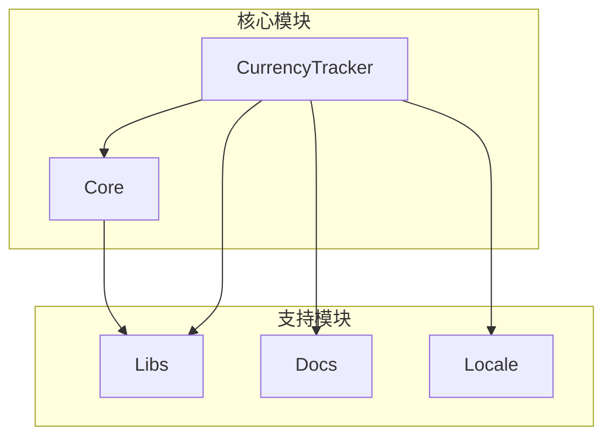
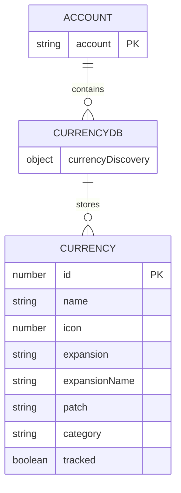
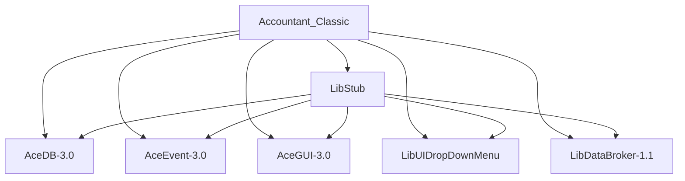

# 数据同步失败

<cite>
**本文档引用的文件**  
- [Core.lua](file://Core/Core.lua)
- [CurrencyStorage.lua](file://CurrencyTracker/CurrencyStorage.lua)
- [CurrencyCore.lua](file://CurrencyTracker/CurrencyCore.lua)
- [CurrencyDataManager.lua](file://CurrencyTracker/CurrencyDataManager.lua)
- [CurrencyFrame.lua](file://CurrencyTracker/CurrencyFrame.lua)
</cite>

## 目录
1. [简介](#简介)
2. [项目结构](#项目结构)
3. [核心组件](#核心组件)
4. [架构概述](#架构概述)
5. [详细组件分析](#详细组件分析)
6. [依赖分析](#依赖分析)
7. [性能考虑](#性能考虑)
8. [故障排除指南](#故障排除指南)
9. [结论](#结论)

## 简介
本文档深入探讨了Accountant_Classic插件中跨角色和跨服务器数据汇总功能可能出现的同步问题，特别是角色重命名和服务器迁移导致的数据关联断裂。重点分析了`Core.lua`中的`PopulateCharacterList`函数如何处理角色列表更新，以及`CurrencyStorage.lua`中账号范围数据库（Accountant_Classic_CurrencyDB）的同步机制。同时，详细说明了当SavedVariables文件因云同步延迟或冲突导致数据不一致时的应对策略，包括手动修复步骤和自动检测机制。

## 项目结构
Accountant_Classic插件的项目结构清晰，主要分为以下几个核心模块：
- **Core**: 包含核心功能逻辑，如金钱跟踪、配置和事件处理。
- **CurrencyTracker**: 专门负责货币跟踪的子模块，包含数据管理、事件处理和UI。
- **Docs**: 存放项目文档，包括使用说明、设计文档和路线图。
- **Libs**: 第三方库，如Ace3框架组件。
- **Locale**: 多语言本地化文件。

这种模块化设计使得货币跟踪功能可以独立开发和维护，同时与核心金钱跟踪功能保持松耦合。



**图表来源**
- [Core.lua](file://Core/Core.lua#L1-L2335)
- [CurrencyStorage.lua](file://CurrencyTracker/CurrencyStorage.lua#L1-L1222)

**章节来源**
- [Core.lua](file://Core/Core.lua#L1-L2335)
- [CurrencyStorage.lua](file://CurrencyTracker/CurrencyStorage.lua#L1-L1222)

## 核心组件
本插件的核心组件围绕两个主要功能：金钱跟踪和货币跟踪。`Core.lua`负责全局状态管理和金钱数据的持久化，而`CurrencyTracker`模块则专注于更复杂的货币数据同步和跨角色汇总。

`PopulateCharacterList`函数是实现跨角色数据汇总的关键。它通过遍历`Accountant_ClassicSaveData`这个全局保存变量，根据服务器和阵营筛选出所有角色，并将它们的服务器名和角色名组合成一个列表。这个列表随后被用于UI的下拉菜单，允许用户在不同角色间切换以查看其货币数据。

```mermaid
flowchart TD
A[调用PopulateCharacterList] --> B{服务器和阵营参数}
B --> |All| C[遍历所有服务器]
B --> |特定服务器| D[遍历该服务器下的所有角色]
C --> E[遍历每个服务器下的所有角色]
D --> F{是否匹配阵营}
E --> F
F --> |是| G[将[server, char]加入AC_CHARSCROLL_LIST]
F --> |否| H[跳过]
G --> I[更新AC_CURR_LINES]
I --> J[为新条目创建UI框架]
J --> K{是否在All Chars标签页}
K --> |是| L[根据金钱、日期或名称排序]
K --> |否| M[保持原始顺序]
L --> N[更新UI显示]
M --> N
```

**章节来源**
- [Core.lua](file://Core/Core.lua#L1500-L1650)
- [CurrencyStorage.lua](file://CurrencyTracker/CurrencyStorage.lua#L1-L1222)

## 架构概述
Accountant_Classic的架构采用了分层设计，将数据存储、业务逻辑和用户界面分离。`CurrencyStorage.lua`作为数据访问层，提供了对`Accountant_ClassicSaveData`（角色范围）和`Accountant_Classic_CurrencyDB`（账号范围）这两个全局保存变量的安全访问接口。

`CurrencyCore.lua`作为业务逻辑层，协调`CurrencyDataManager`、`CurrencyEventHandler`和`CurrencyStorage`等模块。`CurrencyDataManager`负责数据查询和业务规则，`CurrencyEventHandler`监听游戏事件并触发数据更新。

```mermaid
graph TD
A[游戏事件] --> B[CurrencyEventHandler]
B --> C[CurrencyDataManager]
C --> D[CurrencyStorage]
D --> E[Accountant_ClassicSaveData<br/>(角色范围)]
D --> F[Accountant_Classic_CurrencyDB<br/>(账号范围)]
G[用户界面] --> H[CurrencyFrame]
H --> C
H --> D
```

**图表来源**
- [CurrencyStorage.lua](file://CurrencyTracker/CurrencyStorage.lua#L1-L1222)
- [CurrencyCore.lua](file://CurrencyTracker/CurrencyCore.lua#L1-L1414)
- [CurrencyDataManager.lua](file://CurrencyTracker/CurrencyDataManager.lua#L1-L426)

## 详细组件分析

### PopulateCharacterList 函数分析
`PopulateCharacterList`函数是实现跨角色数据汇总的核心。它通过直接操作`Accountant_ClassicSaveData`这个全局表来构建角色列表。

**关键逻辑：**
1.  **参数处理**：函数接受`server`和`faction`作为筛选参数。如果参数为`"All"`或`nil`，则表示不进行筛选。
2.  **数据遍历**：函数使用`orderedpairs`迭代器遍历`Accountant_ClassicSaveData`表。该表的结构为`[服务器名][角色名] = 角色数据`。
3.  **列表构建**：对于每个匹配的角色，将其`[server, char]`组合成一个数组，并添加到`AC_CHARSCROLL_LIST`中。
4.  **UI同步**：根据列表长度，动态创建或复用UI框架（`AccountantClassicCharacterEntry`），确保UI能显示所有角色。
5.  **排序功能**：当在“All Chars”标签页时，函数会根据`AC_SORT_BY`和`AC_SORT_ASC`标志对`AC_CHARSCROLL_LIST`进行排序，支持按名称、金钱或最后登录日期排序。

此函数的健壮性在于它直接依赖于保存变量的结构。只要`Accountant_ClassicSaveData`中的角色数据存在，无论角色是否重命名或服务器是否迁移，只要数据被正确同步，该函数都能正确地列出所有角色。然而，如果云同步失败导致某个角色的数据缺失，该角色将不会出现在列表中。

**章节来源**
- [Core.lua](file://Core/Core.lua#L1500-L1650)

### 账号范围数据库同步机制分析
`Accountant_Classic_CurrencyDB`是为了解决货币发现信息冗余存储而引入的账号范围数据库。其同步机制通过一次性的迁移过程实现。

**关键机制：**
1.  **初始化**：在`Storage:InitializeCurrencyStorage()`函数中，检查是否存在旧的、存储在角色范围内的`currencyDiscovery`表。
2.  **合并与迁移**：如果存在旧数据，函数会遍历该表，将每个货币的发现信息（ID、名称、图标等）合并到新的`Accountant_Classic_CurrencyDB.currencyDiscovery`表中。合并时会保留用户设置（如`tracked`状态）。
3.  **标记与清理**：迁移完成后，会在角色数据中设置`_currencyDiscoveryMigrated = true`标志，防止重复迁移。随后，旧的`currencyDiscovery`表会被清除以节省空间。
4.  **全局访问**：此后，所有角色都通过`Accountant_Classic_CurrencyDB`访问货币发现信息，确保了数据的一致性。

这种设计极大地减少了SavedVariables的大小，并保证了新发现的货币能立即在所有角色上可用。



**图表来源**
- [CurrencyStorage.lua](file://CurrencyTracker/CurrencyStorage.lua#L491-L520)
- [CurrencyDataManager.lua](file://CurrencyTracker/CurrencyDataManager.lua#L1-L426)

**章节来源**
- [CurrencyStorage.lua](file://CurrencyTracker/CurrencyStorage.lua#L491-L560)
- [CurrencyDataManager.lua](file://CurrencyTracker/CurrencyDataManager.lua#L1-L426)

### 数据不一致应对策略分析
当SavedVariables因云同步问题导致数据不一致时，插件提供了一套完善的应对策略，包括自动检测和手动修复。

**自动检测与修复机制：**
-   **基线校准 (Baseline Calibration)**：`CurrencyCore.lua`中的`RepairBaselinePreview`和`RepairBaselineApply`函数是核心。它们通过`BuildBaselineDiscrepancies`函数比较插件记录的货币总量（`Total.net`）与游戏API返回的实时数量（`GetCurrencyInfo`）。如果发现差异，用户可以预览差异，然后应用修复，系统会通过`ApplyTotalOnlyBaselineDelta`函数在`Total`时间段的`BaselinePrime`源中记录一个调整值，从而校准总量，而不会影响日常的收支记录。
-   **负数源键修复**：`MigrateZeroSourceToBaselinePrime`函数会将旧版本中使用数字`0`作为源键的记录（如“ConvertOldItem”）迁移到更语义化的`"BaselinePrime"`字符串键，保持数据清晰。

**手动修复步骤：**
1.  **诊断问题**：使用`/ct repair baseline preview`命令预览所有货币的基线差异。
2.  **应用修复**：如果预览结果正确，执行`/ct repair baseline`命令应用修复。
3.  **移除错误记录**：对于特定的错误记录，可以使用`/ct repair remove <id> <amount> <source> (income|outgoing)`命令手动移除。
4.  **调整聚合数据**：使用`/ct repair adjust <id> <delta> [source]`命令对特定时间段的聚合数据进行微调。

这些机制共同确保了即使在数据同步失败的情况下，用户也能通过相对简单的命令恢复数据的准确性。

**章节来源**
- [CurrencyCore.lua](file://CurrencyTracker/CurrencyCore.lua#L447-L517)
- [CurrencyStorage.lua](file://CurrencyTracker/CurrencyStorage.lua#L55-L90)
- [CurrencyStorage.lua](file://CurrencyTracker/CurrencyStorage.lua#L158-L190)

## 依赖分析
Accountant_Classic插件高度依赖Ace3框架库来实现其核心功能。
-   **AceDB-3.0**: 用于管理配置和保存变量，提供了配置文件切换和默认值管理。
-   **AceEvent-3.0**: 用于注册和监听游戏事件，如`PLAYER_LOGIN`和`CURRENCY_DISPLAY_UPDATE`。
-   **AceGUI-3.0**: 用于构建插件的用户界面，如下拉菜单和设置面板。
-   **LibUIDropDownMenu**: 提供了下拉菜单的UI组件。
-   **LibDataBroker-1.1**: 用于在插件条（如Titan Panel）上创建数据源按钮。

这些库的稳定性和兼容性是插件正常运行的基础。



**图表来源**
- [Core.lua](file://Core/Core.lua#L1-L2335)
- [CurrencyCore.lua](file://CurrencyTracker/CurrencyCore.lua#L1-L1414)

**章节来源**
- [Core.lua](file://Core/Core.lua#L1-L2335)
- [CurrencyCore.lua](file://CurrencyTracker/CurrencyCore.lua#L1-L1414)

## 性能考虑
插件在设计时充分考虑了性能问题：
-   **事件节流**：在战斗中，`CurrencyEventHandler`会将货币更新事件加入批处理队列，待战斗结束后再统一处理，避免在高负载时影响游戏性能。
-   **惰性加载**：UI组件（如`CurrencyFrame`）仅在用户需要时才被创建和显示，减少了内存占用。
-   **高效数据结构**：使用Lua的原生表（table）作为数据结构，访问速度快。`orderedpairs`迭代器确保了数据遍历的可预测性。
-   **最小化API调用**：在处理`BAG_UPDATE`事件时，使用了0.3秒的防抖定时器，避免因背包物品的频繁变动而产生大量不必要的检查。

## 故障排除指南
当遇到数据同步问题时，请按以下步骤进行排查：

1.  **检查云同步状态**：确认游戏客户端的云同步功能已开启，并且没有同步错误。
2.  **验证数据存在性**：检查`WTF/Accountant_Classic/`目录下的SavedVariables文件，确认目标角色的数据是否存在。
3.  **运行基线校准**：
    *   输入`/ct repair baseline preview`查看所有货币的差异。
    *   如果差异合理，输入`/ct repair baseline`进行修复。
4.  **检查迁移状态**：如果怀疑是`Accountant_Classic_CurrencyDB`迁移问题，检查角色数据中是否有`_currencyDiscoveryMigrated = true`字段。
5.  **手动修复特定条目**：对于已知的错误记录，使用`/ct repair remove`或`/ct repair adjust`命令进行精确修复。

**章节来源**
- [CurrencyCore.lua](file://CurrencyTracker/CurrencyCore.lua#L447-L517)
- [CurrencyStorage.lua](file://CurrencyTracker/CurrencyStorage.lua#L55-L90)

## 结论
Accountant_Classic插件通过精心设计的分层架构和模块化组件，有效地解决了跨角色和跨服务器的数据同步问题。`PopulateCharacterList`函数通过直接操作保存变量实现了角色列表的动态构建。`Accountant_Classic_CurrencyDB`的引入通过一次性的数据迁移，成功地将货币发现信息从角色范围提升到账号范围，解决了数据冗余和不一致的问题。面对云同步失败等极端情况，插件提供了强大的自动检测（基线校准）和手动修复工具，确保了数据的长期准确性和用户的可控性。整体设计在功能、性能和健壮性之间取得了良好的平衡。