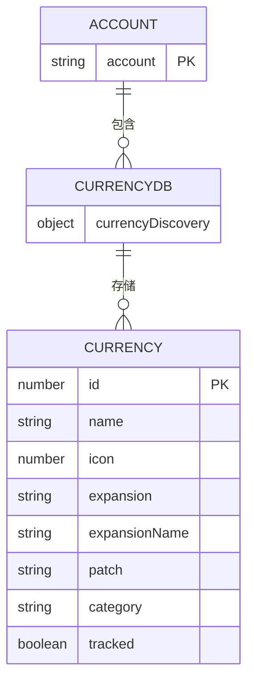
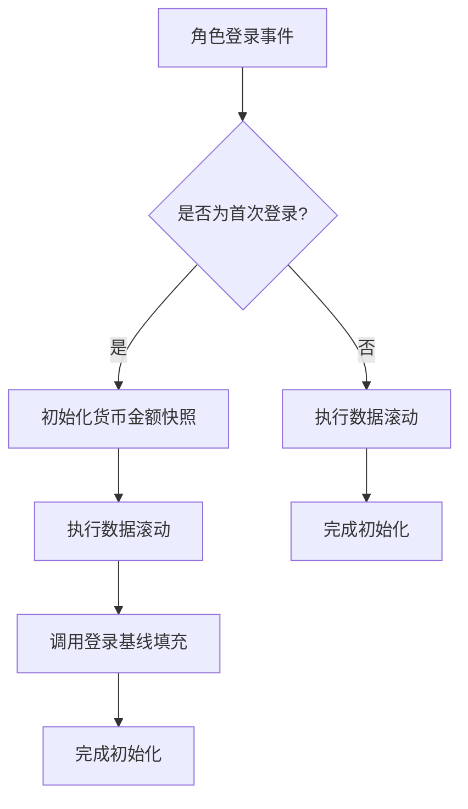
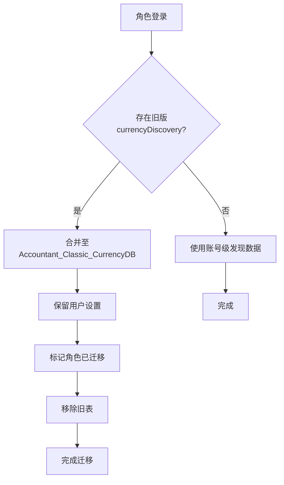

# 服务器迁移同步

<cite>
**本文档引用的文件**  
- [CurrencyStorage.lua](file://CurrencyTracker/CurrencyStorage.lua)
- [CurrencyDataManager.lua](file://CurrencyTracker/CurrencyDataManager.lua)
- [CurrencyEventHandler.lua](file://CurrencyTracker/CurrencyEventHandler.lua)
</cite>

## 目录
1. [引言](#引言)
2. [数据结构与存储机制](#数据结构与存储机制)
3. [服务器变更事件识别](#服务器变更事件识别)
4. [跨服务器数据同步流程](#跨服务器数据同步流程)
5. [数据初始化与防重复机制](#数据初始化与防重复机制)
6. [数据丢失与重复问题修复建议](#数据丢失与重复问题修复建议)
7. [最佳实践](#最佳实践)

## 引言
本文档深入探讨在《魔兽世界》经典怀旧服中，当玩家进行跨服务器角色转移后，Accountant_Classic_CurrencyDB 账号范围货币数据库的同步机制。重点分析 CurrencyStorage.lua 如何处理服务器变更事件，决定货币发现记录的保留、迁移或重建策略。文档将说明数据结构中服务器标识的存储方式，以及在新服务器环境下如何安全初始化数据以避免重复统计，并提供应对迁移导致数据丢失或重复的修复建议和最佳实践。

## 数据结构与存储机制

Accountant_Classic_CurrencyDB 是一个账号范围的全局存储结构，用于跨所有角色统一保存已发现的货币元数据。该设计旨在消除每个角色单独存储货币发现信息的冗余，确保账号内所有角色的数据一致性。

**图表来源**
- [CurrencyStorage.lua](file://CurrencyTracker/CurrencyStorage.lua#L491-L520)
- [CurrencyDataManager.lua](file://CurrencyTracker/CurrencyDataManager.lua#L1-L426)

该结构的关键优势在于：
- **账号级共享**：`currencyDiscovery` 表存储在 `_G.Accountant_Classic_CurrencyDB` 全局变量中，对账号下所有角色可见。
- **元数据统一**：包含货币ID、名称、图标、所属资料片、补丁版本、分类及用户跟踪状态等信息。
- **减少存储占用**：避免了每个角色重复存储相同的发现信息，显著减小了 SavedVariables 文件大小。

**本节来源**
- [CurrencyStorage.lua](file://CurrencyTracker/CurrencyStorage.lua#L491-L520)
- [CurrencyDataManager.lua](file://CurrencyTracker/CurrencyDataManager.lua#L1-L426)

## 服务器变更事件识别

系统通过角色登录事件（`PLAYER_LOGIN`）来识别服务器变更。`CurrencyEventHandler.lua` 模块负责监听此事件，并在 `OnPlayerLogin` 函数中触发货币跟踪的初始化流程。

**图表来源**
- [CurrencyEventHandler.lua](file://CurrencyEventHandler.lua#L380-L405)

具体识别和处理逻辑如下：
1.  **事件监听**：`CurrencyEventHandler` 模块在初始化时注册 `PLAYER_LOGIN` 事件。
2.  **登录处理**：当 `OnPlayerLogin` 被调用时，系统会：
    - 初始化用于跟踪变化的货币金额快照。
    - 执行数据滚动（`ShiftCurrencyLogs`），以确保时间周期（日、周、月）的正确性。
    - 触发登录时的基线填充流程，这是处理新服务器环境的核心步骤。

**本节来源**
- [CurrencyEventHandler.lua](file://CurrencyEventHandler.lua#L380-L405)

## 跨服务器数据同步流程

当玩家在新服务器上首次登录时，系统会自动执行一个数据迁移流程，将旧服务器的货币发现记录同步到新的账号级数据库中。此流程在 `CurrencyStorage:InitializeCurrencyStorage` 函数中实现。

**图表来源**
- [CurrencyStorage.lua](file://CurrencyTracker/CurrencyStorage.lua#L520-L560)

同步流程的详细步骤如下：
1.  **检查旧数据**：系统检查当前角色的 `currencyDiscovery` 表是否存在且未被标记为已迁移（通过 `_currencyDiscoveryMigrated` 标志位）。
2.  **合并数据**：如果存在旧数据，系统会将其与全局的 `Accountant_Classic_CurrencyDB.currencyDiscovery` 表进行浅层合并。合并时会优先保留全局表中已有的信息，并将用户设置（如 `tracked` 状态）从旧数据迁移到新结构中。
3.  **标记与清理**：成功合并后，系统会将 `charData._currencyDiscoveryMigrated` 设置为 `true`，以防止后续登录重复执行合并。随后，旧的 `currencyDiscovery` 表会被清空并删除，以释放存储空间。
4.  **初始化新结构**：无论是否执行了迁移，系统都会确保 `Accountant_Classic_CurrencyDB.currencyDiscovery` 结构存在，为未来的新货币发现做好准备。

**本节来源**
- [CurrencyStorage.lua](file://CurrencyTracker/CurrencyStorage.lua#L520-L560)

## 数据初始化与防重复机制

为了防止在新服务器环境下因数据初始化不当而导致的重复统计，系统采用了“基线填充”（Baseline Prime）机制。该机制在 `CurrencyEventHandler:PrimeDiscoveredCurrenciesOnLogin` 函数中执行。

其核心原理是：
1.  **读取实时数量**：在角色登录并进入世界后，系统会通过 `C_CurrencyInfo.GetCurrencyInfo` API 读取玩家当前持有的每种已发现货币的实际数量。
2.  **对比存储数据**：系统会查询 `Accountant_ClassicSaveData` 中该货币在 `Total` 时间段的累计净收入（`net`）。
3.  **应用基线调整**：如果实时数量与存储的净收入不一致，系统会计算差值（delta），并通过 `Storage:ApplyTotalOnlyBaselineDelta` 函数，将此差值作为一笔“基线补写”（`BaselinePrime`）记录，**仅写入 `Total` 时间段**，而不会影响 `Session`、`Day`、`Week` 等短期统计。
4.  **避免重复**：通过仅在 `Total` 段进行一次性调整，系统确保了历史累计数据的准确性，同时不会在当前会话或当天的统计中产生一笔虚假的“收入”记录，从而有效防止了数据重复。

**本节来源**
- [CurrencyEventHandler.lua](file://CurrencyEventHandler.lua#L407-L485)
- [CurrencyStorage.lua](file://CurrencyStorage.lua#L15-L40)

## 数据丢失与重复问题修复建议

尽管系统设计了完善的同步机制，但在极端情况下（如迁移过程中插件未加载）仍可能出现数据丢失或重复。以下是修复建议：

### 修复数据丢失
1.  **手动重新发现**：如果发现货币未被正确记录，可以手动触发一次该货币的获取或消耗，系统会自动将其重新发现并记录到 `Accountant_Classic_CurrencyDB` 中。
2.  **使用调试命令**：插件提供了 `/ct discover list` 命令来查看所有已发现的货币。如果某个货币缺失，可以使用 `/ct discover track <id>` 命令手动添加并设置其跟踪状态。

### 修复数据重复
1.  **检查基线数据**：使用 `/ct repair baseline preview` 命令预览 `Total` 段的累计数据与实时持有量的差异。如果发现 `Total` 段的累计收入远高于实际持有量，可能是重复统计所致。
2.  **手动调整**：使用 `/ct repair remove` 命令，指定货币ID、金额、来源（如 `BaselinePrime`）和类型（`income` 或 `outgoing`），从 `Total` 和所有时间段中移除错误的记录。

**本节来源**
- [CurrencyCore.lua](file://CurrencyCore.lua#L1000-L1150)
- [CurrencyStorage.lua](file://CurrencyStorage.lua#L150-L180)

## 最佳实践
1.  **确保插件加载**：在进行角色转移后，首次登录新服务器时，务必确保 Accountant_Classic 插件已正确加载，以保证自动迁移流程能够执行。
2.  **避免手动修改**：不要直接编辑 `SavedVariables` 文件，以免破坏数据结构。所有数据修复应通过插件提供的命令行接口进行。
3.  **定期检查**：使用 `/ct status` 命令检查插件的运行状态，确保其正常工作。
4.  **理解数据结构**：了解 `Accountant_Classic_CurrencyDB` 是账号级共享的，而 `Accountant_ClassicSaveData` 是按服务器和角色存储的，有助于理解数据同步的逻辑。