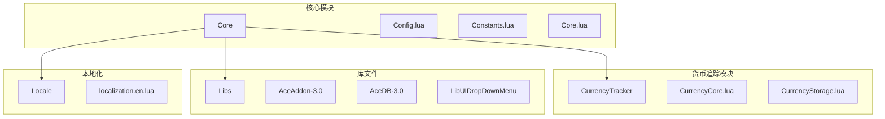
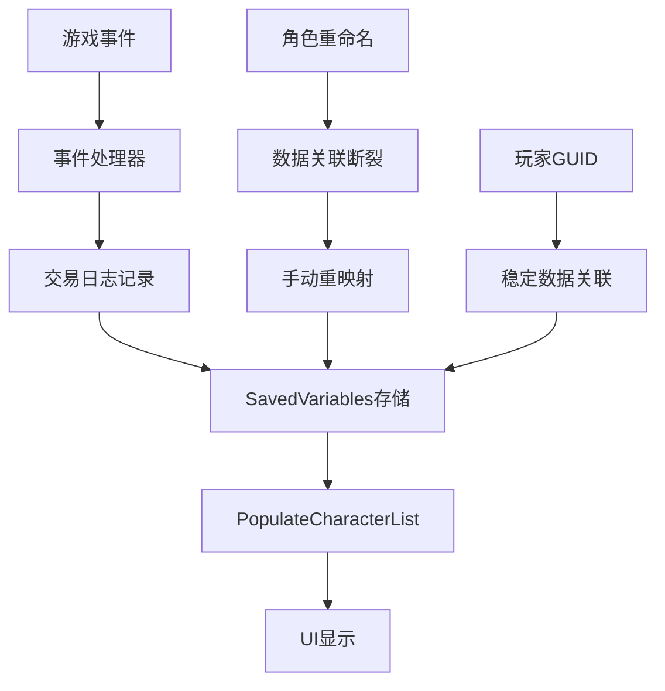
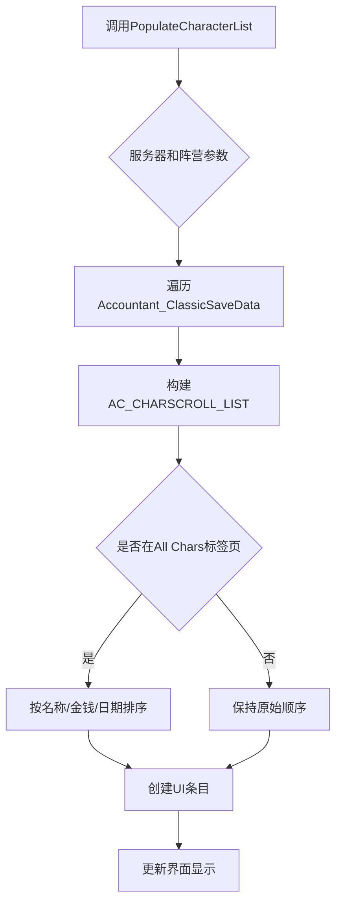
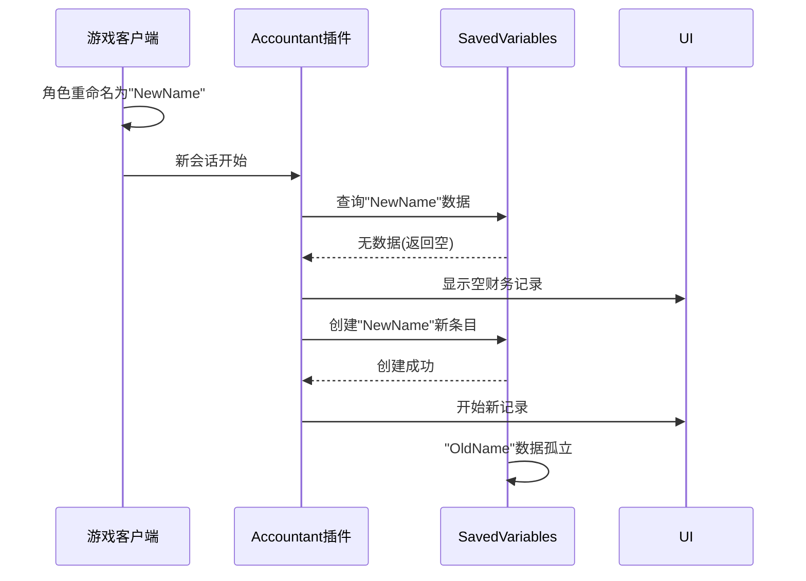
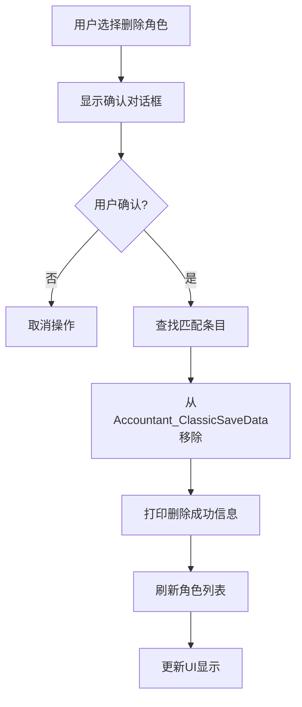
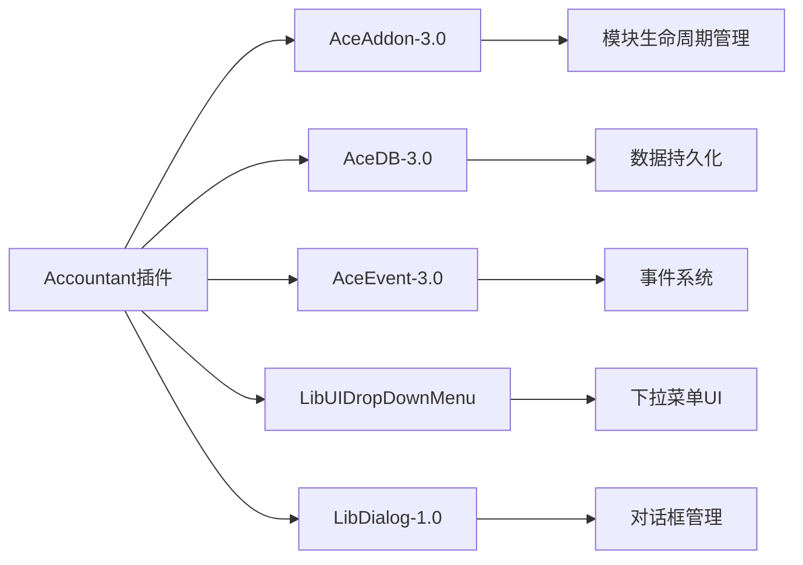
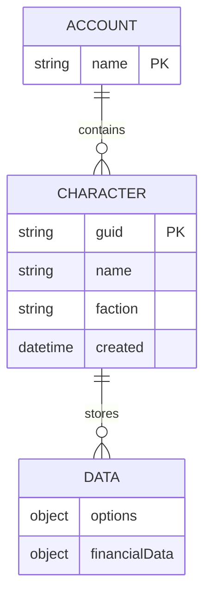

# 角色同步问题

<cite>
**本文档中引用的文件**  
- [Core.lua](file://Core/Core.lua)
- [Config.lua](file://Core/Config.lua)
- [Constants.lua](file://Core/Constants.lua)
- [CurrencyStorage.lua](file://CurrencyTracker/CurrencyStorage.lua)
</cite>

## 目录
1. [简介](#简介)
2. [项目结构](#项目结构)
3. [核心组件](#核心组件)
4. [架构概述](#架构概述)
5. [详细组件分析](#详细组件分析)
6. [依赖分析](#依赖分析)
7. [性能考虑](#性能考虑)
8. [故障排除指南](#故障排除指南)
9. [结论](#结论)
10. [附录](#附录)（如有必要）

## 简介
本文档详细分析了在角色重命名或删除后，金币和货币数据的同步问题。重点解释了`Core.lua`中的`PopulateCharacterList`函数如何从`SavedVariables`中读取并更新角色列表，以及当角色名称变更导致旧数据无法正确关联时的处理逻辑。文档提供了实际代码示例说明数据映射断裂的场景，并给出了开发者和用户层面的解决方案，包括手动重映射和自动匹配策略。最后探讨了如何通过玩家GUID或角色创建时间戳增强数据关联稳定性。

## 项目结构
项目结构遵循典型的魔兽世界插件组织方式，主要分为核心功能、货币追踪、库文件和本地化文件四个部分。核心功能位于`Core`目录下，包含主逻辑文件`Core.lua`、配置管理`Config.lua`和常量定义`Constants.lua`。货币追踪功能独立在`CurrencyTracker`目录中，实现了专门的货币数据管理。`Libs`目录包含Ace3框架库，提供模块化、配置和事件处理等基础功能。这种分层结构确保了功能的模块化和可维护性。

**图表来源**
- [Core.lua](file://Core/Core.lua#L1-L50)
- [Constants.lua](file://Core/Constants.lua#L1-L20)

## 核心组件
核心组件围绕`Accountant_ClassicSaveData`数据结构展开，该结构以服务器和角色为层级组织财务数据。`PopulateCharacterList`函数负责从保存变量中读取角色列表并进行排序显示。当角色重命名时，由于数据存储依赖角色名称作为键，会导致旧数据无法与新名称关联，形成数据孤岛。系统通过`CharacterRemovalProceed`函数处理角色删除，直接从数据结构中移除对应条目。

**章节来源**
- [Core.lua](file://Core/Core.lua#L1739-L1798)
- [Config.lua](file://Core/Config.lua#L71-L107)

## 架构概述
系统采用分层架构设计，上层为UI展示和用户交互，中层为业务逻辑处理，底层为数据存储和持久化。数据流从游戏事件触发开始，经过事件处理器分类，记录到`Accountant_ClassicSaveData`结构中，最终反映在UI界面上。对于角色重命名问题，架构缺乏自动关联机制，需要用户手动干预或通过唯一标识符重建关联。

**图表来源**
- [Core.lua](file://Core/Core.lua#L1739-L1798)
- [CurrencyStorage.lua](file://CurrencyTracker/CurrencyStorage.lua#L523-L547)

## 详细组件分析

### PopulateCharacterList 函数分析
`PopulateCharacterList`函数负责从`Accountant_ClassicSaveData`中提取角色列表，支持按服务器和阵营过滤。当角色名称变更时，函数无法自动识别新旧名称的关联，导致数据无法正确显示。排序功能虽然支持按金钱、更新时间等字段，但仍然基于角色名称进行数据查找。

**图表来源**
- [Core.lua](file://Core/Core.lua#L1739-L1798)

### 数据映射断裂场景
当角色重命名时，`Accountant_ClassicSaveData`中保留的是旧名称的数据条目，而新登录的角色使用新名称。由于系统没有建立名称变更的历史记录或唯一标识符关联，导致`PopulateCharacterList`无法找到新名称对应的数据，造成财务记录丢失的假象。

**图表来源**
- [Core.lua](file://Core/Core.lua#L262-L304)
- [Constants.lua](file://Core/Constants.lua#L20-L45)

### 角色删除处理机制
`CharacterRemovalProceed`函数处理角色数据删除，通过遍历`Accountant_ClassicSaveData`结构找到匹配的服务器和角色名称，然后直接将其从数据结构中移除。该过程不可逆，删除后数据将永久丢失，因此系统提供了确认对话框防止误操作。

**图表来源**
- [Core.lua](file://Core/Core.lua#L1932-L1980)
- [Config.lua](file://Core/Config.lua#L71-L107)

**章节来源**
- [Core.lua](file://Core/Core.lua#L1932-L1980)
- [Config.lua](file://Core/Config.lua#L71-L107)

## 依赖分析
系统主要依赖Ace3框架库进行模块化管理、事件处理和配置存储。`AceDB-3.0`负责数据持久化，`LibUIDropDownMenu`提供下拉菜单UI组件。这些库确保了插件的稳定性和兼容性，但同时也增加了代码复杂性。对于角色同步问题，当前依赖体系缺乏唯一标识符管理功能，需要扩展或集成额外的解决方案。

**图表来源**
- [Core.lua](file://Core/Core.lua#L10-L25)
- [Constants.lua](file://Core/Constants.lua#L1-L10)

**章节来源**
- [Core.lua](file://Core/Core.lua#L10-L25)
- [Constants.lua](file://Core/Constants.lua#L1-L10)

## 性能考虑
数据同步操作主要在角色登录和界面刷新时发生，对性能影响较小。`PopulateCharacterList`函数的遍历操作时间复杂度为O(n)，其中n为保存的角色数量，在正常情况下不会造成性能瓶颈。然而，频繁的角色重命名和数据迁移可能增加磁盘I/O操作，建议在后台线程中处理大规模数据迁移。

## 故障排除指南
当遇到角色重命名后数据不显示的问题时，用户应首先检查`Accountant_ClassicSaveData`中是否存在旧名称的数据条目。如果存在，可以通过导出数据、手动修改保存变量文件或使用开发者工具进行数据重映射。对于已删除角色的数据恢复，需要从备份文件中提取相关信息并重新导入。

**章节来源**
- [Core.lua](file://Core/Core.lua#L1932-L1980)
- [CurrencyStorage.lua](file://CurrencyTracker/CurrencyStorage.lua#L523-L547)

## 结论
当前系统在角色重命名或删除后的数据同步方面存在明显缺陷，主要原因是依赖角色名称作为唯一标识符。建议引入玩家GUID或角色创建时间戳作为稳定的数据关联依据，同时提供自动迁移工具帮助用户平滑过渡。此外，应增强数据备份和恢复机制，防止重要财务记录的意外丢失。

## 附录

### 解决方案建议
1. **自动匹配策略**：在角色登录时，检查是否存在同服务器、同阵营但名称不同的数据条目，通过创建时间戳或GUID进行匹配。
2. **手动重映射功能**：在配置界面添加"数据重映射"选项，允许用户手动关联新旧角色名称。
3. **唯一标识符升级**：将数据存储结构从`[服务器][角色名]`升级为`[服务器][GUID]`，并在UI层维护名称映射表。

**图表来源**
- [Core.lua](file://Core/Core.lua#L262-L304)
- [CurrencyStorage.lua](file://CurrencyTracker/CurrencyStorage.lua#L523-L547)