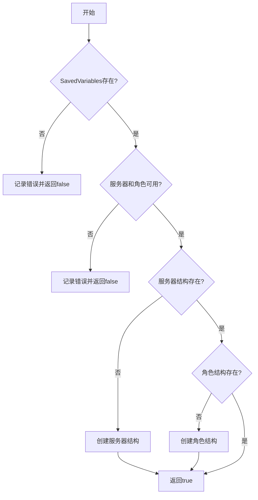
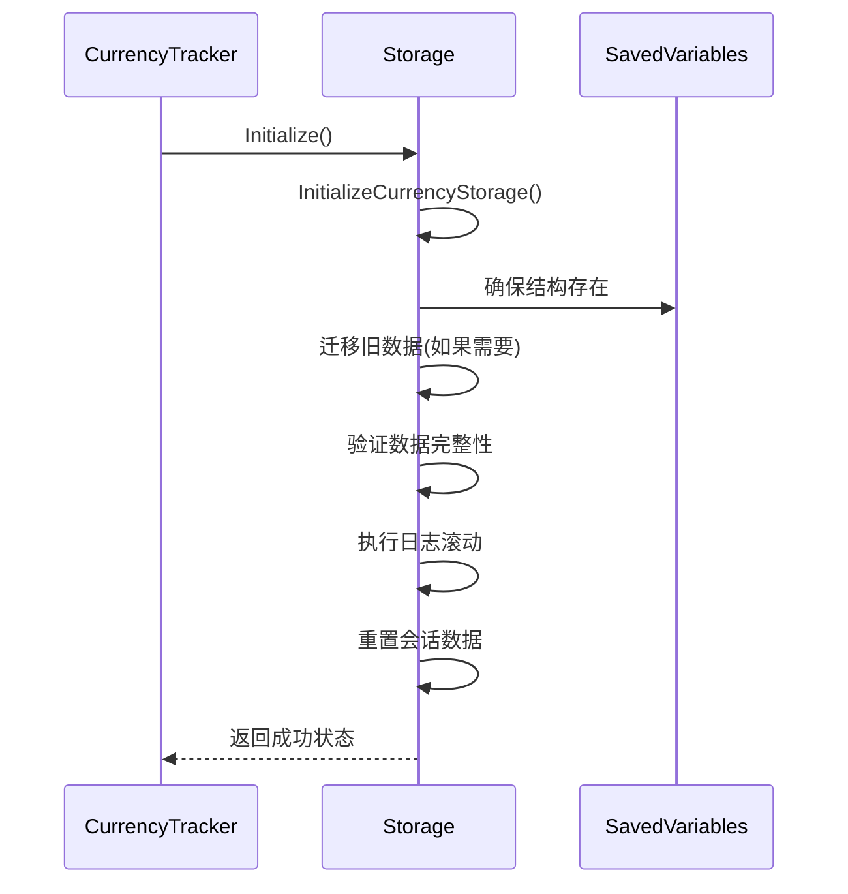
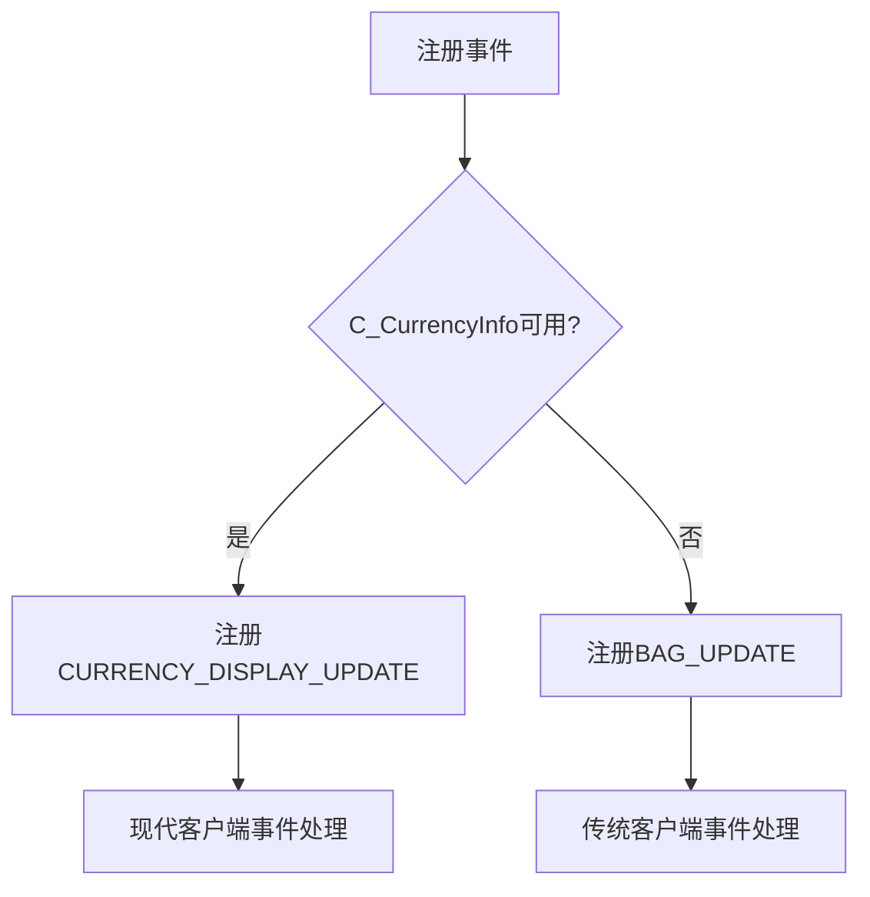
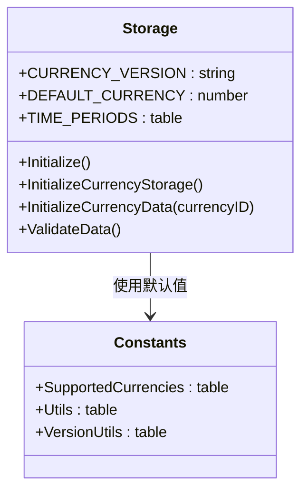
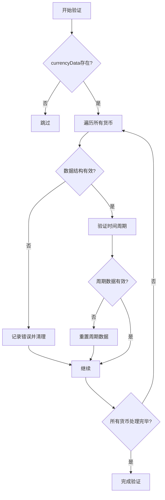
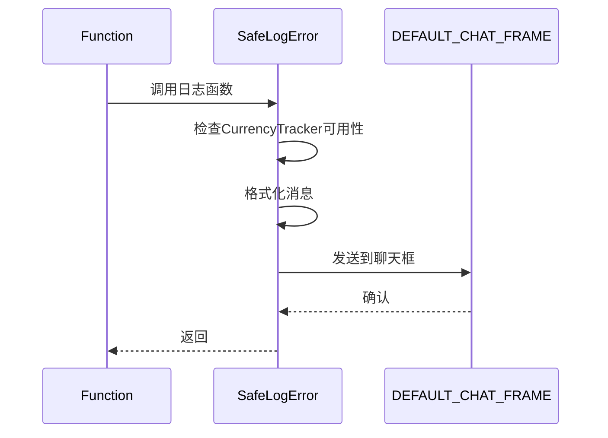
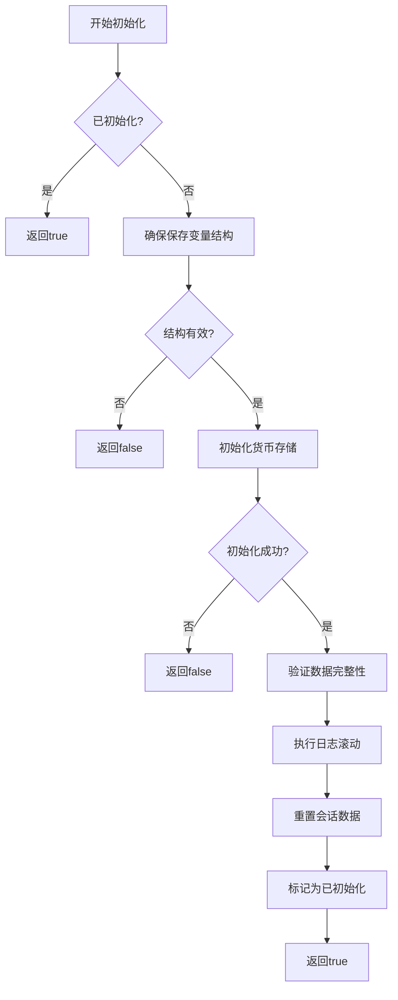
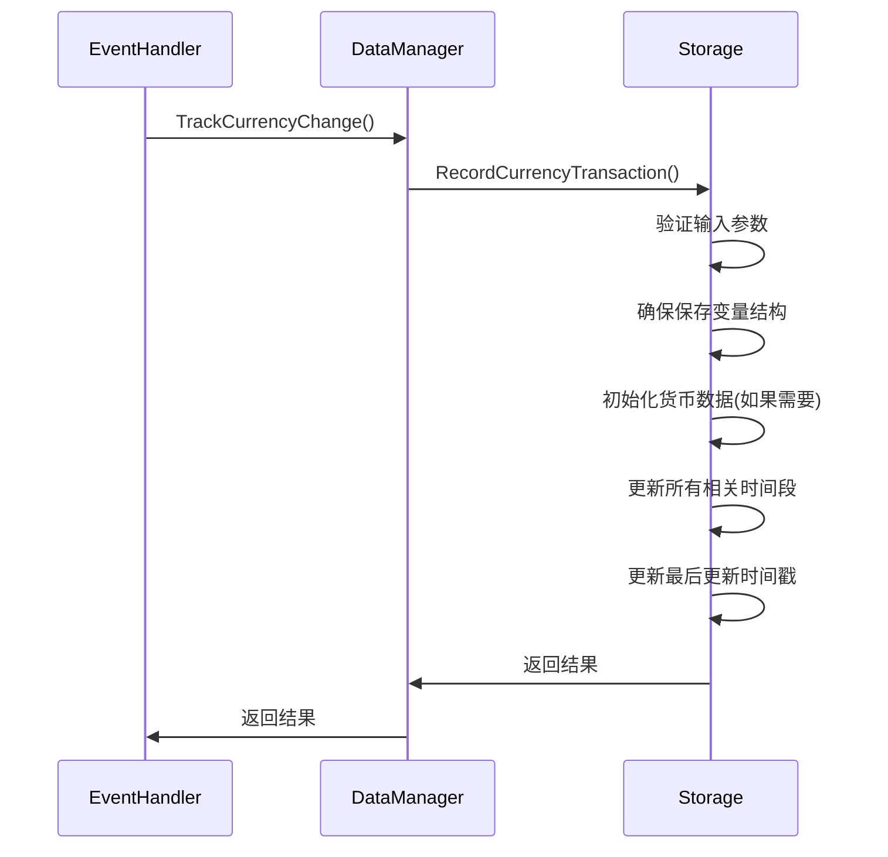
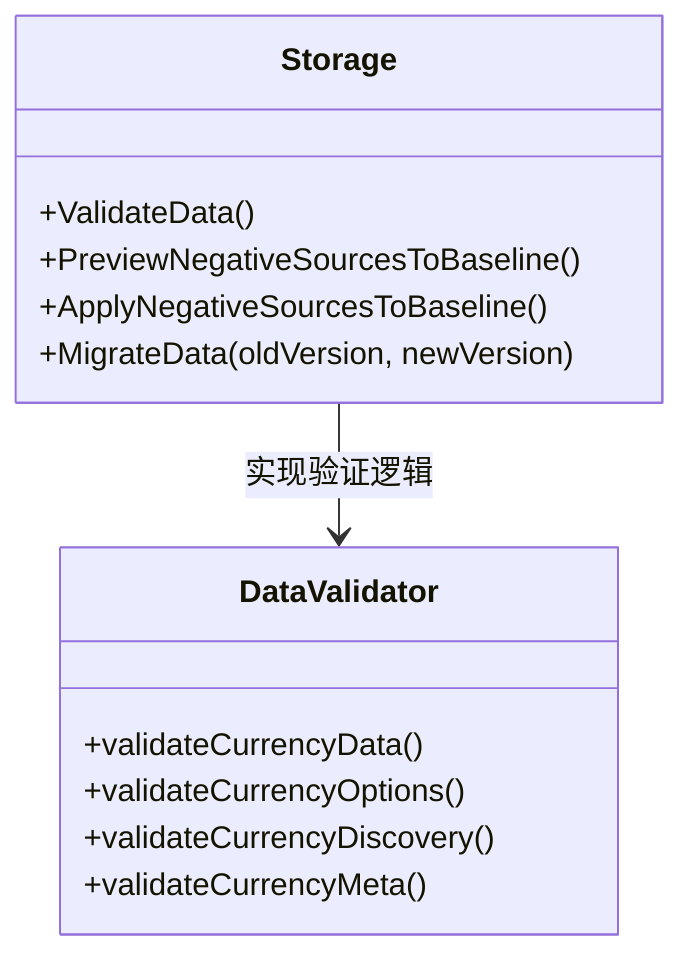

# 向后兼容性处理

<cite>
**本文档中引用的文件**
- [CurrencyStorage.lua](file://CurrencyTracker/CurrencyStorage.lua)
- [CurrencyDataManager.lua](file://CurrencyTracker/CurrencyDataManager.lua)
- [CurrencyCore.lua](file://CurrencyTracker/CurrencyCore.lua)
- [CurrencyEventHandler.lua](file://CurrencyTracker/CurrencyEventHandler.lua)
</cite>

## 目录
1. [简介](#简介)
2. [向后兼容性策略](#向后兼容性策略)
3. [数据降级处理](#数据降级处理)
4. [异常安全的数据加载流程](#异常安全的数据加载流程)
5. [结论](#结论)

## 简介
本文件详细说明了Accountant_Classic插件在数据结构升级过程中如何维持向后兼容性。文档重点介绍了通过保留旧字段、提供转换适配层和条件兼容逻辑来确保插件稳定性不受损坏数据影响的策略。结合CurrencyStorage.lua中的错误处理代码，展示了异常安全的数据加载流程。

## 向后兼容性策略

### 保留旧字段与数据结构
插件通过保留旧的数据结构和字段来确保向后兼容性。在CurrencyStorage.lua中，`EnsureSavedVariablesStructure`函数确保了保存变量结构的存在，即使在结构不完整的情况下也能安全地初始化缺失的部分。

**Diagram sources**
- [CurrencyStorage.lua](file://CurrencyTracker/CurrencyStorage.lua#L200-L230)

### 转换适配层
插件提供了多个转换适配层来处理不同版本的数据。`MigrateZeroSourceToBaselinePrime`函数将数字源键0迁移到字符串键"BaselinePrime"，这是一个外观修复，避免显示"ConvertOldItem"。

**Diagram sources**
- [CurrencyStorage.lua](file://CurrencyTracker/CurrencyStorage.lua#L150-L195)

### 条件兼容逻辑
插件实现了条件兼容逻辑来处理不同版本的客户端。在CurrencyEventHandler.lua中，事件注册逻辑根据客户端功能动态调整：

**Diagram sources**
- [CurrencyEventHandler.lua](file://CurrencyTracker/CurrencyEventHandler.lua#L300-L350)

**Section sources**
- [CurrencyStorage.lua](file://CurrencyTracker/CurrencyStorage.lua#L150-L230)
- [CurrencyEventHandler.lua](file://CurrencyTracker/CurrencyEventHandler.lua#L300-L350)

## 数据降级处理

### 默认值策略
当遇到无法解析的数据时，插件使用默认值策略来确保功能正常。在CurrencyStorage.lua中，`DEFAULT_CURRENCY`常量定义了默认货币ID：

**Diagram sources**
- [CurrencyStorage.lua](file://CurrencyTracker/CurrencyStorage.lua#L130-L140)

### 跳过异常条目
插件在处理损坏数据时会跳过异常条目，而不是让整个处理流程失败。`ValidateData`函数在CurrencyStorage.lua中实现了这一策略：

**Diagram sources**
- [CurrencyStorage.lua](file://CurrencyTracker/CurrencyStorage.lua#L850-L900)

### 记录警告日志
插件在遇到问题时会记录详细的警告日志，而不是静默失败。`SafeLogError`和`SafeLogDebug`函数确保了日志记录的安全性：

**Diagram sources**
- [CurrencyStorage.lua](file://CurrencyTracker/CurrencyStorage.lua#L10-L40)

**Section sources**
- [CurrencyStorage.lua](file://CurrencyTracker/CurrencyStorage.lua#L850-L900)

## 异常安全的数据加载流程

### 安全初始化
插件通过安全的初始化流程确保数据加载的稳定性。`Initialize`函数在CurrencyStorage.lua中实现了这一流程：

**Diagram sources**
- [CurrencyStorage.lua](file://CurrencyTracker/CurrencyStorage.lua#L150-L195)

### 错误处理机制
插件实现了全面的错误处理机制来应对各种异常情况。在CurrencyStorage.lua中，`RecordCurrencyTransaction`函数展示了这一机制：

**Diagram sources**
- [CurrencyStorage.lua](file://CurrencyTracker/CurrencyStorage.lua#L400-L450)
- [CurrencyDataManager.lua](file://CurrencyTracker/CurrencyDataManager.lua#L50-L100)
- [CurrencyEventHandler.lua](file://CurrencyTracker/CurrencyEventHandler.lua#L700-L750)

### 数据验证与修复
插件在加载数据时执行验证和修复操作。`ValidateData`函数在CurrencyStorage.lua中实现了这一功能：

**Diagram sources**
- [CurrencyStorage.lua](file://CurrencyTracker/CurrencyStorage.lua#L850-L950)

**Section sources**
- [CurrencyStorage.lua](file://CurrencyTracker/CurrencyStorage.lua#L150-L195)
- [CurrencyStorage.lua](file://CurrencyTracker/CurrencyStorage.lua#L400-L450)

## 结论
Accountant_Classic插件通过保留旧字段、提供转换适配层和条件兼容逻辑来维持向后兼容性。当遇到无法解析的损坏数据时，插件采用使用默认值、跳过异常条目或记录警告日志的降级策略。结合CurrencyStorage.lua中的错误处理代码，插件实现了异常安全的数据加载流程，确保了插件的稳定性不受损坏数据的影响。这些策略共同确保了插件在不同版本和数据状态下的可靠运行。