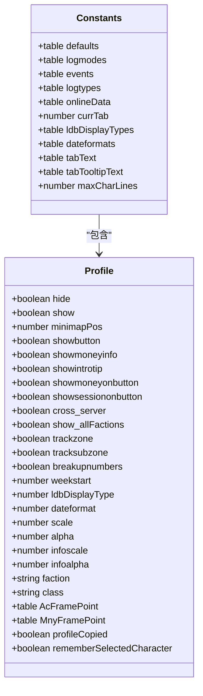
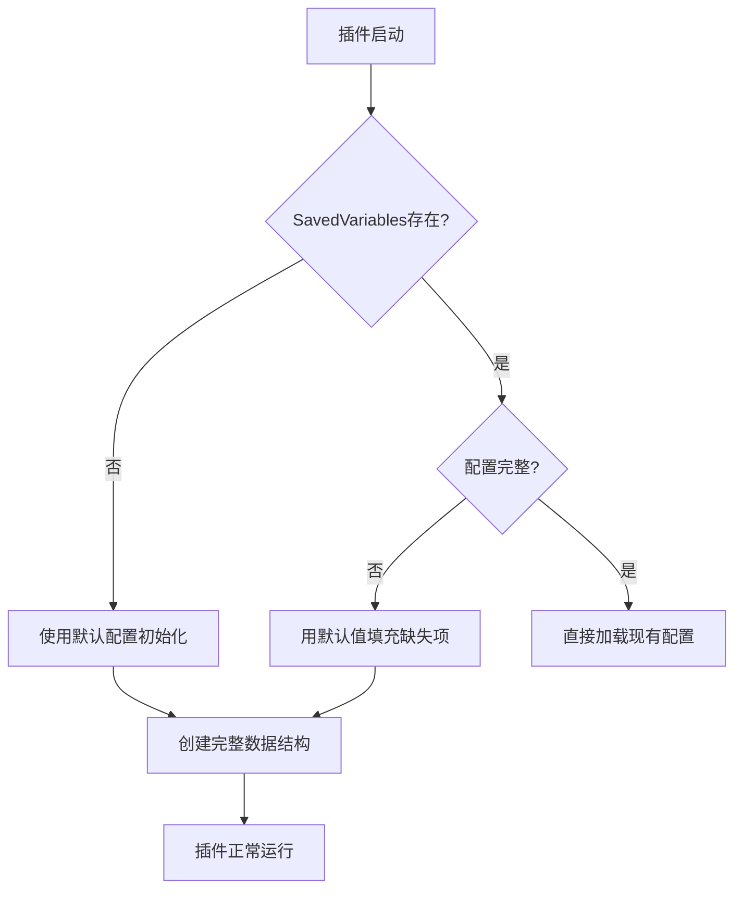
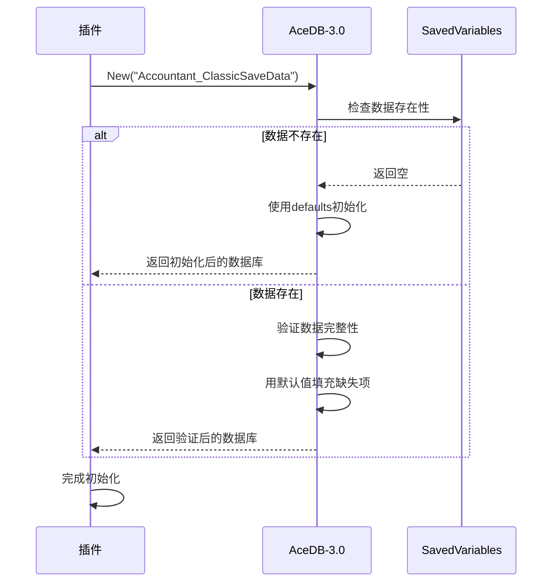

# 数据恢复机制

<cite>
**本文档中引用的文件**  
- [Constants.lua](file://Core/Constants.lua)
- [Core.lua](file://Core/Core.lua)
- [AceDB-3.0.lua](file://Libs/AceDB-3.0/AceDB-3.0.lua)
</cite>

## 目录
1. [简介](#简介)
2. [默认配置结构](#默认配置结构)
3. [数据恢复机制](#数据恢复机制)
4. [插件初始化流程](#插件初始化流程)
5. [手动重置功能](#手动重置功能)
6. [结论](#结论)

## 简介
Accountant_Classic 插件使用 AceDB-3.0 框架来管理其保存的变量，提供了一套完整的配置文件系统和数据持久化机制。当 SavedVariables 数据丢失或损坏时，插件能够通过预定义的默认配置自动重建数据结构，确保插件在首次运行或无数据状态下仍能正常工作。本文档详细解释了 Constants.lua 中定义的默认配置如何作为数据初始化和恢复的基础，以及插件如何利用 AceDB-3.0 的默认值机制实现这一功能。

**Section sources**
- [Constants.lua](file://Core/Constants.lua#L1-L260)
- [Core.lua](file://Core/Core.lua#L1-L2335)
- [AceDB-3.0.lua](file://Libs/AceDB-3.0/AceDB-3.0.lua#L1-L740)

## 默认配置结构
Constants.lua 文件中定义了插件的默认配置结构，这些配置在插件首次运行或数据丢失时作为初始化的基础。默认配置主要包含在 `constants.defaults` 表中，其核心是 `profile` 配置文件，包含了用户界面、显示选项和行为设置。

**Diagram sources**
- [Constants.lua](file://Core/Constants.lua#L1-L260)

**Section sources**
- [Constants.lua](file://Core/Constants.lua#L1-L260)

## 数据恢复机制
插件的数据恢复机制基于 AceDB-3.0 框架的默认值系统。当 SavedVariables 数据丢失或损坏时，AceDB-3.0 会自动使用 Constants.lua 中定义的默认值来重建数据结构。这一机制确保了插件在任何情况下都能以合理的默认配置启动。

AceDB-3.0 的 `copyDefaults` 函数负责将默认值复制到数据库中。当某个配置项不存在时，该函数会从默认配置中查找对应的值并进行填充。这种机制不仅适用于首次运行，也适用于插件更新后新增配置项的情况。

**Diagram sources**
- [AceDB-3.0.lua](file://Libs/AceDB-3.0/AceDB-3.0.lua#L1-L740)

**Section sources**
- [AceDB-3.0.lua](file://Libs/AceDB-3.0/AceDB-3.0.lua#L1-L740)

## 插件初始化流程
插件的初始化流程在 Core.lua 文件中实现，通过一系列步骤确保数据的正确加载和恢复。初始化过程首先检查 SavedVariables 的存在性，如果不存在则创建新的数据结构，并使用默认值进行填充。

`initOptions` 函数是初始化流程的核心，它负责检查和创建必要的数据表，确保所有配置项都存在。如果检测到是首次加载，该函数会设置相应的标志位，并初始化区域数据库。

**Diagram sources**
- [Core.lua](file://Core/Core.lua#L1-L2335)

**Section sources**
- [Core.lua](file://Core/Core.lua#L1-L2335)

## 手动重置功能
除了自动恢复机制外，插件还提供了手动重置功能，允许用户通过命令或界面操作重新初始化数据。`ResetDB` 方法是 AceDB-3.0 提供的核心重置功能，它会清除所有现有数据并使用默认值重新创建数据库。

在插件界面中，"重置"按钮调用 `AccountantClassic_ResetData()` 函数，该函数最终会触发 AceDB-3.0 的重置机制。这为用户提供了在配置严重损坏或想要恢复默认设置时的解决方案。

**Diagram sources**
- [Core.lua](file://Core/Core.lua#L1-L2335)
- [AceDB-3.0.lua](file://Libs/AceDB-3.0/AceDB-3.0.lua#L1-L740)

**Section sources**
- [Core.lua](file://Core/Core.lua#L1-L2335)

## 结论
Accountant_Classic 插件通过 AceDB-3.0 框架和精心设计的默认配置，实现了 robust 的数据恢复机制。Constants.lua 中定义的默认配置不仅为插件提供了合理的初始状态，还在数据丢失或损坏时作为重建的基础。这种机制确保了插件的稳定性和用户体验的一致性，即使在极端情况下也能正常工作。通过自动恢复和手动重置的双重保障，用户可以放心使用插件而无需担心数据问题。