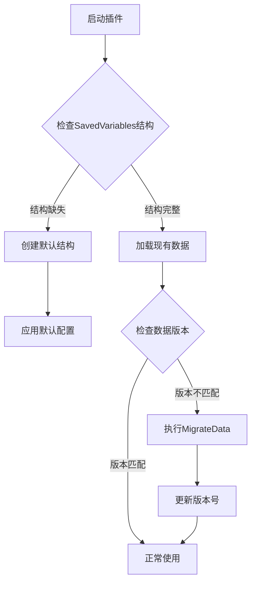

# 数据损坏与恢复机制

<cite>
**本文档引用的文件**
- [Constants.lua](file://Core/Constants.lua)
- [CurrencyStorage.lua](file://CurrencyTracker/CurrencyStorage.lua)
</cite>

## 目录
1. [简介](#简介)
2. [默认数据结构与恢复机制](#默认数据结构与恢复机制)
3. [数据版本控制与迁移](#数据版本控制与迁移)
4. [异常处理与降级策略](#异常处理与降级策略)
5. [总结](#总结)

## 简介
本文件详细说明Accountant_Classic插件中数据损坏与恢复的机制。重点分析Constants.lua中定义的默认数据结构如何在SavedVariables丢失或损坏时作为恢复基础，以及CurrencyStorage.lua中的数据版本控制和迁移机制。文档涵盖数据初始化、版本迁移、异常处理等关键方面，确保用户数据的完整性和向后兼容性。

## 默认数据结构与恢复机制

Constants.lua文件中定义了插件的默认配置数据结构，这些数据在SavedVariables丢失或损坏时作为恢复的基础。当用户首次安装插件或配置数据损坏时，系统会使用这些默认值进行初始化。

`constants.defaults.profile`结构包含了用户配置的完整默认值集合，包括界面显示选项、位置设置、缩放比例等。这些默认值确保了插件在任何情况下都能以合理配置启动，避免因数据缺失导致的功能失效。

当SavedVariables结构不存在或损坏时，EnsureSavedVariablesStructure函数会重建基本结构，确保服务器和角色层级的数据容器存在。这一机制保证了即使在极端情况下，插件也能恢复基本功能。

**Section sources**
- [Constants.lua](file://Core/Constants.lua#L30-L229)
- [CurrencyStorage.lua](file://CurrencyTracker/CurrencyStorage.lua#L430-L460)

## 数据版本控制与迁移

CurrencyStorage.lua实现了完整的数据版本控制和迁移机制，确保不同版本间的数据结构变更能够平滑过渡。系统使用CURRENCY_VERSION常量（当前为"3.00.00"）来标识数据结构的版本。

当检测到旧版本数据时，InitializeCurrencyStorage函数会触发MigrateData函数进行数据迁移。虽然当前版本的MigrateData实现较为简单，但其框架为未来复杂的数据结构变更提供了基础。

数据迁移的关键步骤包括：
1. 检查currencyOptions.version与当前CURRENCY_VERSION是否匹配
2. 如果不匹配，调用MigrateData函数进行版本迁移
3. 更新version字段为当前版本号

此外，系统还实现了多种数据修复功能，如MigrateZeroSourceToBaselinePrime函数将数值源键0迁移到字符串键"BaselinePrime"，确保数据的一致性和可读性。

**Diagram sources**
- [CurrencyStorage.lua](file://CurrencyTracker/CurrencyStorage.lua#L560-L610)
- [CurrencyStorage.lua](file://CurrencyTracker/CurrencyStorage.lua#L803-L810)

**Section sources**
- [CurrencyStorage.lua](file://CurrencyTracker/CurrencyStorage.lua#L400-L599)
- [CurrencyStorage.lua](file://CurrencyTracker/CurrencyStorage.lua#L803-L810)

## 异常处理与降级策略

系统实现了多层次的异常处理和数据验证机制，确保在遇到无法解析的数据时能够优雅降级而非完全失效。

ValidateData函数执行全面的数据完整性检查：
- 验证currencyData结构的类型正确性
- 确保各时间段数据为有效表格
- 修复currencyOptions中的异常值（如将非数字的selectedCurrency重置为默认值）
- 清理损坏的currencyDiscovery和currencyMeta结构

当检测到无效数据时，系统会记录错误日志并尝试修复，而不是抛出异常导致插件崩溃。例如，对于无效的货币数据结构，系统会直接将其设为nil，让后续操作重新初始化。

对于极端情况，系统提供了ResetAllData函数，可以将所有货币数据重置为初始状态，作为最后的恢复手段。此功能既可用于用户主动请求重置，也可在检测到严重数据损坏时自动触发。

**Section sources**
- [CurrencyStorage.lua](file://CurrencyTracker/CurrencyStorage.lua#L815-L865)
- [CurrencyStorage.lua](file://CurrencyTracker/CurrencyStorage.lua#L1109-L1128)

## 总结
Accountant_Classic插件通过精心设计的默认数据结构、版本控制机制和异常处理策略，确保了用户数据的持久性和可靠性。Constants.lua提供的默认配置作为恢复基础，CurrencyStorage.lua实现的版本迁移和数据验证机制保证了跨版本升级的平滑性。多层次的异常处理策略确保了即使在数据损坏的情况下，插件也能以降级模式继续运行，最大限度地保护用户数据。