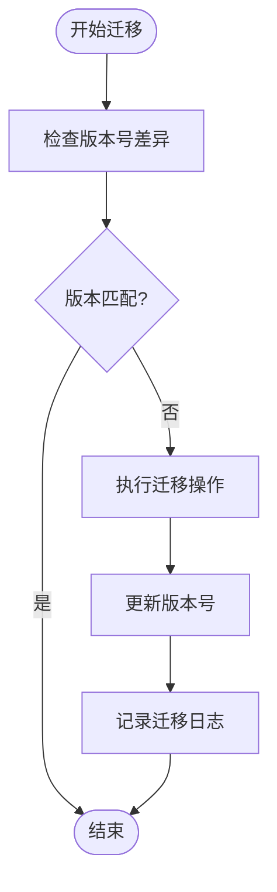
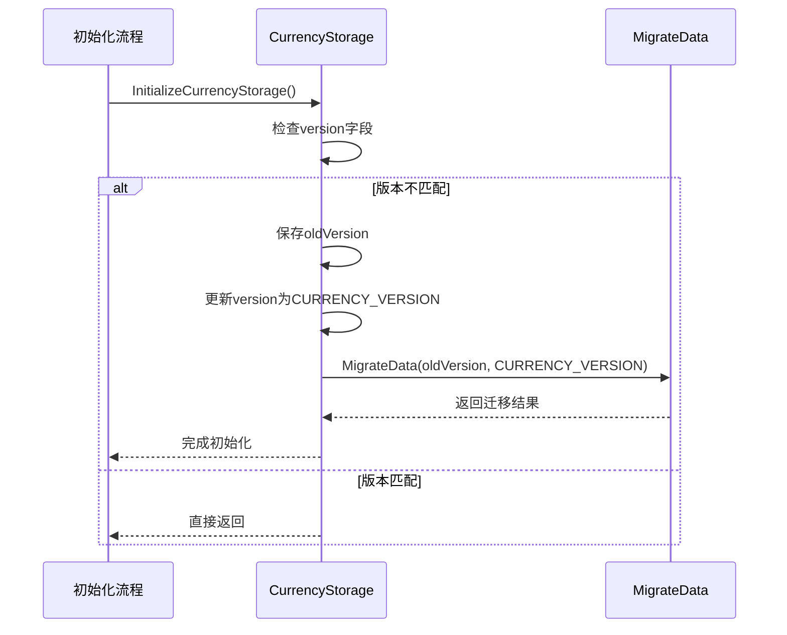
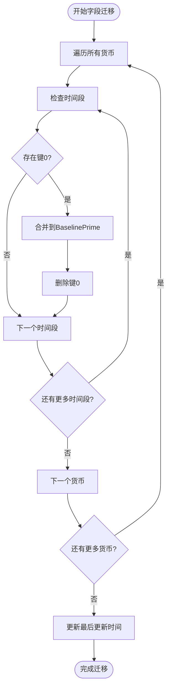

# 数据版本迁移

<cite>
**本文档引用的文件**   
- [CurrencyStorage.lua](file://CurrencyTracker/CurrencyStorage.lua)
</cite>

## 目录
1. [引言](#引言)
2. [核心组件分析](#核心组件分析)
3. [数据迁移流程](#数据迁移流程)
4. [版本管理策略](#版本管理策略)
5. [字段映射与数据重组](#字段映射与数据重组)
6. [增量迁移性能优化](#增量迁移性能优化)
7. [结论](#结论)

## 引言
本文件深入分析Accountant_Classic插件中CurrencyStorage模块的数据迁移机制，重点解析MigrateData函数如何处理不同版本间的数据结构变更。文档将详细说明版本号管理、字段映射逻辑以及旧数据向新结构的转换流程，并阐述通过增量迁移策略降低性能开销的实现方法。

## 核心组件分析
CurrencyStorage模块负责管理货币数据的持久化存储，确保向后兼容性。该模块通过版本控制机制检测数据结构变更，并执行相应的迁移操作。核心功能包括数据初始化、版本验证、结构迁移和完整性检查。

**Section sources**
- [CurrencyStorage.lua](file://CurrencyTracker/CurrencyStorage.lua#L1-L50)

## 数据迁移流程
数据迁移流程始于CurrencyStorage模块的初始化过程。当模块检测到现有数据版本与当前版本不匹配时，自动触发MigrateData函数执行迁移操作。迁移过程首先验证SavedVariables结构的完整性，然后根据版本差异执行相应的数据转换逻辑。

迁移函数接收旧版本号和新版本号作为参数，通过比较这两个值来确定需要执行的迁移步骤。当前实现中，迁移函数主要记录版本变更日志，为未来的复杂迁移逻辑预留接口。

**Diagram sources **
- [CurrencyStorage.lua](file://CurrencyTracker/CurrencyStorage.lua#L803-L811)

**Section sources**
- [CurrencyStorage.lua](file://CurrencyTracker/CurrencyStorage.lua#L803-L811)

## 版本管理策略
系统采用语义化版本控制策略，当前版本号定义为"3.00.00"。版本信息存储在currencyOptions.version字段中，作为数据结构完整性的关键标识。版本检查在InitializeCurrencyStorage函数中执行，确保每次初始化时都能检测到版本变更。

当检测到版本不匹配时，系统首先保存旧版本号，然后将version字段更新为当前版本号，最后调用MigrateData函数执行具体的迁移逻辑。这种策略确保了迁移操作的幂等性，避免重复执行相同的迁移步骤。

**Diagram sources **
- [CurrencyStorage.lua](file://CurrencyTracker/CurrencyStorage.lua#L579-L585)

**Section sources**
- [CurrencyStorage.lua](file://CurrencyTracker/CurrencyStorage.lua#L420-L420)
- [CurrencyStorage.lua](file://CurrencyTracker/CurrencyStorage.lua#L579-L585)

## 字段映射与数据重组
虽然当前MigrateData函数尚未实现复杂的字段映射逻辑，但代码库中存在其他迁移函数作为参考实现。例如，MigrateZeroSourceToBaselinePrime函数展示了如何将数值源键0迁移到字符串键"BaselinePrime"。

该迁移过程遍历所有货币数据的所有时间段（包括Session、Day、Week、Month、Year、Total等），检测是否存在键为0的记录。如果发现此类记录，将其In和Out值合并到"BaselinePrime"键下，然后删除原始的数值键。这种数据重组策略确保了数据结构的一致性和可读性。

**Diagram sources **
- [CurrencyStorage.lua](file://CurrencyTracker/CurrencyStorage.lua#L92-L156)

**Section sources**
- [CurrencyStorage.lua](file://CurrencyTracker/CurrencyStorage.lua#L92-L156)

## 增量迁移性能优化
系统采用增量迁移策略来降低性能开销。迁移操作仅在版本变更时执行一次，避免了每次启动时重复处理相同的数据。通过将迁移逻辑与初始化流程分离，确保了核心功能的稳定性和迁移操作的可靠性。

此外，系统在执行迁移前会先确保SavedVariables结构的完整性，防止在不完整的数据结构上执行迁移操作。迁移完成后，系统会更新lastUpdate时间戳，标记维护操作的完成。这种设计模式既保证了数据一致性，又最大限度地减少了对正常操作的影响。

**Section sources**
- [CurrencyStorage.lua](file://CurrencyTracker/CurrencyStorage.lua#L157-L158)
- [CurrencyStorage.lua](file://CurrencyTracker/CurrencyStorage.lua#L568-L572)

## 结论
CurrencyStorage模块的MigrateData函数采用简洁而有效的版本管理策略，为未来的数据结构演进提供了坚实的基础。虽然当前实现主要侧重于版本跟踪，但其设计模式支持复杂的迁移逻辑扩展。通过增量迁移和幂等性设计，系统能够在保证数据完整性的同时，最小化对性能的影响。