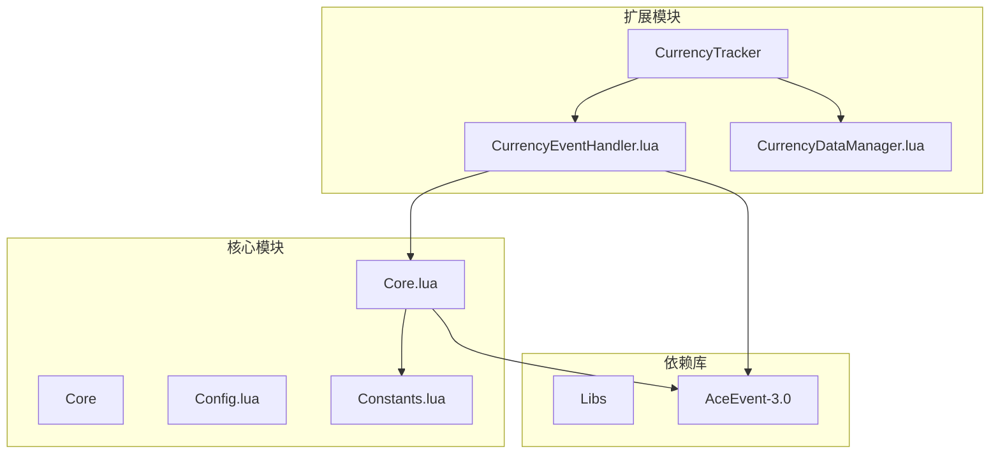
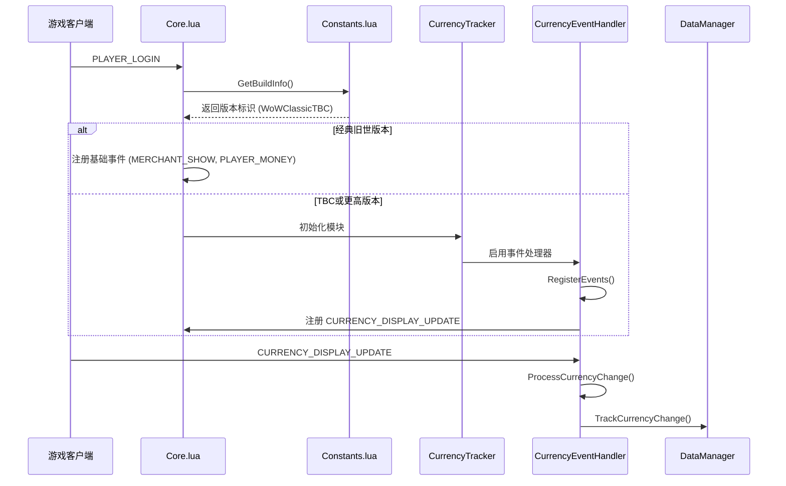
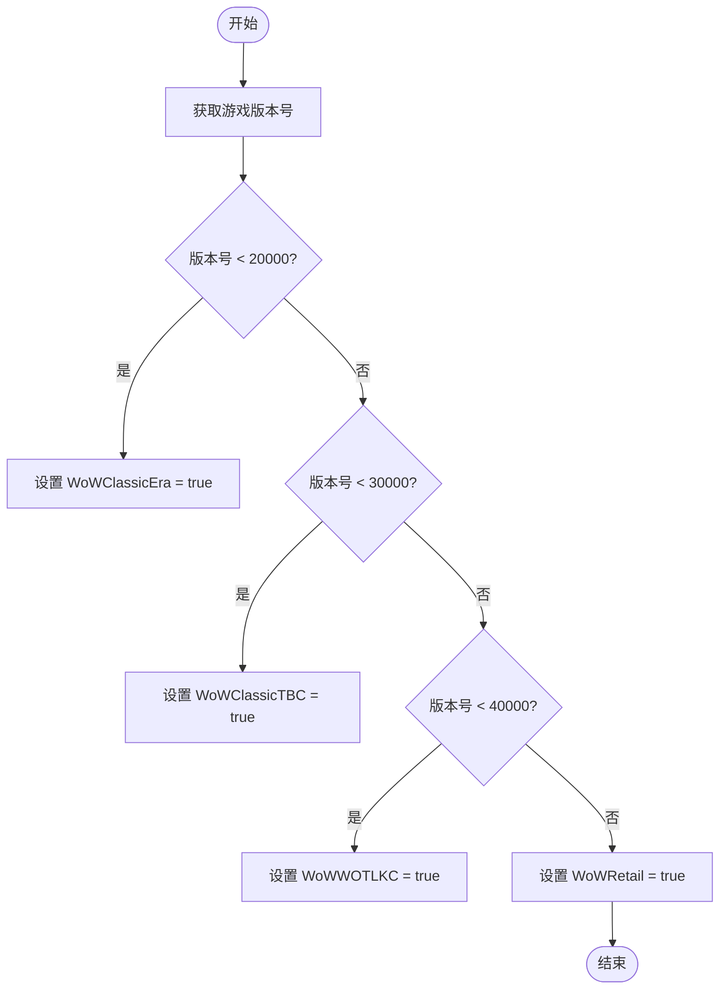
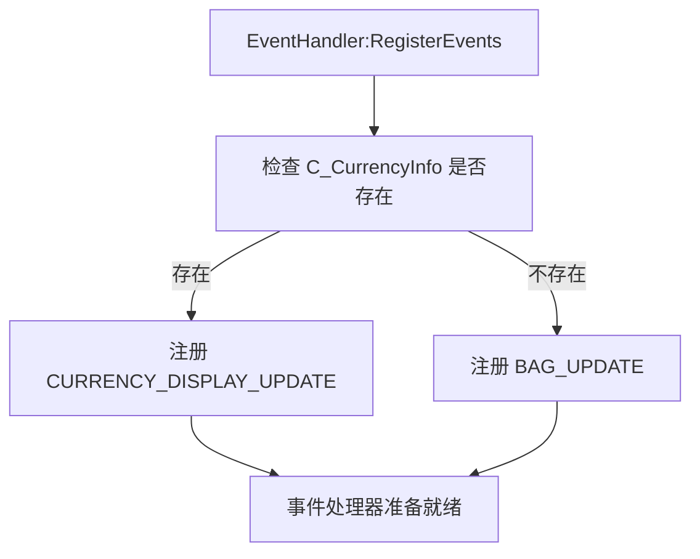
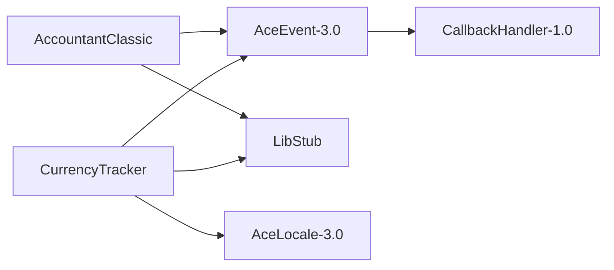

# 功能适配策略

<cite>
**本文档引用的文件**   
- [Constants.lua](file://Core/Constants.lua)
- [Core.lua](file://Core/Core.lua)
- [CurrencyEventHandler.lua](file://CurrencyTracker/CurrencyEventHandler.lua)
- [CurrencyCore.lua](file://CurrencyTracker/CurrencyCore.lua)
- [AceEvent-3.0.lua](file://Libs/AceEvent-3.0/AceEvent-3.0.lua)
</cite>

## 目录
1. [简介](#简介)
2. [项目结构](#项目结构)
3. [核心组件](#核心组件)
4. [架构概述](#架构概述)
5. [详细组件分析](#详细组件分析)
6. [依赖分析](#依赖分析)
7. [性能考虑](#性能考虑)
8. [故障排除指南](#故障排除指南)
9. [结论](#结论)
10. [附录](#附录)（如有必要）

## 简介
本文档阐述了Accountant_Classic插件如何基于`Constants.lua`提供的版本标识，动态注册或替换事件监听器以适配不同游戏版本的API差异。重点说明了通过条件判断加载模块的功能开关设计模式，以及如何利用AceEvent-3.0的松耦合特性实现运行时适配。文档将详细分析核心文件`Core.lua`和`CurrencyTracker`模块的交互，展示事件处理器的版本分支处理逻辑。

## 项目结构
Accountant_Classic插件的项目结构清晰地分为核心功能、货币追踪、库文件和本地化等模块。核心逻辑位于`Core`目录，而针对不同游戏版本的扩展功能（如货币追踪）则被封装在独立的`CurrencyTracker`模块中。这种分层设计使得功能可以按需加载，确保了代码的可维护性和对不同游戏版本的兼容性。

**图表来源**
- [Constants.lua](file://Core/Constants.lua#L1-L260)
- [Core.lua](file://Core/Core.lua#L1-L2335)
- [CurrencyEventHandler.lua](file://CurrencyTracker/CurrencyEventHandler.lua#L1-L932)

**章节来源**
- [Constants.lua](file://Core/Constants.lua#L1-L260)
- [Core.lua](file://Core/Core.lua#L1-L50)

## 核心组件
`Core.lua`是插件的主入口，负责初始化、事件注册和核心数据管理。它通过`Constants.lua`中的版本标识来决定加载哪些功能模块。`CurrencyTracker`模块则是一个独立的子系统，专门用于追踪货币变化，其内部通过`CurrencyEventHandler.lua`来处理与货币相关的事件。

**章节来源**
- [Core.lua](file://Core/Core.lua#L1-L2335)
- [CurrencyEventHandler.lua](file://CurrencyTracker/CurrencyEventHandler.lua#L1-L932)

## 架构概述
该插件采用模块化和松耦合的设计。主核心`Core.lua`通过AceEvent-3.0库与游戏事件系统交互。`CurrencyTracker`作为一个可选的扩展模块，其启用与否取决于游戏版本。当检测到支持的版本时，`CurrencyTracker`会动态注册自己的事件监听器，从而实现对新功能（如TBC版本的货币）的安全集成，而不会影响经典旧世客户端的正常运行。

**图表来源**
- [Core.lua](file://Core/Core.lua#L1447-L1646)
- [CurrencyEventHandler.lua](file://CurrencyTracker/CurrencyEventHandler.lua#L1-L932)
- [Constants.lua](file://Core/Constants.lua#L1-L260)

## 详细组件分析

### 版本适配与事件注册分析
`Core.lua`和`CurrencyTracker`模块共同实现了基于版本的功能适配。其核心在于利用`Constants.lua`中的全局布尔变量来判断当前运行的游戏版本。

#### 版本标识与条件加载
`Constants.lua`文件通过调用`GetBuildInfo()`获取游戏的构建版本号，并据此设置全局变量`WoWClassicEra`、`WoWClassicTBC`等。这些变量作为功能开关，决定了`Core.lua`中事件列表和功能模块的加载。

**图表来源**
- [Constants.lua](file://Core/Constants.lua#L1-L260)

#### 动态事件注册机制
`CurrencyTracker`模块的`EventHandler`利用AceEvent-3.0的`RegisterEvents`方法，根据当前客户端是否支持`C_CurrencyInfo` API来动态选择注册的事件。这确保了代码的向后兼容性。

**图表来源**
- [CurrencyEventHandler.lua](file://CurrencyTracker/CurrencyEventHandler.lua#L1-L932)

**章节来源**
- [CurrencyEventHandler.lua](file://CurrencyTracker/CurrencyEventHandler.lua#L1-L932)

### 核心事件处理流程
`Core.lua`中的`AccountantClassic_OnEvent`函数是处理所有游戏事件的中心。它通过一个长的`if-elseif`链来判断事件类型，并设置相应的日志类型`AC_LOGTYPE`。对于`PLAYER_MONEY`和`CHAT_MSG_MONEY`事件，它实现了“基线初始化”（Priming Approach），以避免将角色的初始金币余额错误地记录为收入。

**章节来源**
- [Core.lua](file://Core/Core.lua#L1447-L1646)

## 依赖分析
该插件依赖于一系列外部库，其中`AceEvent-3.0`是实现事件驱动架构的关键。`CallbackHandler-1.0`为`AceEvent-3.0`提供了底层支持，实现了事件的注册、分发和注销。`LibStub`用于管理这些库的版本。`CurrencyTracker`模块还依赖于`AceLocale-3.0`进行本地化。

**图表来源**
- [AceEvent-3.0.lua](file://Libs/AceEvent-3.0/AceEvent-3.0.lua#L1-L127)
- [CurrencyCore.lua](file://CurrencyTracker/CurrencyCore.lua#L1-L1414)

**章节来源**
- [AceEvent-3.0.lua](file://Libs/AceEvent-3.0/AceEvent-3.0.lua#L1-L127)

## 性能考虑
插件在处理事件时考虑了性能优化。例如，`CurrencyEventHandler`在战斗中会将事件加入批处理队列，待战斗结束后再统一处理，以避免在高负载时影响游戏性能。此外，通过条件判断仅在支持的版本上加载`CurrencyTracker`模块，也减少了经典旧世客户端的内存和CPU开销。

## 故障排除指南
如果货币追踪功能未正常工作，请首先检查游戏版本。该功能仅在TBC及更高版本中可用。其次，确认`CurrencyTracker`模块已正确加载。可以通过在聊天框输入`/ct debug on`来开启调试模式，查看事件注册和处理的日志。

**章节来源**
- [CurrencyEventHandler.lua](file://CurrencyTracker/CurrencyEventHandler.lua#L1-L932)
- [CurrencyCore.lua](file://CurrencyTracker/CurrencyCore.lua#L1-L1414)

## 结论
Accountant_Classic插件通过`Constants.lua`进行版本检测，并结合条件加载和AceEvent-3.0的松耦合事件系统，成功实现了对不同游戏版本的适配。`CurrencyTracker`模块的设计是一个典范，它通过动态注册`CURRENCY_DISPLAY_UPDATE`或`BAG_UPDATE`事件，安全地集成了新版本的功能，同时保证了在旧版本客户端上的稳定运行。这种设计模式值得在开发跨版本插件时借鉴。