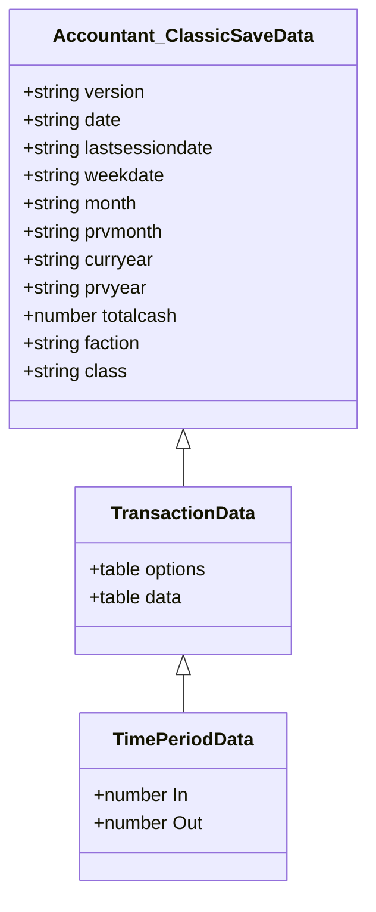
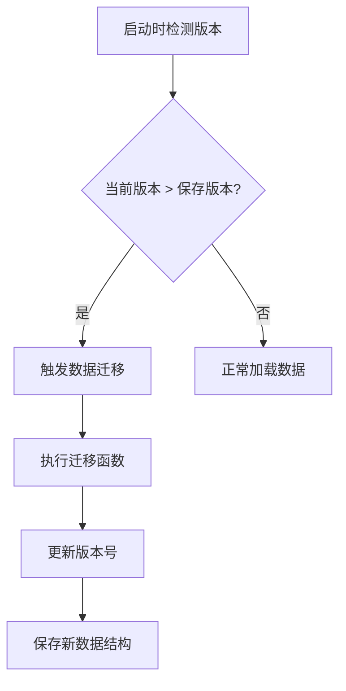
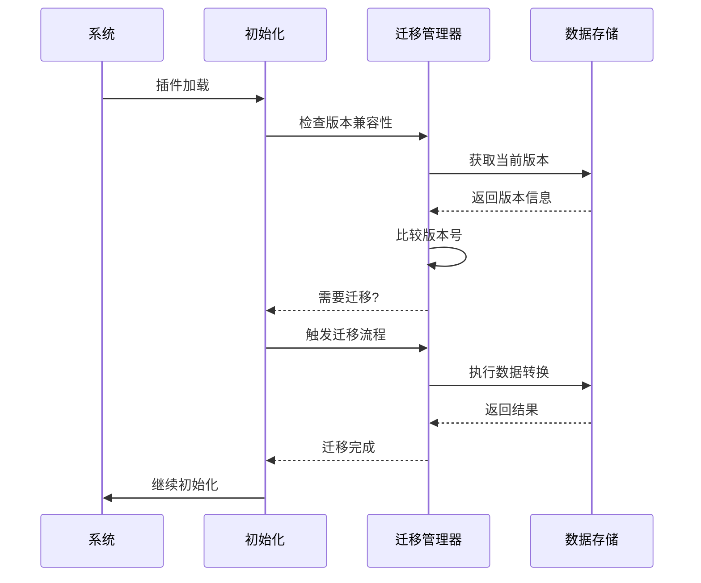
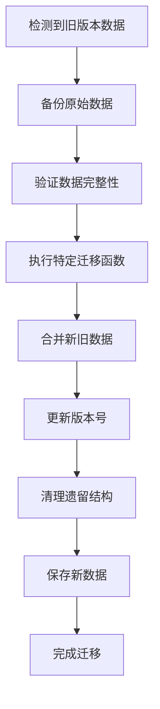
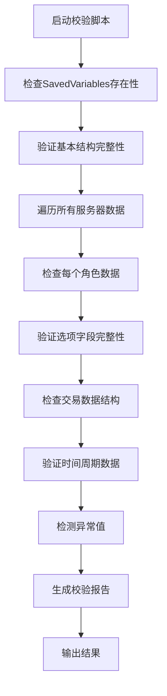
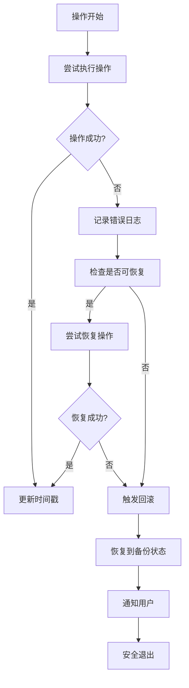

# 升级与数据迁移策略

<cite>
**本文档引用的文件**  
- [Core.lua](file://Core/Core.lua)
- [Constants.lua](file://Core/Constants.lua)
- [CurrencyStorage.lua](file://CurrencyTracker/CurrencyStorage.lua)
- [CurrencyDataManager.lua](file://CurrencyTracker/CurrencyDataManager.lua)
</cite>

## 目录
1. [简介](#简介)
2. [数据结构与版本管理](#数据结构与版本管理)
3. [向后兼容的数据升级路径](#向后兼容的数据升级路径)
4. [重大补丁发布前后的最佳实践](#重大补丁发布前后的最佳实践)
5. [自动化校验脚本设计思路](#自动化校验脚本设计思路)
6. [错误处理与回滚机制](#错误处理与回滚机制)
7. [总结](#总结)

## 简介
本文档详细说明当插件版本更新引入新的数据结构（如SaveData格式变更）时，如何在Core.lua中实现向后兼容的数据升级路径。重点描述版本号比对机制、数据迁移函数的触发条件（如OnInitialize中检测旧版本数据）、迁移过程中的错误处理与回滚建议。同时强调在重大游戏补丁发布前后，提醒用户备份Accountant_ClassicSaveData.lua文件的最佳实践，并提供自动化校验脚本的设计思路。

## 数据结构与版本管理

### Accountant_ClassicSaveData 结构
Accountant_ClassicSaveData 是存储角色财务记录的主要数据结构，采用分层组织方式，包含服务器、角色和交易级别数据。

#### 分层结构
数据结构按三层层次组织：
- **服务器级别**：代表领域名称的顶级键
- **角色级别**：代表角色名称的第二级键
- **数据级别**：包含选项和交易数据

```lua
Accountant_ClassicSaveData = {
  ["服务器名称"] = {
    ["角色名称"] = {
      options = { },
      data = { },
      currencyData = { },
      currencyOptions = { }
    }
  }
}
```

#### 选项结构
options 表包含角色特定的配置和元数据：

**字段定义：**
- :version: 表示保存数据时插件版本的字符串
- :date: 格式为 "dd/mm/yy" 的当前日期字符串
- :lastsessiondate: 上次会话日期的字符串
- :weekdate: 当前周开始日期的字符串
- :month: 表示当前月份的字符串 (1-12)
- :curryear: 表示当前年的字符串
- :totalcash: 角色累计的总金额数
- :faction: 表示角色阵营的字符串 (如 "Alliance", "Horde")
- :class: 表示角色职业的字符串

**数据结构来源**
- [Core.lua](file://Core/Core.lua#L100-L115)
- [Constants.lua](file://Core/Constants.lua#L20-L45)

#### 交易数据结构
data 表包含按类型和时间段分类的财务交易：



**图表来源**
- [Core.lua](file://Core/Core.lua#L1042-L1078)
- [Constants.lua](file://Core/Constants.lua#L50-L52)

## 向后兼容的数据升级路径

### 版本号比对机制
系统通过比较当前插件版本与保存数据中的版本号来确定是否需要进行数据迁移。在 CurrencyDataManager.lua 中实现了版本比较功能：



**图表来源**
- [CurrencyDataManager.lua](file://CurrencyTracker/CurrencyDataManager.lua#L221-L265)

### 数据迁移触发条件
数据迁移在 OnInitialize 阶段检测到旧版本数据时触发，主要检查以下条件：
- 检测 Accountant_ClassicSaveData 是否存在
- 验证角色数据结构完整性
- 比较 currencyOptions.version 与当前 CURRENCY_VERSION
- 检查是否存在需要迁移的遗留数据结构



**图表来源**
- [CurrencyStorage.lua](file://CurrencyTracker/CurrencyStorage.lua#L568-L617)

### 数据迁移流程
当检测到版本不匹配时，系统执行以下迁移流程：



**图表来源**
- [CurrencyStorage.lua](file://CurrencyTracker/CurrencyStorage.lua#L568-L617)

## 重大补丁发布前后的最佳实践

### 备份策略
在重大游戏补丁发布前后，强烈建议用户备份 Accountant_ClassicSaveData.lua 文件，以防止数据丢失或损坏。

**备份步骤：**
1. 关闭游戏客户端
2. 定位到 WoW 安装目录下的 WTF 文件夹
3. 找到 Accountant_ClassicSaveData.lua 文件
4. 复制文件并重命名为 Accountant_ClassicSaveData_backup_日期.lua
5. 将备份文件存放在安全位置

### 自动化备份脚本
建议创建自动化备份脚本，在每次游戏启动前自动创建备份：

```lua
-- 自动备份函数示例
function AutoBackupSaveData()
    local backupName = "Accountant_ClassicSaveData_backup_" .. date("%Y%m%d_%H%M%S") .. ".lua"
    if Accountant_ClassicSaveData then
        -- 创建深拷贝避免引用问题
        local backupData = AccountantClassic_CloneTable(Accountant_ClassicSaveData)
        -- 保存到全局变量以便序列化
        _G["Accountant_ClassicSaveData_Backup"] = backupData
        -- 提示用户备份已完成
        ACC_Print("已创建备份: " .. backupName)
    end
end
```

**代码来源**
- [Core.lua](file://Core/Core.lua#L262-L304)

## 自动化校验脚本设计思路

### 数据完整性校验
设计自动化校验脚本以确保数据完整性和一致性：



**图表来源**
- [CurrencyStorage.lua](file://CurrencyTracker/CurrencyStorage.lua#L813-L850)

### 校验脚本功能模块
自动化校验脚本应包含以下功能模块：

**核心功能：**
- :结构验证: 确保存在必要的数据结构
- :字段完整性: 检查所有必需字段是否存在
- :数据类型验证: 确保数据类型正确
- :数值范围检查: 检测异常的数值
- :版本兼容性: 验证版本号匹配
- :引用完整性: 检查内部引用一致性

**辅助功能：**
- :自动修复: 尝试修复可识别的问题
- :备份创建: 在校验前自动创建备份
- :报告生成: 输出详细的校验结果
- :用户交互: 提供修复建议和选项

### 实现示例
```lua
-- 数据校验函数框架
function Storage:ValidateData()
    if not EnsureSavedVariablesStructure() then
        return false
    end
    
    local server, character = GetCurrentServerAndCharacter()
    local charData = Accountant_ClassicSaveData[server][character]
    
    -- 验证currencyData结构
    if charData.currencyData then
        for currencyID, currencyData in pairs(charData.currencyData) do
            if type(currencyData) ~= "table" then
                SafeLogError("货币数据结构无效: %s", tostring(currencyID))
                charData.currencyData[currencyID] = nil
            else
                -- 验证时间周期
                for _, period in ipairs(TIME_PERIODS) do
                    if currencyData[period] and type(currencyData[period]) ~= "table" then
                        SafeLogError("时间周期数据无效: 货币%s, 周期%s", 
                            tostring(currencyID), period)
                        currencyData[period] = {}
                    end
                end
            end
        end
    end
    
    -- 验证currencyOptions结构
    if charData.currencyOptions then
        if type(charData.currencyOptions.selectedCurrency) ~= "number" then
            charData.currencyOptions.selectedCurrency = DEFAULT_CURRENCY
        end
        
        if type(charData.currencyOptions.trackingEnabled) ~= "boolean" then
            charData.currencyOptions.trackingEnabled = true
        end
    end
end
```

**代码来源**
- [CurrencyStorage.lua](file://CurrencyTracker/CurrencyStorage.lua#L813-L850)

## 错误处理与回滚机制

### 错误处理策略
系统采用多层次的错误处理机制确保数据安全：



**图表来源**
- [CurrencyStorage.lua](file://CurrencyTracker/CurrencyStorage.lua#L158-L190)

### 回滚建议
当数据迁移失败时，建议采取以下回滚措施：

**回滚步骤：**
1. 停止插件运行
2. 恢复之前备份的 Accountant_ClassicSaveData.lua 文件
3. 重启游戏客户端
4. 检查数据完整性
5. 联系开发者报告问题

**预防措施：**
- 在迁移前自动创建备份
- 采用增量迁移而非一次性转换
- 提供手动回滚选项
- 记录详细的迁移日志

## 总结
本文档详细阐述了 Accountant Classic 插件在版本更新时的数据迁移策略。通过版本号比对机制，在 OnInitialize 阶段检测旧版本数据并触发相应的迁移函数。系统实现了完整的错误处理与回滚机制，确保数据安全。特别强调在重大游戏补丁发布前后备份 Accountant_ClassicSaveData.lua 文件的重要性，并提供了自动化校验脚本的设计思路，帮助用户维护数据完整性。

**文档来源**
- [Core.lua](file://Core/Core.lua)
- [Constants.lua](file://Core/Constants.lua)
- [CurrencyStorage.lua](file://CurrencyTracker/CurrencyStorage.lua)
- [CurrencyDataManager.lua](file://CurrencyTracker/CurrencyDataManager.lua)