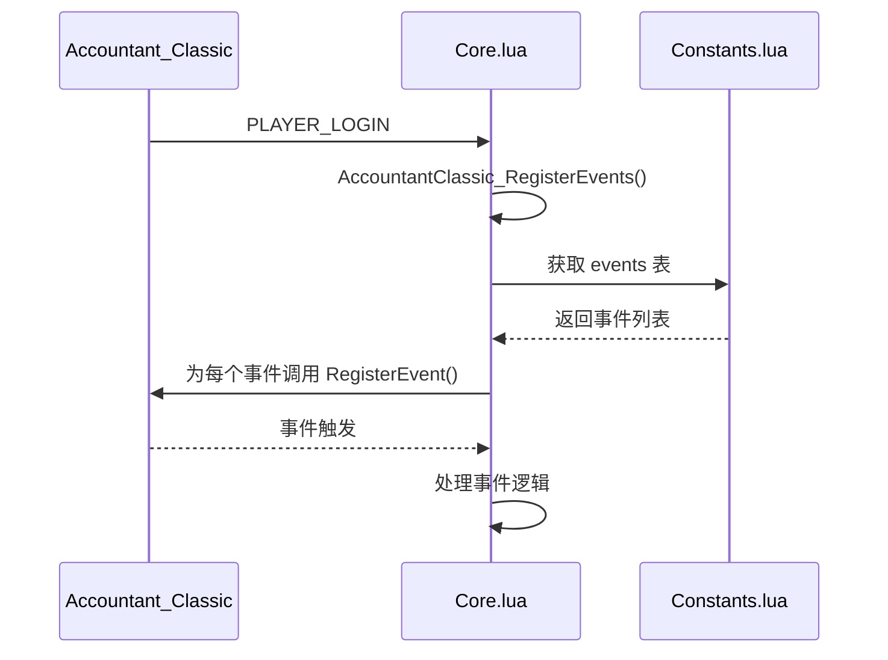
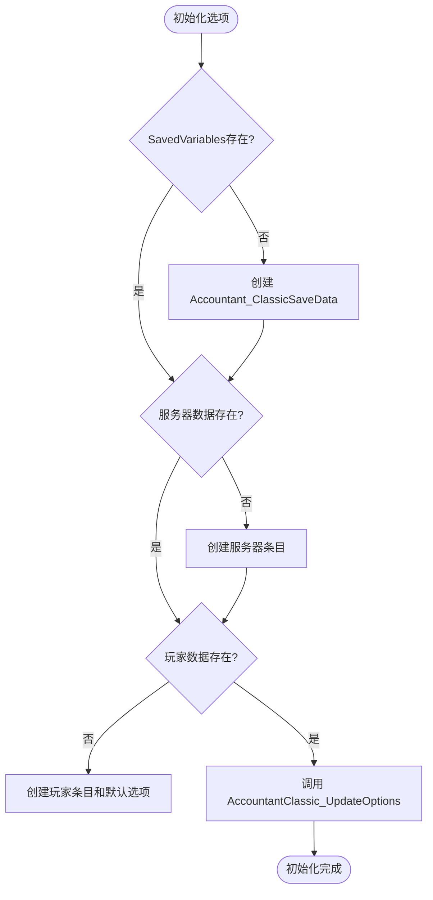

# 版本兼容性问题

<cite>
**本文档引用的文件**   
- [Constants.lua](file://Core/Constants.lua)
- [Core.lua](file://Core/Core.lua)
- [CurrencyConstants.lua](file://CurrencyTracker/CurrencyConstants.lua)
- [CurrencyDataManager.lua](file://CurrencyTracker/CurrencyDataManager.lua)
- [CurrencyStorage.lua](file://CurrencyTracker/CurrencyStorage.lua)
</cite>

## 目录
1. [简介](#简介)
2. [游戏版本检测与功能适配](#游戏版本检测与功能适配)
3. [事件注册机制的版本适应性](#事件注册机制的版本适应性)
4. [数据结构更新与兼容性问题](#数据结构更新与兼容性问题)
5. [最佳实践建议](#最佳实践建议)
6. [结论](#结论)

## 简介
本文档旨在深入分析Accountant_Classic插件如何处理不同《魔兽世界》客户端版本（如经典旧世、TBC等）的兼容性问题。核心内容包括：通过`GetBuildInfo()`检测游戏版本并调整功能启用状态的逻辑；事件注册机制如何适应不同API差异；以及当插件更新引入新数据结构时，旧版客户端加载导致的数据兼容性问题及其解决方案。最后，文档将提供在重大游戏补丁发布前后进行数据备份和验证的最佳实践建议。

## 游戏版本检测与功能适配

插件通过`GetBuildInfo()`函数获取当前游戏的构建信息，特别是版本号（wowversion），以此来判断玩家所处的游戏版本。在`Constants.lua`文件中，代码通过比较`wowversion`的数值来区分不同的游戏阶段，如经典旧世（WoWClassicEra）、燃烧的远征（WoWClassicTBC）和巫妖王之怒（WoWWOTLKC）等。

```mermaid
flowchart TD
A[调用 GetBuildInfo()] --> B{获取 wowversion}
B --> C{wowversion < 20000?}
C --> |是| D[设置为经典旧世]
C --> |否| E{wowversion < 30000?}
E --> |是| F[设置为TBC]
E --> |否| G{wowversion < 40000?}
G --> |是| H[设置为巫妖王之怒]
G --> |否| I[设置为零售版]
```

**Diagram sources**
- [Constants.lua](file://Core/Constants.lua#L15-L25)

基于检测到的游戏版本，插件会动态调整其功能。例如，在`Constants.lua`中，`constants.events`和`constants.logtypes`这两个常量会根据游戏版本的不同而包含不同的事件和日志类型。在经典旧世、TBC和巫妖王之怒版本中，插件会监听如`MERCHANT_SHOW`、`QUEST_TURNED_IN`等基础事件。而在零售版（WoWRetail）中，插件会额外监听`GARRISON_MISSION_FINISHED`、`TRANSMOGRIFY_OPEN`等新版本特有的事件。这种设计确保了插件的功能与当前游戏环境保持一致，避免了在旧版本中尝试使用不存在的API。

**Section sources**
- [Constants.lua](file://Core/Constants.lua#L15-L25)
- [Constants.lua](file://Core/Constants.lua#L40-L105)

## 事件注册机制的版本适应性

插件的事件注册机制在`Core.lua`文件中实现，其核心函数是`AccountantClassic_RegisterEvents`。该函数通过遍历`Constants.lua`中定义的`private.constants.events`表来注册所有需要监听的事件。这种设计将事件列表与注册逻辑分离，使得事件列表可以根据游戏版本动态变化，而注册逻辑保持不变。



**Diagram sources**
- [Core.lua](file://Core/Core.lua#L200-L210)
- [Constants.lua](file://Core/Constants.lua#L40-L105)

在`Core.lua`中，`GetBuildInfo()`被再次调用以确定版本，这确保了事件注册时的版本判断与常量定义时的判断逻辑完全一致。此外，`CurrencyTracker`模块也采用了类似的机制。在`CurrencyEventHandler.lua`中，事件注册会根据`C_CurrencyInfo` API的存在与否来决定注册`CURRENCY_DISPLAY_UPDATE`还是`BAG_UPDATE`事件，从而实现了对新旧客户端API差异的无缝适应。

**Section sources**
- [Core.lua](file://Core/Core.lua#L200-L210)
- [CurrencyEventHandler.lua](file://CurrencyTracker/CurrencyEventHandler.lua#L150-L180)

## 数据结构更新与兼容性问题

当插件更新并引入新的数据结构时，旧版客户端加载可能会导致兼容性问题。Accountant_Classic通过精心设计的存储结构和初始化逻辑来解决这一问题。

### 问题分析
主要问题在于`SavedVariables`（保存的变量）的结构变更。如果新版插件使用了新的数据表或字段，而旧版插件尝试读取这些不存在的字段，则可能导致数据丢失或插件崩溃。

### 解决方案
插件在`Core.lua`的`initOptions()`函数中实现了健壮的初始化和更新机制。该函数首先检查`Accountant_ClassicSaveData`是否存在，如果不存在则创建一个空表。然后，它会检查当前服务器和角色的数据是否存在，如果不存在则创建一个包含默认选项和空数据结构的新条目。



**Diagram sources**
- [Core.lua](file://Core/Core.lua#L300-L350)

`AccountantClassic_UpdateOptions`函数是解决兼容性的关键。它会遍历`AccountantClassicDefaultOptions`中的每一个键值对，如果当前玩家的选项中缺少某个键，则使用默认值进行填充。这确保了即使插件更新后添加了新的配置选项，旧版数据也能通过填充默认值来保持结构完整，从而避免了因字段缺失而导致的错误。

此外，`CurrencyStorage.lua`文件中也包含了类似的兼容性处理。`EnsureSavedVariablesStructure`函数会检查并确保所有必要的数据结构都存在，如果缺失则进行创建。`InitializeCurrencyStorage`函数则负责初始化货币相关的存储结构，包括`currencyData`和`currencyOptions`，并处理从旧版本到新版本的数据迁移。

**Section sources**
- [Core.lua](file://Core/Core.lua#L300-L350)
- [CurrencyStorage.lua](file://CurrencyTracker/CurrencyStorage.lua#L700-L750)

## 最佳实践建议

为了确保在重大游戏补丁发布前后插件数据的安全与完整，建议遵循以下最佳实践：

### 数据备份
1.  **手动备份**：在补丁发布前，手动备份`WTF`文件夹。该文件夹包含了所有角色的`SavedVariables`文件，是插件数据的直接存储位置。
2.  **自动化脚本**：可以编写简单的批处理脚本或使用文件同步工具，在每次登录游戏前自动将`SavedVariables`文件复制到一个安全的备份目录。

### 数据验证
1.  **补丁后检查**：在补丁发布并登录游戏后，立即检查插件的主要功能是否正常工作。
2.  **使用内置命令**：利用插件提供的命令（如`/ct status`）来检查模块状态，确认`isInitialized`和`isEnabled`均为`true`。
3.  **核对关键数据**：手动核对角色的金币总数等关键数据是否与补丁前的记录一致。

### 开发者建议
1.  **向后兼容**：在更新数据结构时，始终采用“添加”而非“修改”或“删除”的策略。对于旧字段，应保留其读取逻辑，即使不再使用。
2.  **版本号管理**：在`SavedVariables`中维护一个版本号（如`CURRENCY_VERSION`），并在初始化时进行版本检查。如果检测到版本不匹配，则执行相应的数据迁移脚本。
3.  **提供修复工具**：为用户提供命令行工具（如`/ct repair baseline apply`）来手动修复可能出现的数据不一致问题。

**Section sources**
- [CurrencyStorage.lua](file://CurrencyTracker/CurrencyStorage.lua#L700-L750)
- [CurrencyCore.lua](file://CurrencyTracker/CurrencyCore.lua#L500-L550)

## 结论
Accountant_Classic插件通过一套综合的策略成功解决了跨版本兼容性问题。其核心在于利用`GetBuildInfo()`进行精确的版本检测，并据此动态调整功能和事件监听。通过将配置和数据结构的初始化与更新逻辑分离，并在每次加载时强制检查和修复数据结构，插件确保了即使在重大更新后，用户数据也能得到妥善处理。对于开发者而言，遵循向后兼容、版本管理和提供修复工具的最佳实践，是维护插件长期稳定性和用户信任的关键。