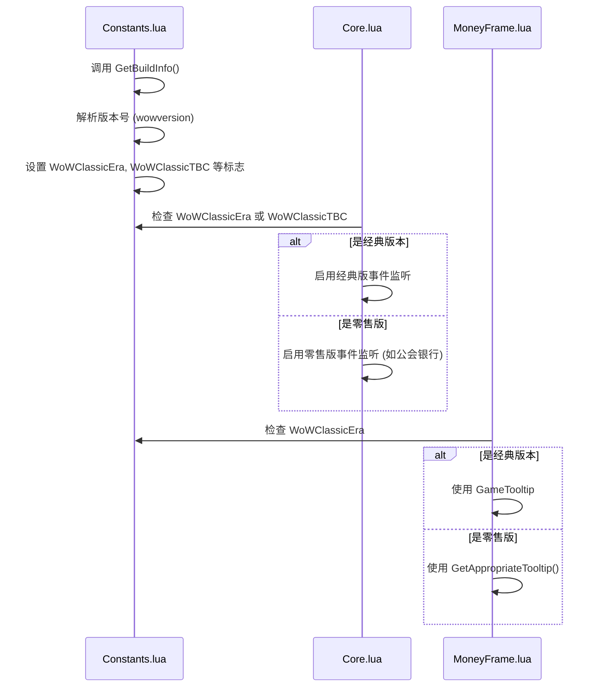
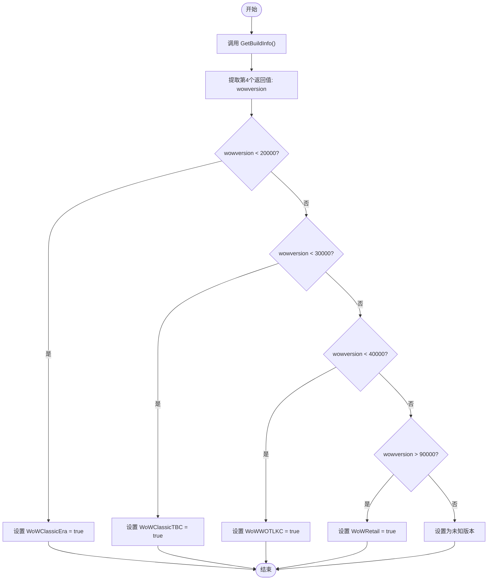
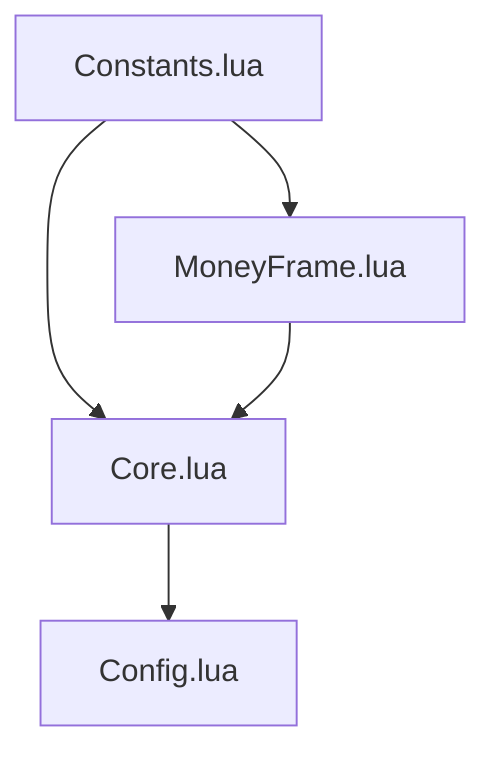

# 环境检测机制

<cite>
**本文档引用文件**  
- [Constants.lua](file://Core/Constants.lua)
- [Core.lua](file://Core/Core.lua)
- [MoneyFrame.lua](file://Core/MoneyFrame.lua)
</cite>

## 目录
1. [简介](#简介)
2. [项目结构](#项目结构)
3. [核心组件](#核心组件)
4. [架构概述](#架构概述)
5. [详细组件分析](#详细组件分析)
6. [依赖分析](#依赖分析)
7. [性能考虑](#性能考虑)
8. [故障排除指南](#故障排除指南)
9. [结论](#结论)

## 简介
本文件详细分析 Accountant_Classic 插件中基于 `GetBuildInfo()` 的客户端环境检测机制。重点阐述如何通过游戏版本号、分支（经典旧世、TBC、巫妖王之怒）和客户端区域来设置常量并控制功能模块的启用状态。

## 项目结构
Accountant_Classic 是一个为《魔兽世界》经典版设计的金币追踪插件，其核心功能依赖于对运行环境的精确识别。项目采用模块化设计，主要分为 Core（核心功能）和 CurrencyTracker（货币追踪）两大模块。

```mermaid
graph TB
subgraph "Core"
Config[Config.lua]
Constants[Constants.lua]
Core[Core.lua]
MoneyFrame[MoneyFrame.lua]
end
subgraph "CurrencyTracker"
CurrencyConstants[CurrencyConstants.lua]
CurrencyDataManager[CurrencyDataManager.lua]
end
Constants --> Core : "提供版本常量"
Constants --> MoneyFrame : "提供版本常量"
CurrencyConstants --> CurrencyDataManager : "提供版本工具"
```

**Diagram sources**
- [Constants.lua](file://Core/Constants.lua)
- [CurrencyConstants.lua](file://CurrencyTracker/CurrencyConstants.lua)

**Section sources**
- [Constants.lua](file://Core/Constants.lua)
- [Core.lua](file://Core/Core.lua)

## 核心组件
`Constants.lua` 是环境检测逻辑的核心，它在插件加载初期通过 `GetBuildInfo()` 获取版本信息，并据此定义一系列布尔常量（如 `WoWClassicEra`, `WoWClassicTBC`），这些常量被其他模块用于条件编译和功能开关。

**Section sources**
- [Constants.lua](file://Core/Constants.lua#L11-L20)

## 架构概述
该插件的环境检测机制遵循“一次检测，全局共享”的原则。`Constants.lua` 在初始化时完成版本判断，并将结果以模块常量的形式暴露给整个插件。其他模块（如 `Core.lua` 和 `MoneyFrame.lua`）通过检查这些常量来决定代码执行路径。



**Diagram sources**
- [Constants.lua](file://Core/Constants.lua#L11-L20)
- [Core.lua](file://Core/Core.lua#L53-L64)
- [MoneyFrame.lua](file://Core/MoneyFrame.lua#L10-L20)

## 详细组件分析

### Constants.lua 分析
`Constants.lua` 文件负责执行环境检测和常量定义。

#### 版本检测逻辑


**Diagram sources**
- [Constants.lua](file://Core/Constants.lua#L11-L25)

#### 功能模块启用逻辑
根据检测到的版本，`Constants.lua` 会为 `constants.events`、`constants.logtypes` 和 `constants.onlineData` 定义不同的内容。经典版本（WoWClassicEra, WoWClassicTBC, WoWWOTLKC）会启用一套事件列表，而零售版则会启用包含公会银行、幻化等新功能的事件列表。

**Section sources**
- [Constants.lua](file://Core/Constants.lua#L75-L150)

### 开发测试中的版本模拟
在开发和测试过程中，可以通过直接修改 `Constants.lua` 中的 `wowversion` 变量或强制设置 `WoWClassicEra`、`WoWRetail` 等布尔值为 `true` 或 `false`，来模拟插件在不同客户端版本下的行为，从而验证条件逻辑的正确性。

**Section sources**
- [Constants.lua](file://Core/Constants.lua#L14-L20)

## 依赖分析
环境检测机制是整个插件的基础，多个核心文件都直接依赖于 `Constants.lua` 中定义的版本标志。



**Diagram sources**
- [Constants.lua](file://Core/Constants.lua)
- [Core.lua](file://Core/Core.lua)
- [MoneyFrame.lua](file://Core/MoneyFrame.lua)

**Section sources**
- [Constants.lua](file://Core/Constants.lua)
- [Core.lua](file://Core/Core.lua)
- [MoneyFrame.lua](file://Core/MoneyFrame.lua)

## 性能考虑
版本检测仅在插件加载时执行一次，其开销可以忽略不计。后续的条件判断（如 `if (WoWClassicEra or WoWClassicTBC)`）是简单的布尔值检查，性能高效。这种设计避免了在运行时反复调用 `GetBuildInfo()`，是一种优化的实践。

## 故障排除指南
如果插件在特定版本的客户端中出现功能异常（例如，经典版中出现了零售版的功能），应首先检查 `Constants.lua` 中的版本检测逻辑是否正确。确认 `GetBuildInfo()` 返回的版本号是否符合预期，以及 `wowversion` 的比较条件是否准确。

**Section sources**
- [Constants.lua](file://Core/Constants.lua#L11-L25)

## 结论
Accountant_Classic 通过在 `Constants.lua` 中集中管理环境检测逻辑，实现了对不同《魔兽世界》客户端版本的优雅适配。该机制利用 `GetBuildInfo()` 的返回值进行精确的分支判断，并通过全局常量的方式将检测结果分发给所有需要它的模块，确保了代码的清晰性和可维护性。这种设计模式为开发兼容多个游戏版本的插件提供了一个优秀的范例。