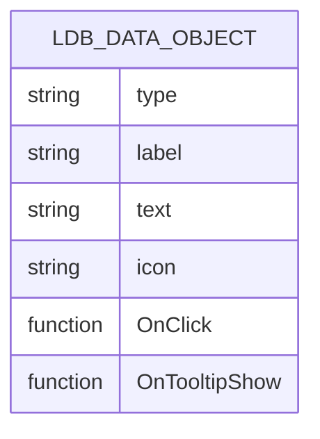
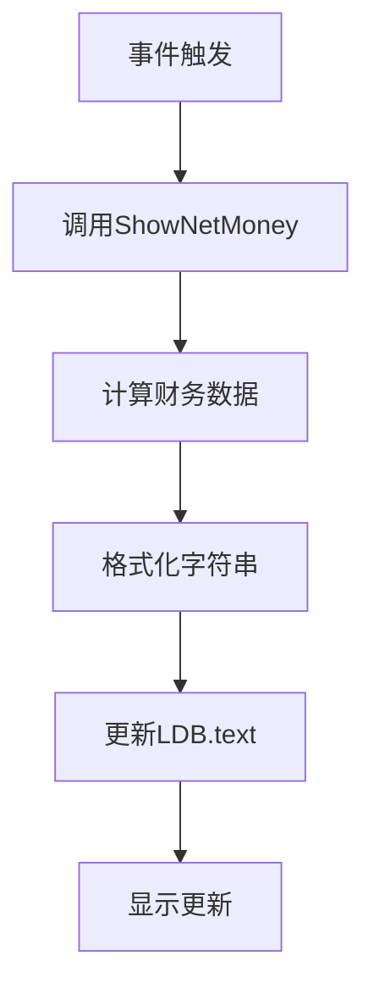
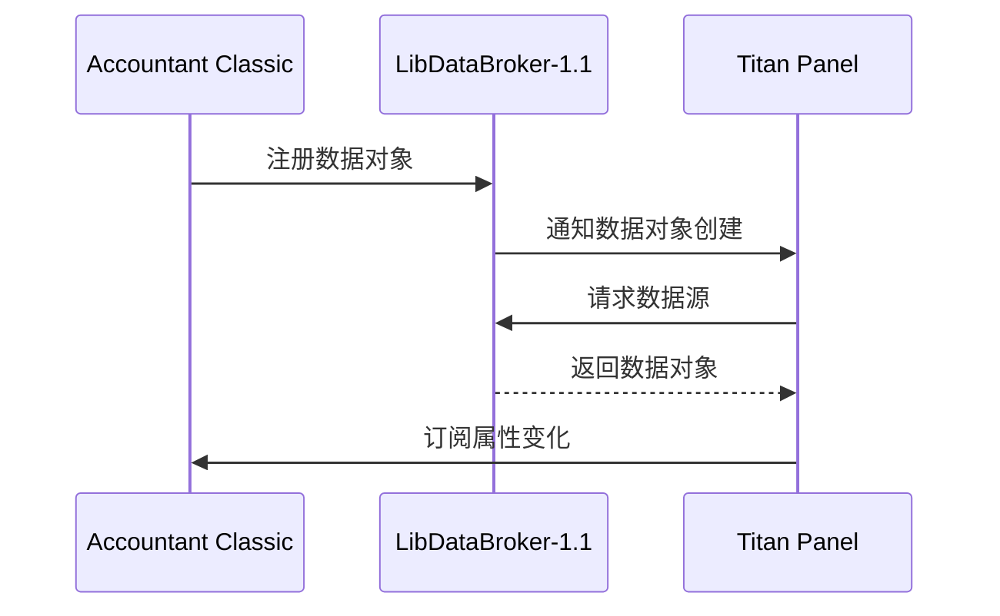
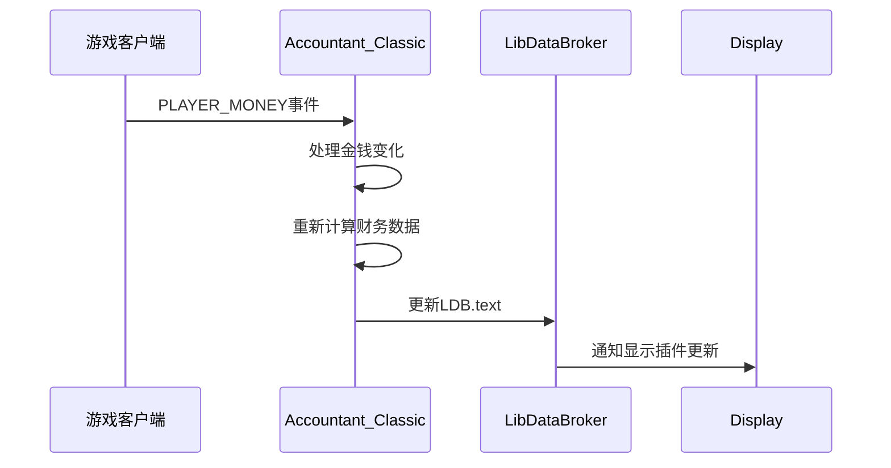
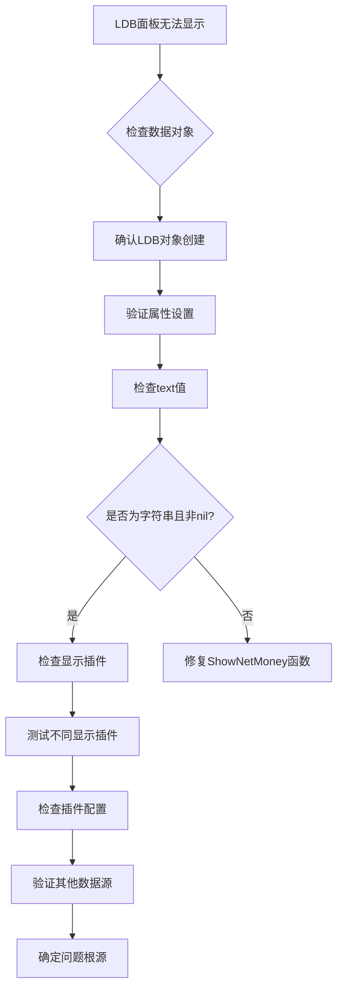

# LDB面板数据无法显示

<cite>
**本文档中引用的文件**   
- [Core.lua](file://Core/Core.lua)
- [LibDataBroker-1.1.lua](file://Libs/LibDataBroker-1.1/LibDataBroker-1.1.lua)
- [Config.lua](file://Core/Config.lua)
- [LibDBIcon-1.0.lua](file://Libs/LibDBIcon-1.0/LibDBIcon-1.0.lua)
</cite>

## 目录
1. [问题分析](#问题分析)
2. [LDB数据对象创建与初始化](#ldb数据对象创建与初始化)
3. [LDB数据更新机制](#ldb数据更新机制)
4. [LDB显示插件兼容性](#ldb显示插件兼容性)
5. [事件监听与数据注入](#事件监听与数据注入)
6. [故障排查与解决方案](#故障排查与解决方案)
7. [调试与验证方法](#调试与验证方法)

## 问题分析
Accountant_Classic插件的LibDataBroker（LDB）数据代理面板无法显示，主要涉及以下几个方面的问题：LDB数据对象是否正确创建并设置了label/text值，是否被其他LDB显示插件（如TitanPanel、ChocolateBar）正确识别，LibDataBroker-1.1是否成功注入数据源，以及事件监听机制是否正常工作。

**本节来源**
- [Core.lua](file://Core/Core.lua#L79-L80)

## LDB数据对象创建与初始化
Accountant_Classic在初始化过程中通过LibDataBroker-1.1创建数据对象，该对象用于向外部显示插件提供财务数据。数据对象的创建和初始化在`OnInitialize`方法中完成。

```lua
local LDB = LibStub("LibDataBroker-1.1"):NewDataObject(private.addon_name);
```

创建的数据对象包含以下关键属性：
- **type**: 设置为"data source"，标识其为数据源类型
- **label**: 显示名称，设置为"Accountant Classic"
- **text**: 显示文本，初始设置为"Accountant Classic"
- **icon**: 图标路径，指向插件目录下的图标文件
- **OnClick**: 点击事件处理函数
- **OnTooltipShow**: 工具提示显示函数

这些属性在`OnInitialize`方法中被设置，确保LDB数据对象具有完整的功能和正确的初始值。



**图表来源**
- [Core.lua](file://Core/Core.lua#L2155-L2199)

**本节来源**
- [Core.lua](file://Core/Core.lua#L2155-L2199)

## LDB数据更新机制
LDB数据对象的text属性需要在各种事件触发时更新，以反映最新的财务信息。Accountant_Classic通过`ShowNetMoney`函数计算并格式化显示文本。

```lua
LDB.text = addon:ShowNetMoney(private.constants.ldbDisplayTypes[profile.ldbDisplayType]) or ""
```

`ShowNetMoney`函数根据用户配置的显示类型（总金额、本会话、今日、本周、本月）计算相应的财务数据，并返回格式化的字符串。该函数在以下情况下被调用：
- 插件初始化时
- 配置更改时
- 财务数据更新时

确保返回值为非nil的字符串类型是关键，否则可能导致显示问题。



**图表来源**
- [Core.lua](file://Core/Core.lua#L2001-L2030)

**本节来源**
- [Core.lua](file://Core/Core.lua#L2001-L2030)

## LDB显示插件兼容性
Accountant_Classic的LDB数据对象设计为与各种LDB显示插件兼容，包括TitanPanel、ChocolateBar等。兼容性通过标准的LDB接口实现。



显示插件通过LibDataBroker获取数据对象，并监听属性变化事件来更新显示。如果显示插件无法正确识别数据对象，可能是由于LibDataBroker版本不兼容或插件加载顺序问题。

**图表来源**
- [LibDataBroker-1.1.lua](file://Libs/LibDataBroker-1.1/LibDataBroker-1.1.lua#L29-L72)

**本节来源**
- [LibDataBroker-1.1.lua](file://Libs/LibDataBroker-1.1/LibDataBroker-1.1.lua#L29-L72)

## 事件监听与数据注入
Accountant_Classic通过事件监听机制确保LDB数据的实时更新。关键事件包括`PLAYER_MONEY`和`CHAT_MSG_MONEY`，这些事件在金钱发生变化时触发。

```lua
function AccountantClassic_RegisterEvents(self)
    for key, value in pairs( private.constants.events ) do
        self:RegisterEvent( value );
    end
    self:RegisterEvent("PLAYER_LOGIN")
end
```

在事件处理函数中，插件会重新计算财务数据并更新LDB.text属性。这种机制确保了数据的实时性和准确性。



**图表来源**
- [Core.lua](file://Core/Core.lua#L1585-L1590)

**本节来源**
- [Core.lua](file://Core/Core.lua#L1585-L1590)

## 故障排查与解决方案
当LDB面板无法显示时，可以采取以下步骤进行排查和解决：

### 检查LDB数据对象创建
确认LDB数据对象是否成功创建：
1. 检查`LibStub("LibDataBroker-1.1")`是否返回有效对象
2. 验证`NewDataObject`调用是否成功
3. 确认数据对象的属性是否正确设置

### 验证数据更新机制
确保LDB.text属性能够正确更新：
1. 检查`ShowNetMoney`函数是否返回有效的字符串
2. 验证`LDB.text`赋值操作是否执行
3. 确认返回值不为nil

### 测试显示插件兼容性
排除显示插件的问题：
1. 尝试更换不同的LDB显示插件（如从TitanPanel切换到ChocolateBar）
2. 检查显示插件的配置是否正确
3. 确认显示插件能够识别其他LDB数据源

### 检查事件监听
验证事件监听机制是否正常工作：
1. 确认事件注册是否成功
2. 检查事件处理函数是否被调用
3. 验证事件触发时数据是否更新



**图表来源**
- [Core.lua](file://Core/Core.lua#L2272-L2274)

**本节来源**
- [Core.lua](file://Core/Core.lua#L2272-L2274)

## 调试与验证方法
为了有效诊断和解决LDB面板显示问题，可以采用以下调试方法：

### 启用详细日志
通过`/accountant verbose`命令启用详细日志，观察财务事件的处理过程。

### 检查Lua错误
使用`/console scriptErrors 1`启用Lua错误报告，捕获可能导致问题的脚本错误。

### 手动调用更新
在游戏内通过以下代码手动调用LDB更新：
```lua
local ldb = LibStub("LibDataBroker-1.1")
local accountantData = ldb:GetDataObjectByName("Accountant_Classic")
if accountantData then
    accountantData.text = Accountant_Classic:ShowNetMoney("Total")
end
```

### 验证数据源
通过程序化方式验证LDB数据对象的存在和状态：
```lua
local ldb = LibStub("LibDataBroker-1.1")
local obj = ldb:GetDataObjectByName("Accountant_Classic")
if obj then
    print("LDB对象存在，text值：" .. tostring(obj.text))
else
    print("LDB对象不存在")
end
```

这些方法可以帮助快速定位问题所在，并验证解决方案的有效性。

**本节来源**
- [Core.lua](file://Core/Core.lua#L2001-L2030)
- [LibDataBroker-1.1.lua](file://Libs/LibDataBroker-1.1/LibDataBroker-1.1.lua#L70-L89)