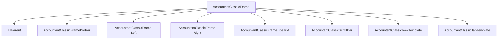

# 主窗口无法显示

<cite>
**本文档中引用的文件**  
- [Core.xml](file://Core/Core.xml)
- [Core.lua](file://Core/Core.lua)
- [MoneyFrame.lua](file://Core/MoneyFrame.lua)
</cite>

## 目录
1. [问题概述](#问题概述)
2. [XML结构分析](#xml结构分析)
3. [核心逻辑分析](#核心逻辑分析)
4. [UI显示机制分析](#ui显示机制分析)
5. [解决方案](#解决方案)

## 问题概述
主窗口AccountantMainFrame无法正常显示的问题涉及多个层面的配置和逻辑。该问题可能由UI框架定义错误、SavedVariables数据加载时机不当、UI事件阻塞或数据绑定过程中的空引用导致。本分析将深入检查Core.xml中主框架的XML定义，验证其父级锚点、层级和初始可见性设置，并排查Core.lua中OpenMainUI和ToggleWindow函数的逻辑执行路径。

**Section sources**
- [Core.xml](file://Core/Core.xml#L0-L43)
- [Core.lua](file://Core/Core.lua#L2279-L2334)

## XML结构分析
主窗口AccountantClassicFrame在Core.xml文件中正确定义了其UI结构。框架被设置为顶级窗口（toplevel="true"），启用鼠标交互（enableMouse="true"），可移动（movable="true"），父级为UIParent，且初始状态为隐藏（hidden="true"）。这些设置符合魔兽世界UI框架的标准配置。

框架的锚点设置为TOPLEFT，偏移量为x=0, y=-104，这确保了窗口在屏幕左上角适当位置显示。尺寸设置为640x512像素，提供了足够的显示空间。层级设置中，BACKGROUND层包含角色肖像纹理，ARTWORK层包含左右侧边纹理和标题文本，这些视觉元素的布局合理。

**Diagram sources**

**Section sources**
- [Core.xml](file://Core/Core.xml#L0-L627)

## 核心逻辑分析
在Core.lua文件中，OpenMainUI功能由AccountantClassic_ButtonOnClick函数实现。该函数检查AccountantClassicFrame的可见性状态，如果窗口可见则隐藏，否则显示。这是一个标准的切换逻辑，但其执行依赖于AccountantClassicFrame对象的正确初始化。

SavedVariables数据的加载是关键因素。initOptions函数负责初始化Accountant_ClassicSaveData，如果该数据未正确加载，可能导致UI状态不一致。AC_LOG_PRIMED标志用于确保基线初始化只执行一次，避免会话数据偏差。PLAYER_LOGIN事件注册确保在角色完全登录后进行必要的初始化。

profile变量存储了用户配置，包括窗口缩放、透明度和位置。arrangeAccountantClassicFrame函数根据这些配置调整窗口的显示属性。如果配置数据损坏或缺失，可能导致窗口显示异常。

**Section sources**
- [Core.lua](file://Core/Core.lua#L424-L450)
- [Core.lua](file://Core/Core.lua#L1580-L1779)

## UI显示机制分析
MoneyFrame.lua文件中的MoneyFrame模块负责管理独立的金钱信息窗口。该模块通过OnEnable和OnDisable方法注册和注销PLAYER_REGEN_ENABLED/DISABLED事件，以处理战斗状态下的UI锁定。frame_OnUpdate函数定期更新显示的金钱值，确保实时性。

createMoneyFrame函数创建了独立的UI元素，其位置由MnyFramePoint配置决定。frame_OnMouseDown和frame_OnMouseUp处理窗口拖动逻辑，允许用户自定义位置。这种独立窗口的实现机制与主框架的显示逻辑相互独立，但共享相同的配置系统。

主框架的显示更新由AccountantClassic_OnShow函数驱动，该函数负责更新标签、填充数据和调整UI元素。setLabels函数根据当前选项卡设置标题文本，settleTabText函数调整选项卡的布局和文本。这些函数的执行顺序和依赖关系对UI的正确显示至关重要。

**Section sources**
- [MoneyFrame.lua](file://Core/MoneyFrame.lua#L0-L169)
- [Core.lua](file://Core/Core.lua#L424-L450)

## 解决方案
针对主窗口无法显示的问题，建议采取以下解决方案：

1. **重载UI**：使用`/reload`命令重载整个UI，这将重新加载所有Lua脚本和XML定义，解决可能的加载时序问题。

2. **强制刷新**：通过`/console reloadui`命令强制刷新UI，这比/reload更彻底，可以解决更深层次的UI状态问题。

3. **检查缩放设置**：验证UI缩放设置是否与其他插件冲突，特别是当主窗口可能被缩放到不可见尺寸时。

4. **手动触发**：调用`Accountant_Classic:OpenMainUI()`方法手动创建和显示窗口，绕过正常的UI事件流程。

5. **数据验证**：检查SavedVariables中的Accountant_ClassicSaveData是否完整，必要时删除该文件让插件重新生成。

6. **事件调试**：在PLAYER_LOGIN事件处理中添加调试信息，确保初始化逻辑在正确时机执行。

7. **依赖检查**：确认Libs目录中的所有依赖库（如Ace3系列）都已正确加载，缺失的依赖可能导致UI初始化失败。

**Section sources**
- [Core.lua](file://Core/Core.lua#L2279-L2334)
- [MoneyFrame.lua](file://Core/MoneyFrame.lua#L58)
- [Core.xml](file://Core/Core.xml#L0-L627)