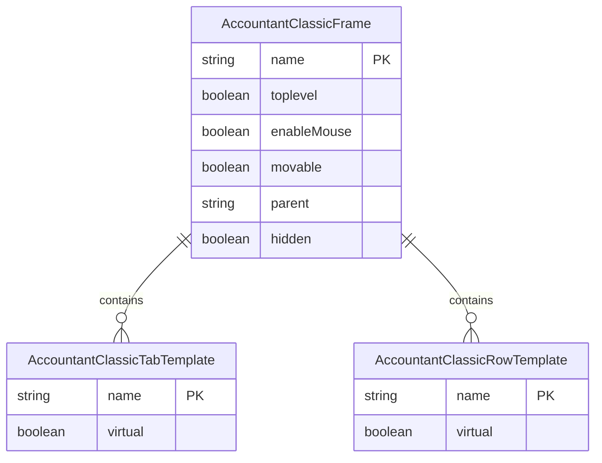
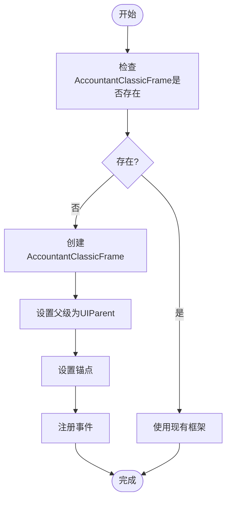
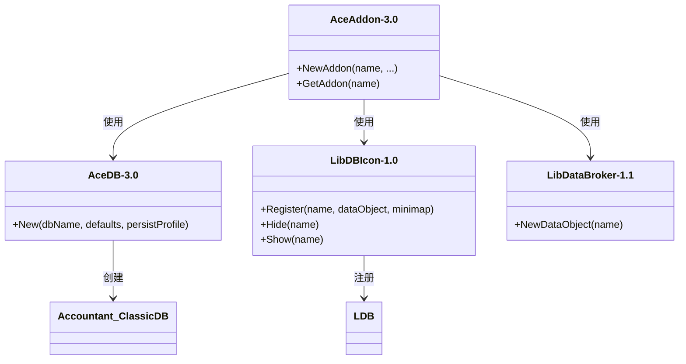
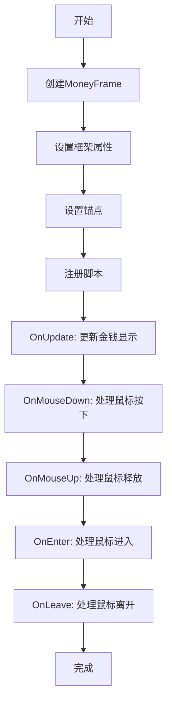

# 界面无法显示

<cite>
**本文档引用的文件**   
- [Core.xml](file://Core/Core.xml)
- [Template.xml](file://Core/Template.xml)
- [Core.lua](file://Core/Core.lua)
- [MoneyFrame.lua](file://Core/MoneyFrame.lua)
</cite>

## 目录
1. [问题概述](#问题概述)
2. [XML框架定义分析](#xml框架定义分析)
3. [Lua窗口控制逻辑分析](#lua窗口控制逻辑分析)
4. [UI元素注册与锚定检查](#ui元素注册与锚定检查)
5. [依赖框架加载验证](#依赖框架加载验证)
6. [数据绑定与渲染流程](#数据绑定与渲染流程)
7. [解决方案与修复建议](#解决方案与修复建议)

## 问题概述

主窗口、最小化地图按钮或LDB面板无法正常显示的问题可能由多种因素导致，包括XML框架创建逻辑错误、UI元素注册失败、Lua函数执行中断、依赖框架加载不完整或数据绑定断点等。本文档将深入分析Accountant_Classic插件的代码库，重点检查Core.xml和Template.xml中的框架创建逻辑，验证OpenMainUI和ToggleWindow函数的执行路径，并提供相应的解决方案。

## XML框架定义分析

通过分析Core.xml和Template.xml文件，可以确认主窗口和相关UI元素的XML定义结构。



**Diagram sources**
- [Core.xml](file://Core/Core.xml#L1-L627)
- [Template.xml](file://Core/Template.xml#L1-L180)

**Section sources**
- [Core.xml](file://Core/Core.xml#L1-L627)
- [Template.xml](file://Core/Template.xml#L1-L180)

## Lua窗口控制逻辑分析

Lua代码中的窗口控制逻辑主要通过Toggle函数和OnShow事件处理程序实现。这些函数负责窗口的显示、隐藏和状态切换。

```mermaid
sequenceDiagram
participant 用户 as 用户
participant UI as UI模块
participant 根框架 as rootFrame
participant 刷新 as RefreshView
用户->>UI : Toggle(state)
activate UI
UI->>UI : 检查initialized状态
alt 未初始化
UI->>UI : 执行Initialize()
end
UI->>UI : 检查rootFrame是否存在
alt rootFrame不存在
UI->>UI : 返回
end
opt state未指定
根框架->>根框架 : IsShown()
alt 显示中
根框架->>根框架 : Hide()
else 隐藏中
根框架->>根框架 : Show()
根框架->>刷新 : RefreshView()
根框架->>刷新 : ApplyHeaderLabels()
根框架->>C_Timer : After(0, SetupTabs)
end
else
alt state为真
根框架->>根框架 : Show()
根框架->>刷新 : RefreshView()
根框架->>刷新 : ApplyHeaderLabels()
根框架->>C_Timer : After(0, SetupTabs)
else
根框架->>根框架 : Hide()
end
end
deactivate UI
```

**Diagram sources**
- [Core.lua](file://Core/Core.lua#L1140-L1174)

**Section sources**
- [Core.lua](file://Core/Core.lua#L1140-L1174)

## UI元素注册与锚定检查

UI元素的注册和锚定是确保界面正确显示的关键。通过分析代码，可以确认UI元素的创建和锚定逻辑。



**Diagram sources**
- [Core.lua](file://Core/Core.lua#L1589-L2328)

**Section sources**
- [Core.lua](file://Core/Core.lua#L1589-L2328)

## 依赖框架加载验证

插件依赖于AceGUI和Blizzard UI框架的完整加载。通过分析代码，可以确认依赖框架的加载和注册过程。



**Diagram sources**
- [Core.lua](file://Core/Core.lua#L1600-L1650)

**Section sources**
- [Core.lua](file://Core/Core.lua#L1600-L1650)

## 数据绑定与渲染流程

MoneyFrame.lua中的UI渲染逻辑涉及数据绑定过程，这是确保界面数据正确显示的关键。



**Diagram sources**
- [MoneyFrame.lua](file://Core/MoneyFrame.lua#L1-L169)

**Section sources**
- [MoneyFrame.lua](file://Core/MoneyFrame.lua#L1-L169)

## 解决方案与修复建议

针对主窗口、最小化地图按钮或LDB面板无法正常显示的问题，提供以下解决方案：

1. **重置UI位置**：通过插件设置重置UI元素的位置和大小。
2. **重新加载插件**：使用`/reload`命令重新加载插件，确保所有脚本正确执行。
3. **检查UI冲突**：确认与其他插件是否存在UI冲突，必要时禁用其他插件进行排查。
4. **验证依赖加载**：确保AceGUI和Blizzard UI框架已正确加载。
5. **检查数据绑定**：确认MoneyFrame.lua中的数据绑定逻辑无断点。

**Section sources**
- [Core.xml](file://Core/Core.xml#L1-L627)
- [Template.xml](file://Core/Template.xml#L1-L180)
- [Core.lua](file://Core/Core.lua#L1140-L2328)
- [MoneyFrame.lua](file://Core/MoneyFrame.lua#L1-L169)