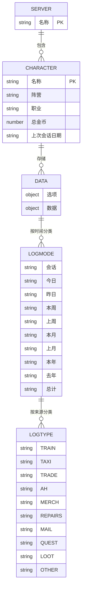
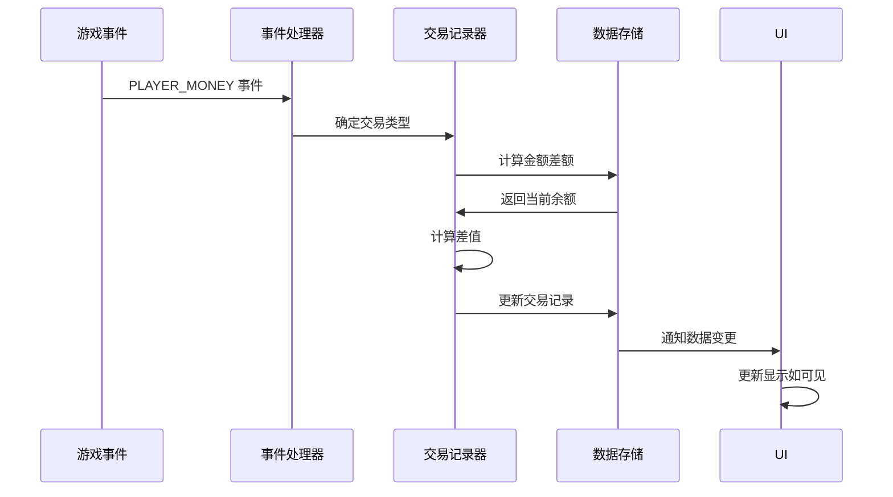
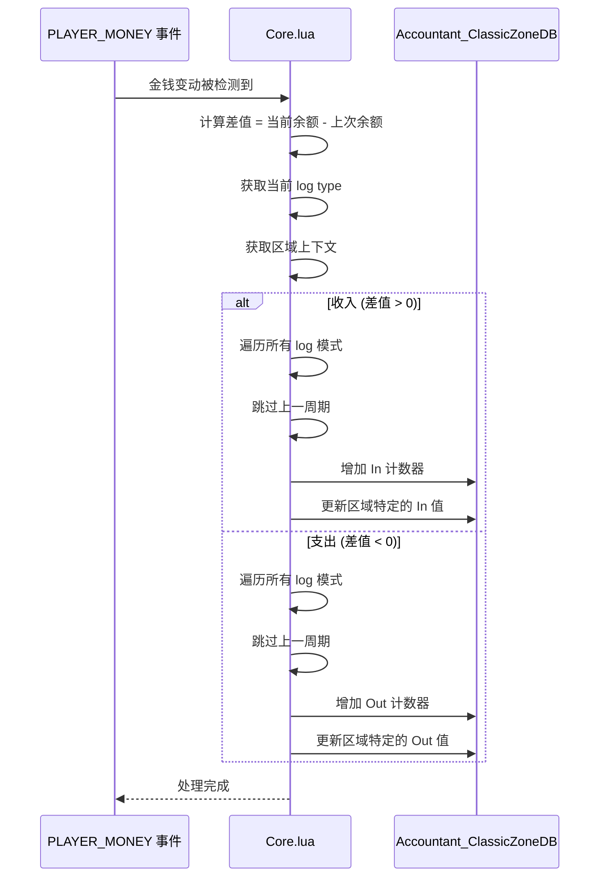

# Accountant_ClassicSaveData - Data 表分类逻辑

<cite>
**本文档中引用的文件**  
- [Constants.lua](file://Core/Constants.lua)
- [Core.lua](file://Core/Core.lua)
</cite>

## 目录
1. [简介](#简介)
2. [数据表结构与分类体系](#数据表结构与分类体系)
3. [收支来源分类体系](#收支来源分类体系)
4. [事件处理与数据归因逻辑](#事件处理与数据归因逻辑)
5. [收入、支出与净收益计算](#收入支出与净收益计算)
6. [数据准确性与可追溯性保障](#数据准确性与可追溯性保障)

## 简介
Accountant_Classic 是一款用于追踪《魔兽世界》经典版中角色金钱收支的插件。其核心数据结构 `Accountant_ClassicSaveData` 通过 `data` 表对收支数据进行精细化分类管理，基于 `Constants.logtypes` 定义的收支来源分类体系，实现了对不同场景下金钱变动的精确记录与归因。本文档深入解析该分类架构，阐述其业务含义、触发场景及计算逻辑。

## 数据表结构与分类体系

`Accountant_ClassicSaveData` 数据结构采用服务器→角色→数据的三层层级组织。`data` 表是核心，用于存储按类型和时间段分类的财务交易记录。



**图表来源**
- [Core.lua](file://Core/Core.lua#L262-L304)
- [Constants.lua](file://Core/Constants.lua#L50-L52)

**本节来源**
- [Core.lua](file://Core/Core.lua#L262-L304)
- [Constants.lua](file://Core/Constants.lua#L50-L52)

## 收支来源分类体系

`Constants.logtypes` 定义了收支数据的来源分类，每个 `logtype` 对应特定的游戏内业务场景。以下是各分类的详细说明：

- **:MERCH (商人)**: 指玩家与NPC商人进行的交易，包括购买物品和出售物品。当 `MERCHANT_SHOW` 事件触发时，系统将当前交易上下文标记为 `MERCH`。
- **:REPAIRS (修理)**: 指玩家在NPC处修理装备所花费的金币。当 `MERCHANT_UPDATE` 事件触发且 `InRepairMode()` 为真时，系统将交易上下文从 `MERCH` 切换为 `REPAIRS`。
- **:QUEST (任务)**: 指完成任务所获得的奖励金币。当 `QUEST_COMPLETE` 或 `QUEST_TURNED_IN` 事件触发时，系统将当前交易上下文标记为 `QUEST`。
- **:LOOT (拾取)**: 指从怪物、宝箱或其他可拾取物中获得的金币。当 `LOOT_OPENED` 事件触发时，系统将当前交易上下文标记为 `LOOT`。
- **:TAXI (飞行)**: 指使用飞行点服务所支付的费用。当 `TAXIMAP_OPENED` 事件触发时，系统将当前交易上下文标记为 `TAXI`。
- **:TRAIN (训练)**: 指学习技能、天赋重置或访问理发店等服务所支付的费用。当 `TRAINER_SHOW` 或 `CONFIRM_TALENT_WIPE` 事件触发时，系统将当前交易上下文标记为 `TRAIN`。
- **:MAIL (邮件)**: 指通过邮件系统收到或发送的金币。当 `MAIL_INBOX_UPDATE` 事件触发且未检测到拍卖行交易时，系统将当前交易上下文标记为 `MAIL`。
- **:AH (拍卖行)**: 指在拍卖行进行的交易，包括拍卖物品所得和购买物品所花的金币。当 `AUCTION_HOUSE_SHOW` 事件触发，或 `MAIL_INBOX_UPDATE` 事件触发并检测到拍卖行交易时，系统将当前交易上下文标记为 `AH`。
- **:OTHER (其他)**: 指无法归入上述任何类别的金钱变动，通常由 `PLAYER_MONEY` 事件直接触发，用于捕捉未被特定事件捕获的零星收支。

**本节来源**
- [Constants.lua](file://Core/Constants.lua#L70-L79)
- [Core.lua](file://Core/Core.lua#L1447-L1599)

## 事件处理与数据归因逻辑

插件通过注册并监听一系列游戏事件来捕获金钱变动，并根据事件类型将变动归因到相应的 `logtype`。核心逻辑在 `AccountantClassic_OnEvent` 函数中实现。



**图表来源**
- [Core.lua](file://Core/Core.lua#L1500-L1599)

当 `PLAYER_MONEY` 事件发生时，系统会调用 `updateLog()` 函数。该函数首先计算当前余额与上一次记录余额的差额 (`diff`)。然后，根据当前存储在 `AC_LOGTYPE` 变量中的上下文，将这笔差额归因到对应的分类。例如，如果玩家刚刚与商人交易，`AC_LOGTYPE` 的值为 `MERCH`，那么这次的金钱变动就会被记录到 `MERCH` 分类下。对于 `CHAT_MSG_MONEY` 事件（如团队分钱），系统会解析聊天信息中的金额，并临时将 `AC_LOGTYPE` 设置为 `LOOT` 来记录这笔收入。

**本节来源**
- [Core.lua](file://Core/Core.lua#L1500-L1599)

## 收入、支出与净收益计算

`data` 表中的每个 `logtype` 在每个时间周期（如 `Session`, `Day`, `Week`）下都包含 `In` (收入) 和 `Out` (支出) 两个字段。

- **:收入 (income)**: 当 `diff > 0` 时，系统将差额加到当前 `logtype` 和所有相关时间周期（排除 `Prv*` 类型）的 `In` 字段上。
- **:支出 (expense)**: 当 `diff < 0` 时，系统将差额的绝对值加到当前 `logtype` 和所有相关时间周期（排除 `Prv*` 类型）的 `Out` 字段上。
- **:净收益 (profit)**: 净收益并非直接存储，而是通过计算得出。对于任意时间周期，净收益 = 总收入 - 总支出。如果结果为正，则为净收益；如果为负，则为净损失。UI 在显示时会动态计算并展示此值。



**图表来源**
- [Core.lua](file://Core/Core.lua#L1122-L1148)

**本节来源**
- [Core.lua](file://Core/Core.lua#L1122-L1148)

## 数据准确性与可追溯性保障

该分类模型通过多种机制确保数据的准确性和可追溯性：

1.  **基线初始化 (Priming)**: 为防止角色首次登录时的当前余额被误认为是收入，系统采用“基线初始化”策略。在首次加载时，系统将当前余额设为基准 (`AC_LASTMONEY`)，后续的金钱变动才作为真正的收支进行记录，避免了数据失真。
2.  **时间周期管理**: 系统会自动检查日期、周、月、年的滚动。当检测到周期变更时，会将当前周期（如 `Day`）的数据复制到“上一周期”（如 `PrvDay`），然后将当前周期的数据清零。这确保了历史数据的完整保留和当前数据的准确重置。
    ```mermaid
flowchart TD
A[玩家登录] --> B{配置文件存在?}
B --> |否| C[创建新配置文件]
C --> D[用默认选项初始化]
D --> E[设置首次加载标志]
E --> F[初始化区域数据库]
F --> G[加载数据]
B --> |是| H[更新选项]
H --> I[检查缺失字段]
I --> J[添加默认值]
J --> K[加载数据]
K --> L[检查日期滚动]
L --> M{日期改变?}
M --> |是| N[转移数据周期]
N --> O[更新上一周期]
O --> P[重置当前周期]
M --> |否| Q[进入正常操作]
```
    **图表来源**
    - [Core.lua](file://Core/Core.lua#L849-L983)
3.  **区域追踪**: 当启用区域追踪 (`profile.trackzone == true`) 时，系统会将收支数据进一步细分到具体的区域（主区域或子区域）。这使得玩家可以追溯在特定地点（如“奥格瑞玛 - 铁砧区”）的消费和收入情况，极大地增强了数据的可追溯性。
4.  **事件驱动**: 通过精确监听游戏事件来设置交易上下文，确保了收支分类的准确性。例如，只有在打开拍卖行界面时发生的金钱变动才会被归为 `AH` 类别。

**本节来源**
- [Core.lua](file://Core/Core.lua#L849-L983)
- [Core.lua](file://Core/Core.lua#L1122-L1148)