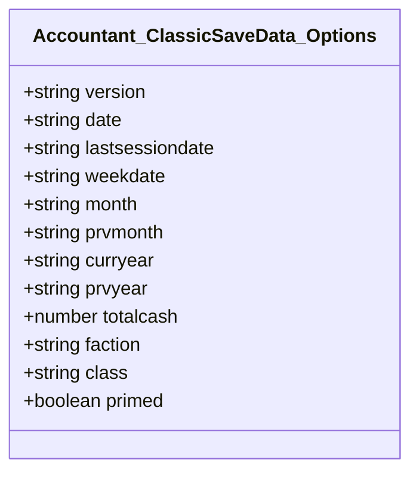
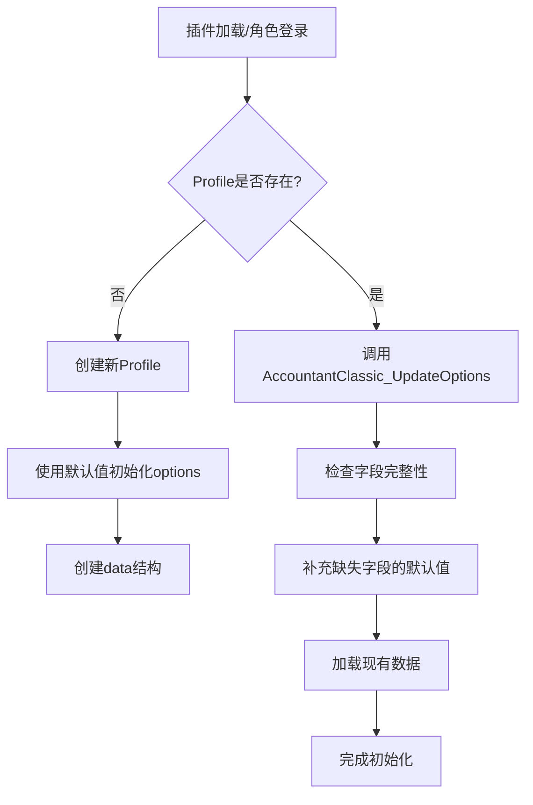
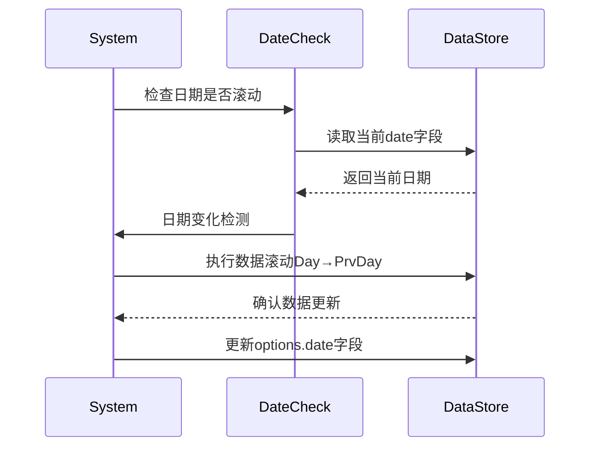

# Accountant_ClassicSaveData - Options 表结构

<cite>
**本文档中引用的文件**  
- [Core.lua](file://Core/Core.lua)
- [Constants.lua](file://Core/Constants.lua)
- [Config.lua](file://Core/Config.lua)
</cite>

## 目录
1. [简介](#简介)
2. [Options表结构与核心作用](#options表结构与核心作用)
3. [初始化逻辑分析](#初始化逻辑分析)
4. [实际Lua表结构示例](#实际lua表结构示例)
5. [跨角色概览与数据完整性校验](#跨角色概览与数据完整性校验)
6. [角色信息变更时的更新机制](#角色信息变更时的更新机制)
7. [结论](#结论)

## 简介
Accountant_ClassicSaveData 是 Accountant Classic 插件的核心数据存储结构，用于记录玩家角色的财务信息。该结构以服务器和角色为层级组织，其中 `options` 表作为配置与元数据存储的关键部分，承载了版本控制、时间戳、角色基础信息及总金币数等重要字段。本文档详细说明 `options` 表的结构、初始化逻辑及其在插件运行中的关键作用。

**Section sources**
- [Core.lua](file://Core/Core.lua#L176-L374)
- [Constants.lua](file://Core/Constants.lua#L20-L45)

## Options表结构与核心作用
`options` 表是 Accountant_ClassicSaveData 中用于存储角色配置与元数据的核心组件，其字段设计旨在支持插件的长期维护、数据兼容性以及跨角色财务分析。

### 核心字段定义
- :version: 插件版本号，用于确保数据格式兼容性。
- :date: 当前日期（格式为 "dd/mm/yy"），用于日志记录和时间周期管理。
- :lastsessiondate: 上次会话的日期，用于判断是否需要进行数据滚动更新。
- :weekdate: 当前周的起始日期，用于周度财务统计。
- :month: 当前月份（1-12），用于月度财务统计。
- :curryear: 当前年份，用于年度财务统计。
- :totalcash: 角色当前拥有的总金币数，作为财务状态的核心指标。
- :faction: 角色所属阵营（如 "Alliance", "Horde"），用于跨角色筛选与分类。
- :class: 角色职业，用于角色识别与数据聚合。
- :primed: 布尔值，标记是否已完成基线初始化，防止首次登录时将初始余额误判为收入。

这些字段共同构成了插件运行所需的元数据基础，支持时间周期管理、数据完整性校验和跨角色财务聚合等功能。



**Diagram sources**
- [Core.lua](file://Core/Core.lua#L176-L195)
- [Constants.lua](file://Core/Constants.lua#L20-L45)

**Section sources**
- [Core.lua](file://Core/Core.lua#L176-L195)
- [Constants.lua](file://Core/Constants.lua#L20-L45)

## 初始化逻辑分析
当插件首次加载或新角色登录时，`InitializeData` 函数通过 `initOptions()` 实现 `options` 表的初始化。该过程确保所有必要字段存在并设置默认值，同时处理版本兼容性问题。

### 初始化流程
1. **检查数据结构完整性**：若 `Accountant_ClassicSaveData` 或其子结构不存在，则创建相应层级。
2. **应用默认选项**：使用 `AccountantClassicDefaultOptions` 提供的默认值填充 `options` 表。
3. **更新缺失字段**：调用 `AccountantClassic_UpdateOptions()` 检查现有配置中是否存在新添加的字段，若有缺失则补充默认值。
4. **持久化基线标记**：从 `options.primed` 读取基线初始化状态，避免重复初始化。

此机制确保即使插件升级引入新字段，旧用户数据也能自动适配，保障向后兼容性。



**Diagram sources**
- [Core.lua](file://Core/Core.lua#L262-L304)
- [Core.lua](file://Core/Core.lua#L849-L983)

**Section sources**
- [Core.lua](file://Core/Core.lua#L262-L304)
- [Core.lua](file://Core/Core.lua#L849-L983)

## 实际Lua表结构示例
以下是一个典型的 `Accountant_ClassicSaveData` 结构示例，展示了 `options` 表在实际环境中的组织方式：

```lua
Accountant_ClassicSaveData = {
  ["服务器名称"] = {
    ["角色名称"] = {
      options = {
        version = "2.20",
        date = "01/04/24",
        lastsessiondate = "01/04/24",
        weekdate = "31/03/24",
        month = "4",
        weekstart = 1,
        curryear = "2024",
        totalcash = 1257843,
        faction = "Alliance",
        class = "Mage",
        primed = true
      },
      data = { },
      currencyData = { },
      currencyOptions = { }
    }
  }
}
```

该结构清晰地体现了服务器 → 角色 → 数据的三层组织模式，`options` 表位于角色层级，直接关联该角色的所有财务记录。

**Section sources**
- [Core.lua](file://Core/Core.lua#L278-L304)
- [Constants.lua](file://Core/Constants.lua#L20-L45)

## 跨角色概览与数据完整性校验
`options` 表中的元数据不仅服务于单个角色，还支持跨角色的财务概览与数据完整性校验。

### 跨角色财务聚合
通过遍历 `Accountant_ClassicSaveData` 中所有角色的 `options.totalcash` 字段，插件可在“所有角色”标签页中展示账户级总财富。此外，`faction` 和 `class` 字段支持按阵营或职业筛选角色，实现精细化财务分析。

### 数据完整性校验
插件在每次加载时执行 `AccountantClassic_LogsShifting()`，检查 `date`、`month`、`curryear` 等字段是否发生变化。若检测到日期滚动（如新一天开始），则自动将 `Day` 数据移至 `PrvDay`，并重置当前周期数据，确保历史记录不被覆盖。



**Diagram sources**
- [Core.lua](file://Core/Core.lua#L849-L983)
- [Core.lua](file://Core/Core.lua#L1739-L1938)

**Section sources**
- [Core.lua](file://Core/Core.lua#L849-L983)
- [Core.lua](file://Core/Core.lua#L1739-L1938)

## 角色信息变更时的更新机制
当角色信息发生变更（如金币变动、会话结束）时，`options` 表会同步更新以反映最新状态。

### 金币变动处理
在 `PLAYER_MONEY` 事件触发时，系统首先检查 `AC_LOG_PRIMED` 状态。若未完成基线初始化，则将当前金币数设为 `AC_LASTMONEY` 并标记 `primed = true`，防止初始余额被误记为收入。此后，所有金币变动均通过 `updateLog()` 记录到 `data` 表中，并实时更新 `options.totalcash`。

### 会话与日期更新
每次角色登录时，系统比较 `lastsessiondate` 与当前日期。若不一致，则更新 `lastsessiondate` 并可能触发周期性数据滚动。此机制确保 `options` 表始终反映角色的最新活动状态。

**Section sources**
- [Core.lua](file://Core/Core.lua#L1500-L1699)
- [Core.lua](file://Core/Core.lua#L849-L983)

## 结论
`Accountant_ClassicSaveData` 中的 `options` 表是插件实现稳定、可靠财务跟踪的核心。它不仅存储了版本、时间、角色属性等关键元数据，还通过精心设计的初始化与更新机制，确保了数据的完整性与一致性。该表支持跨角色财务聚合、周期性数据滚动和版本兼容性处理，为用户提供全面、准确的财务分析能力。