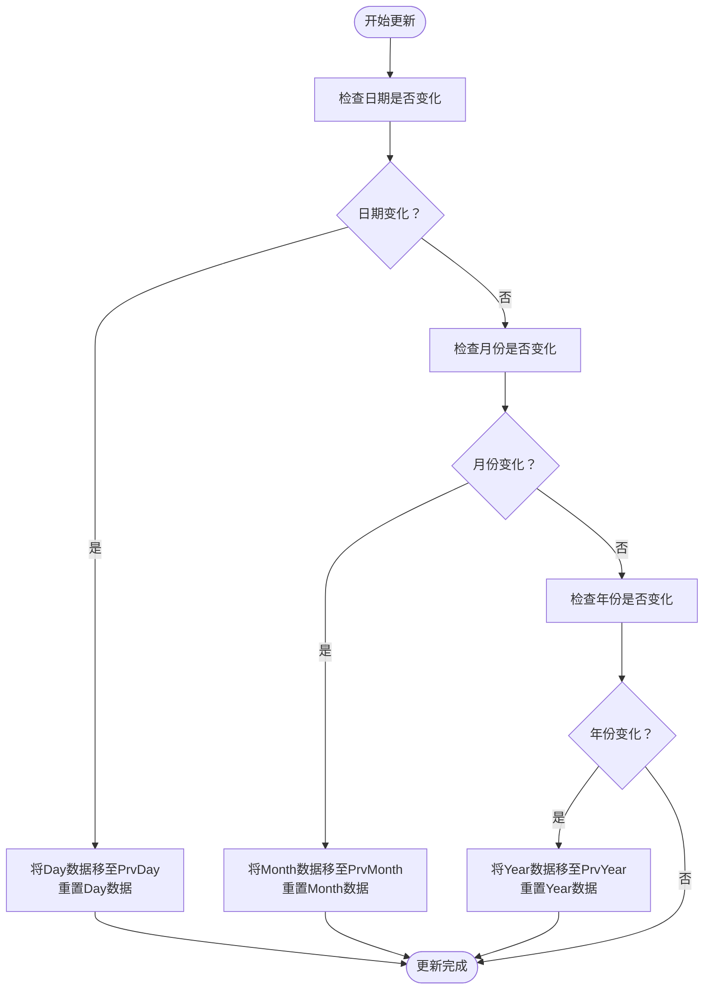
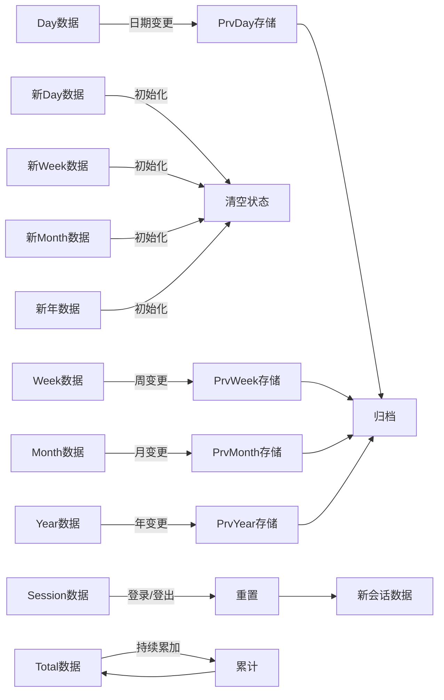

# Accountant_ClassicSaveData - 时间周期管理

<cite>
**本文档引用文件**   
- [Constants.lua](file://Core/Constants.lua)
- [Core.lua](file://Core/Core.lua)
- [CurrencyStorage.lua](file://CurrencyTracker/CurrencyStorage.lua)
</cite>

## 目录
1. [引言](#引言)
2. [时间窗口设计原理](#时间窗口设计原理)
3. [数据存储结构](#数据存储结构)
4. [重置条件与更新策略](#重置条件与更新策略)
5. [时间周期变更检测机制](#时间周期变更检测机制)
6. [Total数据的特殊性](#total数据的特殊性)
7. [数据流转示意图](#数据流转示意图)
8. [多维度数据查看支持](#多维度数据查看支持)

## 引言
Accountant_ClassicSaveData插件通过精心设计的时间窗口管理系统，为玩家提供多维度的金币数据追踪功能。该系统基于Constants.logmodes定义的多种时间周期，实现了从会话级到年度级的全面财务记录。本专项文档将深入解析该时间周期管理机制的设计原理与实现细节。

## 时间窗口设计原理
Constants.logmodes定义了插件用于财务数据聚合的时间周期桶，这些周期使用户能够在不同时间粒度下分析其财务活动。系统通过预定义的时间窗口实现数据的分层存储与管理。

**时间周期定义：**
- :"Session": 跟踪当前登录会话期间的财务活动
- :"Day": 跟踪每日财务活动
- :"PrvDay": 存储前一天的数据
- :"Week": 跟踪每周财务活动
- :"PrvWeek": 存储前一周的数据
- :"Month": 跟踪每月财务活动
- :"PrvMonth": 存储前一个月的数据
- :"Year": 跟踪年度财务活动
- :"PrvYear": 存储前一年的数据
- :"Total": 跨所有时间的累计财务数据

**Section sources**
- [Constants.lua](file://Core/Constants.lua#L50-L52)
- [Core.lua](file://Core/Core.lua#L849-L882)

## 数据存储结构
时间窗口的数据存储结构采用分层设计，每个时间周期对应独立的数据存储区域。系统在Accountant_ClassicSaveData中为每个角色创建基于服务器的存储结构，其中包含options和data两个主要部分。

data部分存储了按时间模式(logmode)和交易类型(logtype)分类的财务数据，每个时间窗口包含"in"和"out"两个字段分别记录收入和支出。这种结构支持快速查询特定时间周期内的财务汇总信息。

对于货币追踪功能，系统在CurrencyTracker模块中扩展了存储结构，增加了currencyData字段来管理各种游戏货币的跨时间周期数据。

**Section sources**
- [Core.lua](file://Core/Core.lua#L1000-L1050)
- [CurrencyStorage.lua](file://CurrencyTracker/CurrencyStorage.lua#L568-L617)

## 重置条件与更新策略
时间窗口的重置遵循特定的触发条件和更新策略，确保数据的准确性和时效性。

**会话(Session)重置：**
- 触发条件：角色登出或重新登录
- 重置策略：在初始化时清除Session数据，确保每次会话从零开始记录

**每日(Day)重置：**
- 触发条件：系统日期发生变化
- 重置策略：将Day数据复制到PrvDay，然后清空Day数据

**每周(Week)重置：**
- 触发条件：周起始日发生变化（基于用户设置的weekstart）
- 重置策略：将Week数据复制到PrvWeek，然后清空Week数据

**每月(Month)重置：**
- 触发条件：月份发生变化
- 重置策略：将Month数据复制到PrvMonth，然后清空Month数据

**每年(Year)重置：**
- 触发条件：年份发生变化
- 重置策略：将Year数据复制到PrvYear，然后清空Year数据

**Section sources**
- [Core.lua](file://Core/Core.lua#L849-L882)
- [CurrencyStorage.lua](file://CurrencyTracker/CurrencyStorage.lua#L360-L434)

## 时间周期变更检测机制
插件通过核心的AccountantClassic_LogsShifting函数检测时间周期变更并自动创建新的数据记录。该机制在多个关键时间点执行检查，确保数据的连续性和完整性。

系统通过比较当前日期、周起始日、月份和年份与存储中的对应值来判断是否需要进行周期滚动。当检测到变化时，系统执行相应的数据迁移操作，将当前周期的数据复制到"Prv"前缀的存储区域，然后重置当前周期的数据。

周起始日的计算通过addon:WeekStart()方法实现，该方法考虑了用户设置的weekstart偏好（1=星期日），确保周周期的正确划分。

**Diagram sources**
- [Constants.lua](file://Core/Constants.lua#L50-L52)
- [Core.lua](file://Core/Core.lua#L849-L882)

## Total数据的特殊性
"Total"时间窗口作为永久累计数据具有特殊性，与其他时间窗口存在独特的聚合关系。

**特殊性特征：**
- 持久性：数据不会因时间周期变更而重置
- 累计性：持续累加所有收入和支出
- 基准性：作为其他时间窗口数据的参考基准

**聚合关系：**
- 所有其他时间窗口的交易都会同时更新Total数据
- Total数据作为长期财务趋势分析的基础
- 在角色切换和服务器切换时保持数据完整性
- 支持跨角色的财务数据汇总统计

Total数据的特殊处理确保了玩家可以随时查看其角色的完整财务历史，不受时间周期限制的影响。

**Section sources**
- [Core.lua](file://Core/Core.lua#L1600-L1650)
- [CurrencyStorage.lua](file://CurrencyTracker/CurrencyStorage.lua#L661-L713)

## 数据流转示意图
当时间窗口发生切换时，系统执行特定的数据流转操作，确保历史数据的保存和新周期的初始化。

**Diagram sources**
- [Core.lua](file://Core/Core.lua#L849-L882)
- [CurrencyStorage.lua](file://CurrencyTracker/CurrencyStorage.lua#L388-L434)

## 多维度数据查看支持
该时间周期设计支持用户在不同时间维度下查看金币数据，提供了灵活的财务分析能力。

系统通过标签页(tab)机制实现多维度切换，用户可以在界面中选择不同的时间窗口查看相应的财务汇总。每个标签页对应Constants.logmodes中的一个时间模式，显示该周期内的收入、支出和净收益。

对于跨角色数据查看，系统支持按服务器、阵营和特定角色进行筛选，结合时间窗口选择，用户可以获得精确的财务视图。这种设计使得玩家能够深入分析特定时间段内的财务行为模式，优化游戏内经济决策。

**Section sources**
- [Core.lua](file://Core/Core.lua#L1600-L2000)
- [Constants.lua](file://Core/Constants.lua#L150-L170)