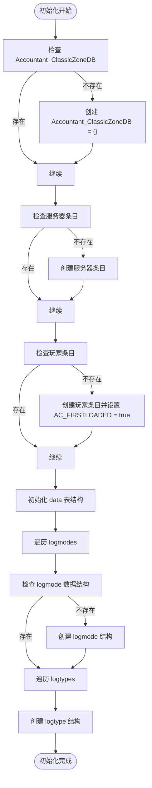
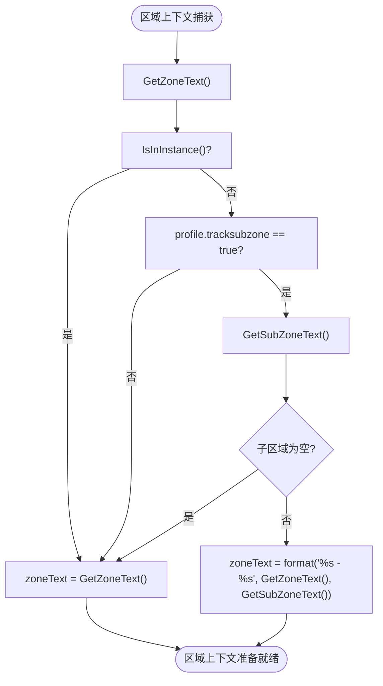

# Accountant_ClassicZoneDB 区域数据结构

<cite>
**本文档中引用的文件**  
- [Core.lua](file://Core/Core.lua)
- [Config.lua](file://Core/Config.lua)
- [Constants.lua](file://Core/Constants.lua)
</cite>

## 目录
1. [简介](#简介)
2. [数据结构概述](#数据结构概述)
3. [初始化流程](#初始化流程)
4. [区域数据采集逻辑](#区域数据采集逻辑)
5. [区域名称存储格式](#区域名称存储格式)
6. [数据组织结构](#数据组织结构)
7. [实际使用场景](#实际使用场景)

## 简介
Accountant_ClassicZoneDB 是 Accountant_Classic 插件提供的可选功能，用于实现地理级别的财务追踪机制。该系统允许玩家按区域和子区域追踪收入与支出，提供更精细的财务数据分析能力。通过启用 `trackzone` 和 `tracksubzone` 配置选项，用户可以控制是否启用区域追踪以及是否包含子区域信息。

**Section sources**
- [Core.lua](file://Core/Core.lua#L242-L268)
- [Config.lua](file://Core/Config.lua#L18-L20)

## 数据结构概述
Accountant_ClassicZoneDB 采用与 Accountant_ClassicSaveData 相似的层级结构：服务器 → 角色 → data。在 data 表中，数据按时间周期（如会话、日、周、月、年）和交易类型进行组织。每个区域记录包含收入(In)和支出(Out)两个数值，用于精确追踪特定区域的财务活动。

该结构支持多种时间周期和交易类型的组合，确保财务数据的完整性和可追溯性。数据结构的设计考虑了性能和存储效率，同时提供了足够的灵活性以满足不同用户的分析需求。

**Section sources**
- [Core.lua](file://Core/Core.lua#L242-L268)
- [Constants.lua](file://Core/Constants.lua#L50-L52)

## 初始化流程
区域数据库的初始化通过 `AccountantClassic_InitZoneDB` 函数完成。该函数首先检查主数据库表的存在性，并在必要时创建它。然后验证服务器特定和角色特定条目的存在，建立按领域和玩家角色组织财务数据的层次结构。



**Diagram sources**
- [Core.lua](file://Core/Core.lua#L242-L268)

**Section sources**
- [Core.lua](file://Core/Core.lua#L242-L268)

## 区域数据采集逻辑
区域数据采集通过 `ZoneTracking` 函数实现，该函数集成 World of Warcraft 的 UI 事件和区域检测功能。系统使用 `GetZoneText()` 捕获当前区域上下文，并在启用子区域追踪时可选地使用 `GetSubZoneText()`。



**Diagram sources**
- [Core.lua](file://Core/Core.lua#L1100-L1120)

**Section sources**
- [Core.lua](file://Core/Core.lua#L1100-L1120)

## 区域名称存储格式
`zone_name` 字段的存储格式根据 `tracksubzone` 选项的设置而变化。当 `tracksubzone` 选项启用且玩家不在实例中时，系统将区域和子区域名称用连字符分隔组合（如"艾尔文森林 - 闪金镇"）以提供更细粒度的位置数据。

系统尊重玩家的配置偏好，特别是 `trackzone` 和 `tracksubzone` 配置选项。这些设置允许玩家控制位置追踪的详细程度，在全面数据收集和数据库大小之间取得平衡。系统还处理实例地下城和战场等边缘情况，默认对这些上下文使用区域级追踪而非子区域追踪。

**Section sources**
- [Core.lua](file://Core/Core.lua#L1119)
- [Config.lua](file://Core/Config.lua#L18-L20)

## 数据组织结构
区域数据在 `data` 表中按时间周期和交易类型组织。对于每个区域，系统记录收入和支出数值。数据结构支持多个时间周期（会话、日、周、月、年）和交易类型（logmodes），每个组合包含收入和支出追踪条目。

当财务变动发生时，系统根据当前区域上下文更新相应的区域数据。如果特定区域的数据条目不存在，则创建新的条目并初始化收入和支出为零。随后，系统根据交易性质（收入或支出）更新相应的数值。

```mermaid
erDiagram
SERVER {
string server_name PK
}
CHARACTER {
string character_name PK
}
TIME_PERIOD {
string period_name PK
enum Session, Day, Week, Month, Year, Total
}
TRANSACTION_TYPE {
string type_name PK
enum TRAIN, TAXI, TRADE, AH, MERCH, REPAIRS, MAIL, QUEST, LOOT, OTHER
}
ZONE_DATA {
string zone_name PK
number In
number Out
}
SERVER ||--o{ CHARACTER : contains
CHARACTER ||--o{ TIME_PERIOD : tracks
TIME_PERIOD ||--o{ TRANSACTION_TYPE : categorizes
TRANSACTION_TYPE ||--o{ ZONE_DATA : records
```

**Diagram sources**
- [Core.lua](file://Core/Core.lua#L1149-L1151)
- [Core.lua](file://Core/Core.lua#L1172-L1174)

**Section sources**
- [Core.lua](file://Core/Core.lua#L1132-L1158)

## 实际使用场景
Accountant_ClassicZoneDB 的实际应用包括分析特定区域的修理开销或任务收入。例如，玩家可以查看在"艾尔文森林 - 闪金镇"区域的总支出，了解在该区域修理装备的成本。同样，玩家可以追踪在"西部荒野 - 塔伦米尔"区域完成任务获得的总收入。

通过启用区域追踪功能，玩家可以获得更详细的财务洞察，帮助优化游戏策略。例如，比较不同区域的任务收入效率，或识别修理成本过高的区域以调整游戏行为。该功能特别适用于需要精细财务管理的玩家，如专业商人或成就追求者。

**Section sources**
- [Core.lua](file://Core/Core.lua#L2133-L2164)
- [Config.lua](file://Core/Config.lua#L18-L20)