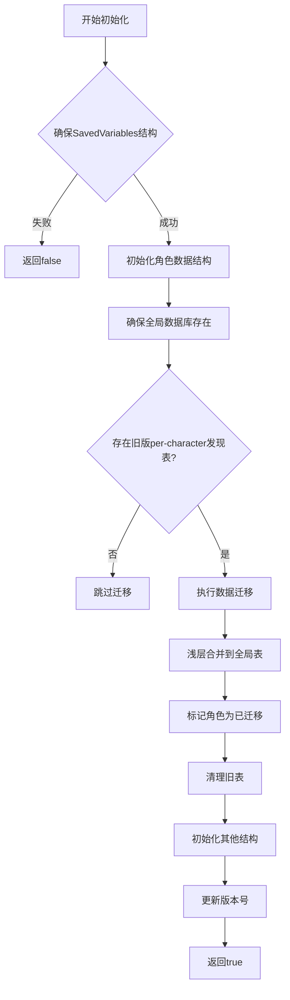

# Accountant_Classic_CurrencyDB 数据结构定义

<cite>
**Referenced Files in This Document**   
- [CurrencyStorage.lua](file://CurrencyTracker/CurrencyStorage.lua)
</cite>

## 目录
1. [简介](#简介)
2. [Accountant_Classic_CurrencyDB 全局存储设计](#accountant_classic_currencydb-全局存储设计)
3. [currencyDiscovery 表结构详解](#currencydiscovery-表结构详解)
4. [全局数据库初始化流程](#全局数据库初始化流程)
5. [跨角色数据共享机制](#跨角色数据共享机制)

## 简介
本文档详细说明了 `Accountant_Classic` 插件中 `Accountant_Classic_CurrencyDB` 的数据结构设计，重点阐述其作为账号范围全局存储的设计目的。文档将深入分析 `currencyDiscovery` 表的结构，解释其如何实现跨角色和跨服务器的数据共享，并详细说明全局数据库的初始化流程。

## Accountant_Classic_CurrencyDB 全局存储设计

`Accountant_Classic_CurrencyDB` 是一个位于全局命名空间 `_G` 下的全局表，其核心设计目的是作为账号范围内的全局存储，用于集中管理所有角色发现的货币信息。这种设计避免了每个角色重复存储已发现的货币信息，实现了数据的统一管理和即时同步。

该全局存储的设计解决了早期版本中每个角色独立存储发现信息的问题。通过将发现数据从每个角色的保存变量（SavedVariables）中迁移至全局表，新创建的角色可以立即继承账号内其他角色已发现的货币信息，无需重新发现。

**Section sources**
- [CurrencyStorage.lua](file://CurrencyTracker/CurrencyStorage.lua#L518-L519)

## currencyDiscovery 表结构详解

`currencyDiscovery` 表是 `Accountant_Classic_CurrencyDB` 的核心子表，用于存储每种已发现货币的元数据。其结构设计如下：

- **id**: 货币的唯一标识符（ID），作为表的主键。
- **name**: 货币的名称，从游戏API中获取或使用默认名称。
- **icon**: 货币图标的文件ID，用于在UI中显示。
- **expansion**: 货币所属的资料片ID，标识其来源资料片。
- **expansionName**: 资料片的名称，提供可读性。
- **patch**: 引入该货币的补丁版本号。
- **category**: 货币的分类，用于组织和过滤。
- **tracked**: 追踪状态，布尔值，表示用户是否选择追踪该货币。

该表的结构设计支持动态发现和元数据填充。当插件检测到一种新货币时，会调用 `SaveDiscoveredCurrency` 函数来填充这些字段，其中 `name` 和 `icon` 会优先从现代API `C_CurrencyInfo.GetCurrencyInfo` 获取，若不可用则使用默认值。

**Section sources**
- [CurrencyStorage.lua](file://CurrencyTracker/CurrencyStorage.lua#L1014-L1035)

## 全局数据库初始化流程

全局数据库的初始化由 `InitializeCurrencyStorage` 函数负责，该函数在插件加载时被调用。其核心流程如下：

1.  **确保基础结构存在**：首先调用 `EnsureSavedVariablesStructure` 函数，确保 `Accountant_ClassicSaveData` 及其服务器、角色层级结构已正确创建。
2.  **初始化角色特定数据**：为当前角色创建 `currencyData` 和 `currencyOptions` 等必要的保存变量结构。
3.  **创建全局数据库**：通过 `or` 操作符确保 `_G.Accountant_Classic_CurrencyDB` 及其 `currencyDiscovery` 子表的存在。如果这些全局表尚不存在，将创建它们。
4.  **执行数据迁移**：检查当前角色的旧版 `currencyDiscovery` 表。如果存在且未被标记为已迁移，则执行一次性的向后兼容迁移，将所有条目浅层合并（shallow merge）到全局的 `currencyDiscovery` 表中。此过程会保留全局表中已有的任何用户设置（如 `tracked` 状态），并最终清理旧的、每角色的发现表以节省空间。
5.  **完成初始化**：创建 `currencyMeta` 表并更新版本号，完成初始化。

此流程确保了无论插件是首次安装还是已有数据，全局数据库都能被正确建立和初始化。

**Diagram sources**
- [CurrencyStorage.lua](file://CurrencyTracker/CurrencyStorage.lua#L491-L547)

**Section sources**
- [CurrencyStorage.lua](file://CurrencyTracker/CurrencyStorage.lua#L491-L547)

## 跨角色数据共享机制

`Accountant_Classic_CurrencyDB` 的设计完美支持了跨角色和跨服务器的数据共享。其核心机制在于：

1.  **全局作用域**：`_G.Accountant_Classic_CurrencyDB` 是一个全局变量，对账号下的所有角色都可见。当一个角色发现新货币并将其信息写入此表后，该信息立即对账号内所有其他角色生效。
2.  **初始化时继承**：每当一个新角色或现有角色登录时，`InitializeCurrencyStorage` 函数都会执行。对于新角色，它会创建一个空的 `currencyDiscovery` 表；对于已有角色，它会检查并执行一次性的数据迁移。关键在于，**所有角色在初始化后，其发现信息的“事实来源”都指向同一个全局表**。
3.  **即时同步**：由于所有角色都读取和写入同一个全局表，因此一个角色的发现操作会即时反映在账号内所有其他角色上。新创建的角色在首次登录时，其 `GetDiscoveredCurrencies` 函数会直接返回全局表的内容，从而自动继承所有已发现的货币信息，实现了无缝的即时同步。

这种设计极大地提升了用户体验，用户无需在每个角色上重复进行货币发现过程，所有信息在账号层面自动同步。

**Section sources**
- [CurrencyStorage.lua](file://CurrencyTracker/CurrencyStorage.lua#L523-L547)