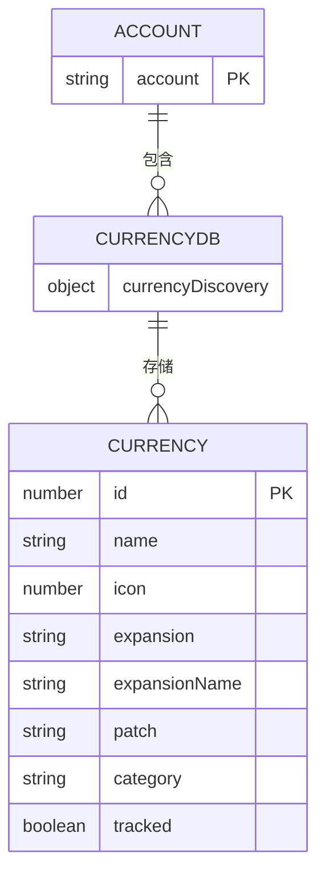
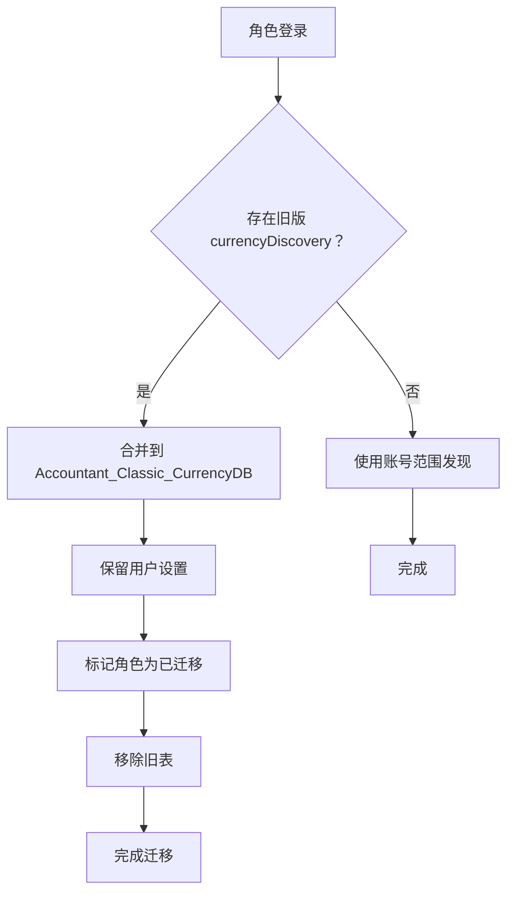

# Accountant_Classic_CurrencyDB 货币发现数据库

<cite>
**本文档引用文件**  
- [CurrencyStorage.lua](file://CurrencyTracker/CurrencyStorage.lua)
- [CurrencyDataManager.lua](file://CurrencyTracker/CurrencyDataManager.lua)
- [CurrencyConstants.lua](file://CurrencyTracker/CurrencyConstants.lua)
- [CurrencyEventHandler.lua](file://CurrencyTracker/CurrencyEventHandler.lua)
</cite>

## 目录
1. [简介](#简介)
2. [Accountant_Classic_CurrencyDB 结构](#accountant_classic_currencydb-结构)
3. [迁移流程分析](#迁移流程分析)
4. [数据一致性保障](#数据一致性保障)
5. [结论](#结论)

## 简介
Accountant_Classic_CurrencyDB 是一个账号范围的全局存储系统，旨在解决每个角色重复存储货币发现信息的冗余问题。该系统通过将货币发现数据从每角色存储迁移到账号范围存储，实现了新发现货币在账号所有角色间的即时同步。本文档详细说明了 currencyDiscovery 表的结构、迁移流程以及数据一致性保障措施。

**Section sources**
- [CurrencyStorage.lua](file://CurrencyTracker/CurrencyStorage.lua#L491-L560)

## Accountant_Classic_CurrencyDB 结构
Accountant_Classic_CurrencyDB 结构是一个新的账号范围全局存储，用于跨所有角色存储发现的货币元数据。此结构的引入消除了货币发现信息的冗余存储，并确保了角色间的一致性。

**Diagram sources**
- [CurrencyStorage.lua](file://CurrencyTracker/CurrencyStorage.lua#L491-L520)
- [CurrencyDataManager.lua](file://CurrencyTracker/CurrencyDataManager.lua#L1-L426)

currencyDiscovery 表包含以下字段：
- **id**: 货币的唯一标识符
- **name**: 货币名称
- **icon**: 货币图标
- **expansion**: 所属资料片
- **expansionName**: 资料片名称
- **patch**: 补丁版本
- **category**: 分类
- **tracked**: 追踪状态

这种结构设计消除了每个角色重复存储货币发现信息的冗余问题，减少了 SavedVariables 的大小，并确保了数据的一致性。

**Section sources**
- [CurrencyStorage.lua](file://CurrencyTracker/CurrencyStorage.lua#L491-L520)
- [CurrencyDataManager.lua](file://CurrencyTracker/CurrencyDataManager.lua#L1-L426)

## 迁移流程分析
迁移过程将货币发现数据从每角色存储迁移到账号范围的 Accountant_Classic_CurrencyDB.currencyDiscovery 表中。该过程在角色登录时触发，确保了用户设置的保留和跨角色数据的合并。

**Diagram sources**
- [CurrencyStorage.lua](file://CurrencyTracker/CurrencyStorage.lua#L520-L560)

迁移流程确保了以下几点：
1. 每个角色发现的所有货币都合并到账号范围存储中
2. 用户偏好（如追踪状态）在迁移过程中得以保留
3. 成功迁移后，旧的每角色发现表被移除
4. 未来的货币发现直接存储在账号范围数据库中

这一变更减少了 SavedVariables 的大小，并确保了新发现的货币立即在账号的所有角色间同步。

**Section sources**
- [CurrencyStorage.lua](file://CurrencyTracker/CurrencyStorage.lua#L520-L560)

## 数据一致性保障
数据一致性通过 CurrencyStorage.lua 中的 Migration 函数来保障。该函数在初始化货币存储时执行，确保了全局发现表的存在，并处理了从旧版每角色存储到新版账号范围存储的迁移。

关键保障措施包括：
- 确保 Accountant_Classic_CurrencyDB 和 currencyDiscovery 表的存在
- 从每角色 currencyDiscovery 表迁移数据到全局表
- 保留用户设置（如追踪偏好）
- 标记角色为已迁移以避免重复合并
- 清理旧的每角色表

这些措施确保了迁移过程的原子性和一致性，防止了数据丢失或重复。

**Section sources**
- [CurrencyStorage.lua](file://CurrencyTracker/CurrencyStorage.lua#L491-L560)

## 结论
Accountant_Classic_CurrencyDB 的引入成功解决了每角色存储货币发现信息的冗余问题。通过将数据迁移到账号范围存储，实现了新发现货币在所有角色间的即时同步。迁移流程设计周密，确保了用户设置的保留和数据的一致性。这一变更不仅减少了 SavedVariables 的大小，还提高了系统的整体效率和用户体验。