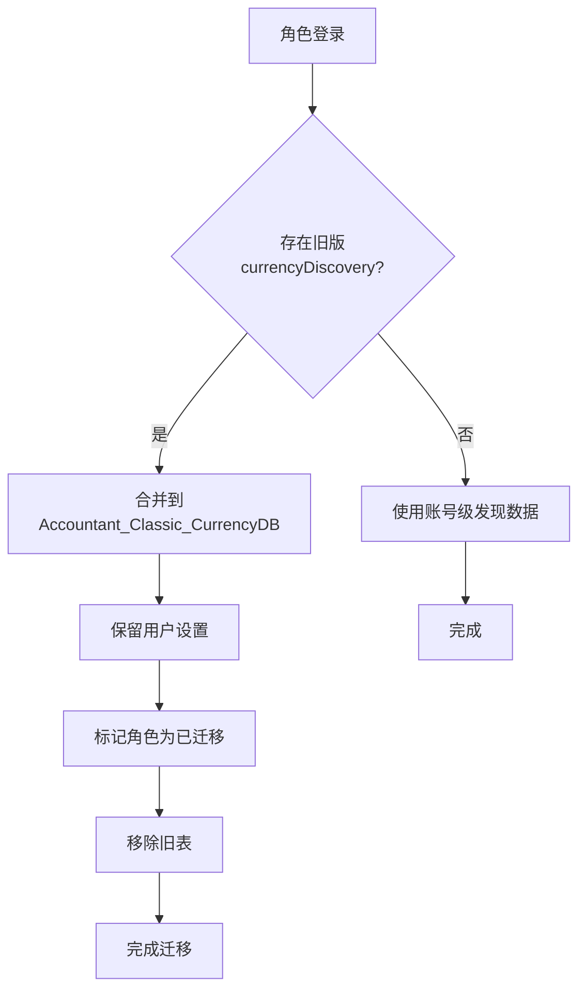
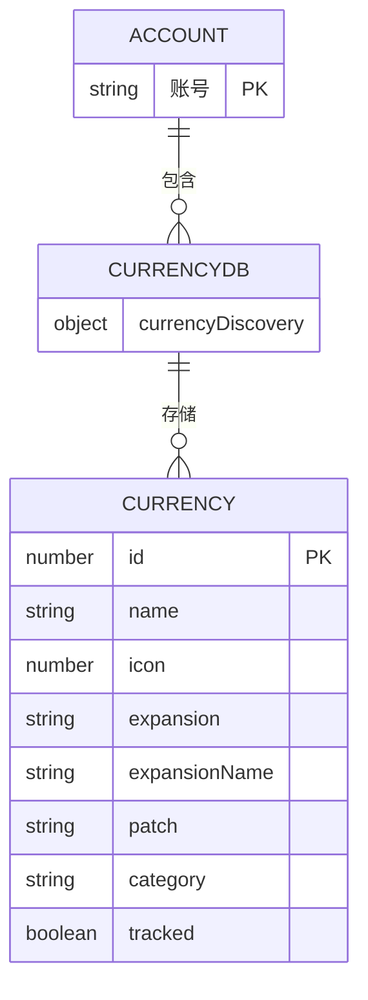

# 从角色级到账号级的迁移流程

<cite>
**本文档引用的文件**
- [CurrencyStorage.lua](file://CurrencyTracker/CurrencyStorage.lua)
- [Saved Variables Schema.md](file://.qoder/repowiki/en/content/Data Model/Saved Variables Schema.md)
</cite>

## 目录
1. [简介](#简介)
2. [迁移流程概述](#迁移流程概述)
3. [合并策略详解](#合并策略详解)
4. [数据清理机制](#数据清理机制)
5. [日志与用户通知](#日志与用户通知)
6. [架构影响与优势](#架构影响与优势)
7. [结论](#结论)

## 简介
Accountant_Classic插件通过将货币发现数据从每角色存储迁移到账号范围存储，实现了数据存储的优化。这一变更通过`CurrencyStorage.lua`文件中的`InitializeCurrencyStorage`函数实现，从根本上解决了数据冗余问题，并实现了新发现货币在账号所有角色间的即时同步。

**Section sources**
- [CurrencyStorage.lua](file://CurrencyTracker/CurrencyStorage.lua#L491-L560)

## 迁移流程概述
迁移流程在角色登录时自动触发，通过`InitializeCurrencyStorage`函数检测是否存在旧版的`currencyDiscovery`表。如果存在且未被标记为已迁移，则启动迁移过程。该流程将角色特定的货币发现数据合并到全局的`Accountant_Classic_CurrencyDB.currencyDiscovery`表中，确保所有角色共享同一份发现数据。

**Diagram sources**
- [CurrencyStorage.lua](file://CurrencyTracker/CurrencyStorage.lua#L520-L560)

**Section sources**
- [CurrencyStorage.lua](file://CurrencyTracker/CurrencyStorage.lua#L491-L560)

## 合并策略详解
迁移过程采用浅层合并（shallow merge）策略，确保数据一致性。合并规则如下：优先保留全局数据，仅当目标字段为空时才从源数据填充。对于`tracked`状态的迁移，系统会保留用户设置，仅在全局数据中该字段为空时才从角色数据中获取。

**Diagram sources**
- [CurrencyStorage.lua](file://CurrencyTracker/CurrencyStorage.lua#L491-L520)
- [CurrencyDataManager.lua](file://CurrencyTracker/CurrencyDataManager.lua#L1-L426)

**Section sources**
- [CurrencyStorage.lua](file://CurrencyTracker/CurrencyStorage.lua#L520-L560)

## 数据清理机制
迁移完成后，系统通过设置`_migrated`标记防止重复迁移，并将原`currencyDiscovery`表置为nil以释放内存。这一机制确保了迁移过程的幂等性，避免了数据重复和内存泄漏。

**Section sources**
- [CurrencyStorage.lua](file://CurrencyTracker/CurrencyStorage.lua#L540-L560)

## 日志与用户通知
迁移过程包含详细的日志输出和用户通知机制。系统通过`SafeLogDebug`函数记录迁移过程中的关键步骤，并通过聊天框向用户显示迁移完成的通知，确保用户知晓迁移状态。

**Section sources**
- [CurrencyStorage.lua](file://CurrencyTracker/CurrencyStorage.lua#L550-L560)

## 架构影响与优势
此变更从根本上解决了数据冗余问题，将原本每个角色都存储的发现数据集中到账号级存储中。这不仅减少了SavedVariables的大小，还实现了新发现货币在账号所有角色间的即时同步，提升了用户体验。

**Section sources**
- [CurrencyStorage.lua](file://CurrencyTracker/CurrencyStorage.lua#L491-L560)

## 结论
从角色级到账号级的迁移流程通过精心设计的合并策略和清理机制，成功实现了数据存储的优化。这一变更不仅解决了数据冗余问题，还为用户提供了更一致和高效的货币跟踪体验。

**Section sources**
- [CurrencyStorage.lua](file://CurrencyTracker/CurrencyStorage.lua#L491-L560)