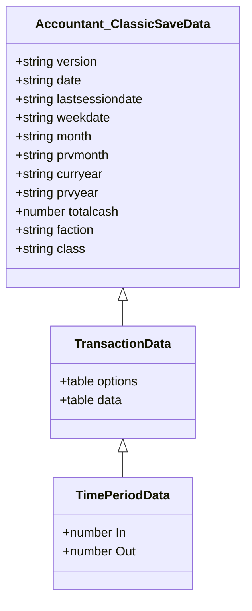
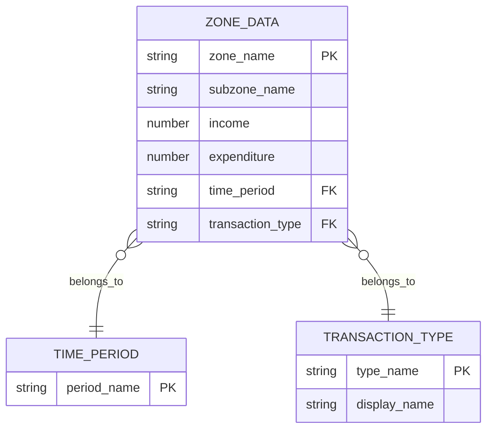
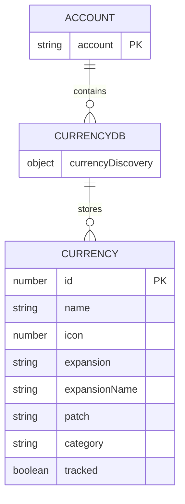
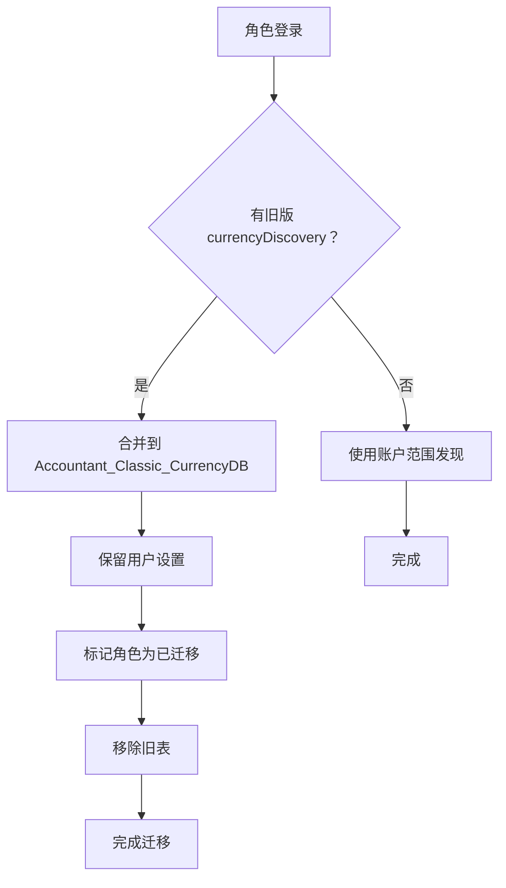

# 数据模型与存储

<cite>
**本文档引用的文件**  
- [Core.lua](file://Core/Core.lua)
- [Constants.lua](file://Core/Constants.lua)
- [CurrencyStorage.lua](file://CurrencyTracker/CurrencyStorage.lua)
</cite>

## 目录
1. [Accountant_ClassicSaveData 结构](#accountant_classicsavedata-结构)
2. [Accountant_ClassicZoneDB 结构](#accountant_classiczonedb-结构)
3. [Accountant_Classic_CurrencyDB 结构](#accountant_classic_currencydb-结构)
4. [默认值初始化机制](#默认值初始化机制)
5. [数据完整性检查与修复流程](#数据完整性检查与修复流程)
6. [示例数据片段](#示例数据片段)

## Accountant_ClassicSaveData 结构

Accountant_ClassicSaveData 是用于存储角色财务记录的主要数据结构，采用服务器、角色和交易级别的分层组织方式。

### 分层结构
该数据结构分为三个层级：
- **服务器层级**：代表服务器名称的顶级键
- **角色层级**：代表角色名称的二级键
- **数据层级**：包含选项和交易数据

```lua
Accountant_ClassicSaveData = {
  ["服务器名称"] = {
    ["角色名称"] = {
      options = { },
      data = { },
      currencyData = { },
      currencyOptions = { }
    }
  }
}
```

### 选项结构
options 表包含角色特定的配置和元数据：

**字段定义：**
- :version: 字符串，表示数据上次保存时的插件版本
- :date: 字符串，格式为 "dd/mm/yy"，表示当前日期
- :lastsessiondate: 字符串，表示上一次会话的日期
- :weekdate: 字符串，表示当前周的开始日期
- :month: 字符串，表示当前月份 (1-12)
- :curryear: 字符串，表示当前年份
- :totalcash: 数字，表示角色累计的总金额
- :faction: 字符串，表示角色阵营（如 "Alliance", "Horde"）
- :class: 字符串，表示角色职业

**Section sources**
- [Core.lua](file://Core/Core.lua#L100-L115)
- [Constants.lua](file://Core/Constants.lua#L20-L45)

### 交易数据结构
data 表包含按类型和时间段分类的财务交易：



**Diagram sources**
- [Core.lua](file://Core/Core.lua#L1042-L1078)
- [Constants.lua](file://Core/Constants.lua#L50-L52)

## Accountant_ClassicZoneDB 结构

Accountant_ClassicZoneDB 存储基于地理位置的交易数据，支持按游戏世界中的地理位置分析财务活动。

### 区域数据层级
区域数据库采用与主保存数据类似的分层结构：

```lua
Accountant_ClassicZoneDB = {
  ["服务器名称"] = {
    ["角色名称"] = {
      data = { }
    }
  }
}
```

### 基于位置的交易存储
对于每个时间段和交易类型，系统会按区域跟踪财务数据：

**字段定义：**
- :data: 包含时间段桶的表
- :time_period: Constants.logmodes 中的值之一
- :transaction_type: Constants.logtypes 中的值之一
- :zone_name: 字符串，表示区域或子区域名称
- :In: 数字，表示该区域的收入
- :Out: 数字，表示该区域的支出

当启用位置跟踪（由 trackzone 配置选项控制）时，交易会记录其地理位置上下文。如果启用了 tracksubzone，则还会捕获子区域信息。



**Diagram sources**
- [Core.lua](file://Core/Core.lua#L239-L265)
- [Core.lua](file://Core/Core.lua#L1122-L1148)

## Accountant_Classic_CurrencyDB 结构

Accountant_Classic_CurrencyDB 是一个新的账户范围全局存储，用于跨所有角色保存已发现的货币元数据。此结构的引入是为了消除货币发现信息的冗余存储，并确保角色间的一致性。



**Diagram sources**
- [CurrencyStorage.lua](file://CurrencyTracker/CurrencyStorage.lua#L491-L520)
- [CurrencyDataManager.lua](file://CurrencyTracker/CurrencyDataManager.lua#L1-L426)

迁移过程将货币发现数据从每个角色的存储迁移到账户范围的 `Accountant_Classic_CurrencyDB.currencyDiscovery` 表：



**Diagram sources**
- [CurrencyStorage.lua](file://CurrencyTracker/CurrencyStorage.lua#L520-L560)

迁移过程确保：
1. 每个角色发现的所有货币都合并到账户范围的存储中
2. 迁移期间保留用户偏好（如跟踪状态）
3. 成功迁移后移除旧的每个角色发现表
4. 未来的货币发现直接存储在账户范围的数据库中

此更改减少了 SavedVariables 的大小，并确保新发现的货币立即在账户上的所有角色间可用。

**Section sources**
- [CurrencyStorage.lua](file://CurrencyTracker/CurrencyStorage.lua#L491-L560)
- [CurrencyDataManager.lua](file://CurrencyTracker/CurrencyDataManager.lua#L1-L426)

## 默认值初始化机制

系统通过 `AccountantClassicDefaultOptions` 表实现默认值初始化机制。当角色首次登录时，系统会创建必要的数据结构并用默认值填充。初始化过程通过将当前配置文件与 `AccountantClassicDefaultOptions` 进行比较来确保所有必需字段都存在。任何缺失的字段都会用默认值填充，从而在添加新功能时保持向后兼容性。

**Section sources**
- [Core.lua](file://Core/Core.lua#L262-L304)
- [Core.lua](file://Core/Core.lua#L849-L983)

## 数据完整性检查与修复流程

系统在每次插件加载和 UI 更新时检查时间段滚动（日、周、月、年），以维护不同时间框架内的准确财务记录。当检测到滚动时，系统：
1. 将当前周期数据复制到相应的“前一”周期
2. 将当前周期数据重置为零
3. 更新选项表中的日期跟踪字段

这确保了财务数据按时间段准确分割，同时保留历史记录。

**Section sources**
- [Core.lua](file://Core/Core.lua#L849-L983)

## 示例数据片段

```json
{
  "ServerName": {
    "CharacterName": {
      "options": {
        "version": "3.00.00",
        "date": "01/01/23",
        "lastsessiondate": "01/01/23",
        "weekdate": "12/31/22",
        "month": "01",
        "curryear": "2023",
        "totalcash": 1000000,
        "faction": "Alliance",
        "class": "Mage"
      },
      "data": {
        "Session": {
          "TRAIN": { "In": 0, "Out": 5000 },
          "TAXI": { "In": 0, "Out": 2000 }
        },
        "Day": {
          "QUEST": { "In": 15000, "Out": 0 },
          "LOOT": { "In": 8000, "Out": 0 }
        }
      }
    }
  }
}
```