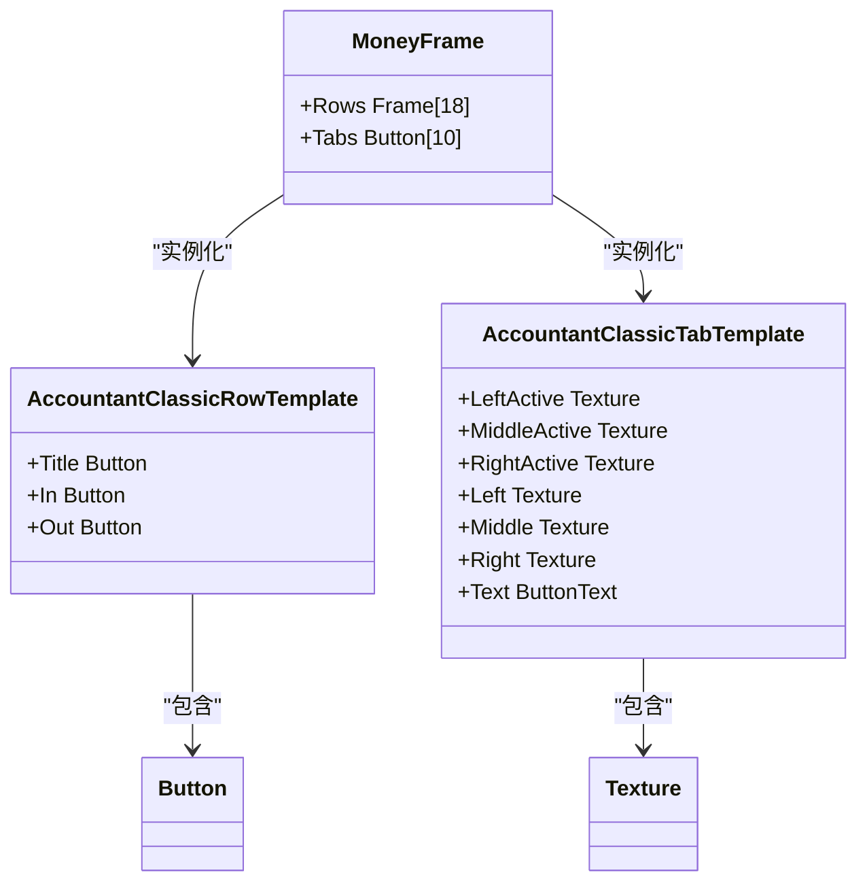

# 主窗口 (MoneyFrame)

<cite>
**本文档中引用的文件**   
- [MoneyFrame.lua](file://Core/MoneyFrame.lua)
- [Template.xml](file://Core/Template.xml)
- [Constants.lua](file://Core/Constants.lua)
- [Core.lua](file://Core/Core.lua)
</cite>

## 目录
1. [简介](#简介)
2. [布局结构与UI模板](#布局结构与ui模板)
3. [标签页组织与数据源绑定](#标签页组织与数据源绑定)
4. [表格控件渲染流程](#表格控件渲染流程)
5. [交互行为实现](#交互行为实现)
6. [配置项与外观设置](#配置项与外观设置)
7. [扩展与安全实践](#扩展与安全实践)

## 简介
主窗口MoneyFrame是Accountant_Classic插件的核心用户界面组件，提供玩家金币收支的实时可视化跟踪。该窗口通过XML定义其布局结构，并继承自Template.xml中的UI模板机制。Lua脚本负责窗口的初始化逻辑，包括事件注册、配置加载和UI元素的动态更新。窗口支持多种时间窗口（如会话、今日、本周等）的数据展示，并通过标签页进行组织。本文档详细描述了MoneyFrame的实现细节，为开发者提供扩展和维护的指导。

**Section sources**
- [MoneyFrame.lua](file://Core/MoneyFrame.lua#L1-L168)
- [Core.lua](file://Core/Core.lua#L1-L2306)

## 布局结构与UI模板
MoneyFrame的布局结构在XML文件中定义，遵循World of Warcraft的UI框架规范。主窗口继承自Template.xml中定义的`AccountantClassicRowTemplate`和`AccountantClassicTabTemplate`，确保了视觉风格的一致性。`AccountantClassicRowTemplate`定义了表格行的通用结构，包括标题、收入和支出三列，每列包含一个FontString用于显示文本。`AccountantClassicTabTemplate`定义了标签页的外观，使用Blizzard的UI Atlas纹理（如`uiframe-tab-left`、`uiframe-tab-center`）来创建标准的选项卡样式。主窗口的XML定义了18个数据行和10个标签页，通过`inherits`属性复用模板，减少了代码重复。

**Diagram sources**
- [Template.xml](file://Core/Template.xml#L26-L179)
- [Core.xml](file://Core/Core.xml#L493-L574)

## 标签页组织与数据源绑定
MoneyFrame的标签页按时间窗口组织，包括“会话”、“今日”、“昨日”、“本周”、“上周”、“本月”、“上月”、“本年”、“去年”和“总计”。这些标签页的文本和提示信息在Constants.lua中定义，通过`constants.tabText`和`constants.tabTooltipText`表进行管理。每个标签页对应一个特定的日志模式（log mode），如`"Session"`、`"Day"`、`"Week"`等。当用户点击某个标签页时，窗口会根据当前选择的时间窗口从数据库中加载相应的数据。数据源是分层的，顶层是服务器和角色，底层是具体的收支记录。Lua脚本中的`settleTabText()`函数负责设置标签页的文本，并根据游戏版本（经典版或零售版）调整布局。

**Section sources**
- [Constants.lua](file://Core/Constants.lua#L1-L260)
- [Core.lua](file://Core/Core.lua#L1-L2306)

## 表格控件渲染流程
表格控件的渲染流程包括列头定义、数据行生成和动态更新三个阶段。列头在XML中静态定义，包括“来源”、“收入”和“支出”三列。数据行的生成在Lua脚本中完成，`createACFrames()`函数创建18个数据行实例，并将它们锚定在主窗口上。`setLabels()`函数负责设置每一行的标签，根据当前标签页的模式从`AC_DATA`表中获取对应的标题。动态更新通过事件驱动实现，当监听到`PLAYER_MONEY`或`CHAT_MSG_MONEY`等事件时，`updateLog()`函数会被调用，计算新的收支数据并更新UI。为了优化性能，只有在数据实际发生变化时才会触发UI更新，避免了不必要的字符串操作和渲染。

**Section sources**
- [Core.lua](file://Core/Core.lua#L1-L2306)

## 交互行为实现
MoneyFrame的交互行为包括拖拽移动、缩放、最小化和关闭操作。拖拽移动通过注册`OnMouseDown`和`OnMouseUp`脚本实现：当用户左键点击并拖动窗口时，`StartMoving()`被调用；当鼠标释放时，`StopMovingOrSizing()`被调用，并将新的位置保存到数据库中。缩放功能通过配置项`scale`和`alpha`控制，用户可以在设置界面中调整窗口的大小和透明度。最小化和关闭操作通过窗口右上角的按钮实现，点击后会隐藏窗口。为了防止在战斗中意外移动UI，窗口在`PLAYER_REGEN_DISABLED`事件触发时会进入锁定状态，禁用移动功能，直到`PLAYER_REGEN_ENABLED`事件触发后才恢复。

**Section sources**
- [MoneyFrame.lua](file://Core/MoneyFrame.lua#L70-L78)
- [MoneyFrame.lua](file://Core/MoneyFrame.lua#L155-L168)

## 配置项与外观设置
窗口的外观由多个配置项控制，这些配置项存储在`Constants.lua`的`constants.defaults`表中。`scale`和`alpha`控制窗口的整体缩放比例和透明度，默认值分别为1和1。`infoscale`和`infoalpha`控制浮动金钱窗口的缩放和透明度。`AcFramePoint`和`MnyFramePoint`存储窗口和浮动窗口的位置信息。这些配置项在`arrangeAccountantClassicFrame()`和`ArrangeMoneyInfoFrame()`函数中被应用到UI元素上。例如，`SetScale()`和`SetAlpha()`方法根据配置值设置窗口的缩放和透明度，`SetPoint()`方法根据`AcFramePoint`中的坐标信息定位窗口。

**Section sources**
- [Constants.lua](file://Core/Constants.lua#L1-L260)
- [MoneyFrame.lua](file://Core/MoneyFrame.lua#L136-L153)

## 扩展与安全实践
为开发者提供扩展新标签页或修改现有布局的安全实践指南。首先，应避免直接修改AceGUI或游戏UI的核心代码，而是通过插件的事件系统和API进行交互。其次，添加新标签页时，应在`Constants.lua`中定义新的日志模式和标签文本，并在`Core.lua`中注册相应的事件监听器。最后，修改布局时应使用XML模板继承机制，而不是在Lua中硬编码UI元素的位置和大小。这可以确保布局的一致性和可维护性。此外，所有对数据库的写操作都应进行错误处理，防止因数据损坏导致插件崩溃。

**Section sources**
- [Constants.lua](file://Core/Constants.lua#L1-L260)
- [Core.lua](file://Core/Core.lua#L1-L2306)