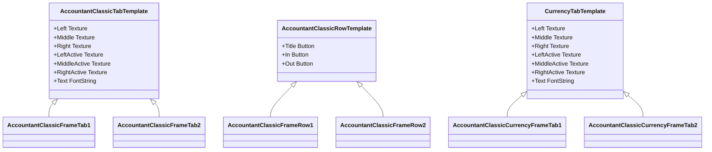

# 用户界面组件

<cite>
**本文档引用的文件**   
- [MoneyFrame.lua](file://Core/MoneyFrame.lua)
- [Core.lua](file://Core/Core.lua)
- [CurrencyFrame.lua](file://CurrencyTracker/CurrencyFrame.lua)
- [CurrencyFrame.xml](file://CurrencyTracker/CurrencyFrame.xml)
- [Core.xml](file://Core/Core.xml)
- [CurrencyTemplate.xml](file://CurrencyTracker/CurrencyTemplate.xml)
- [Template.xml](file://Core/Template.xml)
- [Config.lua](file://Core/Config.lua)
- [Constants.lua](file://Core/Constants.lua)
- [CurrencyConstants.lua](file://CurrencyTracker/CurrencyConstants.lua)
</cite>

## 目录
1. [简介](#简介)
2. [主窗口MoneyFrame布局结构](#主窗口moneyframe布局结构)
3. [标签页组织与时间窗口划分](#标签页组织与时间窗口划分)
4. [表格渲染逻辑](#表格渲染逻辑)
5. [最小化地图按钮交互行为](#最小化地图按钮交互行为)
6. [CurrencyFrame CLI输出界面](#currencyframe-cli输出界面)
7. [XML模板继承与样式定义](#xml模板继承与样式定义)
8. [组件属性与配置方式](#组件属性与配置方式)
9. [交互行为说明](#交互行为说明)
10. [UI外观定制指南](#ui外观定制指南)

## 简介
本用户界面组件文档详细描述了Accountant_Classic插件中的可视化元素设计与实现。文档重点分析了主窗口MoneyFrame的布局结构、标签页组织方式（按时间窗口划分）以及表格渲染逻辑。同时，文档解释了最小化地图按钮的创建过程及其左右键点击行为（左键打开主窗口，右键打开配置菜单），并描述了CurrencyFrame提供的CLI输出界面如何展示货币数据。通过分析XML模板文件，说明了UI元素的继承关系和样式定义。文档还提供了各组件的属性（如尺寸、位置、透明度）及其配置方式，包含窗口拖拽、缩放和关闭等交互行为说明。最后，为希望定制UI外观的用户提供了安全的样式覆盖方法和避免冲突的最佳实践指南。

## 主窗口MoneyFrame布局结构

主窗口MoneyFrame的布局结构基于XML模板文件定义，采用分层设计模式。核心布局在Core.xml文件中定义，包含背景纹理、标题文本、数据展示区域和控制按钮。窗口尺寸固定为640x512像素，锚点位于屏幕左上角偏移(0, -104)位置。布局分为三个主要区域：顶部包含角色头像和标题文本，中部为数据滚动区域，底部为功能按钮和标签页。数据区域使用FauxScrollFrameTemplate实现滚动功能，支持18行数据展示。窗口通过继承AccountantClassicRowTemplate模板创建数据行，每行包含三个按钮：标题、收入和支出，分别对应不同的数据字段。这种结构化的布局确保了界面的一致性和可维护性。

**Section sources**
- [Core.xml](file://Core/Core.xml#L1-L627)
- [Template.xml](file://Core/Template.xml#L1-L180)

## 标签页组织与时间窗口划分

标签页组织采用双行布局设计，按时间窗口划分数据展示。主窗口包含11个标签页，前10个按时间维度组织，最后一个为"所有角色"视图。第一行包含Session、Day、Week、Month、Year和Total六个标签页，第二行包含PrvDay、PrvWeek、PrvMonth、PrvYear四个标签页，形成清晰的时间序列。标签页通过继承AccountantClassicTabTemplate实现统一的视觉风格，包括背景纹理、高亮效果和文本样式。标签页的激活状态通过切换纹理图集（uiframe-activetab-*）实现，确保用户能清晰识别当前选中的时间窗口。这种组织方式使用户能够快速在不同时间范围的数据间切换，便于财务分析和比较。

**Section sources**
- [Core.xml](file://Core/Core.xml#L1-L627)
- [Template.xml](file://Core/Template.xml#L1-L180)
- [Constants.lua](file://Core/Constants.lua#L1-L261)

## 表格渲染逻辑

表格渲染逻辑由CurrencyFrame模块实现，采用动态数据绑定和虚拟滚动技术。渲染过程从ApplyHeaderLabels函数开始，该函数负责应用本地化的表头标签并确保表头与数据行的对齐一致。表头包含五个字段：货币名称、上限、收入、支出和净额，每个字段都有固定的X坐标和宽度。数据行通过UpdateScrollFrame函数更新，该函数根据当前视图模式（所有货币或单个货币）加载相应的数据。对于单个货币模式，显示摘要行和来源行；对于所有货币模式，显示多个货币的汇总数据。表格使用FauxScrollFrame实现虚拟滚动，只渲染可见行，提高性能。每行数据通过设置文本、图标和对齐方式来呈现，数字字段右对齐，货币名称左对齐，确保视觉一致性。

**Section sources**
- [CurrencyFrame.lua](file://CurrencyTracker/CurrencyFrame.lua#L1-L1220)
- [CurrencyFrame.xml](file://CurrencyTracker/CurrencyFrame.xml#L1-L673)

## 最小化地图按钮交互行为

最小化地图按钮的交互行为通过事件驱动机制实现。按钮的创建在MoneyFrame模块中完成，通过createMoneyFrame函数创建一个可移动的UI框架。左键点击行为由frame_OnMouseDown函数处理，当检测到左键点击时，调用StartMoving方法启动窗口拖拽功能，允许用户重新定位窗口。右键点击行为同样在frame_OnMouseDown中处理，当检测到右键点击时，调用AccountantClassic_ButtonOnClick函数打开主配置菜单。按钮还支持鼠标悬停显示工具提示，显示当前会话的收入和支出统计。为防止战斗中意外移动，模块注册了PLAYER_REGEN_ENABLED和PLAYER_REGEN_DISABLED事件，当进入战斗时设置isInLockdown标志，阻止移动操作。这种设计确保了用户交互的直观性和安全性。

**Section sources**
- [MoneyFrame.lua](file://Core/MoneyFrame.lua#L1-L169)
- [Core.lua](file://Core/Core.lua#L1-L2335)

## CurrencyFrame CLI输出界面

CurrencyFrame提供的CLI输出界面通过PrintMultipleCurrencies和PrintCurrencyData函数实现，将货币数据以文本形式输出到聊天窗口。界面设计遵循简洁明了的原则，首先输出当前视图的标题，然后按行输出每个货币的数据。每行包含货币名称、收入、支出和净额，使用制表符分隔，确保对齐。数字使用FormatThousands函数格式化，添加千位分隔符提高可读性。对于单个货币的详细视图，还包含来源行，显示每个收入来源的具体金额。输出内容与UI界面保持一致，包括相同的字段和格式，确保用户在不同界面间获得一致的信息体验。CLI输出作为UI的补充，为用户提供了一种快速查看和分享数据的方式。

**Section sources**
- [CurrencyFrame.lua](file://CurrencyTracker/CurrencyFrame.lua#L1-L1220)
- [CurrencyCore.lua](file://CurrencyTracker/CurrencyCore.lua#L1-L1414)

## XML模板继承与样式定义

XML模板继承与样式定义通过虚拟模板（virtual="true"）机制实现，确保UI元素的一致性和可维护性。核心模板定义在Template.xml和CurrencyTemplate.xml文件中，包括AccountantClassicTabTemplate、AccountantClassicRowTemplate和CurrencyTabTemplate。这些模板使用atlas纹理实现现代化的视觉效果，如三切片标签背景（uiframe-tab-*）和活动状态指示器（uiframe-activetab-*）。样式定义包括文本对齐、字体样式、纹理布局和交互效果。例如，标签模板定义了左、中、右三个纹理切片，通过相对定位实现自适应宽度。行模板定义了按钮布局和文本样式，确保数据行的一致性。通过继承这些模板，具体UI元素（如标签和数据行）获得统一的外观和行为，同时允许通过重写特定属性进行定制。

**Diagram sources**
- [Template.xml](file://Core/Template.xml#L1-L180)
- [CurrencyTemplate.xml](file://CurrencyTracker/CurrencyTemplate.xml#L1-L77)

## 组件属性与配置方式

组件属性通过配置文件和用户界面进行管理，支持运行时修改。核心属性包括尺寸（scale）、位置（point）、透明度（alpha）和可见性（showmoneyinfo）。这些属性存储在数据库配置文件中，通过profile对象访问。尺寸和透明度通过滑块控件调整，范围分别为0.5-1.75和0.1-1.0，以百分比形式显示。位置通过窗口拖拽自动保存，记录锚点、相对点和偏移量。配置方式分为两种：通过Config.lua中的选项表在设置界面调整，或通过代码直接修改profile值。例如，infoscale属性控制浮动信息框的大小，infoalpha控制其透明度。所有属性修改后立即生效，无需重启游戏，提供即时的视觉反馈。这种灵活的配置系统使用户能够根据个人偏好定制界面外观。

**Section sources**
- [Config.lua](file://Core/Config.lua#L1-L431)
- [MoneyFrame.lua](file://Core/MoneyFrame.lua#L1-L169)
- [Constants.lua](file://Core/Constants.lua#L1-L261)

## 交互行为说明

交互行为涵盖窗口拖拽、缩放和关闭等基本操作。窗口拖拽通过注册左键拖拽事件实现，当用户按住左键拖动时，调用StartMoving方法启动移动模式，松开时通过OnMouseUp调用StopMovingOrSizing并保存新位置。缩放功能通过尺寸滑块控件实现，用户调整滑块值后，系统调用SetScale方法应用新尺寸。关闭行为由关闭按钮触发，调用HideUIPanel隐藏窗口。所有交互都考虑了用户体验和游戏规则，例如在战斗中禁用窗口移动，防止玩家在战斗中分心。此外，还实现了鼠标悬停显示工具提示、点击标签页切换视图等辅助交互。这些行为通过事件监听和回调函数实现，确保响应及时且可靠。交互逻辑与数据更新分离，保证界面操作不会影响数据准确性。

**Section sources**
- [MoneyFrame.lua](file://Core/MoneyFrame.lua#L1-L169)
- [Core.xml](file://Core/Core.xml#L1-L627)
- [Core.lua](file://Core/Core.lua#L1-L2335)

## UI外观定制指南

为希望定制UI外观的用户提供以下安全的样式覆盖方法和最佳实践。首先，建议通过设置界面调整现有属性，如尺寸、透明度和位置，避免直接修改代码。其次，若需深度定制，应在插件目录创建自定义样式文件，通过继承现有模板进行修改，而非直接编辑原文件。例如，创建CustomTemplate.xml文件，定义新的标签模板，然后在自定义窗口中引用。避免冲突的最佳实践包括：使用唯一的命名空间前缀，如"Custom_"；在修改前备份原文件；测试时使用测试角色；遵循插件更新策略，记录自定义更改以便在更新后重新应用。此外，建议使用配置文件存储自定义设置，而非硬编码值，便于迁移和共享。通过这些方法，用户可以在保持插件稳定性的前提下，实现个性化的UI外观。

**Section sources**
- [Config.lua](file://Core/Config.lua#L1-L431)
- [Template.xml](file://Core/Template.xml#L1-L180)
- [CurrencyTemplate.xml](file://CurrencyTracker/CurrencyTemplate.xml#L1-L77)