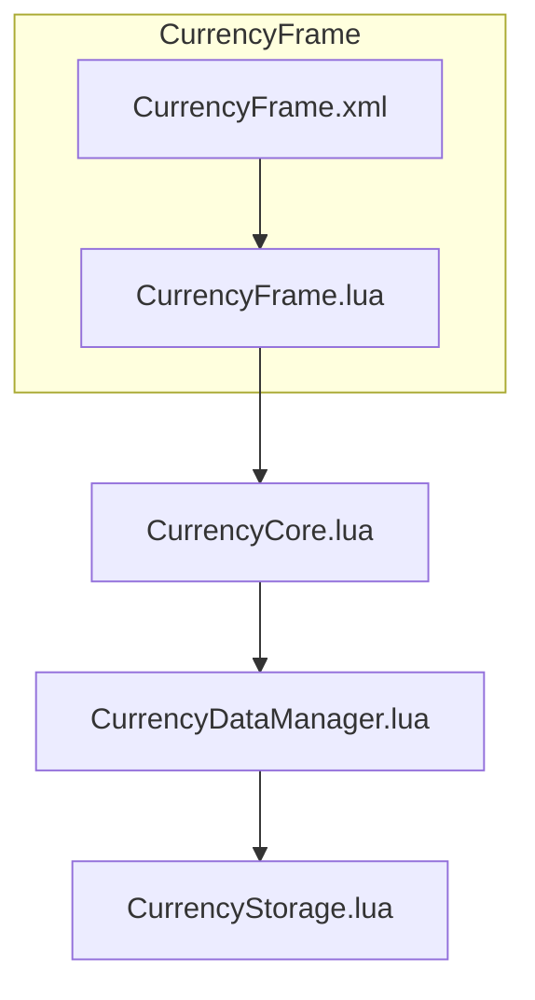
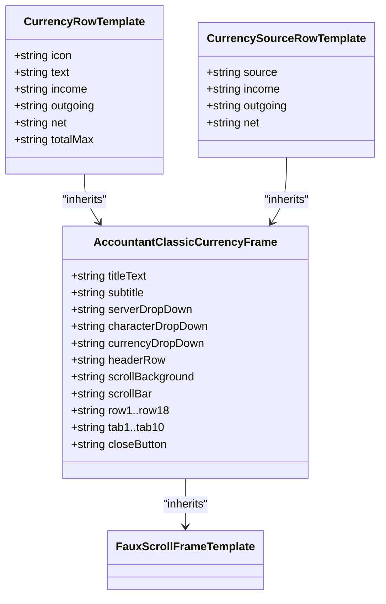
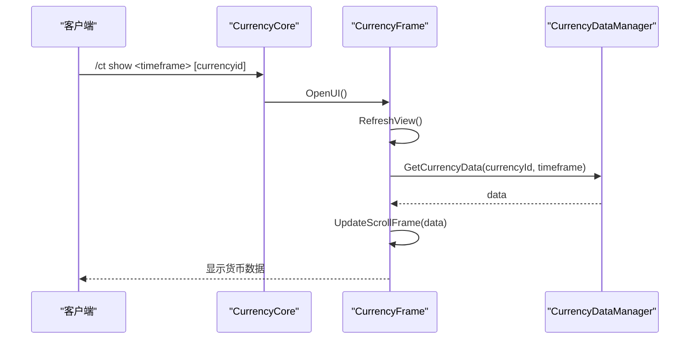
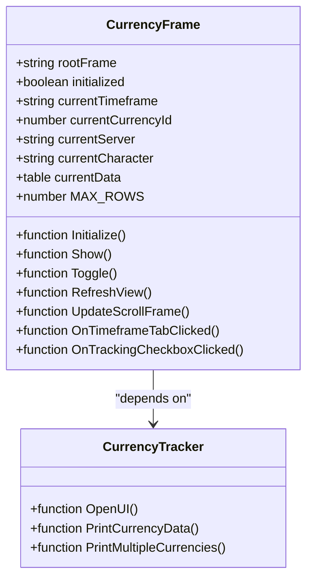
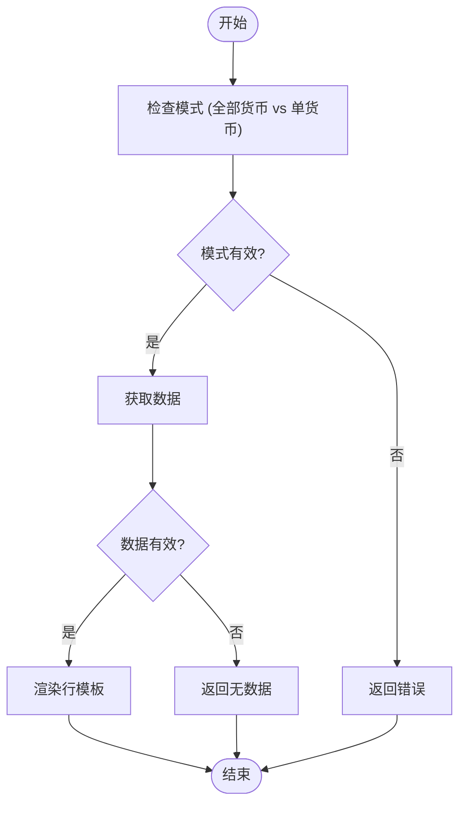
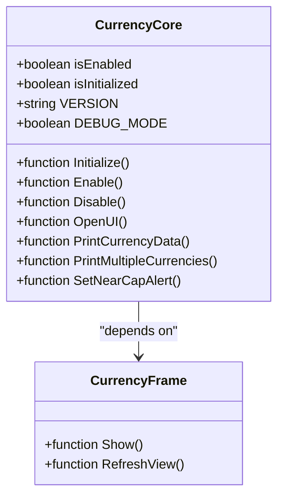
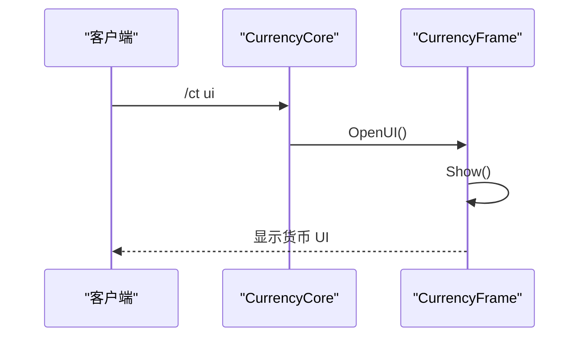
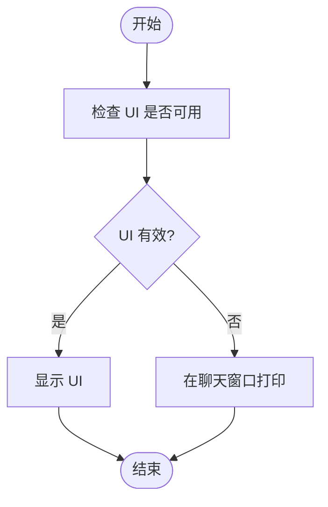
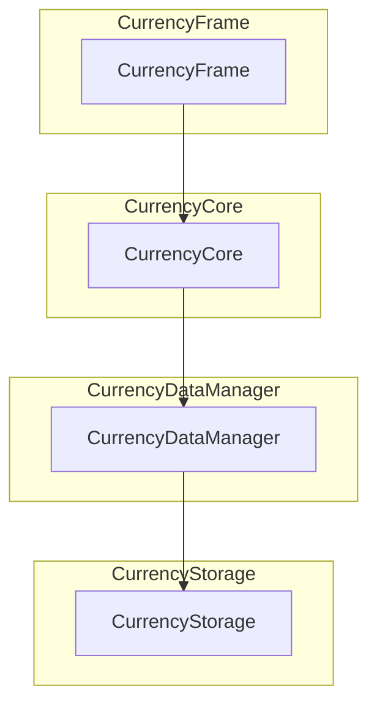

# 货币跟踪界面 (CurrencyFrame)

<cite>
**本文档引用的文件**   
- [CurrencyFrame.xml](file://CurrencyTracker/CurrencyFrame.xml)
- [CurrencyFrame.lua](file://CurrencyTracker/CurrencyFrame.lua)
- [CurrencyCore.lua](file://CurrencyTracker/CurrencyCore.lua)
</cite>

## 目录
1. [简介](#简介)
2. [项目结构](#项目结构)
3. [核心组件](#核心组件)
4. [架构概述](#架构概述)
5. [详细组件分析](#详细组件分析)
6. [依赖分析](#依赖分析)
7. [性能考虑](#性能考虑)
8. [故障排除指南](#故障排除指南)
9. [结论](#结论)
10. [附录](#附录)（如有必要）

## 简介
货币跟踪界面 (CurrencyFrame) 是 Accountant_Classic 插件中用于展示货币跟踪数据的命令行交互式用户界面。该界面通过 XML 定义的容器结构和 Lua 实现的渲染逻辑，为用户提供清晰的货币数据展示。用户可以通过输入 `/ct` 命令来触发数据展示，界面支持动态文本输出、文本滚动、颜色编码和清屏功能。本文档详细描述了 CurrencyFrame 的设计目的、实现方式以及如何扩展命令输出样式。

## 项目结构
CurrencyFrame 模块由两个主要文件组成：`CurrencyFrame.xml` 和 `CurrencyFrame.lua`。`CurrencyFrame.xml` 负责定义界面的静态布局和模板，包括主框架、行模板和时间范围按钮。`CurrencyFrame.lua` 则负责控制逻辑和数据绑定，包括初始化、显示/隐藏窗口、下拉菜单和时间范围按钮的回调处理、以及根据当前模式和时间范围调用数据获取器并渲染行模板。

**Section sources**
- [CurrencyFrame.xml](file://CurrencyTracker/CurrencyFrame.xml#L1-L673)
- [CurrencyFrame.lua](file://CurrencyTracker/CurrencyFrame.lua#L1-L1220)

## 核心组件
CurrencyFrame 的核心组件包括主框架、行模板、滚动区域和时间范围按钮。主框架定义了界面的尺寸、贴图、标题和关闭按钮。行模板分为 `CurrencyRowTemplate` 和 `CurrencySourceRowTemplate`，分别用于全部货币模式和单货币模式。滚动区域使用 `FauxScrollFrameTemplate` 来支持大数据量的滚动。时间范围按钮则允许用户选择不同的时间范围来查看货币数据。

**Section sources**
- [CurrencyFrame.xml](file://CurrencyTracker/CurrencyFrame.xml#L1-L673)
- [CurrencyFrame.lua](file://CurrencyTracker/CurrencyFrame.lua#L1-L1220)

## 架构概述
CurrencyFrame 的架构设计遵循了模块化和可扩展的原则。XML 文件负责静态布局和模板声明，确保视觉风格与 Gold UI 一致。Lua 文件负责控制逻辑和数据绑定，通过 `Initialize()`、`Show()`、`Toggle()` 等方法提供对外接口。`RefreshView()` 方法根据当前模式和时间范围调用数据获取器并渲染行模板。追踪复选框的处理逻辑与存储更新（写入 `discovered.tracked`）也在 Lua 文件中实现。

**Diagram sources **
- [CurrencyFrame.xml](file://CurrencyTracker/CurrencyFrame.xml#L1-L673)
- [CurrencyFrame.lua](file://CurrencyTracker/CurrencyFrame.lua#L1-L1220)
- [CurrencyCore.lua](file://CurrencyTracker/CurrencyCore.lua#L1-L1414)

## 详细组件分析

### CurrencyFrame.xml 分析
`CurrencyFrame.xml` 定义了界面的静态布局和模板。主框架 `AccountantClassicCurrencyFrame` 包含了尺寸、贴图、标题、关闭按钮等元素。行模板 `CurrencyRowTemplate` 和 `CurrencySourceRowTemplate` 分别用于全部货币模式和单货币模式。滚动区域 `AccountantClassicCurrencyScrollBar` 使用 `FauxScrollFrameTemplate` 来支持大数据量的滚动。时间范围按钮则允许用户选择不同的时间范围来查看货币数据。

#### 对象导向组件：

**Diagram sources **
- [CurrencyFrame.xml](file://CurrencyTracker/CurrencyFrame.xml#L1-L673)

#### API/服务组件：

**Diagram sources **
- [CurrencyFrame.lua](file://CurrencyTracker/CurrencyFrame.lua#L1-L1220)
- [CurrencyCore.lua](file://CurrencyTracker/CurrencyCore.lua#L1-L1414)

#### 复杂逻辑组件：

**Diagram sources **
- [CurrencyFrame.lua](file://CurrencyTracker/CurrencyFrame.lua#L1-L1220)

**Section sources**
- [CurrencyFrame.xml](file://CurrencyTracker/CurrencyFrame.xml#L1-L673)
- [CurrencyFrame.lua](file://CurrencyTracker/CurrencyFrame.lua#L1-L1220)

### CurrencyFrame.lua 分析
`CurrencyFrame.lua` 负责控制逻辑和数据绑定。`Initialize()` 方法加载/绑定 XML 中的控件、注册事件/回调。`Show()` 和 `Toggle()` 方法显示/隐藏窗口，设置默认状态（全部货币 + Session）。下拉菜单和时间范围按钮的回调处理变更状态并触发 `RefreshView()`。`RefreshView()` 方法根据当前模式和时间范围调用数据获取器并渲染行模板。追踪复选框的处理逻辑与存储更新（写入 `discovered.tracked`）也在 Lua 文件中实现。

#### 对象导向组件：

**Diagram sources **
- [CurrencyFrame.lua](file://CurrencyTracker/CurrencyFrame.lua#L1-L1220)

#### API/服务组件：

**Diagram sources **
- [CurrencyFrame.lua](file://CurrencyTracker/CurrencyFrame.lua#L1-L1220)
- [CurrencyCore.lua](file://CurrencyTracker/CurrencyCore.lua#L1-L1414)

#### 复杂逻辑组件：

**Diagram sources **
- [CurrencyFrame.lua](file://CurrencyTracker/CurrencyFrame.lua#L1-L1220)

**Section sources**
- [CurrencyFrame.lua](file://CurrencyTracker/CurrencyFrame.lua#L1-L1220)

### CurrencyCore.lua 分析
`CurrencyCore.lua` 是货币跟踪功能的主要协调模块，负责管理模块生命周期并协调子组件。`OpenUI()` 方法用于打开货币 UI 窗口，如果 UI 模块不可用，则回退到在聊天窗口中显示所有货币的摘要。`PrintCurrencyData()` 和 `PrintMultipleCurrencies()` 方法用于格式化并打印货币数据。`SetNearCapAlert()` 方法用于配置接近上限警告参数。

#### 对象导向组件：

**Diagram sources **
- [CurrencyCore.lua](file://CurrencyTracker/CurrencyCore.lua#L1-L1414)

#### API/服务组件：

**Diagram sources **
- [CurrencyCore.lua](file://CurrencyTracker/CurrencyCore.lua#L1-L1414)

#### 复杂逻辑组件：

**Diagram sources **
- [CurrencyCore.lua](file://CurrencyTracker/CurrencyCore.lua#L1-L1414)

**Section sources**
- [CurrencyCore.lua](file://CurrencyTracker/CurrencyCore.lua#L1-L1414)

## 依赖分析
CurrencyFrame 模块依赖于多个其他模块，包括 `CurrencyCore`、`CurrencyDataManager` 和 `CurrencyStorage`。`CurrencyCore` 提供了主要的协调功能，`CurrencyDataManager` 负责获取货币数据，`CurrencyStorage` 负责存储和管理货币数据。这些模块之间的依赖关系确保了数据的一致性和完整性。

**Diagram sources **
- [CurrencyFrame.lua](file://CurrencyTracker/CurrencyFrame.lua#L1-L1220)
- [CurrencyCore.lua](file://CurrencyTracker/CurrencyCore.lua#L1-L1414)

**Section sources**
- [CurrencyFrame.lua](file://CurrencyTracker/CurrencyFrame.lua#L1-L1220)
- [CurrencyCore.lua](file://CurrencyTracker/CurrencyCore.lua#L1-L1414)

## 性能考虑
CurrencyFrame 模块在性能方面做了多项优化。UI 打开时延迟拉取数据，切换时使用轻量刷新，避免反复扫描。兼容没有 `C_CurrencyInfo` 的旧版本，TotalMax 显示为 `Unlimited`。不修改 Gold 逻辑与数据结构，保持向后兼容。这些优化确保了模块在不同环境下的稳定性和性能。

## 故障排除指南
如果遇到问题，可以检查以下几点：
1. 确保 `CurrencyFrame.xml` 和 `CurrencyFrame.lua` 文件正确加载。
2. 检查 `CurrencyCore.lua` 是否能够正确调用 `OpenUI()` 方法。
3. 确认 `CurrencyDataManager` 和 `CurrencyStorage` 模块是否正常工作。
4. 检查是否有任何错误消息输出到聊天窗口。

**Section sources**
- [CurrencyFrame.xml](file://CurrencyTracker/CurrencyFrame.xml#L1-L673)
- [CurrencyFrame.lua](file://CurrencyTracker/CurrencyFrame.lua#L1-L1220)
- [CurrencyCore.lua](file://CurrencyTracker/CurrencyCore.lua#L1-L1414)

## 结论
CurrencyFrame 模块通过 XML 定义的容器结构和 Lua 实现的渲染逻辑，为用户提供了一个清晰、高效的货币数据展示界面。该模块的设计遵循了模块化和可扩展的原则，确保了数据的一致性和完整性。通过合理的性能优化和错误处理，CurrencyFrame 模块能够在不同环境下稳定运行，为用户提供良好的用户体验。