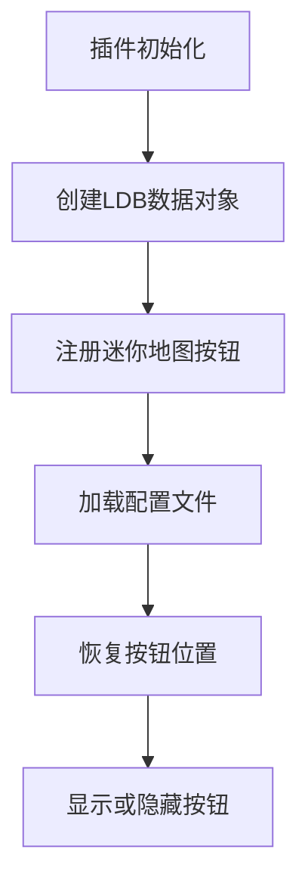
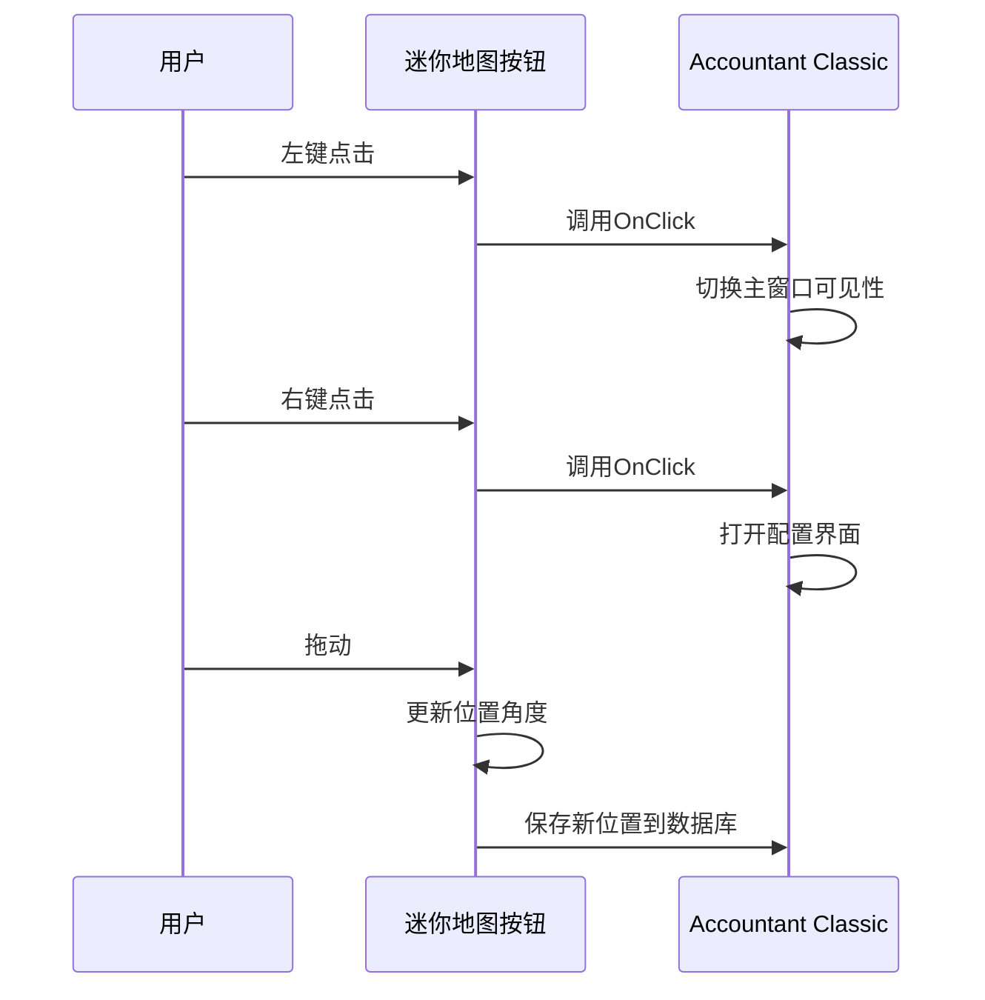

# 迷你地图按钮

<cite>
**本文档中引用的文件**   
- [Core.lua](file://Core/Core.lua)
- [Constants.lua](file://Core/Constants.lua)
- [Config.lua](file://Core/Config.lua)
- [LibDBIcon-1.0.lua](file://Libs/LibDBIcon-1.0/LibDBIcon-1.0.lua)
- [LibDataBroker-1.1.lua](file://Libs/LibDataBroker-1.1/LibDataBroker-1.1.lua)
</cite>

## 目录
1. [简介](#简介)
2. [迷你地图按钮创建与管理](#迷你地图按钮创建与管理)
3. [按钮事件处理逻辑](#按钮事件处理逻辑)
4. [配置选项与自定义设置](#配置选项与自定义设置)
5. [图标配置来源](#图标配置来源)
6. [常见问题排查](#常见问题排查)
7. [兼容性注意事项](#兼容性注意事项)

## 简介
Accountant Classic 使用 LibDBIcon-1.0 库在游戏迷你地图周围创建可拖动图标，为玩家提供快速访问插件主界面和配置选项的入口。该按钮通过 LibDataBroker-1.1 提供数据源，支持左键点击显示/隐藏主窗口、右键点击打开配置界面以及拖动调整位置等交互功能。按钮的可见性、位置和行为均可通过插件配置进行自定义，并与其他使用 LibDBIcon 的插件保持兼容。

**Section sources**
- [Core.lua](file://Core/Core.lua#L2192-L2193)
- [Constants.lua](file://Core/Constants.lua#L0-L260)

## 迷你地图按钮创建与管理
迷你地图按钮由 LibDBIcon-1.0 库负责创建和管理。在 Core.lua 文件中，通过调用 `Register` 方法将插件名称、LDB 对象和配置文件数据库作为参数注册按钮：

```lua
ACbutton:Register(private.addon_name, LDB, profile.minimap);
```

此注册过程利用 LibDataBroker 创建的数据对象（LDB）来暴露财务数据，使第三方显示插件（如 Titan Panel 或 ChocolateBar）能够消费这些数据。按钮的位置由 `db.minimapPos` 存储，以 0-360 度的角度表示，确保在重新登录后能恢复到先前的位置。



**Diagram sources**
- [Core.lua](file://Core/Core.lua#L2192-L2193)
- [LibDBIcon-1.0.lua](file://Libs/LibDBIcon-1.0/LibDBIcon-1.0.lua#L0-L571)

**Section sources**
- [Core.lua](file://Core/Core.lua#L2192-L2193)
- [LibDBIcon-1.0.lua](file://Libs/LibDBIcon-1.0/LibDBIcon-1.0.lua#L0-L571)

## 按钮事件处理逻辑
迷你地图按钮支持多种用户交互，其事件处理逻辑如下：

### 左键点击
左键点击触发主窗口的显示或隐藏。该逻辑通过 `OnClick` 回调实现，调用 `AccountantClassic_ButtonOnClick` 函数来切换主框架的可见状态：

```lua
function AccountantClassic_ButtonOnClick()
	if AccountantClassicFrame:IsVisible() then
		AccountantClassicFrame:Hide();
	else
		AccountantClassicFrame:Show();
	end
end
```

### 右键点击
右键点击调用 AceConfigDialog-3.0 打开插件配置界面。此功能通过集成 AceConfig 系统实现，允许用户实时调整插件设置并立即看到效果。

### 拖动行为
当按钮未锁定时，玩家可以通过左键点击并拖动来调整按钮在迷你地图周围的方位。拖动过程中，`onDragStart` 和 `onDragStop` 脚本被激活，实时计算鼠标位置与迷你地图中心的角度，并更新 `minimapPos` 值。



**Diagram sources**
- [Core.lua](file://Core/Core.lua#L2275-L2334)
- [LibDBIcon-1.0.lua](file://Libs/LibDBIcon-1.0/LibDBIcon-1.0.lua#L130-L220)

**Section sources**
- [Core.lua](file://Core/Core.lua#L2275-L2334)
- [LibDBIcon-1.0.lua](file://Libs/LibDBIcon-1.0/LibDBIcon-1.0.lua#L130-L220)

## 配置选项与自定义设置
用户可以通过插件配置界面自定义迷你地图按钮的行为。相关选项定义在 Config.lua 文件中，主要包括：

- **显示迷你地图按钮**：控制按钮的可见性，通过 `minimap.hide` 配置项管理。
- **显示金钱**：在按钮提示中显示当前角色的金钱总额。
- **显示会话信息**：在提示中包含本次游戏会话的收支摘要。
- **显示操作提示**：启用后，在提示中显示左键/右键点击的操作说明。

这些设置存储在 AceDB 配置文件中，并通过 `optSetter` 函数实时应用更改，调用 `addon:Refresh()` 方法更新 UI。

```lua
function optSetter(info, value)
    local key = info[#info]
    addon.db.profile[key] = value
    addon:Refresh()
end
```

**Section sources**
- [Config.lua](file://Core/Config.lua#L200-L260)
- [Core.lua](file://Core/Core.lua#L1025-L1060)

## 图标配置来源
按钮图标的配置来源于 Constants.lua 文件中定义的常量。默认情况下，图标路径由 LibDataBroker 数据对象的 `icon` 属性指定，通常指向插件目录下的图标文件（如 "Interface\\AddOns\\Accountant_Classic\\icon.blp"）。此外，提示内容的格式化字符串和多语言支持也在此文件中定义，确保不同客户端语言下的正确显示。

**Section sources**
- [Constants.lua](file://Core/Constants.lua#L0-L260)
- [Core.lua](file://Core/Core.lua#L79-L80)

## 常见问题排查
### 按钮丢失
**症状**：迷你地图上找不到按钮  
**原因与解决方案**：
- `minimap.hide = true` 在配置文件中 → 使用 `/accountant config` 启用“显示迷你地图按钮”
- 按钮被拖至屏幕外或隐藏区域 → 重置位置或检查 UI 缩放设置
- 插件加载错误 → 使用 `/console scriptErrors 1` 检查 Lua 错误

### 点击无响应
**症状**：点击按钮无反应  
**原因**：
- `OnClick` 处理程序未正确设置
- 其他插件拦截了点击事件
- 按钮被其他 UI 元素遮挡

**调试步骤**：
1. 确认 `dataObject.OnClick` 是否已定义
2. 在干净的 UI 环境下测试（禁用其他插件）
3. 使用 `LibDBIcon10_<name>:GetPoint()` 检查按钮位置

### 提示信息错误
**症状**：提示显示过时或错误的数值  
**原因**：
- 数据未在会话变更后刷新
- 数字格式化存在本地化问题

**修复方法**：
- 确保在数据更新后调用 `addon:Refresh()`
- 验证 `breakupnumbers` 设置是否正确

**Section sources**
- [Config.lua](file://Core/Config.lua#L200-L230)
- [LibDBIcon-1.0.lua](file://Libs/LibDBIcon-1.0/LibDBIcon-1.0.lua#L80-L100)

## 兼容性注意事项
Accountant Classic 的迷你地图按钮设计为与其他使用 LibDBIcon-1.0 的插件兼容。它遵循标准的 LDB 规范，确保与主流显示插件（如 Titan Panel、ChocolateBar、ElvUI 等）无缝集成。为了避免冲突，建议：
- 不要手动修改 LibDBIcon 或 LibDataBroker 的核心代码
- 在多插件环境中测试按钮行为
- 使用官方提供的 API 进行扩展开发

**Section sources**
- [LibDBIcon-1.0.lua](file://Libs/LibDBIcon-1.0/LibDBIcon-1.0.lua#L0-L31)
- [LibDataBroker-1.1.lua](file://Libs/LibDataBroker-1.1/LibDataBroker-1.1.lua#L0-L29)