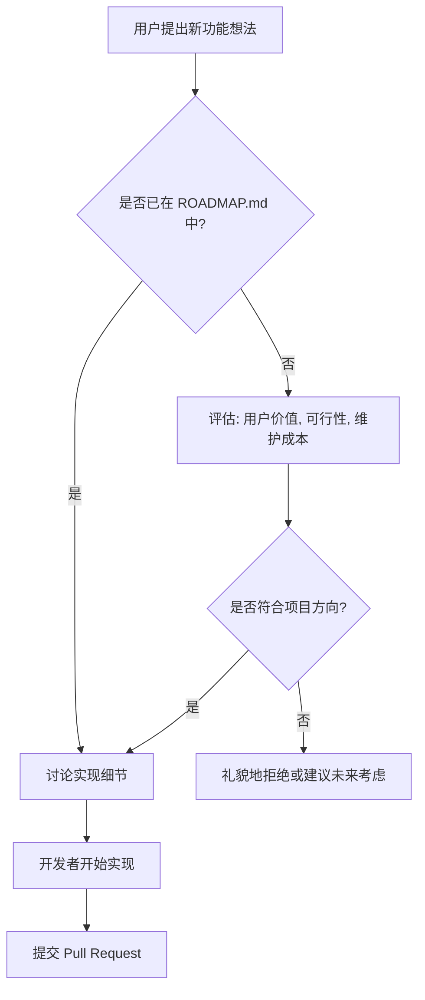

# 贡献指南

<cite>
**本文档中引用的文件**
- [CLAUDE.md](file://CLAUDE.md)
- [ROADMAP.md](file://Docs/ROADMAP.md)
- [README.md](file://README.md)
- [Core.lua](file://Core/Core.lua)
- [Constants.lua](file://Core/Constants.lua)
- [Config.lua](file://Core/Config.lua)
- [pkgmeta.yaml](file://pkgmeta.yaml)
</cite>

## 目录
1. [简介](#简介)
2. [Pull Request 流程](#pull-request-流程)
3. [代码风格与一致性](#代码风格与一致性)
4. [报告 Bug](#报告-bug)
5. [功能请求与 ROADMAP](#功能请求与-roadmap)
6. [开发哲学 (CLAUDE.md)](#开发哲学-claudemd)
7. [测试建议](#测试建议)

## 简介
欢迎为 Accountant Classic 项目做出贡献！本指南旨在帮助社区成员高效地参与项目开发。Accountant Classic 是一个基于 ACE3 框架的《魔兽世界》插件，用于跨多个时间段跟踪金币的收支情况。我们鼓励您通过 GitHub Issues 进行讨论，并遵循本文档中的标准流程提交 Pull Request。

## Pull Request 流程

### 分支策略
本项目采用简单的分支模型。所有开发工作都应基于 `master` 分支进行。
1.  从 `master` 分支创建一个新的功能或修复分支，例如 `feature/new-currency-tracking` 或 `fix/login-prime-bug`。
2.  在您的分支上完成开发和测试。
3.  提交 Pull Request (PR) 至 `master` 分支。

### 提交信息规范
提交信息应清晰、简洁，并遵循以下格式：
- **类型**: 说明变更的类别，例如 `feat` (新功能), `fix` (bug 修复), `docs` (文档更新), `style` (代码格式), `refactor` (重构), `test` (测试), `chore` (构建或工具变更)。
- **作用域**: (可选) 变更影响的模块，例如 `(Core)`, `(CurrencyTracker)`, `(Config)`。
- **简短描述**: 用一句话概括变更内容。

**示例**:
```
feat(CurrencyTracker): 添加对所有游戏内货币的跟踪
fix(Core): 修复首次登录时基线初始化的竞态条件
docs: 更新贡献指南中的测试建议
```

### 代码审查期望
在提交 PR 后，维护者将进行代码审查。审查将重点关注：
- **功能正确性**: 代码是否解决了提出的问题或实现了预期的功能？
- **代码质量**: 是否遵循了项目的代码风格？代码是否清晰、可维护？
- **性能影响**: 变更是否会在战斗或快速更新期间引入性能问题？
- **向后兼容性**: 变更是否会破坏现有用户的保存数据？
- **文档**: 是否更新了相关的文档（如 `README.md` 或 `Docs/` 中的文件）？

请对审查意见保持开放态度，并积极进行修改。

**Section sources**
- [README.md](file://README.md#L1-L120)

## 代码风格与一致性

为了确保代码库的一致性，所有贡献必须遵守以下代码风格要求：
- **语言**: 使用 Lua 5.1 语法，并遵循《魔兽世界》API 的约定。
- **框架**: 遵循 ACE3 插件模式，正确管理命名空间。
- **缩进**: 使用空格进行缩进（非制表符），标准缩进为 2 或 4 个空格。
- **本地化**: 所有用户界面字符串必须使用 AceLocale-3.0 进行本地化，不得在代码中硬编码英文字符串。
- **常量定义**: 新的货币来源或事件常量应添加到 `Core/Constants.lua` 文件中相应的类别下。
- **文件组织**: 新的模块或功能应放置在逻辑上正确的目录中（如 `Core/` 或 `CurrencyTracker/`）。

**Section sources**
- [CLAUDE.md](file://CLAUDE.md#L1-L92)
- [Constants.lua](file://Core/Constants.lua#L0-L260)

## 报告 Bug

有效的 Bug 报告对于维护插件的稳定性至关重要。当您发现一个 Bug 时，请在 GitHub Issues 中创建一个新的 issue，并提供以下信息：
- **游戏版本**: 您正在运行的《魔兽世界》客户端版本（例如，经典怀旧服，巫妖王之怒经典版，正式服）。
- **插件版本**: 您使用的 Accountant Classic 的版本号（可在 `Core/Core.lua` 的注释中找到）。
- **复现步骤**: 详细描述如何重现该问题。请尽可能具体，例如：“1. 登录角色。2. 打开拍卖行。3. 出售一件物品。4. 观察到金币收入被错误地归类为‘未知’。”
- **错误日志**: 如果有 Lua 错误弹出，请复制完整的错误堆栈信息。
- **相关截图或录像**: （可选）提供截图或录屏可以帮助我们更快地理解问题。

**Section sources**
- [README.md](file://README.md#L1-L120)

## 功能请求与 ROADMAP

我们欢迎功能请求，但新功能的优先级将根据项目的长期规划来评估。
- **参考 ROADMAP**: 在提出新功能之前，请先查阅 `Docs/ROADMAP.md` 文件。该文件概述了项目的近期、中期和长期计划。如果您的想法已在 ROADMAP 中列出，我们很乐意讨论其实现细节。
- **评估标准**: 新功能的评估将基于以下几点：
  - **用户价值**: 该功能是否能为大多数用户带来显著的价值？
  - **技术可行性**: 实现该功能是否可行？是否会引入性能问题或与现有架构冲突？
  - **维护成本**: 该功能是否会显著增加代码的复杂性或维护负担？
- **提前讨论**: **强烈建议**在开始实现任何新功能之前，先通过 GitHub Issues 发起讨论。这可以确保您的工作方向与项目目标一致，并避免重复劳动。



**Diagram sources**
- [ROADMAP.md](file://Docs/ROADMAP.md#L0-L46)

**Section sources**
- [ROADMAP.md](file://Docs/ROADMAP.md#L0-L46)

## 开发哲学 (CLAUDE.md)

`CLAUDE.md` 文件阐述了本项目的核心开发哲学，所有贡献者都应牢记：
- **保持代码简洁**: 优先选择简单、直接的解决方案。避免过度工程化。代码应易于理解、阅读和维护。
- **性能高效**: 插件必须在战斗或快速金钱更新期间保持高性能。避免在关键事件（如 `PLAYER_MONEY`）中执行繁重的操作。
- **向后兼容性**: 在修改保存数据结构时，必须谨慎处理，以确保现有用户的数据不会丢失或损坏。
- **渐进式改进**: 鼓励通过小的、可管理的提交来逐步改进代码，而不是一次性提交巨大的重构。

**Section sources**
- [CLAUDE.md](file://CLAUDE.md#L1-L92)

## 测试建议

为了确保代码的可靠性，建议进行以下测试：
- **手动测试**: 在不同版本的《魔兽世界》客户端中进行手动测试，验证金钱事件（如商人交易、修理、任务奖励等）是否被正确跟踪和分类。
- **金币分类准确性**: 重点测试金币分类的准确性。例如，确保在拍卖行出售物品的收入被正确归类为“拍卖行”，而不是“未知”。可以利用 `/accountant` 命令打开主窗口进行验证。
- **跨角色数据**: 测试跨角色和跨服务器的数据是否能正确显示和汇总。
- **配置选项**: 测试所有配置选项（通过右键点击小地图按钮或在界面选项中）是否按预期工作。

**Section sources**
- [README.md](file://README.md#L1-L120)
- [Config.lua](file://Core/Config.lua#L0-L430)