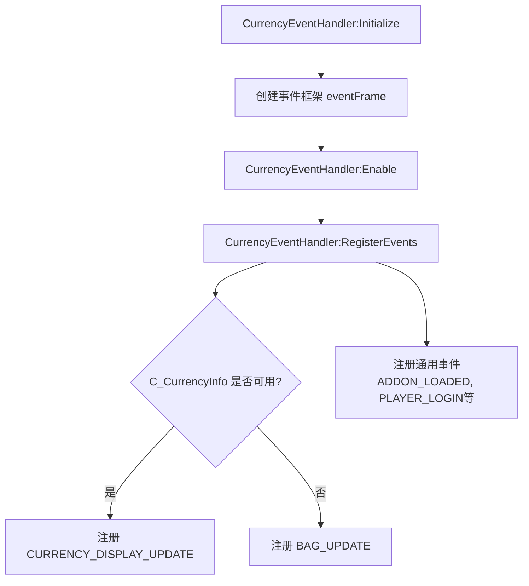
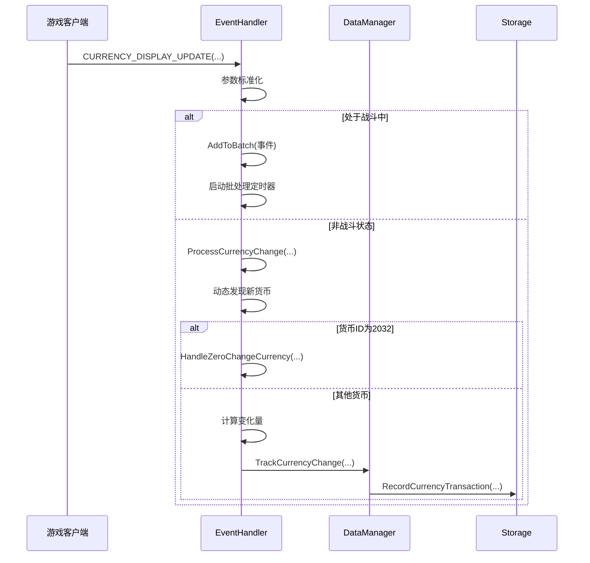
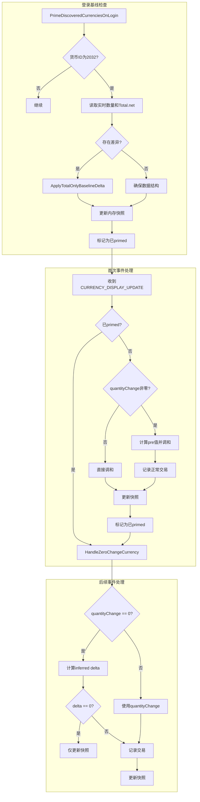
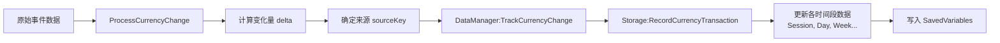

# 事件处理机制

<cite>
**本文档引用的文件**   
- [CurrencyEventHandler.lua](file://CurrencyTracker/CurrencyEventHandler.lua)
- [CurrencyCore.lua](file://CurrencyTracker/CurrencyCore.lua)
- [CurrencyDataManager.lua](file://CurrencyTracker/CurrencyDataManager.lua)
- [CurrencyStorage.lua](file://CurrencyTracker/CurrencyStorage.lua)
</cite>

## 目录
1. [简介](#简介)
2. [事件监听与注册](#事件监听与注册)
3. [核心事件处理流程](#核心事件处理流程)
4. [特殊货币处理：交易者礼券](#特殊货币处理交易者礼券)
5. [数据提取、分类与归因](#数据提取分类与归因)
6. [事件去重、节流与错误恢复](#事件去重节流与错误恢复)
7. [原始事件到可存储记录的转换](#原始事件到可存储记录的转换)
8. [扩展与自定义事件](#扩展与自定义事件)
9. [性能与调试](#性能与调试)

## 简介
本模块文档详细阐述了《Accountant_Classic》插件中货币跟踪功能的事件处理机制。核心组件`CurrencyEventHandler.lua`负责监听游戏内与货币相关的事件，如`CURRENCY_DISPLAY_UPDATE`，并将其与`CurrencyCore`主逻辑协同工作，以实现对玩家货币变动的精确追踪。文档将深入解析事件处理器的初始化、事件数据的提取与分类、针对特殊货币（如交易者礼券）的定制化处理逻辑，以及确保数据准确性的去重、节流和错误恢复机制。开发者将了解如何将原始事件数据转换为结构化的可存储记录，并获得扩展事件处理逻辑的指导。

## 事件监听与注册

`CurrencyEventHandler`模块通过创建一个隐藏的UI框架（`eventFrame`）来注册和监听特定的事件。其事件注册逻辑具有版本兼容性，优先使用现代的`C_CurrencyInfo` API，若不可用则回退到旧的`BAG_UPDATE`事件。

**Diagram sources**
- [CurrencyEventHandler.lua](file://CurrencyTracker/CurrencyEventHandler.lua#L222-L330)

**Section sources**
- [CurrencyEventHandler.lua](file://CurrencyTracker/CurrencyEventHandler.lua#L222-L330)
- [CurrencyCore.lua](file://CurrencyTracker/CurrencyCore.lua#L284-L325)

## 核心事件处理流程

当`CURRENCY_DISPLAY_UPDATE`事件被触发时，事件处理器会调用`OnCurrencyDisplayUpdate`方法。该方法首先进行参数标准化（处理可能存在的前导表参数），然后根据当前是否处于战斗状态决定是立即处理还是将事件加入批处理队列。

**Diagram sources**
- [CurrencyEventHandler.lua](file://CurrencyTracker/CurrencyEventHandler.lua#L478-L541)
- [CurrencyEventHandler.lua](file://CurrencyTracker/CurrencyEventHandler.lua#L571-L799)

**Section sources**
- [CurrencyEventHandler.lua](file://CurrencyTracker/CurrencyEventHandler.lua#L478-L799)

## 特殊货币处理：交易者礼券

对于“交易者礼券”（ID 2032）这类API返回的`quantityChange`值不可靠（常为0）的货币，模块采用专门的`HandleZeroChangeCurrency`函数进行处理。该处理逻辑分为三个阶段：登录基线检查、首次事件处理和后续事件处理。

**Diagram sources**
- [CurrencyEventHandler.lua](file://CurrencyTracker/CurrencyEventHandler.lua#L53-L155)
- [CurrencyEventHandler.lua](file://CurrencyTracker/CurrencyEventHandler.lua#L284-L300)
- [CurrencyEventHandler.lua](file://CurrencyTracker/CurrencyEventHandler.lua#L542-L570)

**Section sources**
- [CurrencyEventHandler.lua](file://CurrencyTracker/CurrencyEventHandler.lua#L53-L155)
- [CurrencyEventHandler.lua](file://CurrencyTracker/CurrencyEventHandler.lua#L284-L300)
- [CurrencyEventHandler.lua](file://CurrencyTracker/CurrencyEventHandler.lua#L542-L570)

## 数据提取、分类与归因

事件处理器从`CURRENCY_DISPLAY_UPDATE`事件中提取关键数据：`currencyType`（货币ID）、`quantity`（新数量）、`quantityChange`（变化量）、`quantityGainSource`（获得来源）和`quantityLostSource`（失去来源）。这些数据经过处理后，用于分类和归因。

1.  **数据提取**：`ProcessCurrencyChange`函数接收事件参数，并通过`GetCurrentCurrencyAmount`等辅助函数获取更准确的实时数据。
2.  **分类**：通过`DataManager:IsCurrencySupported`检查货币是否受支持，若不支持，则通过`Storage:SaveDiscoveredCurrency`进行动态发现和分类。
3.  **归因**：将`quantityGainSource`和`quantityLostSource`统一为一个`sourceKey`，并记录到`Storage`中，以便后续分析。

**Section sources**
- [CurrencyEventHandler.lua](file://CurrencyTracker/CurrencyEventHandler.lua#L542-L570)
- [CurrencyDataManager.lua](file://CurrencyTracker/CurrencyDataManager.lua#L101-L120)

## 事件去重、节流与错误恢复

为了确保数据的准确性和性能，模块实现了多种机制来处理事件的重复、高频和错误情况。

1.  **去重**：通过`lastCurrencyAmounts`表存储每个货币的上一次已知数量。只有当计算出的变化量（delta）不为零时，才会记录新的交易，有效避免了重复事件。
2.  **节流**：
    *   **战斗节流**：在战斗中（`inCombat = true`），所有事件都会被加入`updateBatch`批处理队列，并由`batchTimer`在1秒后统一处理，防止战斗中频繁操作影响性能。
    *   **旧版回退节流**：对于`BAG_UPDATE`事件，使用`bagDebounceTimer`（0.3秒）进行去抖，合并短时间内爆发的事件。
3.  **错误恢复**：
    *   **基线保护**：在`ProcessCurrencyChange`中，如果`Total`为空且有具体变化量，会通过`PrimeBaselineTotalOnly`写入一个基线，防止数据丢失。
    *   **快照漂移纠正**：在处理交易者礼券时，如果内存快照与持久化存储的`Total.net`存在差异，会以存储的数据为准进行纠正，避免因初始读取错误导致的计数问题。

**Section sources**
- [CurrencyEventHandler.lua](file://CurrencyTracker/CurrencyEventHandler.lua#L876-L931)
- [CurrencyEventHandler.lua](file://CurrencyTracker/CurrencyEventHandler.lua#L542-L570)
- [CurrencyEventHandler.lua](file://CurrencyTracker/CurrencyEventHandler.lua#L131-L155)

## 原始事件到可存储记录的转换

原始事件数据通过一系列步骤被转换为可持久化存储的记录。核心转换发生在`DataManager:TrackCurrencyChange`和`Storage:RecordCurrencyTransaction`方法中。

具体转换流程如下：
1.  事件处理器计算出`delta`（正为收入，负为支出）和`sourceKey`。
2.  调用`DataManager:TrackCurrencyChange`，传入`currencyID`, `delta`, `sourceKey`。
3.  `DataManager`验证数据后，调用`Storage:RecordCurrencyTransaction`。
4.  `Storage`模块将交易记录到`Session`, `Day`, `Week`, `Month`, `Year`, `Total`等多个时间段的聚合数据中，最终持久化到`SavedVariables`。

**Diagram sources**
- [CurrencyDataManager.lua](file://CurrencyTracker/CurrencyDataManager.lua#L101-L120)
- [CurrencyStorage.lua](file://CurrencyTracker/CurrencyStorage.lua#L401-L440)

**Section sources**
- [CurrencyDataManager.lua](file://CurrencyTracker/CurrencyDataManager.lua#L101-L120)
- [CurrencyStorage.lua](file://CurrencyTracker/CurrencyStorage.lua#L401-L440)

## 扩展与自定义事件

开发者可以通过以下方式扩展现有的事件处理逻辑：

1.  **监听自定义事件**：虽然核心逻辑围绕`CURRENCY_DISPLAY_UPDATE`构建，但`EventHandler`的架构允许通过修改`RegisterEvents`函数来监听其他自定义事件。
2.  **扩展现有逻辑**：可以在`ProcessCurrencyChange`函数中添加对特定`currencyID`的处理分支，或在`TrackCurrencyChange`前对`sourceKey`进行预处理。
3.  **注意事项**：任何扩展都应考虑性能影响，避免在事件处理函数中执行耗时操作。建议使用批处理或异步定时器来处理复杂逻辑。

**Section sources**
- [CurrencyEventHandler.lua](file://CurrencyTracker/CurrencyEventHandler.lua#L301-L330)
- [CurrencyEventHandler.lua](file://CurrencyTracker/CurrencyEventHandler.lua#L542-L570)

## 性能与调试

模块内置了性能优化和调试支持。

*   **性能**：通过战斗节流、事件去抖和批处理机制，有效降低了CPU占用，尤其是在高频率事件场景下。
*   **调试**：通过`CurrencyTracker:LogDebug`函数输出详细的调试信息。开发者可以通过`/ct debug on`命令开启调试模式，实时查看事件接收、参数解析和数据处理的详细日志，便于排查问题。

**Section sources**
- [CurrencyEventHandler.lua](file://CurrencyTracker/CurrencyEventHandler.lua#L493-L505)
- [CurrencyCore.lua](file://CurrencyTracker/CurrencyCore.lua#L1010-L1025)