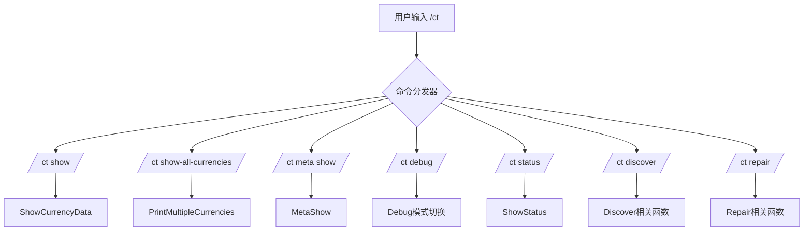
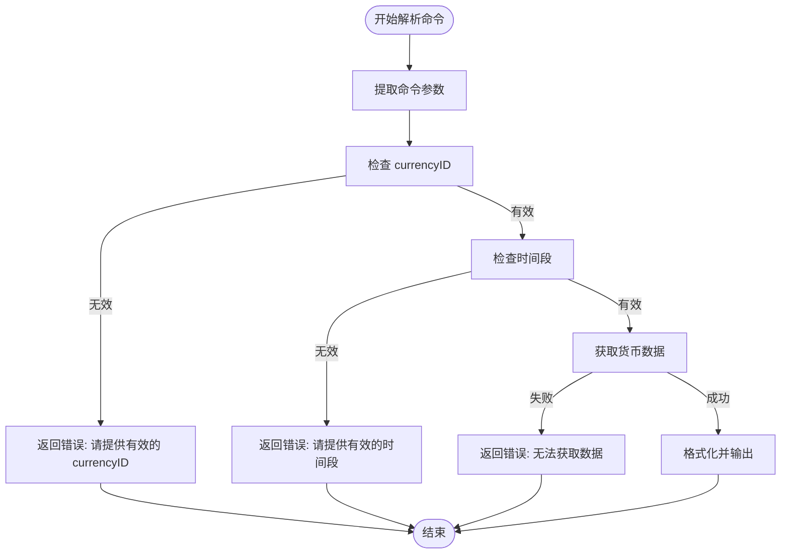

# 命令行接口 (CLI)

<cite>
**本文档中引用的文件**  
- [CurrencyCore.lua](file://CurrencyTracker/CurrencyCore.lua)
- [AceConsole-3.0.lua](file://Libs/AceConsole-3.0/AceConsole-3.0.lua)
- [CurrencyTracker-Usage.md](file://Docs/CurrencyTracker-Usage.md)
</cite>

## 目录
1. [简介](#简介)
2. [命令解析机制](#命令解析机制)
3. [子命令功能详解](#子命令功能详解)
4. [参数解析与错误处理](#参数解析与错误处理)
5. ‘预览/应用’设计模式
6. 自定义命令开发指南
7. 结论

## 简介
本文档详细阐述Accountant_Classic插件中货币跟踪模块的命令行接口（CLI）实现机制。重点分析`/ct`命令的注册、解析流程，以及各子命令的功能与使用场景。结合`CurrencyCore.lua`中的代码逻辑和`CurrencyTracker-Usage.md`中的实际用例，为开发者提供清晰的实现参考和扩展指南。

**Section sources**
- [CurrencyCore.lua](file://CurrencyTracker/CurrencyCore.lua#L1-L50)
- [CurrencyTracker-Usage.md](file://Docs/CurrencyTracker-Usage.md#L1-L10)

## 命令解析机制
货币跟踪模块使用AceConsole-3.0库来注册和管理其Slash命令。在`CurrencyCore.lua`中，通过`SLASH_CURRENCYTRACKER1 = "/ct"`和`SlashCmdList["CURRENCYTRACKER"]`的全局变量定义，将`/ct`命令的处理函数绑定到一个中央分发器。

该分发器函数接收用户输入的完整命令字符串，并通过一系列`string.find`和`string.match`操作进行模式匹配，以确定应调用哪个具体的子命令处理函数。这种设计将命令的注册与具体的业务逻辑分离，提高了代码的可维护性。

**Diagram sources**
- [CurrencyCore.lua](file://CurrencyTracker/CurrencyCore.lua#L799-L936)

**Section sources**
- [CurrencyCore.lua](file://CurrencyTracker/CurrencyCore.lua#L799-L936)
- [AceConsole-3.0.lua](file://Libs/AceConsole-3.0/AceConsole-3.0.lua#L1-L50)

## 子命令功能详解
`/ct`命令提供了一系列子命令，用于查询、调试和修复货币数据。

### show 命令
`/ct show`用于显示单个货币在指定时间段内的详细数据。其语法为`/ct show <timeframe> [currencyid]`。如果省略`currencyid`，系统会尝试使用上次选中的货币。该命令会输出收入、支出、净变化以及按来源分类的详细交易记录。

### show-all-currencies 命令
`/ct show-all-currencies`用于显示所有已跟踪货币在指定时间段内的汇总信息。它会列出每种货币的收入、支出和净变化，是快速概览所有货币状态的有效工具。

### meta show 命令
`/ct meta show`是一个诊断工具，用于检查特定货币在指定时间段内的原始元数据。它显示了`quantityGainSource`和`quantityLostSource`（或WoW 11.0.2+中的`destroyReason`）的原始计数，帮助开发者分析数据来源。

### debug 命令
`/ct debug`用于切换调试模式。当开启时，每次处理货币事件都会在聊天框中打印详细的调试信息，这对于验证数据处理逻辑非常有用。

### status 命令
`/ct status`打印模块的内部状态，包括是否已初始化、是否已启用、版本号和调试模式状态，是确认模块运行状况的常用命令。

### discover 命令
`/ct discover`系列命令用于管理动态发现的货币。`list`子命令列出所有已发现的货币ID，`track`用于切换特定货币的跟踪状态，`clear`则清除所有发现的货币记录。

### repair 命令
`/ct repair`提供了一系列数据修复工具。`adjust`用于对特定货币的聚合数据进行调整，`remove`用于从记录中移除特定来源的金额，`baseline preview`和`baseline apply`则用于将插件记录的总量与游戏内实时值进行比对和修正。

**Section sources**
- [CurrencyCore.lua](file://CurrencyTracker/CurrencyCore.lua#L937-L1413)
- [CurrencyTracker-Usage.md](file://Docs/CurrencyTracker-Usage.md#L50-L200)

## 参数解析与错误处理
命令的参数解析主要通过`ParseShowCommand`函数实现。该函数首先将命令字符串分割成多个部分，然后检查最后一个部分是否为数字（即`currencyID`），并将其从命令中分离。接着，它会移除命令动词（如`show`），并根据剩余部分在`tfMap`表中查找对应的时间段。

错误处理贯穿于所有命令的执行过程。例如，在`MetaShow`函数中，会检查`currencyID`是否存在，以及是否有可用的保存数据。如果检查失败，会通过`print`函数向用户输出清晰的错误信息和正确的使用方法，避免程序崩溃。

**Diagram sources**
- [CurrencyCore.lua](file://CurrencyTracker/CurrencyCore.lua#L952-L999)

**Section sources**
- [CurrencyCore.lua](file://CurrencyTracker/CurrencyCore.lua#L952-L999)

## ‘预览/应用’设计模式
‘预览/应用’设计模式在`/ct repair baseline`命令中得到了完美体现。`RepairBaselinePreview`函数负责构建差异列表并打印预览结果，而`RepairBaselineApply`函数则复用相同的`BuildBaselineDiscrepancies`逻辑，但在确认无误后执行实际的修正操作。

这种设计模式将命令的解析与业务逻辑彻底分离。`Preview`函数只负责读取和展示，不进行任何数据修改；`Apply`函数则在`Preview`验证通过后，安全地执行写入操作。这不仅避免了代码重复，还极大地降低了因误操作导致数据损坏的风险。

**Section sources**
- [CurrencyCore.lua](file://CurrencyTracker/CurrencyCore.lua#L700-L750)
- [CurrencyTracker-Usage.md](file://Docs/CurrencyTracker-Usage.md#L180-L200)

## 自定义命令开发指南
开发者可以通过以下步骤为模块添加新的自定义命令：

1.  **注册命令**：在模块初始化时，使用AceConsole-3.0的`RegisterChatCommand`方法注册新命令。
2.  **实现处理函数**：创建一个处理函数，该函数接收命令参数字符串作为输入。
3.  **参数验证**：使用`string.match`等方法解析参数，并进行严格的类型和范围检查。
4.  **权限检查**：根据需要，检查执行命令的用户是否具有相应权限。
5.  **业务逻辑**：执行核心的业务逻辑。
6.  **输出格式化**：使用`print`或AceConsole的`Print`方法，将结果以清晰、一致的格式输出给用户。

遵循此指南可以确保新命令与现有代码风格一致，并具备良好的健壮性和用户体验。

**Section sources**
- [CurrencyCore.lua](file://CurrencyTracker/CurrencyCore.lua#L799-L936)
- [AceConsole-3.0.lua](file://Libs/AceConsole-3.0/AceConsole-3.0.lua#L100-L150)

## 结论
Accountant_Classic的货币跟踪模块通过AceConsole-3.0实现了强大且灵活的命令行接口。其清晰的命令解析机制、丰富的子命令功能、严谨的错误处理以及‘预览/应用’的设计模式，共同构成了一个高效、可靠且易于扩展的CLI系统。本文档为理解现有功能和开发新功能提供了全面的指导。